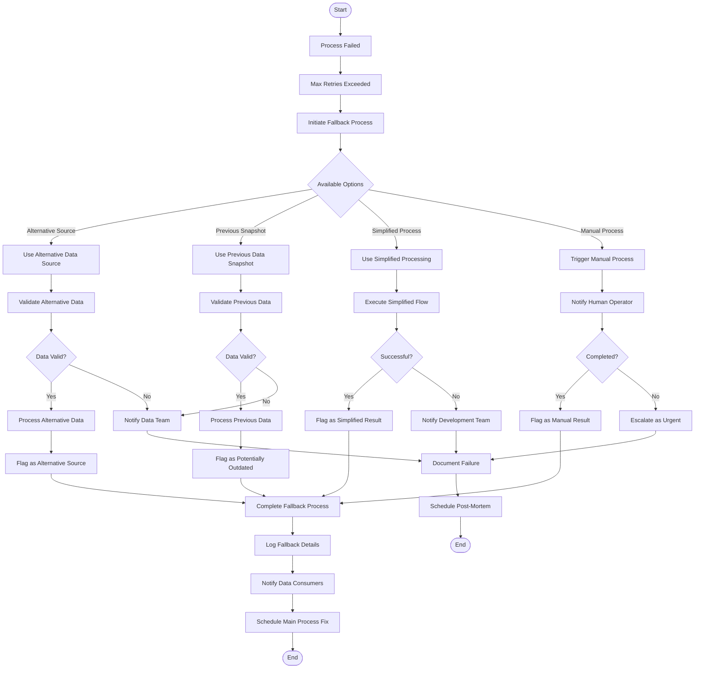

# Technical Specifications

## 1. INTRODUCTION

### EXECUTIVE SUMMARY

| Category | Description |
| --- | --- |
| Project Overview | An end-to-end self-healing data pipeline for BigQuery using Google Cloud services and AI-driven automation that minimizes manual intervention through intelligent monitoring and autonomous correction. |
| Core Business Problem | Organizations face significant challenges with data pipeline reliability including frequent failures, manual error resolution, data quality issues, and lack of proactive monitoring. These problems lead to delayed insights, increased operational costs, and unreliable business intelligence. |
| Key Stakeholders | • Data Engineering Teams<br>• Data Scientists and Analysts<br>• IT Operations<br>• Business Decision Makers<br>• Data Governance Teams |
| Value Proposition | • Reduce manual intervention by 80% through AI-driven self-healing<br>• Improve data reliability with automated quality validation<br>• Minimize pipeline downtime through predictive failure detection<br>• Lower operational costs via optimized resource utilization<br>• Enable faster, more reliable business insights |

### SYSTEM OVERVIEW

#### Project Context

| Aspect | Details |
| --- | --- |
| Business Context | Modern data-driven organizations require robust, reliable data pipelines to support critical analytics and business intelligence workflows. As data volumes grow and sources diversify, traditional pipeline management approaches become unsustainable. |
| Current Limitations | • Manual error handling and troubleshooting<br>• Reactive rather than proactive failure management<br>• Limited data quality validation<br>• Suboptimal resource utilization<br>• High operational overhead for maintenance |
| Enterprise Integration | The solution will integrate with the existing Google Cloud environment, enhancing data processing capabilities while maintaining compatibility with current data sources, security policies, and downstream analytics systems. |

#### High-Level Description

| Component | Description |
| --- | --- |
| Primary Capabilities | • Multi-source data ingestion<br>• Automated quality validation<br>• AI-powered self-healing<br>• Intelligent monitoring and alerting<br>• Performance optimization |
| Key Architectural Decisions | • Cloud-native implementation using Google Cloud services<br>• Apache Airflow (Cloud Composer) for orchestration<br>• Great Expectations for data validation<br>• AI/ML models for anomaly detection and correction<br>• Centralized monitoring with intelligent alerting |
| Major System Components | • Data Ingestion Layer<br>• Quality Validation Framework<br>• Self-Healing AI Engine<br>• Monitoring & Alerting System<br>• Performance Optimization Layer |
| Core Technical Approach | A modular, microservices-based architecture leveraging serverless and managed services where possible, with AI capabilities embedded throughout to enable autonomous operation and continuous improvement. |

#### Success Criteria

| Category | Metrics |
| --- | --- |
| Operational Efficiency | • 80% reduction in manual intervention<br>• 90% decrease in pipeline failure resolution time<br>• 99.5% pipeline execution success rate |
| Data Quality | • 95% reduction in data quality incidents<br>• 100% validation coverage for critical data elements<br>• Zero critical data errors reaching production |
| Performance | • 30% improvement in pipeline execution time<br>• 25% reduction in BigQuery processing costs<br>• Ability to scale to 3x current data volume without degradation |
| Business Impact | • Reduced time-to-insight for business users<br>• Increased trust in data<br>• Lower total cost of ownership for data infrastructure |

### SCOPE

#### In-Scope

##### Core Features and Functionalities

| Feature | Details |
| --- | --- |
| Data Ingestion | • Google Cloud Storage (GCS) integration<br>• Cloud SQL data extraction<br>• External API and third-party database connectors<br>• Cloud Composer (Apache Airflow) orchestration |
| Data Quality Validation | • Schema consistency validation<br>• Null/missing value detection<br>• Anomaly identification<br>• Referential integrity checks<br>• Automated reporting of quality issues |
| Self-Healing Mechanisms | • AI-driven data correction<br>• Automatic job retry with optimized parameters<br>• Predictive failure detection<br>• Autonomous application of fixes for common issues |
| Monitoring & Alerting | • Intelligent anomaly detection<br>• Microsoft Teams notifications<br>• Email alerts<br>• Cloud Monitoring integration<br>• Real-time root cause analysis |
| Performance Optimization | • BigQuery query optimization<br>• Partitioning and clustering strategies<br>• Resource allocation optimization<br>• Cost efficiency monitoring |

##### Implementation Boundaries

| Boundary | Specification |
| --- | --- |
| System Boundaries | • Google Cloud Platform environment<br>• Batch processing pipelines<br>• Integration with specified notification systems |
| User Groups | • Data engineering teams<br>• Operations personnel<br>• Data governance teams<br>• Business analysts (as data consumers) |
| Geographic Coverage | • All enterprise regions utilizing the specified Google Cloud services |
| Data Domains | • Structured data from operational systems<br>• Semi-structured data from external sources<br>• Metadata from pipeline operations |

#### Out-of-Scope

| Category | Exclusions |
| --- | --- |
| Technical Exclusions | • Real-time streaming data processing<br>• On-premises data sources without cloud connectivity<br>• Non-Google cloud platforms<br>• Custom visualization or reporting tools |
| Functional Limitations | • Manual data quality rule creation (focus on automated detection)<br>• Human-in-the-loop approval workflows<br>• Integration with unsupported notification platforms<br>• Direct business user interfaces |
| Future Considerations | • Advanced data governance capabilities<br>• Integration with data catalogs<br>• Natural language query interfaces<br>• Extended machine learning model deployment pipelines |
| Unsupported Use Cases | • Continuous real-time data processing<br>• Unstructured data analysis (images, video, audio)<br>• End-user self-service analytics<br>• Direct operational system feedback loops |

## 2. PRODUCT REQUIREMENTS

### FEATURE CATALOG

#### Data Ingestion Features

| Feature Metadata | Details |
| --- | --- |
| **Feature ID** | F-001 |
| **Feature Name** | GCS Data Ingestion |
| **Feature Category** | Data Ingestion |
| **Priority Level** | Critical |
| **Status** | Proposed |

**Description:**
- **Overview**: Automated ingestion of data from Google Cloud Storage into BigQuery, supporting various file formats.
- **Business Value**: Enables seamless integration with existing GCS-based data lake structures.
- **User Benefits**: Reduces manual effort for importing GCS data into analytical systems.
- **Technical Context**: Requires configurable file format parsers and metadata extraction.

**Dependencies:**
- **Prerequisite Features**: None
- **System Dependencies**: GCS buckets, BigQuery datasets
- **External Dependencies**: GCS file structure standards
- **Integration Requirements**: IAM permissions, BigQuery load operations

| Feature Metadata | Details |
| --- | --- |
| **Feature ID** | F-002 |
| **Feature Name** | Cloud SQL Data Extraction |
| **Feature Category** | Data Ingestion |
| **Priority Level** | Critical |
| **Status** | Proposed |

**Description:**
- **Overview**: Scheduled and incremental extraction of data from Cloud SQL instances.
- **Business Value**: Consolidates operational database data into the analytical warehouse.
- **User Benefits**: Enables analysis of transactional data without impacting source systems.
- **Technical Context**: Implements CDC patterns for efficient incremental data loading.

**Dependencies:**
- **Prerequisite Features**: None
- **System Dependencies**: Cloud SQL instances
- **External Dependencies**: Database schema definitions
- **Integration Requirements**: Database credentials, connection management

| Feature Metadata | Details |
| --- | --- |
| **Feature ID** | F-003 |
| **Feature Name** | External Sources Integration |
| **Feature Category** | Data Ingestion |
| **Priority Level** | High |
| **Status** | Proposed |

**Description:**
- **Overview**: Framework for ingesting data from external APIs and third-party databases.
- **Business Value**: Incorporates external data sources for comprehensive analytics.
- **User Benefits**: Enables unified analysis across internal and external datasets.
- **Technical Context**: Requires adaptable connectors and secure credential management.

**Dependencies:**
- **Prerequisite Features**: None
- **System Dependencies**: Cloud network configuration
- **External Dependencies**: API specifications, third-party system availability
- **Integration Requirements**: Authentication mechanisms, rate limiting compliance

| Feature Metadata | Details |
| --- | --- |
| **Feature ID** | F-004 |
| **Feature Name** | Pipeline Orchestration with Cloud Composer |
| **Feature Category** | Data Ingestion |
| **Priority Level** | Critical |
| **Status** | Proposed |

**Description:**
- **Overview**: End-to-end workflow orchestration using Cloud Composer (Apache Airflow).
- **Business Value**: Ensures reliable, scheduled, and monitored data processing.
- **User Benefits**: Provides visibility into pipeline execution and dependencies.
- **Technical Context**: Central control plane for all data integration processes.

**Dependencies:**
- **Prerequisite Features**: F-001, F-002, F-003
- **System Dependencies**: Cloud Composer environment
- **External Dependencies**: None
- **Integration Requirements**: Integration with all data sources and BigQuery

#### Automated Data Quality Features

| Feature Metadata | Details |
| --- | --- |
| **Feature ID** | F-005 |
| **Feature Name** | Schema Validation Framework |
| **Feature Category** | Data Quality |
| **Priority Level** | Critical |
| **Status** | Proposed |

**Description:**
- **Overview**: Automated validation of data schema consistency against expected structures.
- **Business Value**: Prevents downstream processing errors due to schema drift.
- **User Benefits**: Reduces data quality incidents and improves data reliability.
- **Technical Context**: Implements Great Expectations or similar tooling for schema validations.

**Dependencies:**
- **Prerequisite Features**: F-001, F-002, F-003
- **System Dependencies**: Data quality validation framework
- **External Dependencies**: None
- **Integration Requirements**: Access to source and target data schemas

| Feature Metadata | Details |
| --- | --- |
| **Feature ID** | F-006 |
| **Feature Name** | Data Completeness Validation |
| **Feature Category** | Data Quality |
| **Priority Level** | Critical |
| **Status** | Proposed |

**Description:**
- **Overview**: Detection and quantification of null/missing values in datasets.
- **Business Value**: Ensures data completeness for accurate analytics.
- **User Benefits**: Prevents incomplete data from affecting business decisions.
- **Technical Context**: Statistical profiling of datasets for completeness metrics.

**Dependencies:**
- **Prerequisite Features**: F-005
- **System Dependencies**: Data quality validation framework
- **External Dependencies**: None
- **Integration Requirements**: Data profiling capabilities

| Feature Metadata | Details |
| --- | --- |
| **Feature ID** | F-007 |
| **Feature Name** | Anomaly Detection System |
| **Feature Category** | Data Quality |
| **Priority Level** | High |
| **Status** | Proposed |

**Description:**
- **Overview**: Pattern and statistical analysis to identify anomalous data points.
- **Business Value**: Identifies potential data quality issues that aren't simple rule violations.
- **User Benefits**: Improves data reliability through advanced anomaly detection.
- **Technical Context**: Uses statistical and machine learning techniques for anomaly detection.

**Dependencies:**
- **Prerequisite Features**: F-005, F-006
- **System Dependencies**: ML infrastructure
- **External Dependencies**: Historical data patterns
- **Integration Requirements**: Integration with monitoring systems

| Feature Metadata | Details |
| --- | --- |
| **Feature ID** | F-008 |
| **Feature Name** | Referential Integrity Checks |
| **Feature Category** | Data Quality |
| **Priority Level** | High |
| **Status** | Proposed |

**Description:**
- **Overview**: Validation of referential relationships between datasets.
- **Business Value**: Ensures relational consistency across the data warehouse.
- **User Benefits**: Prevents join failures and incorrect relationship mapping.
- **Technical Context**: Cross-dataset validation of primary and foreign key relationships.

**Dependencies:**
- **Prerequisite Features**: F-005
- **System Dependencies**: Data relationships metadata
- **External Dependencies**: None
- **Integration Requirements**: Access to relationship definitions

| Feature Metadata | Details |
| --- | --- |
| **Feature ID** | F-009 |
| **Feature Name** | Automated Quality Issue Response |
| **Feature Category** | Data Quality |
| **Priority Level** | Critical |
| **Status** | Proposed |

**Description:**
- **Overview**: Automated response framework for data quality failures.
- **Business Value**: Reduces manual intervention for data quality issues.
- **User Benefits**: Faster resolution of quality problems.
- **Technical Context**: Decision tree for appropriate responses to different quality issues.

**Dependencies:**
- **Prerequisite Features**: F-005, F-006, F-007, F-008
- **System Dependencies**: Alerting system
- **External Dependencies**: None
- **Integration Requirements**: Integration with self-healing mechanisms

#### Self-Healing Mechanism Features

| Feature Metadata | Details |
| --- | --- |
| **Feature ID** | F-010 |
| **Feature Name** | AI-Driven Data Correction |
| **Feature Category** | Self-Healing |
| **Priority Level** | Critical |
| **Status** | Proposed |

**Description:**
- **Overview**: Generative AI system to automatically correct common data issues.
- **Business Value**: Reduces pipeline failures and manual intervention.
- **User Benefits**: Improves data pipeline reliability and reduces maintenance effort.
- **Technical Context**: ML models trained to identify and fix common data problems.

**Dependencies:**
- **Prerequisite Features**: F-005, F-006, F-007, F-008
- **System Dependencies**: AI/ML infrastructure
- **External Dependencies**: Training data of common issues
- **Integration Requirements**: Integration with data quality framework

| Feature Metadata | Details |
| --- | --- |
| **Feature ID** | F-011 |
| **Feature Name** | Intelligent Job Retry |
| **Feature Category** | Self-Healing |
| **Priority Level** | Critical |
| **Status** | Proposed |

**Description:**
- **Overview**: Smart retry mechanism with parameter optimization for failed jobs.
- **Business Value**: Increases pipeline success rate without manual intervention.
- **User Benefits**: Reduces need for manual job restarts and troubleshooting.
- **Technical Context**: Analyzes failure patterns to determine optimal retry strategies.

**Dependencies:**
- **Prerequisite Features**: F-004
- **System Dependencies**: Cloud Composer
- **External Dependencies**: None
- **Integration Requirements**: Access to job history and parameters

| Feature Metadata | Details |
| --- | --- |
| **Feature ID** | F-012 |
| **Feature Name** | Predictive Failure Detection |
| **Feature Category** | Self-Healing |
| **Priority Level** | High |
| **Status** | Proposed |

**Description:**
- **Overview**: AI models that predict potential failures before they occur.
- **Business Value**: Enables proactive issue resolution before business impact.
- **User Benefits**: Reduces unexpected failures and increases pipeline reliability.
- **Technical Context**: Uses historical execution data to build predictive models.

**Dependencies:**
- **Prerequisite Features**: F-004, F-017
- **System Dependencies**: ML infrastructure
- **External Dependencies**: Historical execution data
- **Integration Requirements**: Integration with monitoring systems

| Feature Metadata | Details |
| --- | --- |
| **Feature ID** | F-013 |
| **Feature Name** | Autonomous Resolution System |
| **Feature Category** | Self-Healing |
| **Priority Level** | High |
| **Status** | Proposed |

**Description:**
- **Overview**: Framework for autonomous application of fixes for common issues.
- **Business Value**: Minimizes human intervention in pipeline maintenance.
- **User Benefits**: Faster resolution of pipeline issues with less manual effort.
- **Technical Context**: Decision engine for when to apply automated fixes vs. alert.

**Dependencies:**
- **Prerequisite Features**: F-010, F-011, F-012
- **System Dependencies**: None
- **External Dependencies**: None
- **Integration Requirements**: Integration with all pipeline components

#### Automated Alerting & Monitoring Features

| Feature Metadata | Details |
| --- | --- |
| **Feature ID** | F-014 |
| **Feature Name** | AI-Based Anomaly Detection |
| **Feature Category** | Monitoring |
| **Priority Level** | Critical |
| **Status** | Proposed |

**Description:**
- **Overview**: Machine learning models to detect pipeline execution anomalies.
- **Business Value**: Identifies abnormal patterns before failures occur.
- **User Benefits**: Early warning of potential issues.
- **Technical Context**: Time-series analysis of execution metrics and patterns.

**Dependencies:**
- **Prerequisite Features**: F-017
- **System Dependencies**: ML infrastructure
- **External Dependencies**: Historical execution metrics
- **Integration Requirements**: Integration with monitoring data sources

| Feature Metadata | Details |
| --- | --- |
| **Feature ID** | F-015 |
| **Feature Name** | Microsoft Teams Notification System |
| **Feature Category** | Alerting |
| **Priority Level** | High |
| **Status** | Proposed |

**Description:**
- **Overview**: Real-time alerts via Microsoft Teams for pipeline events.
- **Business Value**: Ensures prompt team awareness of critical issues.
- **User Benefits**: Immediate notifications in team collaboration platform.
- **Technical Context**: Integration with Microsoft Teams webhook API.

**Dependencies:**
- **Prerequisite Features**: F-009, F-014
- **System Dependencies**: None
- **External Dependencies**: Microsoft Teams
- **Integration Requirements**: Teams webhook configuration

| Feature Metadata | Details |
| --- | --- |
| **Feature ID** | F-016 |
| **Feature Name** | Email Alert System |
| **Feature Category** | Alerting |
| **Priority Level** | High |
| **Status** | Proposed |

**Description:**
- **Overview**: Configurable email alerts for pipeline events and issues.
- **Business Value**: Ensures stakeholders are informed of critical issues.
- **User Benefits**: Receive notifications even when not using collaboration tools.
- **Technical Context**: Integration with email delivery services.

**Dependencies:**
- **Prerequisite Features**: F-009, F-014
- **System Dependencies**: None
- **External Dependencies**: Email service
- **Integration Requirements**: SMTP configuration

| Feature Metadata | Details |
| --- | --- |
| **Feature ID** | F-017 |
| **Feature Name** | Cloud Monitoring Integration |
| **Feature Category** | Monitoring |
| **Priority Level** | Critical |
| **Status** | Proposed |

**Description:**
- **Overview**: Comprehensive monitoring using Google Cloud Monitoring.
- **Business Value**: Centralized visibility into pipeline operations.
- **User Benefits**: Real-time dashboards and monitoring of pipeline health.
- **Technical Context**: Custom metrics and dashboards in Cloud Monitoring.

**Dependencies:**
- **Prerequisite Features**: F-004
- **System Dependencies**: Cloud Monitoring
- **External Dependencies**: None
- **Integration Requirements**: Custom metrics configuration

| Feature Metadata | Details |
| --- | --- |
| **Feature ID** | F-018 |
| **Feature Name** | Root Cause Analysis Engine |
| **Feature Category** | Monitoring |
| **Priority Level** | High |
| **Status** | Proposed |

**Description:**
- **Overview**: Automated analysis to identify root causes of pipeline failures.
- **Business Value**: Faster resolution through accurate diagnosis.
- **User Benefits**: Reduces troubleshooting time and effort.
- **Technical Context**: Analysis of logs, execution data, and error patterns.

**Dependencies:**
- **Prerequisite Features**: F-017
- **System Dependencies**: Log analysis systems
- **External Dependencies**: None
- **Integration Requirements**: Access to all pipeline logs and metrics

#### Performance Optimization Features

| Feature Metadata | Details |
| --- | --- |
| **Feature ID** | F-019 |
| **Feature Name** | BigQuery Query Optimization |
| **Feature Category** | Performance |
| **Priority Level** | High |
| **Status** | Proposed |

**Description:**
- **Overview**: Automated query analysis and optimization for BigQuery.
- **Business Value**: Reduces processing costs and improves query performance.
- **User Benefits**: Faster data processing and lower cloud costs.
- **Technical Context**: Query analysis, rewrite suggestions, and optimization techniques.

**Dependencies:**
- **Prerequisite Features**: None
- **System Dependencies**: BigQuery
- **External Dependencies**: None
- **Integration Requirements**: Access to query logs and execution plans

| Feature Metadata | Details |
| --- | --- |
| **Feature ID** | F-020 |
| **Feature Name** | Data Partitioning and Clustering Strategy |
| **Feature Category** | Performance |
| **Priority Level** | High |
| **Status** | Proposed |

**Description:**
- **Overview**: Implementation of optimal BigQuery table partitioning and clustering.
- **Business Value**: Improves query performance and reduces costs.
- **User Benefits**: More efficient data storage and faster query execution.
- **Technical Context**: Automated analysis of query patterns to recommend partitioning.

**Dependencies:**
- **Prerequisite Features**: F-019
- **System Dependencies**: BigQuery
- **External Dependencies**: None
- **Integration Requirements**: Access to table schemas and query patterns

| Feature Metadata | Details |
| --- | --- |
| **Feature ID** | F-021 |
| **Feature Name** | Pipeline Scaling Framework |
| **Feature Category** | Performance |
| **Priority Level** | Medium |
| **Status** | Proposed |

**Description:**
- **Overview**: Architecture to enable linear scaling for large datasets.
- **Business Value**: Ensures consistent performance as data volumes grow.
- **User Benefits**: Predictable processing times regardless of data size.
- **Technical Context**: Parallel processing patterns and resource optimization.

**Dependencies:**
- **Prerequisite Features**: F-004
- **System Dependencies**: Cloud Composer, BigQuery
- **External Dependencies**: None
- **Integration Requirements**: Integration with all pipeline components

### FUNCTIONAL REQUIREMENTS TABLE

#### Data Ingestion Requirements

| Requirement Details | Specifications |
| --- | --- |
| **Requirement ID** | F-001-RQ-001 |
| **Description** | System shall ingest data files from specified GCS buckets into BigQuery |
| **Acceptance Criteria** | Successfully load files of all supported formats (CSV, JSON, Avro, Parquet) |
| **Priority** | Must-Have |
| **Complexity** | Medium |

**Technical Specifications:**
- **Input Parameters**: GCS bucket path, file pattern, dataset, table name
- **Output/Response**: Loaded BigQuery table, load statistics
- **Performance Criteria**: Handle files up to 10GB with <30 min processing time
- **Data Requirements**: File must adhere to expected schema and format

**Validation Rules:**
- **Business Rules**: Target table must exist or be created with specified schema
- **Data Validation**: File format validation, row count verification
- **Security Requirements**: Service account must have read access to GCS, write to BigQuery
- **Compliance Requirements**: Data lineage tracking for regulatory compliance

| Requirement Details | Specifications |
| --- | --- |
| **Requirement ID** | F-002-RQ-001 |
| **Description** | System shall extract data from Cloud SQL instances incrementally |
| **Acceptance Criteria** | Complete data extraction with change tracking and minimal source impact |
| **Priority** | Must-Have |
| **Complexity** | High |

**Technical Specifications:**
- **Input Parameters**: Connection details, table list, incremental field
- **Output/Response**: Extracted BigQuery tables, extraction metadata
- **Performance Criteria**: Minimal load on source database, <15 min per GB extracted
- **Data Requirements**: Tables must have primary key or timestamp for incremental extraction

**Validation Rules:**
- **Business Rules**: Respect database maintenance windows
- **Data Validation**: Row count reconciliation between source and target
- **Security Requirements**: Encrypted connection, minimal privilege accounts
- **Compliance Requirements**: No extraction of PII without proper controls

| Requirement Details | Specifications |
| --- | --- |
| **Requirement ID** | F-003-RQ-001 |
| **Description** | System shall connect to and extract data from external APIs |
| **Acceptance Criteria** | Successful API connection, data extraction, and error handling |
| **Priority** | Should-Have |
| **Complexity** | High |

**Technical Specifications:**
- **Input Parameters**: API endpoint, authentication details, extraction parameters
- **Output/Response**: Structured data in BigQuery, API metadata
- **Performance Criteria**: Respect API rate limits, <5 min for typical API call
- **Data Requirements**: API must return structured data (JSON, XML, etc.)

**Validation Rules:**
- **Business Rules**: Honor API terms of use
- **Data Validation**: Response format validation, error handling
- **Security Requirements**: Secure credential storage, encrypted connections
- **Compliance Requirements**: Data usage in compliance with API provider terms

| Requirement Details | Specifications |
| --- | --- |
| **Requirement ID** | F-004-RQ-001 |
| **Description** | System shall orchestrate all pipeline steps using Cloud Composer |
| **Acceptance Criteria** | End-to-end pipeline execution with proper dependency management |
| **Priority** | Must-Have |
| **Complexity** | High |

**Technical Specifications:**
- **Input Parameters**: DAG definitions, schedule intervals, configuration parameters
- **Output/Response**: Pipeline execution logs, task status
- **Performance Criteria**: Handle 100+ concurrent tasks, DAG parsing <30 sec
- **Data Requirements**: DAG definitions in Python Airflow format

**Validation Rules:**
- **Business Rules**: Respect interdependencies between data sources
- **Data Validation**: Task completion verification
- **Security Requirements**: Least privilege execution principles
- **Compliance Requirements**: Audit logging of all executions

#### Data Quality Requirements

| Requirement Details | Specifications |
| --- | --- |
| **Requirement ID** | F-005-RQ-001 |
| **Description** | System shall validate dataset schemas against expected definitions |
| **Acceptance Criteria** | Detect and report all schema violations with accurate details |
| **Priority** | Must-Have |
| **Complexity** | Medium |

**Technical Specifications:**
- **Input Parameters**: Dataset schema, expected schema definition
- **Output/Response**: Validation results, violation details
- **Performance Criteria**: Schema validation <30 sec for standard tables
- **Data Requirements**: Schema definition in supported format

**Validation Rules:**
- **Business Rules**: Schema changes must follow change management
- **Data Validation**: Field names, types, and constraints
- **Security Requirements**: Access to schema definitions
- **Compliance Requirements**: Schema definition version control

| Requirement Details | Specifications |
| --- | --- |
| **Requirement ID** | F-006-RQ-001 |
| **Description** | System shall detect and quantify null/missing values in datasets |
| **Acceptance Criteria** | Accurate reporting of completeness metrics with thresholds |
| **Priority** | Must-Have |
| **Complexity** | Medium |

**Technical Specifications:**
- **Input Parameters**: Dataset, completeness rules, threshold configurations
- **Output/Response**: Completeness metrics, violation reports
- **Performance Criteria**: Analysis time proportional to data volume
- **Data Requirements**: Access to complete dataset or representative sample

**Validation Rules:**
- **Business Rules**: Different thresholds for different data criticality
- **Data Validation**: Null checking across various data types
- **Security Requirements**: Access to analyze full dataset
- **Compliance Requirements**: Documentation of completeness metrics

| Requirement Details | Specifications |
| --- | --- |
| **Requirement ID** | F-007-RQ-001 |
| **Description** | System shall detect statistical anomalies in datasets |
| **Acceptance Criteria** | Identification of outliers and pattern deviations with confidence scores |
| **Priority** | Should-Have |
| **Complexity** | High |

**Technical Specifications:**
- **Input Parameters**: Dataset, historical patterns, sensitivity configurations
- **Output/Response**: Anomaly reports, confidence scores
- **Performance Criteria**: Detection algorithms optimized for large datasets
- **Data Requirements**: Sufficient historical data for baseline comparisons

**Validation Rules:**
- **Business Rules**: Different detection sensitivity for different data types
- **Data Validation**: Statistical significance of anomalies
- **Security Requirements**: Access to historical and current data
- **Compliance Requirements**: False positive/negative tracking

#### Self-Healing Requirements

| Requirement Details | Specifications |
| --- | --- |
| **Requirement ID** | F-010-RQ-001 |
| **Description** | System shall automatically correct common data format issues |
| **Acceptance Criteria** | Successfully identify and fix >80% of common formatting problems |
| **Priority** | Must-Have |
| **Complexity** | High |

**Technical Specifications:**
- **Input Parameters**: Dataset with issues, correction rules
- **Output/Response**: Corrected dataset, correction audit log
- **Performance Criteria**: Corrections applied with <10% overhead to processing time
- **Data Requirements**: Clear patterns of issues for correction

**Validation Rules:**
- **Business Rules**: Corrections must be reversible if errors occur
- **Data Validation**: Before/after validation of corrections
- **Security Requirements**: Limited to approved correction patterns
- **Compliance Requirements**: Full logging of all automated corrections

| Requirement Details | Specifications |
| --- | --- |
| **Requirement ID** | F-011-RQ-001 |
| **Description** | System shall automatically retry failed jobs with optimized parameters |
| **Acceptance Criteria** | Intelligent retry with parameter adjustments that increases success rate |
| **Priority** | Must-Have |
| **Complexity** | High |

**Technical Specifications:**
- **Input Parameters**: Failed job details, execution history, resource constraints
- **Output/Response**: Retry execution plan, success/failure status
- **Performance Criteria**: Retry decision in <1 minute, maximum 3 retry attempts
- **Data Requirements**: Job execution history and failure patterns

**Validation Rules:**
- **Business Rules**: Stop retries after defined threshold
- **Data Validation**: Parameters within allowed ranges
- **Security Requirements**: Same as original job execution
- **Compliance Requirements**: Documentation of all retry attempts

| Requirement Details | Specifications |
| --- | --- |
| **Requirement ID** | F-012-RQ-001 |
| **Description** | System shall predict potential failures before they occur |
| **Acceptance Criteria** | Prediction of >70% of failures at least 30 minutes in advance |
| **Priority** | Should-Have |
| **Complexity** | High |

**Technical Specifications:**
- **Input Parameters**: Current metrics, historical patterns, ML models
- **Output/Response**: Failure predictions with confidence scores
- **Performance Criteria**: Continuous prediction with minimal resource impact
- **Data Requirements**: Sufficient failure examples for model training

**Validation Rules:**
- **Business Rules**: Different prediction thresholds for critical vs. non-critical pipelines
- **Data Validation**: Statistical validation of predictions
- **Security Requirements**: Access to metrics and logs
- **Compliance Requirements**: Tracking of prediction accuracy

#### Monitoring Requirements

| Requirement Details | Specifications |
| --- | --- |
| **Requirement ID** | F-014-RQ-001 |
| **Description** | System shall detect anomalies in pipeline execution metrics |
| **Acceptance Criteria** | Detection of execution anomalies with <10% false positives |
| **Priority** | Must-Have |
| **Complexity** | High |

**Technical Specifications:**
- **Input Parameters**: Current metrics, historical baselines, sensitivity settings
- **Output/Response**: Anomaly alerts with details and confidence
- **Performance Criteria**: Detection latency <5 minutes
- **Data Requirements**: Continuous metrics collection

**Validation Rules:**
- **Business Rules**: Adjustable sensitivity by pipeline importance
- **Data Validation**: Statistical significance of anomalies
- **Security Requirements**: Access to metrics data
- **Compliance Requirements**: Anomaly detection audit trail

| Requirement Details | Specifications |
| --- | --- |
| **Requirement ID** | F-015-RQ-001 |
| **Description** | System shall send configurable alerts to Microsoft Teams |
| **Acceptance Criteria** | Timely delivery of formatted alerts to specified Teams channels |
| **Priority** | Should-Have |
| **Complexity** | Medium |

**Technical Specifications:**
- **Input Parameters**: Alert details, Teams webhook, formatting template
- **Output/Response**: Delivered Teams message, delivery confirmation
- **Performance Criteria**: Alert delivery <30 seconds from trigger
- **Data Requirements**: Valid Teams webhook URL

**Validation Rules:**
- **Business Rules**: Alert throttling to prevent flooding
- **Data Validation**: Message format validation
- **Security Requirements**: Webhook URL protection
- **Compliance Requirements**: No sensitive data in alerts

| Requirement Details | Specifications |
| --- | --- |
| **Requirement ID** | F-018-RQ-001 |
| **Description** | System shall provide automated root cause analysis for failures |
| **Acceptance Criteria** | Accurate identification of root causes for >60% of failures |
| **Priority** | Should-Have |
| **Complexity** | High |

**Technical Specifications:**
- **Input Parameters**: Failure details, logs, historical patterns
- **Output/Response**: Root cause analysis report with confidence
- **Performance Criteria**: Analysis complete <5 minutes after failure
- **Data Requirements**: Comprehensive logs and execution history

**Validation Rules:**
- **Business Rules**: Prioritization of critical pipeline analysis
- **Data Validation**: Correlation of events to failures
- **Security Requirements**: Access to system logs
- **Compliance Requirements**: Documentation of analysis methodology

#### Performance Requirements

| Requirement Details | Specifications |
| --- | --- |
| **Requirement ID** | F-019-RQ-001 |
| **Description** | System shall optimize BigQuery queries for cost and performance |
| **Acceptance Criteria** | Demonstrable reduction in query cost and execution time |
| **Priority** | Should-Have |
| **Complexity** | High |

**Technical Specifications:**
- **Input Parameters**: Query syntax, execution plans, optimization rules
- **Output/Response**: Optimized query, performance metrics comparison
- **Performance Criteria**: Cost reduction >20% for targeted queries
- **Data Requirements**: Query logs and execution statistics

**Validation Rules:**
- **Business Rules**: Optimization must not change query results
- **Data Validation**: Result set validation pre/post optimization
- **Security Requirements**: Access to query history
- **Compliance Requirements**: Documentation of optimization methods

| Requirement Details | Specifications |
| --- | --- |
| **Requirement ID** | F-020-RQ-001 |
| **Description** | System shall implement optimal table partitioning and clustering |
| **Acceptance Criteria** | Automatic implementation of partitioning strategies with clear benefits |
| **Priority** | Should-Have |
| **Complexity** | High |

**Technical Specifications:**
- **Input Parameters**: Table schema, query patterns, data distribution
- **Output/Response**: Partitioning recommendations, implementation scripts
- **Performance Criteria**: Query performance improvement >30% after implementation
- **Data Requirements**: Table metadata and query history

**Validation Rules:**
- **Business Rules**: Cost/benefit analysis required for implementation
- **Data Validation**: Query performance verification
- **Security Requirements**: BigQuery admin access for implementation
- **Compliance Requirements**: Change management documentation

### FEATURE RELATIONSHIPS

#### Feature Dependencies Map

| Dependent Feature | Prerequisite Features |
| --- | --- |
| Pipeline Orchestration (F-004) | GCS Data Ingestion (F-001), Cloud SQL Extraction (F-002), External Sources (F-003) |
| Schema Validation (F-005) | Data Ingestion Features (F-001, F-002, F-003) |
| Data Completeness (F-006) | Schema Validation (F-005) |
| Anomaly Detection (F-007) | Schema Validation (F-005), Data Completeness (F-006) |
| AI-Driven Correction (F-010) | Data Quality Features (F-005, F-006, F-007, F-008) |
| Intelligent Job Retry (F-011) | Pipeline Orchestration (F-004) |
| Predictive Failure (F-012) | Pipeline Orchestration (F-004), Cloud Monitoring (F-017) |
| AI-Based Anomaly Detection (F-014) | Cloud Monitoring (F-017) |
| Root Cause Analysis (F-018) | Cloud Monitoring (F-017) |

#### Integration Points

| Feature | Integration Points |
| --- | --- |
| GCS Data Ingestion (F-001) | Google Cloud Storage, BigQuery |
| Cloud SQL Extraction (F-002) | Cloud SQL, BigQuery |
| External Sources (F-003) | External APIs, BigQuery |
| Pipeline Orchestration (F-004) | Cloud Composer, All Data Sources, BigQuery |
| Data Quality Features (F-005-009) | Great Expectations, BigQuery, Alerting System |
| Self-Healing Features (F-010-013) | AI/ML Platform, Data Quality Framework, Pipeline Orchestration |
| Monitoring Features (F-014-018) | Cloud Monitoring, Microsoft Teams, Email Systems |
| Performance Features (F-019-021) | BigQuery, Pipeline Orchestration |

#### Shared Components

| Component | Features Using Component |
| --- | --- |
| BigQuery Service | F-001, F-002, F-003, F-005, F-006, F-007, F-008, F-019, F-020 |
| Cloud Composer | F-004, F-011, F-021 |
| Data Quality Framework | F-005, F-006, F-007, F-008, F-009, F-010 |
| AI/ML Platform | F-007, F-010, F-012, F-014 |
| Alerting System | F-009, F-014, F-015, F-016, F-018 |
| Monitoring Services | F-012, F-014, F-017, F-018 |

### IMPLEMENTATION CONSIDERATIONS

#### Technical Constraints

| Feature | Technical Constraints |
| --- | --- |
| Data Ingestion (F-001-004) | • Must work within Google Cloud environment<br>• Compatible with various file formats and database types<br>• Network connectivity to external sources |
| Data Quality (F-005-009) | • Integration with Great Expectations or similar framework<br>• Performance impact on pipeline execution<br>• Storage for quality metrics history |
| Self-Healing (F-010-013) | • AI model training and deployment requirements<br>• Safe rollback mechanisms for automated actions<br>• Permissions for self-healing actions |
| Monitoring (F-014-018) | • Cloud Monitoring API limitations<br>• Microsoft Teams API constraints<br>• Log retention policies |
| Performance (F-019-021) | • BigQuery service quotas and limitations<br>• Query optimization complexity<br>• Cost vs. performance tradeoffs |

#### Scalability Considerations

| Feature | Scalability Considerations |
| --- | --- |
| Data Ingestion (F-001-004) | • Handle growing data volumes with linear scaling<br>• Support increasing number of data sources<br>• Maintain performance with larger datasets |
| Data Quality (F-005-009) | • Scale validation with data volume growth<br>• Performance optimization for large-scale validation<br>• Parallelization of quality checks |
| Self-Healing (F-010-013) | • Scale AI models with increasing use cases<br>• Maintain correction performance at scale<br>• Resource optimization for prediction models |
| Monitoring (F-014-018) | • Handle increasing metric volume<br>• Alert consolidation to prevent flooding<br>• Scalable log analysis for root cause identification |
| Performance (F-019-021) | • Optimization techniques for larger datasets<br>• Partitioning strategies for growing tables<br>• Resource allocation for increasing query complexity |

#### Security Implications

| Feature | Security Implications |
| --- | --- |
| Data Ingestion (F-001-004) | • Secure credential management for data sources<br>• Data encryption in transit and at rest<br>• Least privilege access principles |
| Data Quality (F-005-009) | • Handling of sensitive data during validation<br>• Access controls for quality metrics<br>• Audit trails for data quality verification |
| Self-Healing (F-010-013) | • Authorization boundaries for automated actions<br>• Validation of AI-suggested corrections<br>• Secure ML model deployment |
| Monitoring (F-014-018) | • Protection of alert channels<br>• Prevention of sensitive data in alerts<br>• Access controls for monitoring dashboards |
| Performance (F-019-021) | • Authorization for query and table modifications<br>• Cost control mechanisms<br>• Resource utilization monitoring |

#### Maintenance Requirements

| Feature | Maintenance Requirements |
| --- | --- |
| Data Ingestion (F-001-004) | • Regular connector updates for external sources<br>• Monitoring of Cloud Composer versions<br>• Adaptation to source schema changes |
| Data Quality (F-005-009) | • Ongoing refinement of quality rules<br>• Updates to validation thresholds<br>• Maintenance of quality metrics history |
| Self-Healing (F-010-013) | • Retraining of AI models<br>• Updating correction patterns<br>• Tuning of prediction thresholds |
| Monitoring (F-014-018) | • Alert tuning to reduce noise<br>• Dashboard updates<br>• Integration with evolving notification channels |
| Performance (F-019-021) | • Periodic query optimization review<br>• Partitioning strategy updates<br>• Cost optimization monitoring |

## 3. TECHNOLOGY STACK

### PROGRAMMING LANGUAGES

| Language | Components | Justification |
| --- | --- | --- |
| **Python 3.9+** | • Cloud Composer DAGs<br>• Self-healing AI components<br>• Data quality validation<br>• Integration scripts | Primary language due to its robust data processing capabilities, extensive library ecosystem for ML/AI, and native support in Google Cloud environments including Cloud Composer/Airflow. |
| **SQL** | • BigQuery queries<br>• Data transformation logic<br>• Schema definitions | Essential for data manipulation in BigQuery, defining transformations, and optimizing query performance through proper SQL construction. |
| **YAML/JSON** | • Configuration files<br>• Schema definitions<br>• API payloads | Used for structured configuration of pipeline components, defining data schemas, and handling API interactions with external systems. |

### FRAMEWORKS & LIBRARIES

| Framework/Library | Version | Purpose | Justification |
| --- | --- | --- | --- |
| **Apache Airflow** | 2.5.x | Workflow orchestration | Core component of Cloud Composer providing robust scheduling, dependency management, and monitoring capabilities for complex data pipelines. |
| **Great Expectations** | 0.15.x | Data validation | Purpose-built for data validation with rich functionality for schema validation, data quality checks, and integration with Airflow. |
| **Google Cloud SDK** | Latest | GCP service integration | Required for programmatic interactions with Google Cloud services from Python code. |
| **TensorFlow** | 2.12.x | ML model development | Google's preferred ML framework with native integration to Vertex AI for deployment of self-healing and anomaly detection models. |
| **pandas** | 2.0.x | Data manipulation | Essential for efficient data transformations and preparation during pipeline processing. |
| **scikit-learn** | 1.2.x | Statistical analysis, anomaly detection | Provides algorithms for anomaly detection and statistical analysis of pipeline metrics. |
| **PyYAML** | 6.0+ | Configuration management | For handling pipeline configuration files in YAML format. |
| **requests** | 2.31.x | API interactions | Handles external API communications for data ingestion and alerting. |
| **pymsteams** | 0.2.x | Teams notifications | Specialized library for Microsoft Teams webhook integrations. |

### DATABASES & STORAGE

| Component | Purpose | Configuration Details |
| --- | --- | --- |
| **BigQuery** | • Primary data warehouse<br>• Analytics engine<br>• Query processing | • Partitioning by ingestion time for time-series data<br>• Clustering on frequently filtered columns<br>• Data retention policies aligned with business requirements |
| **Cloud SQL (PostgreSQL)** | • Source system for operational data<br>• Intermediate storage when needed | • Connection pooling enabled<br>• Read replicas for extraction to minimize production impact |
| **Google Cloud Storage** | • Data lake storage<br>• Pipeline input/output staging<br>• Backup storage | • Lifecycle management for cost optimization<br>• Standard storage class for active data<br>• Archived storage for long-term retention |
| **Cloud Composer Storage** | • DAG storage<br>• Pipeline logs<br>• Temporary processing files | • Default GCS bucket managed by Cloud Composer |
| **Firestore** | • Metadata storage<br>• Pipeline state tracking<br>• Configuration management | • Document-based storage for flexible schema requirements |

### THIRD-PARTY SERVICES

| Service | Purpose | Integration Method |
| --- | --- | --- |
| **Vertex AI** | • ML model training/serving<br>• Anomaly detection<br>• Self-healing model deployment | • Python SDK integration<br>• REST API for model serving<br>• Model monitoring for performance |
| **Microsoft Teams** | • Alert notifications<br>• Pipeline status updates | • Webhook integration via Incoming Webhook connector<br>• Message cards for rich formatting |
| **Cloud Monitoring** | • Infrastructure monitoring<br>• Pipeline performance tracking<br>• Custom metrics collection | • Native integration with GCP services<br>• Custom metrics API for pipeline-specific KPIs |
| **Cloud Logging** | • Centralized logging<br>• Error tracking<br>• Audit trail | • Native integration with GCP services<br>• Custom log sinks for specialized processing |
| **Secret Manager** | • Secure credential storage<br>• API keys management<br>• Connection strings | • IAM-based access control<br>• Version management for credentials |
| **External APIs** | • Third-party data sources<br>• Integration with external systems | • REST/GraphQL clients<br>• Authentication via OAuth or API keys |

### DEVELOPMENT & DEPLOYMENT

| Component | Tools/Technologies | Purpose |
| --- | --- | --- |
| **Version Control** | • Cloud Source Repositories<br>• GitHub (Enterprise) | • Source code management<br>• Version tracking<br>• Collaborative development |
| **CI/CD** | • Cloud Build<br>• Terraform | • Automated testing<br>• Continuous deployment<br>• Infrastructure as code |
| **Development Environment** | • Jupyter Notebooks<br>• VS Code with Python extensions<br>• Cloud Shell | • Data exploration<br>• Code development<br>• Testing |
| **Testing Framework** | • pytest<br>• Great Expectations | • Unit and integration testing<br>• Data validation testing |
| **Containerization** | • Docker<br>• Artifact Registry | • Custom component packaging<br>• Consistent deployment across environments |
| **Infrastructure Automation** | • Terraform | • Infrastructure as code<br>• Environment consistency<br>• Automated provisioning |

### SYSTEM ARCHITECTURE DIAGRAM


### DATA FLOW DIAGRAM


### DEPLOYMENT PIPELINE


## 4. PROCESS FLOWCHART

### 4.1 SYSTEM WORKFLOWS

#### 4.1.1 Core Business Processes

##### End-to-End Data Pipeline Process

The core business process encompasses the entire lifecycle of data from ingestion to consumption, with self-healing capabilities integrated throughout.


##### User Journey: Data Engineer Experience


##### System Interaction Flow


#### 4.1.2 Integration Workflows

##### Data Source Integration Flow


##### AI Model Integration Workflow


##### End-to-End Event Processing Flow


### 4.2 FLOWCHART REQUIREMENTS

#### 4.2.1 Data Ingestion Workflow


#### 4.2.2 Data Quality Validation Workflow


#### 4.2.3 Self-Healing Process Workflow


#### 4.2.4 Monitoring and Alerting Workflow


### 4.3 TECHNICAL IMPLEMENTATION

#### 4.3.1 State Management

##### Pipeline State Transition Diagram


##### Data State Transition Diagram


##### Transaction Boundaries


#### 4.3.2 Error Handling

##### Error Detection and Resolution Flow


##### Retry Mechanism Flowchart


##### Fallback Process Diagram



### 4.4 VALIDATION RULES

#### 4.4.1 Business Rules

| Process Stage | Business Rules |
| --- | --- |
| **Data Ingestion** | • Source data must be available within defined time windows<br>• Data volume should be within expected range (±20% of historical average)<br>• Extract process must respect source system load limitations<br>• Only authorized data can be extracted from each source |
| **Data Validation** | • Required fields must be present and valid<br>• Data must adhere to business domain constraints<br>• Reject records with critical errors; flag records with non-critical errors<br>• Data quality score must exceed defined thresholds for processing to continue |
| **Data Transformation** | • Calculated fields must follow business formulas<br>• Business rules for data enrichment must be applied consistently<br>• Transformation must preserve data lineage<br>• Sensitive data must be handled according to privacy policy |
| **Data Loading** | • Target tables must maintain referential integrity<br>• Load process must handle duplicates according to defined strategy<br>• Historical data must be preserved according to retention policy<br>• Pipeline must complete within SLA timeframe |
| **Self-Healing** | • Automated fixes must be logged and auditable<br>• Self-healing should not modify source data<br>• Critical business data requires approval before automated correction<br>• Self-healing actions must follow least-privilege principle |
| **Monitoring** | • Critical failures must trigger immediate notifications<br>• Performance degradation beyond threshold requires alert<br>• Alert fatigue must be minimized through intelligent alert batching<br>• System health metrics must be retained for trend analysis |

#### 4.4.2 Data Validation Requirements

| Data Category | Validation Requirements |
| --- | --- |
| **Schema Validation** | • Field names match expected schema<br>• Data types are consistent with schema definition<br>• Required fields are present<br>• Field order matches expected schema (where relevant) |
| **Content Validation** | • Values within acceptable ranges<br>• Formats match expected patterns (e.g., dates, IDs)<br>• Categorical values match defined value sets<br>• Numeric precision meets requirements |
| **Relationship Validation** | • Foreign keys exist in reference tables<br>• Hierarchical relationships are maintained<br>• Temporal relationships are logical (e.g., start date < end date)<br>• Aggregation relationships balance (e.g., sum of detail equals total) |
| **Quality Validation** | • Completeness: Missing value rate below threshold<br>• Accuracy: Values match reference data where applicable<br>• Consistency: Related data points are consistent<br>• Timeliness: Data is current and reflects expected time period |

#### 4.4.3 Authorization Checkpoints


#### 4.4.4 Compliance Requirements

| Compliance Area | Requirements |
| --- | --- |
| **Data Privacy** | • PII data must be identified and handled according to privacy policies<br>• Data masking applied for sensitive fields during processing<br>• Access to sensitive data logged for audit purposes<br>• Data retention complies with legal requirements |
| **Audit Trail** | • All pipeline executions logged with execution metadata<br>• Data transformations documented with before/after states<br>• Self-healing actions recorded with justification<br>• User interactions with pipeline logged |
| **Regulatory Compliance** | • Data lineage maintained end-to-end<br>• Pipeline changes follow change management process<br>• Regular validation of compliance controls<br>• Documentation maintained for regulatory reviews |
| **Security Requirements** | • Encryption of data in transit and at rest<br>• Secure credential management<br>• Principle of least privilege applied to all operations<br>• Regular security assessments of pipeline components |

### 4.5 TIMING CONSTRAINTS

| Process | Timing Constraints |
| --- | --- |
| **End-to-End Processing** | • Critical business data: Complete within 4 hours of source data availability<br>• Standard datasets: Complete within 8 hours of source data availability |
| **Ingestion Phase** | • GCS data: Start within 5 minutes of file availability<br>• Cloud SQL data: Extract during defined maintenance windows<br>• API data: Respect rate limits and schedule accordingly |
| **Quality Validation** | • Complete within 20% of total pipeline time<br>• Critical validations must complete within 30 minutes |
| **Self-Healing** | • Automated fixes applied within 15 minutes of issue detection<br>• Maximum 3 retry attempts with exponential backoff<br>• Escalation after 45 minutes if automated healing unsuccessful |
| **Alerting** | • Critical alerts: Notification within 2 minutes of detection<br>• Warning alerts: Notification within 15 minutes of detection<br>• Predictive alerts: At least 1 hour before predicted issue |
| **BigQuery Loading** | • Partitioned tables: Incremental loads complete within 30 minutes<br>• Full table refresh: Complete within 2 hours for standard tables |

# 5. SYSTEM ARCHITECTURE

## HIGH-LEVEL ARCHITECTURE

### System Overview

The self-healing data pipeline architecture follows a microservices-oriented design, leveraging fully managed Google Cloud services. This approach provides modularity, scalability, and resilience while minimizing operational overhead. The architecture employs event-driven patterns to enable asynchronous processing and loose coupling between components.

Key architectural principles include:

- **Separation of concerns**: Each component focuses on a specific responsibility (ingestion, validation, transformation, monitoring)
- **Infrastructure as code**: All environments maintained through declarative definitions for consistency and reproducibility
- **Defense in depth**: Multiple layers of validation and self-healing to prevent data quality issues
- **Observability by design**: Comprehensive monitoring integrated into every component
- **AI augmentation**: Machine learning models enhance traditional rule-based systems throughout the pipeline

The system boundaries extend from the source data systems to the BigQuery data warehouse, with interfaces to notification systems for alerts. Major interfaces include REST APIs for external data sources, Google Cloud APIs for service integration, and webhook interfaces for alert notifications.

### Core Components Table

| Component Name | Primary Responsibility | Key Dependencies | Critical Considerations |
| --- | --- | --- | --- |
| **Data Ingestion Layer** | Extract data from multiple sources and prepare for processing | GCS, Cloud SQL, External APIs, Cloud Composer | Source system availability, data format compatibility, throttling limits, incremental extraction patterns |
| **Orchestration Engine** | Coordinate pipeline execution, manage dependencies, handle scheduling | Cloud Composer, Airflow DAGs, Cloud Storage | DAG complexity, execution history, error propagation, scheduling conflicts |
| **Data Quality Framework** | Validate data against defined expectations and provide quality metrics | Great Expectations, BigQuery temporary tables, validation rules repository | Rule maintenance, performance impact, false positive management, validation coverage |
| **Self-Healing Engine** | Detect, diagnose, and resolve pipeline issues automatically | AI models, historical error patterns, correction playbooks, Vertex AI | Learning feedback loops, intervention boundaries, correction confidence scoring, model freshness |
| **Monitoring & Alerting System** | Observe pipeline health, detect anomalies, notify stakeholders | Cloud Monitoring, Cloud Logging, Teams webhooks, metrics repository | Alert fatigue, metric granularity, correlation capabilities, notification routing |
| **Performance Optimization Layer** | Enhance BigQuery execution efficiency and resource utilization | BigQuery optimization techniques, query analysis patterns, resource monitoring | Query complexity, cost-performance balance, partitioning strategy, access patterns |

### Data Flow Description

The pipeline begins with **data ingestion** from various sources, where raw data is extracted using source-specific connectors and temporarily staged in Cloud Storage. Metadata about the extraction (timestamps, record counts, source identifiers) is stored in Firestore for lineage tracking.

The **orchestration engine** coordinates the flow through defined DAGs in Cloud Composer, which trigger the extraction processes according to schedules or events. Pipeline state and execution metadata flow from Composer to the monitoring system for observability.

Extracted data moves to the **data quality framework**, where it undergoes validation against predefined expectations. Validation results flow to both the self-healing engine (for remediation of issues) and the monitoring system (for observability). Valid data proceeds to transformation; invalid data triggers the self-healing process.

The **self-healing engine** receives issue notifications, analyzes them using AI models, and applies appropriate corrections when confidence is high. Correction actions flow back to the appropriate pipeline stage, and learning data flows to model training pipelines to improve future healing capabilities.

Transformed data flows into **BigQuery** through optimized load processes that implement partitioning and clustering strategies. Query patterns and performance metrics flow to the optimization layer for continuous improvement.

Throughout the process, the **monitoring system** collects telemetry data, compares against baselines, and detects anomalies. Alert notifications flow to appropriate channels based on severity and type.

### External Integration Points

| System Name | Integration Type | Data Exchange Pattern | Protocol/Format | SLA Requirements |
| --- | --- | --- | --- | --- |
| **Google Cloud Storage** | Storage service | Pull-based batch retrieval | GCS API / Native files | 99.9% availability, <5 min latency |
| **Cloud SQL** | Relational database | Scheduled extraction, CDC | JDBC, SQL / Tabular data | Minimal impact on source, <15 min freshness |
| **External APIs** | Data service | API polling, webhook events | REST, GraphQL / JSON | Respect rate limits, <30 min freshness |
| **BigQuery** | Data warehouse | Batch loading, direct query | BigQuery API / SQL | <30 min load time, 99.9% query availability |
| **Microsoft Teams** | Notification service | Push notifications | Webhook / JSON | <2 min notification delivery |
| **Email System** | Notification service | Push notifications | SMTP / Text | <5 min notification delivery |
| **Vertex AI** | ML platform | Model serving, batch prediction | REST API / JSON | <10 sec prediction latency |

## COMPONENT DETAILS

### Data Ingestion Layer

**Purpose**: Extract data from multiple source systems reliably while minimizing source impact and handling source-specific complexities.

**Technologies**:
- Google Cloud Storage for file-based sources
- Cloud SQL connectors for relational databases
- Cloud Functions for API integrations
- Dataflow for complex transformations
- Transfer Service for scheduled transfers

**Key Interfaces**:
- Source-specific connectors (JDBC, REST, etc.)
- Cloud Storage as staging repository
- Metadata APIs for extraction tracking
- Orchestration triggers and callbacks

**Data Persistence**:
- Temporary staging in Cloud Storage
- Extraction metadata in Firestore
- Connector configurations in Secret Manager

**Scaling Considerations**:
- Horizontal scaling for parallel extractions
- Throttling mechanisms for source protection
- Batching strategies for large datasets
- Incremental processing capabilities

**Component Interaction Diagram**:

```mermaid
flowchart TD
    subgraph Sources
        GCS[GCS Data Lake]
        SQL[Cloud SQL]
        API[External APIs]
    end

    subgraph Connectors
        GCSCON[GCS Connector]
        SQLCON[SQL Connector]
        APICON[API Connector]
    end

    subgraph "Ingestion Layer"
        STAGING[Cloud Storage Staging]
        META[Metadata Service]
        SECRETS[Secret Manager]
    end

    GCS --> GCSCON
    SQL --> SQLCON
    API --> APICON

    GCSCON --> STAGING
    SQLCON --> STAGING
    APICON --> STAGING

    GCSCON --> META
    SQLCON --> META
    APICON --> META

    SECRETS --> GCSCON
    SECRETS --> SQLCON
    SECRETS --> APICON

    META --> ORCH[Orchestration Engine]
    STAGING --> QUAL[Data Quality Framework]
```

### Orchestration Engine

**Purpose**: Coordinate the execution of pipeline components, manage dependencies, and provide workflow visibility.

**Technologies**:
- Cloud Composer (Apache Airflow)
- Python for DAG definitions
- Airflow operators for GCP services
- Cloud Storage for DAG storage

**Key Interfaces**:
- DAG definition API
- Task execution callbacks
- Pipeline status endpoints
- Component trigger mechanisms

**Data Persistence**:
- DAG definitions in Cloud Storage
- Execution history in Airflow database
- Pipeline state in Composer backend
- Task logs in Cloud Logging

**Scaling Considerations**:
- Composer environment sizing
- Task concurrency limits
- Worker allocation strategies
- DAG complexity management

**State Transition Diagram**:

```mermaid
stateDiagram-v2
    [*] --> Pending
    Pending --> Running: Schedule trigger
    Running --> Succeeded: All tasks complete
    Running --> Partially_Succeeded: Some tasks failed, non-critical
    Running --> Failed: Critical task failure
    Running --> Self_Healing: Error detected, attempting fix
    Self_Healing --> Running: Fix successful
    Self_Healing --> Failed: Fix unsuccessful
    Succeeded --> [*]
    Partially_Succeeded --> Analyzed: Issue investigation
    Failed --> Analyzed: Failure analysis
    Analyzed --> [*]
```

### Data Quality Framework

**Purpose**: Validate data against defined expectations, identify quality issues, and provide quality metrics.

**Technologies**:
- Great Expectations framework
- Python for validation logic
- BigQuery for in-database validation
- Cloud Storage for quality documentation

**Key Interfaces**:
- Validation suite API
- Quality reporting endpoints
- Expectation repository
- Failure notification mechanism

**Data Persistence**:
- Validation rules in Cloud Storage
- Quality metrics in BigQuery
- Validation results in Firestore
- Quality documentation as static assets

**Scaling Considerations**:
- Validation performance optimization
- BigQuery slot allocation
- Parallel validation execution
- Sampling strategies for large datasets

**Sequence Diagram**:

```mermaid
sequenceDiagram
    participant Orch as Orchestration
    participant DQ as Data Quality Framework
    participant BQ as BigQuery
    participant SH as Self-Healing
    participant Mon as Monitoring

    Orch->>DQ: Validate dataset
    DQ->>BQ: Execute validation queries
    BQ-->>DQ: Return validation results
    
    alt Validation Passed
        DQ->>Orch: Report success
        DQ->>Mon: Log quality metrics
    else Validation Failed
        DQ->>SH: Report issues
        DQ->>Mon: Log quality failures
        SH->>DQ: Apply fixes
        DQ->>BQ: Re-validate
        BQ-->>DQ: Return results
        DQ->>Orch: Report remediation status
    end
```

### Self-Healing Engine

**Purpose**: Automatically detect, diagnose, and resolve pipeline issues with minimal human intervention.

**Technologies**:
- Vertex AI for model training and serving
- TensorFlow for anomaly detection
- Custom Python correction libraries
- Cloud Functions for remediation actions

**Key Interfaces**:
- Issue analysis API
- Correction action API
- Confidence scoring endpoints
- Feedback learning mechanism

**Data Persistence**:
- ML models in Vertex AI Model Registry
- Error patterns in BigQuery
- Correction actions in Firestore
- Learning data in Cloud Storage

**Scaling Considerations**:
- Model serving capacity
- Parallel issue resolution
- Correction action prioritization
- Learning feedback loops

**Component Interaction Diagram**:

```mermaid
flowchart TD
    subgraph "Detection Layer"
        MON[Monitoring System]
        QUAL[Quality Framework]
        LOG[Log Analysis]
    end

    subgraph "Analysis Layer"
        CLASS[Issue Classification]
        DIAG[Diagnostic Models]
        PAT[Pattern Recognition]
    end

    subgraph "Resolution Layer"
        PLAY[Correction Playbooks]
        AUTO[Automated Actions]
        ESC[Escalation Management]
    end

    subgraph "Learning Layer"
        FEED[Feedback Collection]
        TRAIN[Model Training]
        EVAL[Effectiveness Evaluation]
    end

    MON --> CLASS
    QUAL --> CLASS
    LOG --> CLASS

    CLASS --> DIAG
    DIAG --> PAT

    PAT --> PLAY
    PLAY --> AUTO
    PLAY --> ESC

    AUTO --> FEED
    ESC --> FEED
    FEED --> TRAIN
    TRAIN --> EVAL
    EVAL --> CLASS
```

### Monitoring & Alerting System

**Purpose**: Provide visibility into pipeline health, detect anomalies, and notify stakeholders of issues.

**Technologies**:
- Cloud Monitoring for metrics collection
- Cloud Logging for centralized logging
- Cloud Functions for custom alerting logic
- Webhook integrations for notifications

**Key Interfaces**:
- Metrics collection API
- Alert configuration endpoints
- Notification delivery mechanisms
- Dashboard visualization interfaces

**Data Persistence**:
- Metrics in Cloud Monitoring
- Logs in Cloud Logging
- Alert configurations in Monitoring
- Notification templates in Firestore

**Scaling Considerations**:
- Metrics cardinality management
- Log volume handling
- Alert correlation to prevent floods
- Dashboard performance optimization

**Error Handling Flow**:

```mermaid
flowchart TD
    ERROR[Error Detected] --> CLASSIFY{Classify Severity}
    
    CLASSIFY -->|Critical| URGENT[Urgent Alert]
    CLASSIFY -->|High| HIGH[High Priority Alert]
    CLASSIFY -->|Medium| MEDIUM[Medium Priority Alert]
    CLASSIFY -->|Low| LOW[Low Priority Alert]
    
    URGENT --> TEAMS[Teams Notification]
    URGENT --> EMAIL[Email Alert]
    HIGH --> TEAMS
    MEDIUM --> TEAMS
    
    TEAMS --> ACK{Acknowledged?}
    EMAIL --> ACK
    
    ACK -->|No| ESCALATE[Escalate]
    ACK -->|Yes| TRACKING[Track Resolution]
    
    TRACKING --> RESOLVED{Resolved?}
    
    RESOLVED -->|Yes| CLOSE[Close Alert]
    RESOLVED -->|No| REVIEW[Review Progress]
    
    REVIEW --> ESCALATE
    REVIEW --> TRACKING
    
    LOW --> AUTO[Automated Tracking]
    AUTO --> RESOLVED
```

### Performance Optimization Layer

**Purpose**: Enhance BigQuery execution efficiency and resource utilization.

**Technologies**:
- BigQuery query optimization techniques
- BigQuery partitioning and clustering
- Custom performance analysis scripts
- Slot reservation management

**Key Interfaces**:
- Query analysis API
- Optimization recommendation endpoints
- Resource monitoring interfaces
- Schema management API

**Data Persistence**:
- Query history in BigQuery
- Performance metrics in Monitoring
- Optimization recommendations in Firestore
- Schema definitions in BigQuery

**Scaling Considerations**:
- Query complexity management
- Storage and computation separation
- Reservation sizing strategies
- Cost optimization techniques

**Sequence Diagram**:

```mermaid
sequenceDiagram
    participant PE as Pipeline Execution
    participant BQ as BigQuery
    participant OA as Optimization Analyzer
    participant RM as Resource Monitor
    
    PE->>BQ: Execute Query
    BQ->>RM: Report resource usage
    RM->>OA: Provide execution metrics
    
    OA->>OA: Analyze performance
    
    alt Optimization Needed
        OA->>BQ: Apply table optimizations
        OA->>PE: Provide query recommendations
    end
    
    PE->>BQ: Execute optimized query
    BQ->>RM: Report improved metrics
```

## TECHNICAL DECISIONS

### Architecture Style Decisions

| Decision Area | Selected Approach | Alternatives Considered | Rationale |
| --- | --- | --- | --- |
| **Overall Pattern** | Microservices-oriented | Monolithic, Serverless | Provides modularity, independent scaling, and isolation while maintaining manageability within GCP ecosystem |
| **Processing Model** | Primarily batch with event triggers | Real-time streaming, Hybrid | Matches the nature of the source data systems and analytical workload requirements while managing resource efficiency |
| **Deployment Strategy** | Managed services with limited custom code | Containerized, Custom infrastructure | Minimizes operational overhead while leveraging Google's integration advantages and built-in scaling capabilities |
| **Data Management** | Stage-process-load with clear boundaries | ELT, Direct query federation | Creates clear validation checkpoints while enabling self-healing at multiple stages |

The microservices-oriented approach was selected to provide clear boundaries between pipeline components, enabling targeted self-healing and independent scaling. This approach facilitates incremental improvement of individual components without disrupting the entire pipeline.

Batch processing with event triggers provides the best balance of efficiency and responsiveness for analytical workloads. While real-time streaming was considered, it would introduce unnecessary complexity for use cases not requiring sub-minute latency.

### Communication Pattern Choices

| Pattern | Application | Benefits | Tradeoffs |
| --- | --- | --- | --- |
| **Orchestrated API Calls** | Component coordination | Clear execution sequence, transactional boundaries | Tighter coupling, potential cascading failures |
| **Message-Based Events** | Status notifications, asynchronous processing | Loose coupling, buffer for load spikes | Additional infrastructure, eventual consistency |
| **Shared State Repository** | Pipeline status tracking, metadata management | Centralized visibility, simplified recovery | Potential bottleneck, consistency challenges |
| **Webhook Callbacks** | External system notifications | Simple integration, standardized patterns | Delivery guarantees, security considerations |

Communication patterns were selected to balance the need for orchestration control with system resilience. Airflow provides the primary orchestration backbone with direct API calls, while event-based patterns are used for notification and monitoring to reduce coupling.

### Data Storage Solution Rationale

| Data Category | Selected Solution | Rationale |
| --- | --- | --- |
| **Raw Source Data** | Cloud Storage | Cost-effective, immutable storage providing a reliable "source of truth" and enabling reprocessing when needed |
| **Processed Analytics Data** | BigQuery | Serverless analytics database with separation of storage and compute, ideal for high-volume analytical workloads |
| **Pipeline Metadata** | Firestore | Flexible document structure for varying metadata types, good performance for read-heavy workloads |
| **State Management** | Cloud Composer (Airflow DB) | Integrated with orchestration engine, optimized for task state tracking |

The storage architecture follows a multi-tier approach, using the most appropriate storage technology for each data category. Cloud Storage provides an immutable landing zone for raw data, enabling historical reprocessing when needed. BigQuery serves as the primary analytical store, with its decoupled storage and compute model supporting cost-effective scaling.

### Decision Tree: Self-Healing Strategy

```mermaid
flowchart TD
    START[Issue Detected] --> CLASSIFY{Classify Issue Type}
    
    CLASSIFY -->|Data Quality| DQ[Data Quality Issue]
    CLASSIFY -->|Pipeline Failure| PF[Pipeline Failure]
    CLASSIFY -->|Resource Constraint| RC[Resource Constraint]
    CLASSIFY -->|External Dependency| ED[External Dependency]
    
    DQ --> DQ_CLASS{Classify DQ Issue}
    DQ_CLASS -->|Schema| DQ_SCHEMA[Schema Issue]
    DQ_CLASS -->|Content| DQ_CONTENT[Content Issue]
    DQ_CLASS -->|Referential| DQ_REF[Referential Issue]
    
    DQ_SCHEMA --> DQ_S_FIX{Confidence in Fix}
    DQ_CONTENT --> DQ_C_FIX{Confidence in Fix}
    DQ_REF --> DQ_R_FIX{Confidence in Fix}
    
    DQ_S_FIX -->|High| AUTO_S[Automated Schema Fix]
    DQ_S_FIX -->|Medium| REVIEW_S[Human Review Suggested Fix]
    DQ_S_FIX -->|Low| MANUAL_S[Manual Intervention]
    
    DQ_C_FIX -->|High| AUTO_C[Automated Content Fix]
    DQ_C_FIX -->|Medium| REVIEW_C[Human Review Suggested Fix]
    DQ_C_FIX -->|Low| MANUAL_C[Manual Intervention]
    
    DQ_R_FIX -->|High| AUTO_R[Automated Referential Fix]
    DQ_R_FIX -->|Medium| REVIEW_R[Human Review Suggested Fix]
    DQ_R_FIX -->|Low| MANUAL_R[Manual Intervention]
    
    PF --> PF_CLASS{Classify Failure}
    PF_CLASS -->|Transient| PF_RETRY[Smart Retry]
    PF_CLASS -->|Configuration| PF_CONFIG[Config Adjustment]
    PF_CLASS -->|Resource| PF_RESOURCE[Resource Adjustment]
    
    RC --> RC_CLASS{Classify Constraint}
    RC_CLASS -->|BigQuery Slots| RC_BQ[Slot Adjustment]
    RC_CLASS -->|Airflow Workers| RC_AF[Worker Scaling]
    RC_CLASS -->|Memory| RC_MEM[Memory Optimization]
    
    ED --> ED_CLASS{Classify Dependency}
    ED_CLASS -->|Source Unavailable| ED_SOURCE[Source Fallback]
    ED_CLASS -->|API Rate Limit| ED_API[Rate Adjustment]
    ED_CLASS -->|Service Disruption| ED_SERVICE[Service Fallback]
```

### Architecture Decision Record: AI-Driven Self-Healing

**Context**: Traditional pipeline error handling relies on predefined rules and manual intervention, leading to operational overhead and prolonged resolution times.

**Decision**: Implement an AI-driven self-healing system using Vertex AI with the following components:
1. Anomaly detection models to identify potential issues
2. Classification models to categorize detected issues
3. Resolution recommendation models to suggest fixes
4. Autonomous action models for high-confidence fixes

**Consequences**:
- Positive: Reduced mean time to resolution, decreased operational burden, improved pipeline reliability
- Negative: Initial development complexity, model training requirements, need for ongoing feedback loops
- Risks: False positives/negatives, inappropriate automatic fixes, model drift over time

**Implementation Strategy**:
1. Start with rule-based detection and human-in-the-loop fixes
2. Gradually introduce prediction models for specific error categories
3. Implement confidence scoring to determine autonomous action boundaries
4. Establish feedback mechanisms to continuously improve models

## CROSS-CUTTING CONCERNS

### Monitoring and Observability Approach

The monitoring and observability strategy focuses on comprehensive visibility across all pipeline components while preventing alert fatigue through intelligent correlation and prioritization.

**Key Metrics by Component**:

| Component | Key Metrics | Thresholds | Actions |
| --- | --- | --- | --- |
| **Data Ingestion** | Source availability, extraction duration, record count variance | >10% time variance, >20% volume variance | Trigger validation, adjust scheduling |
| **Data Quality** | Validation pass rate, quality score, error category distribution | <98% pass rate, <90% quality score | Invoke self-healing, notify data stewards |
| **Self-Healing** | Resolution success rate, correction confidence, response time | <80% success, >5 min response | Review model performance, expand training data |
| **BigQuery** | Query performance, slot utilization, storage growth | >20% performance degradation | Apply query optimization, adjust resources |

The monitoring system implements a three-tier approach:
1. **Infrastructure monitoring**: Resource utilization, service health, and quota consumption
2. **Application monitoring**: Pipeline execution, component performance, and error rates
3. **Business monitoring**: Data quality, freshness, and business rule compliance

Custom dashboards provide role-specific views with appropriate levels of detail for operators, data engineers, and business stakeholders.

### Logging and Tracing Strategy

| Log Category | Content | Retention | Access |
| --- | --- | --- | --- |
| **Operational Logs** | Pipeline execution events, component communication, system actions | 30 days | Pipeline operators, data engineers |
| **Error Logs** | Detailed error information, stack traces, contextual data | 90 days | Development team, support engineers |
| **Audit Logs** | Security events, configuration changes, data access | 1 year | Security team, compliance officers |
| **Data Transformation Logs** | Schema changes, transformation details, data lineage | 90 days | Data engineers, data analysts |

Log entries follow a structured format with consistent fields including:
- Timestamp with millisecond precision
- Correlation ID for end-to-end tracing
- Component identifier and version
- Event severity and category
- Context-specific details in structured JSON

Distributed tracing using Cloud Trace provides visibility into request flows across components, with sampling rates adjusted based on transaction criticality.

### Error Handling Patterns

```mermaid
flowchart TD
    ERROR[Error Occurs] --> CLASSIFY{Classify Error}
    
    CLASSIFY -->|Transient| RETRY[Apply Retry Pattern]
    CLASSIFY -->|Validation| VALIDATE[Apply Validation Response]
    CLASSIFY -->|Resource| RESOURCE[Apply Resource Management]
    CLASSIFY -->|Security| SECURITY[Apply Security Response]
    
    RETRY --> BACKOFF[Exponential Backoff]
    RETRY --> MAX_ATTEMPTS[Maximum Attempt Limit]
    RETRY --> CIRCUIT_BREAKER[Circuit Breaker Pattern]
    
    VALIDATE --> DATA_QUARANTINE[Data Quarantine]
    VALIDATE --> PARTIAL_PROCESSING[Partial Processing]
    VALIDATE --> DEFAULT_VALUES[Default Value Substitution]
    
    RESOURCE --> GRACEFUL_DEGRADATION[Graceful Degradation]
    RESOURCE --> RESOURCE_SCALING[Dynamic Resource Scaling]
    RESOURCE --> WORKLOAD_SHIFT[Workload Shifting]
    
    SECURITY --> ACCESS_REVOCATION[Access Revocation]
    SECURITY --> CREDENTIAL_ROTATION[Credential Rotation]
    SECURITY --> ISOLATION[Component Isolation]
    
    BACKOFF --> LOG[Log Error Context]
    MAX_ATTEMPTS --> LOG
    CIRCUIT_BREAKER --> LOG
    DATA_QUARANTINE --> LOG
    PARTIAL_PROCESSING --> LOG
    DEFAULT_VALUES --> LOG
    GRACEFUL_DEGRADATION --> LOG
    RESOURCE_SCALING --> LOG
    WORKLOAD_SHIFT --> LOG
    ACCESS_REVOCATION --> LOG
    CREDENTIAL_ROTATION --> LOG
    ISOLATION --> LOG
    
    LOG --> NOTIFY[Notify Appropriate Channel]
    NOTIFY --> LEARN[Feed to Learning System]
```

The system implements a comprehensive error handling approach with specific patterns for different error categories. All error responses include detailed context capture, appropriate notification, and feedback into the learning system for continuous improvement of self-healing capabilities.

Error boundaries are established at key points in the pipeline to prevent cascading failures, with each component designed to fail safely without compromising data integrity or downstream processing.

### Authentication and Authorization Framework

| Access Category | Authentication Method | Authorization Approach | Principle |
| --- | --- | --- | --- |
| **Service-to-Service** | Service account keys, Workload Identity | IAM roles with least privilege | Zero trust, service boundaries |
| **Human Operations** | Google Cloud Identity, MFA | IAM roles with time-limited elevation | Just-in-time access, audit logging |
| **External Systems** | API keys, OAuth 2.0 tokens | Scoped access with expiration | Rate limiting, usage monitoring |
| **Data Access** | Service accounts, user identities | Column-level security, row-level access | Data classification, need-to-know |

Authentication and authorization follow a defense-in-depth approach with multiple layers of control. Service accounts use fine-grained IAM roles limited to specific resources and actions. Human access leverages Cloud Identity with MFA and conditional access policies.

Data access is governed through BigQuery's column-level and row-level security features, with policies defined based on data classification and compliance requirements.

### Performance Requirements and SLAs

| Pipeline Category | Completion SLA | Recovery SLA | Availability Target |
| --- | --- | --- | --- |
| **Critical Business Data** | 4 hours from source availability | 30 minutes from failure | 99.9% successful execution |
| **Standard Analytics Data** | 8 hours from source availability | 2 hours from failure | 99.5% successful execution |
| **Auxiliary Data Sets** | 24 hours from source availability | Next business day | 99.0% successful execution |

Performance requirements extend beyond completion times to include resource efficiency metrics:
- BigQuery slot utilization optimization
- Storage cost management through lifecycle policies
- Network transfer minimization through co-location

Regular performance testing validates these requirements with synthetic and production-derived datasets, with results feeding into continuous optimization efforts.

### Disaster Recovery Procedures

| Scenario | Recovery Approach | RTO | RPO |
| --- | --- | --- | --- |
| **Component Failure** | Automated restart with self-healing | 30 minutes | 0 minutes (no data loss) |
| **Zone Outage** | Cross-zone resilience in same region | 1 hour | 0 minutes (no data loss) |
| **Region Failure** | Manual failover to secondary region | 4 hours | 24 hours (daily backups) |
| **Data Corruption** | Point-in-time recovery from backups | 2 hours | Dependent on detection time |

The disaster recovery strategy employs a tiered approach with increasing recovery times based on failure scope. For component and zone failures, automated recovery mechanisms provide near-zero downtime. For region-level failures, a documented manual failover process ensures business continuity.

Data corruption scenarios rely on immutable data in Cloud Storage and point-in-time recovery capabilities in BigQuery, with validation procedures to verify recovered data integrity.

Regular disaster recovery tests validate these procedures, with results incorporated into continuous improvement of the recovery process.

## 6. SYSTEM COMPONENTS DESIGN

### 6.1 DATA INGESTION COMPONENT

#### 6.1.1 Component Overview

The Data Ingestion Component serves as the entry point for all data flowing into the self-healing pipeline. It abstracts the complexities of diverse source systems behind a unified ingestion framework while maintaining source-specific optimizations.

| Aspect | Description |
| --- | --- |
| **Purpose** | Extract data from multiple heterogeneous sources with minimal impact on source systems and prepare it for quality validation and processing |
| **Key Functions** | • Source connection management<br>• Extraction scheduling and orchestration<br>• Incremental data detection<br>• Source metadata capture<br>• Data staging and normalization |
| **Performance Goals** | • Minimize source system impact<br>• Complete extractions within defined time windows<br>• Scale to handle growing data volumes<br>• Detect and recover from source connectivity issues |

#### 6.1.2 Subcomponents and Architecture

```mermaid
flowchart TD
    subgraph "Source Systems"
        GCS[GCS]
        CloudSQL[Cloud SQL]
        ExtAPI[External APIs]
        ThirdPartyDB[3rd Party DBs]
    end

    subgraph "Connector Framework"
        GCSConn[GCS Connector]
        SQLConn[SQL Connector]
        APIConn[API Connector]
        CustomConn[Custom Connectors]
    end

    subgraph "Extraction Services"
        FileProcessor[File Processor]
        IncrementalExtractor[Incremental Extractor]
        APIClient[API Client]
        CustomExtractor[Custom Extractors]
    end

    subgraph "Ingestion Core"
        Orchestrator[Extraction Orchestrator]
        Scheduler[Scheduling Service]
        MetadataTracker[Metadata Tracker]
        ErrorHandler[Error Handler]
    end

    subgraph "Data Landing"
        StagingStorage[Staging Storage]
        SchemaRegistry[Schema Registry]
        DataCatalog[Data Catalog]
    end

    GCS --> GCSConn
    CloudSQL --> SQLConn
    ExtAPI --> APIConn
    ThirdPartyDB --> CustomConn

    GCSConn --> FileProcessor
    SQLConn --> IncrementalExtractor
    APIConn --> APIClient
    CustomConn --> CustomExtractor

    FileProcessor --> Orchestrator
    IncrementalExtractor --> Orchestrator
    APIClient --> Orchestrator
    CustomExtractor --> Orchestrator

    Scheduler --> Orchestrator
    Orchestrator --> MetadataTracker
    Orchestrator --> ErrorHandler
    Orchestrator --> StagingStorage

    StagingStorage --> SchemaRegistry
    MetadataTracker --> DataCatalog
```

#### 6.1.3 Detailed Design

##### GCS Connector Module

| Component | Specification |
| --- | --- |
| **Implementation** | Cloud Function triggered by Cloud Storage events & scheduled Composer tasks |
| **Functionality** | • Monitor specified GCS buckets/paths for new or changed files<br>• Support multiple file formats (CSV, JSON, Avro, Parquet)<br>• Extract file metadata (creation time, size, schema)<br>• Trigger appropriate processing based on file type |
| **Configuration Parameters** | • Source bucket/path patterns<br>• File format specifications<br>• Partitioning strategy<br>• Notification settings<br>• Processing priority |
| **Error Handling** | • Retry logic for transient errors<br>• Quarantine for corrupted files<br>• Notification for persistent failures<br>• Logging for diagnostic information |
| **Scaling Mechanism** | • Parallel processing for multiple files<br>• Batching for large file counts<br>• Size-based routing for very large files |

##### Cloud SQL Connector Module

| Component | Specification |
| --- | --- |
| **Implementation** | Composer DAGs with JDBC connections and custom Python operators |
| **Functionality** | • Connect to Cloud SQL instances (PostgreSQL/MySQL)<br>• Support full and incremental extraction patterns<br>• Implement change data capture (CDC) where applicable<br>• Apply source-specific query optimizations |
| **Configuration Parameters** | • Connection details (encrypted)<br>• Table specifications<br>• Incremental extraction keys<br>• Query templates<br>• Extraction windows |
| **Error Handling** | • Connection pooling with failover<br>• Transaction management<br>• Query timeout controls<br>• Resource monitoring and adjustment |
| **Scaling Mechanism** | • Partitioned extraction for large tables<br>• Dynamic query parallelism<br>• Read replica utilization<br>• Throttling to limit source impact |

##### External API Connector Module

| Component | Specification |
| --- | --- |
| **Implementation** | Cloud Functions and Composer tasks with API client libraries |
| **Functionality** | • Connect to REST, GraphQL, or SOAP APIs<br>• Support authentication methods (OAuth, API keys, JWT)<br>• Handle pagination and rate limiting<br>• Transform API responses to pipeline format |
| **Configuration Parameters** | • Endpoint URLs<br>• Authentication details (secured)<br>• Request templates<br>• Pagination settings<br>• Rate limit configurations |
| **Error Handling** | • Exponential backoff for rate limits<br>• Circuit breaker for failing endpoints<br>• Response validation<br>• Error classification and recovery strategies |
| **Scaling Mechanism** | • Concurrent request management<br>• Batch size optimization<br>• Request windowing<br>• Priority-based scheduling |

##### Extraction Orchestrator Module

| Component | Specification |
| --- | --- |
| **Implementation** | Cloud Composer DAGs with custom operators and sensors |
| **Functionality** | • Coordinate extraction across all sources<br>• Manage dependencies between extractions<br>• Track extraction progress and status<br>• Implement recovery procedures for failures |
| **Configuration Parameters** | • DAG definitions<br>• Dependency maps<br>• Scheduling parameters<br>• Resource allocation settings<br>• Priority configurations |
| **Error Handling** | • Partial success handling<br>• Dependency recalculation<br>• DAG retry management<br>• Escalation for persistent failures |
| **Scaling Mechanism** | • Dynamic worker allocation<br>• Parallel DAG execution<br>• Execution slot management<br>• Priority-based resource allocation |

##### Metadata Tracker Module

| Component | Specification |
| --- | --- |
| **Implementation** | Firestore document database with Cloud Functions for updates |
| **Functionality** | • Record extraction metadata (time, source, volume)<br>• Track lineage information<br>• Maintain schema version history<br>• Provide metrics for monitoring and reporting |
| **Data Model** | • Extraction events<br>• Source definitions<br>• Schema versions<br>• Lineage records |
| **Integration Points** | • Data Catalog for searchability<br>• Monitoring for metrics visualization<br>• Quality service for validation context<br>• Self-healing for historical patterns |
| **Performance Considerations** | • Optimized for high write throughput<br>• Indexed for extraction history queries<br>• Denormalized for common access patterns |

#### 6.1.4 Interfaces

##### External Interfaces

| Interface | Description | Protocol | Format |
| --- | --- | --- | --- |
| **Source Systems** | Connections to data sources | HTTPS, JDBC, Custom | Various (CSV, JSON, SQL, etc.) |
| **Cloud Storage** | Staging area for extracted data | GCS API | Source-specific and normalized formats |
| **Data Catalog** | Registration of datasets and schemas | Data Catalog API | Metadata and schema definitions |
| **Orchestration** | Execution control and scheduling | Airflow API | DAG definitions, task status |

##### Internal Interfaces

| Interface | Description | Type | Data Elements |
| --- | --- | --- | --- |
| **Connector-to-Orchestrator** | Source data availability notifications | Event | Source ID, timestamp, volume metrics |
| **Orchestrator-to-Processor** | Processing instructions | Command | Source details, extraction parameters, destination |
| **Processor-to-Storage** | Data persistence | Stream/Batch | Extracted data, processing metadata |
| **All-to-Metadata** | Tracking information | Events | Operation details, timestamps, metrics |

#### 6.1.5 Component-Specific Considerations

##### Data Volume Handling

The ingestion component implements a tiered approach to handle varying data volumes:

1. **Small Data Volumes (<100MB)**: Direct processing with Cloud Functions
2. **Medium Data Volumes (100MB-10GB)**: Batch processing with Composer tasks
3. **Large Data Volumes (10GB-1TB)**: Partitioned extraction with Dataflow
4. **Very Large Data Volumes (>1TB)**: Specialized extraction with BigQuery external tables or direct path optimization

##### Credentials Management

Secure handling of source system credentials through:

- Secret Manager for all connection credentials
- Short-lived tokens for external API authentication
- Workload Identity for GCP service interactions
- Just-in-time access generation for sensitive sources
- Credential rotation policies with versioning

##### Scalability Strategy

The ingestion component scales through:

- Horizontal scaling of connector instances
- Dynamic resource allocation based on volume
- Parallel extraction for independent sources
- Throttling and prioritization during peak loads
- Queue-based processing for burst handling

### 6.2 DATA QUALITY VALIDATION COMPONENT

#### 6.2.1 Component Overview

The Data Quality Validation Component ensures that data entering the pipeline meets defined quality standards before proceeding to transformation and loading stages. It applies both standard and custom validation rules to detect and classify data quality issues.

| Aspect | Description |
| --- | --- |
| **Purpose** | Validate data quality against defined expectations, quantify quality levels, and trigger appropriate responses to quality issues |
| **Key Functions** | • Schema validation<br>• Content validation (nulls, types, ranges)<br>• Relationship validation<br>• Statistical validation<br>• Quality score calculation |
| **Performance Goals** | • Validate datasets within 10% of total pipeline time<br>• Minimize false positives/negatives<br>• Scale validation with data volume<br>• Provide actionable quality metrics |

#### 6.2.2 Subcomponents and Architecture

```mermaid
flowchart TD
    subgraph "Data Sources"
        StagedData[Staged Raw Data]
        SchemaRegistry[Schema Registry]
        ValidationRules[Validation Rule Repository]
    end

    subgraph "Validation Framework"
        RuleEngine[Validation Rule Engine]
        ExpectationManager[Expectation Manager]
        ExecutionEngine[Validation Execution Engine]
    end

    subgraph "Execution Layer"
        SchemaValidator[Schema Validator]
        ContentValidator[Content Validator]
        RelationshipValidator[Relationship Validator]
        StatisticalValidator[Statistical Validator]
    end

    subgraph "Results Processing"
        ResultsAggregator[Results Aggregator]
        QualityScorer[Quality Scorer]
        IssueDetector[Issue Detector]
        ReportGenerator[Report Generator]
    end

    subgraph "Integration Layer"
        SelfHealingTrigger[Self-Healing Trigger]
        MonitoringPublisher[Monitoring Publisher]
        MetadataUpdater[Metadata Updater]
    end

    StagedData --> ExecutionEngine
    SchemaRegistry --> ExpectationManager
    ValidationRules --> RuleEngine

    ExpectationManager --> RuleEngine
    RuleEngine --> ExecutionEngine

    ExecutionEngine --> SchemaValidator
    ExecutionEngine --> ContentValidator
    ExecutionEngine --> RelationshipValidator
    ExecutionEngine --> StatisticalValidator

    SchemaValidator --> ResultsAggregator
    ContentValidator --> ResultsAggregator
    RelationshipValidator --> ResultsAggregator
    StatisticalValidator --> ResultsAggregator

    ResultsAggregator --> QualityScorer
    ResultsAggregator --> IssueDetector
    ResultsAggregator --> ReportGenerator

    IssueDetector --> SelfHealingTrigger
    QualityScorer --> MonitoringPublisher
    ReportGenerator --> MetadataUpdater
```

#### 6.2.3 Detailed Design

##### Validation Rule Engine Module

| Component | Specification |
| --- | --- |
| **Implementation** | Python-based rule engine using Great Expectations with custom extensions |
| **Functionality** | • Manage rule definitions and configurations<br>• Translate business rules to technical validations<br>• Support rule versioning and history<br>• Enable rule parameter customization |
| **Rule Types** | • Column existence and naming<br>• Data type and format<br>• Value range and distribution<br>• Uniqueness and referential integrity<br>• Custom business rules |
| **Rule Storage** | • YAML configuration in Cloud Storage<br>• Rule metadata in Firestore<br>• Version history with timestamps<br>• Rule ownership and approval workflow |
| **Extensibility** | • Custom rule definition framework<br>• Plugin architecture for specialized validators<br>• Integration with external validation services<br>• ML-enhanced rule generation |

##### Validation Execution Engine Module

| Component | Specification |
| --- | --- |
| **Implementation** | Python execution engine with BigQuery integration for large datasets |
| **Functionality** | • Execute validation rules against datasets<br>• Optimize validation execution order<br>• Support sampling for large datasets<br>• Enable validation checkpointing |
| **Execution Modes** | • In-memory for small datasets<br>• BigQuery for large datasets<br>• Hybrid for complex rule sets<br>• Streaming for continuous validation |
| **Performance Optimizations** | • Rule dependency analysis for execution order<br>• Parallel rule execution where possible<br>• Incremental validation for changed data<br>• Caching of intermediate results |
| **Resource Management** | • Dynamic resource allocation<br>• Execution prioritization<br>• Timeout handling<br>• Cancel/resume capabilities |

##### Quality Scoring Module

| Component | Specification |
| --- | --- |
| **Implementation** | Python scoring engine with configurable algorithms |
| **Functionality** | • Calculate quality scores based on validation results<br>• Apply weighting to different rule categories<br>• Track score trends over time<br>• Generate quality certifications for datasets |
| **Scoring Models** | • Simple pass/fail ratio<br>• Weighted category scoring<br>• Impact-based scoring<br>• ML-based adaptive scoring |
| **Threshold Management** | • Configurable pass/warn/fail thresholds<br>• Dataset-specific thresholds<br>• Trend-based dynamic thresholds<br>• Business impact alignment |
| **Output Formats** | • Numeric scores (0-100)<br>• Grade classifications (A-F)<br>• Pass/warn/fail indicators<br>• Detailed breakdown by category |

##### Issue Detection and Classification Module

| Component | Specification |
| --- | --- |
| **Implementation** | Python classifier using rule-based and ML approaches |
| **Functionality** | • Identify patterns in validation failures<br>• Classify issues by type and severity<br>• Group related issues<br>• Prioritize issues for resolution |
| **Classification Categories** | • Schema issues (missing columns, type mismatches)<br>• Content issues (invalid values, formatting errors)<br>• Relationship issues (referential violations)<br>• Statistical issues (outliers, distribution shifts) |
| **Severity Levels** | • Critical (blocking)<br>• High (significant impact)<br>• Medium (notable impact)<br>• Low (minimal impact) |
| **ML Enhancement** | • Pattern recognition for common issues<br>• Anomaly detection for unusual failures<br>• Classification refinement from feedback<br>• Correlation analysis across datasets |

#### 6.2.4 Interfaces

##### External Interfaces

| Interface | Description | Protocol | Format |
| --- | --- | --- | --- |
| **Data Staging** | Source data for validation | GCS/BigQuery API | Various (CSV, JSON, tables) |
| **Schema Registry** | Expected data structures | REST API | JSON schema definitions |
| **Rule Repository** | Validation rule definitions | REST API | YAML/JSON configurations |
| **Metadata Service** | Dataset and validation metadata | REST API | JSON metadata records |

##### Internal Interfaces

| Interface | Description | Type | Data Elements |
| --- | --- | --- | --- |
| **Rule-to-Execution** | Validation instructions | Function calls | Rule definitions, parameters, context |
| **Execution-to-Results** | Validation outcomes | Events/Objects | Validation results, metrics, exceptions |
| **Results-to-Scoring** | Quality assessment input | Data stream | Validation result sets, weights, thresholds |
| **Issues-to-SelfHealing** | Remediation requests | Events | Issue classifications, priorities, contexts |

#### 6.2.5 Component-Specific Considerations

##### Performance Optimization

The validation component employs several strategies to optimize performance:

1. **Execution Strategy Selection**:
   - In-memory validation for small datasets
   - BigQuery-based validation for large datasets
   - Sampling-based validation for initial assessment
   - Incremental validation for changed data only

2. **Validation Ordering**:
   - Critical validations first (fail-fast approach)
   - Dependency-based execution ordering
   - Parallel execution of independent validations
   - Cost-based optimization for complex validations

3. **Resource Management**:
   - Configurable timeout limits for validations
   - Memory usage monitoring and control
   - BigQuery slot allocation optimization
   - Execution prioritization based on criticality

##### Rule Management Lifecycle

The component implements a comprehensive lifecycle for validation rules:

1. **Rule Development**:
   - Rule authoring interface
   - Test suite for rule validation
   - Version control integration
   - Documentation generation

2. **Rule Approval**:
   - Peer review workflow
   - Impact assessment
   - Performance evaluation
   - Approval workflow with signoffs

3. **Rule Deployment**:
   - Versioned rule sets
   - Staged deployment (dev/test/prod)
   - Rollback capabilities
   - A/B testing for complex rules

4. **Rule Monitoring**:
   - Effectiveness tracking
   - Performance metrics
   - False positive/negative rates
   - Improvement recommendations

##### Extensibility Framework

The validation framework supports extension through:

1. **Custom Validators**:
   - API for custom validation logic
   - Plugin architecture for specialized validators
   - Integration with external validation services
   - BigQuery UDF support for performance

2. **Validation Contexts**:
   - Context-aware validation (e.g., different rules for different sources)
   - Temporal context (e.g., different rules at month-end)
   - Business context (e.g., different thresholds for different data criticality)
   - Environmental context (e.g., different behavior in dev vs. prod)

### 6.3 SELF-HEALING AI ENGINE COMPONENT

#### 6.3.1 Component Overview

The Self-Healing AI Engine is the intelligent core of the pipeline, automatically detecting, diagnosing, and resolving issues with minimal human intervention. It leverages machine learning and rule-based approaches to improve reliability and reduce manual operations.

| Aspect | Description |
| --- | --- |
| **Purpose** | Automatically detect, diagnose, and resolve data and pipeline issues using AI/ML and predefined resolution strategies |
| **Key Functions** | • Issue detection and classification<br>• Root cause analysis<br>• Correction strategy selection<br>• Automated remediation<br>• Continuous learning |
| **Performance Goals** | • Resolve >80% of common issues without human intervention<br>• Reduce mean time to resolution by 70%<br>• Maintain <1% false positive rate for corrections<br>• Apply fixes within 15 minutes of detection |

#### 6.3.2 Subcomponents and Architecture

```mermaid
flowchart TD
    subgraph "Input Sources"
        QualityIssues[Data Quality Issues]
        PipelineFailures[Pipeline Failures]
        PerformanceAnomalies[Performance Anomalies]
        MonitoringAlerts[Monitoring Alerts]
    end

    subgraph "AI Analysis Layer"
        IssueClassifier[Issue Classifier]
        RootCauseAnalyzer[Root Cause Analyzer]
        PatternRecognizer[Pattern Recognizer]
        PredictiveAnalyzer[Predictive Analyzer]
    end

    subgraph "Decision Engine"
        ResolutionSelector[Resolution Strategy Selector]
        ConfidenceScorer[Confidence Scorer]
        ImpactAnalyzer[Impact Analyzer]
        ApprovalManager[Approval Manager]
    end

    subgraph "Resolution Engine"
        DataCorrector[Data Corrector]
        PipelineAdjuster[Pipeline Adjuster]
        ResourceOptimizer[Resource Optimizer]
        RecoveryOrchestrator[Recovery Orchestrator]
    end

    subgraph "Learning & Improvement"
        FeedbackCollector[Feedback Collector]
        ModelTrainer[Model Trainer]
        EffectivenessAnalyzer[Effectiveness Analyzer]
        KnowledgeBase[Knowledge Base]
    end

    QualityIssues --> IssueClassifier
    PipelineFailures --> IssueClassifier
    PerformanceAnomalies --> IssueClassifier
    MonitoringAlerts --> IssueClassifier

    IssueClassifier --> RootCauseAnalyzer
    RootCauseAnalyzer --> PatternRecognizer
    PatternRecognizer --> PredictiveAnalyzer

    PredictiveAnalyzer --> ResolutionSelector
    ResolutionSelector --> ConfidenceScorer
    ConfidenceScorer --> ImpactAnalyzer
    ImpactAnalyzer --> ApprovalManager

    ApprovalManager -->|Approved| DataCorrector
    ApprovalManager -->|Approved| PipelineAdjuster
    ApprovalManager -->|Approved| ResourceOptimizer
    ApprovalManager -->|Approved| RecoveryOrchestrator

    DataCorrector --> FeedbackCollector
    PipelineAdjuster --> FeedbackCollector
    ResourceOptimizer --> FeedbackCollector
    RecoveryOrchestrator --> FeedbackCollector

    FeedbackCollector --> ModelTrainer
    FeedbackCollector --> EffectivenessAnalyzer
    ModelTrainer --> KnowledgeBase
    EffectivenessAnalyzer --> KnowledgeBase

    KnowledgeBase --> IssueClassifier
    KnowledgeBase --> RootCauseAnalyzer
    KnowledgeBase --> ResolutionSelector
```

#### 6.3.3 Detailed Design

##### Issue Classification & Root Cause Analysis Module

| Component | Specification |
| --- | --- |
| **Implementation** | TensorFlow-based classification models deployed on Vertex AI |
| **Functionality** | • Classify issues into categories and subcategories<br>• Identify root causes based on symptoms<br>• Correlate related issues across pipeline<br>• Prioritize issues based on impact |
| **Model Architecture** | • Multi-class classification for issue types<br>• Graph-based models for causality analysis<br>• Transformer models for log/error analysis<br>• Ensemble approach for confidence scoring |
| **Input Features** | • Error messages and stack traces<br>• System metrics and time series<br>• Data quality validation results<br>• Historical issue patterns |
| **Output Format** | • Issue classification with confidence scores<br>• Root cause identification<br>• Related issues and dependencies<br>• Severity and impact assessment |

##### Resolution Strategy Selection Module

| Component | Specification |
| --- | --- |
| **Implementation** | Decision tree and reinforcement learning models on Vertex AI |
| **Functionality** | • Select optimal resolution strategies for issues<br>• Evaluate multiple potential solutions<br>• Consider context and constraints<br>• Balance fix effectiveness vs. risk |
| **Strategy Types** | • Data corrections (imputation, reformatting, filtering)<br>• Pipeline adjustments (retries, parameter tuning)<br>• Resource optimization (scaling, reallocation)<br>• Process adaptations (alternative flows, fallbacks) |
| **Selection Factors** | • Historical success rates<br>• Context similarity<br>• Risk assessment<br>• Resource requirements<br>• Time constraints |
| **Decision Process** | • Generate candidate strategies<br>• Score each strategy<br>• Filter by constraints<br>• Select optimal strategy<br>• Determine approval requirements |

##### Data Correction Module

| Component | Specification |
| --- | --- |
| **Implementation** | Python correction framework with specialized ML models |
| **Functionality** | • Apply automated fixes to data quality issues<br>• Handle common data problems (missing values, formats, outliers)<br>• Maintain data integrity during correction<br>• Document all changes for auditability |
| **Correction Types** | • Value imputation for nulls<br>• Format standardization<br>• Outlier treatment<br>• Deduplication<br>• Reference data matching<br>• Type conversion and casting |
| **Execution Methods** | • In-place correction for staging data<br>• Transformation during pipeline processing<br>• SQL-based correction in BigQuery<br>• Recommendation-only for high-risk fixes |
| **Validation Process** | • Pre-validation of correction impact<br>• Post-correction quality validation<br>• A/B comparison of before/after<br>• Rollback capability for failed corrections |

##### Predictive Failure Analysis Module

| Component | Specification |
| --- | --- |
| **Implementation** | Time series and pattern recognition models on Vertex AI |
| **Functionality** | • Predict potential failures before they occur<br>• Identify degradation patterns<br>• Recommend preventive actions<br>• Provide early warning notifications |
| **Prediction Types** | • Resource exhaustion<br>• Performance degradation<br>• Data quality deterioration<br>• Component failure likelihood |
| **Prediction Horizons** | • Short-term (minutes to hours)<br>• Medium-term (hours to days)<br>• Long-term (days to weeks) |
| **Model Inputs** | • System metrics time series<br>• Resource utilization patterns<br>• Error rate trends<br>• Seasonality and cyclical patterns<br>• Event correlation data |
| **Output Actions** | • Preventive scaling<br>• Maintenance scheduling<br>• Resource reallocation<br>• Early intervention alerts |

##### Learning Feedback Loop Module

| Component | Specification |
| --- | --- |
| **Implementation** | Continuous learning framework with Vertex AI Training |
| **Functionality** | • Collect feedback on correction effectiveness<br>• Refine models based on outcomes<br>• Expand knowledge base of issues and solutions<br>• Improve confidence scoring accuracy |
| **Feedback Sources** | • Automated correction outcomes<br>• Human engineer feedback<br>• System performance after intervention<br>• Long-term effectiveness metrics |
| **Learning Process** | • Feedback data collection<br>• Feature extraction and labeling<br>• Periodic model retraining<br>• A/B testing of model versions<br>• Performance evaluation |
| **Improvement Metrics** | • Resolution success rate<br>• False positive/negative rates<br>• Average resolution time<br>• Human intervention reduction |

#### 6.3.4 Interfaces

##### External Interfaces

| Interface | Description | Protocol | Format |
| --- | --- | --- | --- |
| **Data Quality System** | Quality validation issues | REST API | JSON issue records |
| **Pipeline Orchestrator** | Task failures and anomalies | Airflow API | Error details, context |
| **Monitoring System** | System metrics and alerts | Monitoring API | Time series, alert details |
| **Resource Manager** | Resource control | GCP APIs | Configuration commands |

##### Internal Interfaces

| Interface | Description | Type | Data Elements |
| --- | --- | --- | --- |
| **Classification-to-Resolution** | Analysis results | ML model output | Classifications, confidence scores, contexts |
| **Resolution-to-Execution** | Remediation instructions | Command objects | Action details, parameters, validation criteria |
| **Execution-to-Feedback** | Outcome reporting | Event stream | Results, metrics, timestamps, contexts |
| **Feedback-to-Learning** | Improvement data | Data pipeline | Labeled examples, performance metrics, annotations |

#### 6.3.5 Component-Specific Considerations

##### AI Model Management

The self-healing component implements a comprehensive model management approach:

1. **Model Versioning and Deployment**:
   - Versioned model registry in Vertex AI
   - Canary deployment for new models
   - A/B testing framework for model comparison
   - Rollback capabilities for problematic models

2. **Model Monitoring**:
   - Prediction accuracy tracking
   - Feature drift detection
   - Performance degradation alerts
   - Confusion matrix analysis

3. **Training Pipeline**:
   - Automated feature engineering
   - Hyperparameter optimization
   - Cross-validation framework
   - Model explainability tools

##### Risk Management Framework

A multi-layered approach to managing the risks of automated intervention:

1. **Confidence Thresholds**:
   - Higher confidence required for critical systems
   - Graduated thresholds based on impact
   - Context-specific confidence requirements
   - Adaptive thresholds based on performance history

2. **Approval Workflows**:
   - Fully automated for high-confidence, low-impact fixes
   - Semi-automated with human approval for medium-impact
   - Recommendation-only for high-impact changes
   - Emergency override protocols for critical situations

3. **Blast Radius Limitation**:
   - Staged rollout of corrections
   - Impact isolation through partitioning
   - Automated rollback triggers
   - Resource throttling during automated actions

##### Explainable AI Implementation

Ensuring transparency in AI decision-making:

1. **Decision Explanation**:
   - Natural language explanations of root causes
   - Confidence factor breakdowns
   - Alternative solutions considered
   - Key factors influencing decisions

2. **Visualization Tools**:
   - Decision tree visualizations
   - Impact prediction graphs
   - Historical pattern comparisons
   - Correction before/after views

3. **Audit Trail**:
   - Complete decision logs
   - Feature importance tracking
   - Model version documentation
   - Approval chain recording

### 6.4 MONITORING AND ALERTING COMPONENT

#### 6.4.1 Component Overview

The Monitoring and Alerting Component provides comprehensive visibility into pipeline health, detects anomalies, and delivers targeted notifications to appropriate stakeholders. It serves as both an early warning system and a diagnostic tool for pipeline operations.

| Aspect | Description |
| --- | --- |
| **Purpose** | Monitor pipeline health, detect anomalies, deliver intelligent alerts, and provide diagnostic capabilities to support both automated and human-driven intervention |
| **Key Functions** | • Metric collection and aggregation<br>• Anomaly detection<br>• Alert generation and routing<br>• Visualization and reporting<br>• Diagnostic assistance |
| **Performance Goals** | • Detect critical anomalies within 1 minute<br>• Maintain false positive rate <5%<br>• Process and correlate >1000 metrics/second<br>• Provide sub-minute alert delivery |

#### 6.4.2 Subcomponents and Architecture

```mermaid
flowchart TD
    subgraph "Data Collection"
        MetricCollector[Metric Collector]
        LogIngestion[Log Ingestion]
        EventCapture[Event Capture]
        StateTracker[State Tracker]
    end

    subgraph "Processing & Analysis"
        MetricProcessor[Metric Processor]
        AnomalyDetector[Anomaly Detector]
        AlertCorrelator[Alert Correlator]
        Forecaster[Metric Forecaster]
    end

    subgraph "Alert Management"
        RuleEngine[Alert Rule Engine]
        AlertGenerator[Alert Generator]
        NotificationRouter[Notification Router]
        EscalationManager[Escalation Manager]
    end

    subgraph "Visualization & Reporting"
        Dashboard[Dashboard Engine]
        ReportGenerator[Report Generator]
        DiagnosticTools[Diagnostic Tools]
        HistoricalAnalysis[Historical Analysis]
    end

    subgraph "Integration Layer"
        SelfHealingInterface[Self-Healing Interface]
        TicketingInterface[Ticketing Interface]
        ExternalNotification[External Notification]
        FeedbackCollector[Feedback Collector]
    end

    MetricCollector --> MetricProcessor
    LogIngestion --> MetricProcessor
    EventCapture --> AlertCorrelator
    StateTracker --> AlertCorrelator

    MetricProcessor --> AnomalyDetector
    MetricProcessor --> Forecaster
    AnomalyDetector --> AlertCorrelator
    Forecaster --> AlertCorrelator

    AlertCorrelator --> RuleEngine
    RuleEngine --> AlertGenerator
    AlertGenerator --> NotificationRouter
    AlertGenerator --> EscalationManager

    MetricProcessor --> Dashboard
    AlertGenerator --> Dashboard
    MetricProcessor --> ReportGenerator
    AlertGenerator --> DiagnosticTools
    MetricProcessor --> HistoricalAnalysis

    NotificationRouter --> SelfHealingInterface
    NotificationRouter --> TicketingInterface
    NotificationRouter --> ExternalNotification
    ExternalNotification --> FeedbackCollector

    FeedbackCollector --> AnomalyDetector
    FeedbackCollector --> AlertCorrelator
    FeedbackCollector --> RuleEngine
```

#### 6.4.3 Detailed Design

##### Metric Collection and Processing Module

| Component | Specification |
| --- | --- |
| **Implementation** | Cloud Monitoring with custom metrics and agents |
| **Functionality** | • Collect metrics from all pipeline components<br>• Process and normalize metrics<br>• Implement sampling and aggregation<br>• Store metrics with appropriate retention |
| **Metric Categories** | • System metrics (CPU, memory, disk, network)<br>• Application metrics (task counts, durations, rates)<br>• Business metrics (record counts, quality scores)<br>• Custom metrics (component-specific KPIs) |
| **Collection Methods** | • Pull-based collection from APIs<br>• Push-based reporting from components<br>• Log-based extraction<br>• Synthetic transaction monitoring |
| **Processing Pipeline** | • Filtering and validation<br>• Normalization and standardization<br>• Aggregation and roll-up<br>• Enrichment with context |

##### Anomaly Detection Module

| Component | Specification |
| --- | --- |
| **Implementation** | ML models on Vertex AI with Cloud Functions for processing |
| **Functionality** | • Detect anomalies in metric streams<br>• Identify unusual patterns in system behavior<br>• Distinguish between normal variation and true anomalies<br>• Predict potential future anomalies |
| **Detection Methods** | • Statistical methods (z-score, IQR)<br>• Machine learning (isolation forests, LSTM networks)<br>• Heuristic rule-based detection<br>• Ensemble approaches combining multiple methods |
| **Anomaly Types** | • Point anomalies (spikes/drops)<br>• Contextual anomalies (normal value, wrong context)<br>• Collective anomalies (pattern violations)<br>• Trend anomalies (unexpected changes in direction) |
| **Training Approach** | • Supervised learning with labeled examples<br>• Unsupervised learning for pattern discovery<br>• Semi-supervised with feedback incorporation<br>• Online learning for continual improvement |

##### Alert Correlation and Management Module

| Component | Specification |
| --- | --- |
| **Implementation** | Custom correlation engine with Cloud Functions and Firestore |
| **Functionality** | • Correlate related alerts<br>• Reduce alert noise<br>• Identify root cause from symptoms<br>• Manage alert lifecycle |
| **Correlation Methods** | • Temporal correlation (time-based grouping)<br>• Topological correlation (component relationships)<br>• Causal correlation (root cause analysis)<br>• Semantic correlation (similar issue types) |
| **Alert Prioritization** | • Business impact assessment<br>• Urgency classification<br>• Resource criticality<br>• Recovery potential |
| **Noise Reduction** | • Alert deduplication<br>• Flapping detection and suppression<br>• Thresholding and dampening<br>• Maintenance window awareness |

##### Notification Delivery Module

| Component | Specification |
| --- | --- |
| **Implementation** | Multi-channel notification service with Cloud Functions |
| **Functionality** | • Route alerts to appropriate channels<br>• Format notifications for channels<br>• Track delivery and acknowledgment<br>• Manage escalation paths |
| **Channel Support** | • Microsoft Teams (primary collaboration)<br>• Email (backup notifications)<br>• SMS (critical alerts)<br>• Ticketing systems (record creation)<br>• Self-healing system (automated response) |
| **Notification Content** | • Alert summary and details<br>• Severity and priority<br>• Impact assessment<br>• Diagnostic links<br>• Recommended actions<br>• Acknowledgment options |
| **Delivery Logic** | • Channel selection based on alert attributes<br>• Time-of-day routing<br>• On-call schedule integration<br>• Fallback pathways<br>• Escalation after timeout |

##### Dashboard and Visualization Module

| Component | Specification |
| --- | --- |
| **Implementation** | Cloud Monitoring dashboards with custom views |
| **Functionality** | • Visualize pipeline health and performance<br>• Provide drill-down capabilities<br>• Support different user personas<br>• Enable both real-time and historical views |
| **Dashboard Types** | • Executive summary (high-level health)<br>• Operational dashboard (detailed metrics)<br>• Component-specific views<br>• Alert investigation dashboard<br>• Trend analysis views |
| **Visualization Elements** | • Time series charts<br>• Heatmaps<br>• Status indicators<br>• Dependency graphs<br>• Alert timelines<br>• Performance scorecards |
| **Interactive Features** | • Time range selection<br>• Metric correlation<br>• Anomaly highlighting<br>• Diagnostic action triggers<br>• Custom filtering |

#### 6.4.4 Interfaces

##### External Interfaces

| Interface | Description | Protocol | Format |
| --- | --- | --- | --- |
| **Pipeline Components** | Metric and event sources | Monitoring API | Metrics, logs, events |
| **Microsoft Teams** | Alert notification channel | Webhook API | JSON message cards |
| **Email System** | Alert notification channel | SMTP | HTML/text emails |
| **Ticketing System** | Issue tracking integration | REST API | Ticket JSON format |

##### Internal Interfaces

| Interface | Description | Type | Data Elements |
| --- | --- | --- | --- |
| **Collection-to-Processing** | Raw metrics and events | Stream | Metric data points, metadata |
| **Processing-to-Detection** | Processed metric streams | Stream | Normalized metrics, context |
| **Detection-to-Correlation** | Detected anomalies | Events | Anomaly details, confidence, context |
| **Correlation-to-Notification** | Correlated alerts | Command | Alert packages, routing information |

#### 6.4.5 Component-Specific Considerations

##### Alert Fatigue Mitigation

Strategies implemented to minimize alert fatigue:

1. **Smart Grouping and Correlation**:
   - Related alert grouping
   - Root cause identification
   - Symptom suppression
   - Temporal correlation

2. **Progressive Notification Strategy**:
   - Severity-based notification
   - Batching of low-priority alerts
   - Digest formats for non-critical issues
   - Notification schedule management

3. **Self-Service Configuration**:
   - User-configurable alert preferences
   - Mute capabilities with expiration
   - Personal notification thresholds
   - View customization options

4. **Continuous Improvement**:
   - Alert effectiveness tracking
   - False positive reduction
   - User feedback incorporation
   - Alert rule refinement

##### Multi-Environment Monitoring

Approach for consistent monitoring across environments:

1. **Environment-Specific Configurations**:
   - Tailored thresholds by environment
   - Different alerting rules per environment
   - Environment-specific retention policies
   - Variable sampling rates

2. **Unified View with Context**:
   - Cross-environment dashboards
   - Environment labeling and filtering
   - Comparative visualization
   - Environment health scorecards

3. **Environment Promotion Tracking**:
   - Change impact monitoring
   - Pre/post deployment comparisons
   - Regression detection
   - Deployment correlation with metrics

##### Historical Analysis Capabilities

Features supporting forensic and trend analysis:

1. **Long-Term Storage Strategy**:
   - Tiered storage approach
   - Aggregation policies for aged data
   - Important event preservation
   - Cost-optimized retention

2. **Analysis Toolset**:
   - Trend visualization tools
   - Pattern comparison features
   - Correlation analysis
   - Anomaly retrospectives
   - Before/after evaluations

3. **Incident Reconstruction**:
   - Timeline reconstruction
   - State replay capabilities
   - Event sequence visualization
   - Root cause verification

### 6.5 PERFORMANCE OPTIMIZATION COMPONENT

#### 6.5.1 Component Overview

The Performance Optimization Component analyzes and enhances the execution efficiency and resource utilization of the data pipeline, with particular focus on BigQuery operations. It applies both automated tuning and recommendation-based improvements.

| Aspect | Description |
| --- | --- |
| **Purpose** | Optimize BigQuery performance, manage resource utilization, and improve cost efficiency throughout the pipeline |
| **Key Functions** | • Query analysis and optimization<br>• Schema design improvement<br>• Resource allocation management<br>• Cost monitoring and optimization |
| **Performance Goals** | • Reduce query costs by >20%<br>• Improve query performance by >30%<br>• Optimize storage costs by >15%<br>• Provide actionable optimization recommendations |

#### 6.5.2 Subcomponents and Architecture

```mermaid
flowchart TD
    subgraph "Performance Data Collection"
        QueryLogger[Query Logger]
        ResourceMonitor[Resource Monitor]
        CostTracker[Cost Tracker]
        SchemaAnalyzer[Schema Analyzer]
    end

    subgraph "Analysis Engine"
        QueryAnalyzer[Query Analyzer]
        PatternIdentifier[Pattern Identifier]
        PerfPredictor[Performance Predictor]
        CostPredictor[Cost Predictor]
    end

    subgraph "Optimization Engine"
        QueryOptimizer[Query Optimizer]
        SchemaOptimizer[Schema Optimizer]
        ResourceOptimizer[Resource Optimizer]
        WorkloadManager[Workload Manager]
    end

    subgraph "Recommendation System"
        RecGenerator[Recommendation Generator]
        ImpactEstimator[Impact Estimator]
        PriorityRanker[Priority Ranker]
        ApprovalFlow[Approval Workflow]
    end

    subgraph "Implementation Layer"
        AutoImplementer[Automated Implementer]
        ManualGuide[Implementation Guide]
        ChangeTracker[Change Tracker]
        EffectivenessMonitor[Effectiveness Monitor]
    end

    QueryLogger --> QueryAnalyzer
    ResourceMonitor --> ResourceOptimizer
    CostTracker --> CostPredictor
    SchemaAnalyzer --> SchemaOptimizer

    QueryAnalyzer --> PatternIdentifier
    PatternIdentifier --> QueryOptimizer
    PatternIdentifier --> PerfPredictor
    ResourceMonitor --> PerfPredictor

    QueryOptimizer --> RecGenerator
    SchemaOptimizer --> RecGenerator
    ResourceOptimizer --> RecGenerator
    WorkloadManager --> RecGenerator

    PerfPredictor --> ImpactEstimator
    CostPredictor --> ImpactEstimator
    ImpactEstimator --> PriorityRanker
    PriorityRanker --> ApprovalFlow

    ApprovalFlow -->|Automated| AutoImplementer
    ApprovalFlow -->|Manual| ManualGuide
    AutoImplementer --> ChangeTracker
    ManualGuide --> ChangeTracker
    ChangeTracker --> EffectivenessMonitor
    EffectivenessMonitor --> QueryAnalyzer
    EffectivenessMonitor --> ResourceOptimizer
```

#### 6.5.3 Detailed Design

##### Query Analysis and Optimization Module

| Component | Specification |
| --- | --- |
| **Implementation** | Python analysis engine with BigQuery INFORMATION_SCHEMA integration |
| **Functionality** | • Analyze query patterns and performance<br>• Identify optimization opportunities<br>• Generate optimized query alternatives<br>• Validate optimization impacts |
| **Analysis Methods** | • Query plan analysis<br>• Statistical performance profiling<br>• Pattern matching against anti-patterns<br>• Historical performance correlation |
| **Optimization Techniques** | • Predicate optimization<br>• Join optimization<br>• Aggregation improvement<br>• Subquery optimization<br>• Projection pruning<br>• Common expression factoring |
| **Validation Approach** | • A/B testing of query alternatives<br>• Resource usage comparison<br>• Result validation<br>• Performance gain quantification |

##### Schema Optimization Module

| Component | Specification |
| --- | --- |
| **Implementation** | Python analysis and recommendation engine |
| **Functionality** | • Analyze table usage patterns<br>• Recommend partitioning strategies<br>• Suggest optimal clustering keys<br>• Identify denormalization opportunities |
| **Partitioning Strategies** | • Time-based partitioning<br>• Integer range partitioning<br>• Ingestion-time partitioning<br>• Custom partitioning expressions |
| **Clustering Analysis** | • Query filter analysis<br>• Join key identification<br>• Sort key optimization<br>• Cardinality consideration |
| **Implementation Methods** | • Schema evolution scripts<br>• Table recreation with optimized structure<br>• Incremental migration strategies<br>• Validation and rollback procedures |

##### Resource Management Module

| Component | Specification |
| --- | --- |
| **Implementation** | Python controller with GCP API integration |
| **Functionality** | • Monitor resource usage patterns<br>• Optimize resource allocation<br>• Implement quota and limit management<br>• Provide capacity planning recommendations |
| **Resource Types** | • BigQuery slots<br>• Composer workers<br>• VM instances<br>• Storage allocations |
| **Optimization Strategies** | • Reservation right-sizing<br>• Autoscaling configuration<br>• Workload scheduling<br>• Peak load management |
| **Management Interfaces** | • Automated adjustment API<br>• Recommendation dashboard<br>• Forecast visualization<br>• Cost impact analysis |

##### Cost Optimization Module

| Component | Specification |
| --- | --- |
| **Implementation** | Cost analysis engine with GCP billing API integration |
| **Functionality** | • Track and analyze pipeline costs<br>• Identify cost optimization opportunities<br>• Recommend cost reduction strategies<br>• Forecast future costs |
| **Cost Categories** | • Query processing costs<br>• Storage costs<br>• API usage costs<br>• Compute resource costs |
| **Optimization Techniques** | • Query cost reduction<br>• Storage optimization<br>• Tiered storage strategies<br>• Resource commitment planning<br>• Idle resource elimination |
| **ROI Analysis** | • Cost-benefit analysis of changes<br>• Implementation cost vs. savings<br>• Payback period calculation<br>• Optimization prioritization |

#### 6.5.4 Interfaces

##### External Interfaces

| Interface | Description | Protocol | Format |
| --- | --- | --- | --- |
| **BigQuery** | Query and schema management | BigQuery API | SQL, JSON configuration |
| **Billing System** | Cost data acquisition | Billing API | JSON cost data |
| **Resource Manager** | Resource control | Resource Manager API | JSON configuration |
| **Recommendation UI** | User interaction for recommendations | Web UI / REST API | Interactive dashboard |

##### Internal Interfaces

| Interface | Description | Type | Data Elements |
| --- | --- | --- | --- |
| **Analysis-to-Optimization** | Optimization opportunities | Data stream | Analysis results, optimization targets |
| **Optimization-to-Recommendation** | Optimization strategies | Data objects | Recommended changes, impact estimates |
| **Recommendation-to-Implementation** | Approved changes | Commands | Implementation instructions, validation criteria |
| **Implementation-to-Monitoring** | Change results | Events | Performance deltas, cost impacts |

#### 6.5.5 Component-Specific Considerations

##### Query Optimization Strategies

Comprehensive approach to query optimization:

1. **Anti-Pattern Detection**:
   - Cartesian product identification
   - Inefficient join order detection
   - Suboptimal predicate placement
   - Unnecessary data scanning
   - Excessive materialization

2. **Query Rewriting Techniques**:
   - Predicate pushdown
   - Join reordering
   - Aggregation optimization
   - Common table expression (CTE) usage
   - Materialized view recommendations

3. **Performance Testing Framework**:
   - Automated A/B testing of queries
   - Performance regression detection
   - Slot utilization analysis
   - Execution plan comparison
   - Result validation

##### Storage Optimization Approach

Multi-faceted strategy for storage optimization:

1. **Table Structure Optimization**:
   - Schema normalization assessment
   - Column type optimization
   - Repeated field handling
   - Nested structure optimization

2. **Storage Layout Strategies**:
   - Partitioning strategy selection
   - Clustering key optimization
   - Materialized view creation
   - Temporary table management

3. **Lifecycle Management**:
   - Data retention policy implementation
   - Partition expiration automation
   - Table archival strategy
   - Storage class optimization

##### Cost-Performance Balancing

Framework for balancing cost and performance:

1. **Optimization Prioritization**:
   - Business criticality assessment
   - Performance improvement potential
   - Cost reduction opportunity
   - Implementation effort
   - Risk assessment

2. **Tradeoff Analysis**:
   - Performance vs. cost modeling
   - Response time requirements mapping
   - Cost budget allocation
   - SLA compliance verification

3. **ROI-Based Decision Making**:
   - Implementation cost estimation
   - Ongoing savings calculation
   - Payback period analysis
   - Cost-benefit visualization

## 6. CORE SERVICES ARCHITECTURE

### 6.1 SERVICE COMPONENTS

#### Service Boundaries and Responsibilities

| Service Component | Primary Responsibilities | Key Technologies | Data Ownership |
| --- | --- | --- | --- |
| **Data Ingestion Service** | • Extract data from multiple sources<br>• Orchestrate data movement workflows<br>• Handle source-specific connection logic<br>• Track ingestion metadata | • Cloud Composer<br>• Cloud Functions<br>• Cloud Storage<br>• Custom connectors | • Source connection metadata<br>• Extraction logs<br>• Raw data staging |
| **Data Quality Service** | • Validate data against expectations<br>• Detect schema/value anomalies<br>• Classify and report quality issues<br>• Maintain quality metrics history | • Great Expectations<br>• BigQuery<br>• Cloud Functions<br>• Custom validators | • Quality definitions<br>• Validation results<br>• Quality metrics<br>• Issue classifications |
| **Self-Healing AI Service** | • Analyze and correct data issues<br>• Optimize failed job parameters<br>• Predict potential failures<br>• Apply autonomous fixes | • Vertex AI<br>• TensorFlow<br>• Cloud Functions<br>• BigQuery ML | • ML model artifacts<br>• Correction strategies<br>• Historical patterns<br>• Prediction data |
| **Monitoring & Alerting Service** | • Collect and analyze pipeline metrics<br>• Detect execution anomalies<br>• Route notifications to channels<br>• Provide root cause analysis | • Cloud Monitoring<br>• Cloud Logging<br>• Pub/Sub<br>• Custom dashboards | • Metrics data<br>• Alert definitions<br>• Notification records<br>• Anomaly patterns |
| **Performance Optimization Service** | • Analyze query performance<br>• Recommend optimization strategies<br>• Apply partitioning/clustering<br>• Monitor resource efficiency | • BigQuery<br>• Cloud Monitoring<br>• Custom analyzers<br>• Recommendation engine | • Query metrics<br>• Optimization recommendations<br>• Schema designs<br>• Performance baselines |

#### Inter-Service Communication Patterns

```mermaid
flowchart TD
    subgraph "Data Flow"
        Ingestion([Data Ingestion])
        Quality([Data Quality])
        SelfHealing([Self-Healing AI])
        Monitoring([Monitoring & Alerting])
        Performance([Performance Optimization])
        
        Ingestion -->|"Raw data\n(object storage)"| Quality
        Quality -->|"Quality issues\n(events)"| SelfHealing
        SelfHealing -->|"Corrected data\n(object storage)"| Quality
        SelfHealing -->|"Optimized parameters\n(config updates)"| Ingestion
        
        Ingestion -->|"Execution metrics\n(metrics stream)"| Monitoring
        Quality -->|"Quality metrics\n(metrics stream)"| Monitoring
        SelfHealing -->|"Correction metrics\n(metrics stream)"| Monitoring
        
        Monitoring -->|"Anomaly alerts\n(events)"| SelfHealing
        Performance -->|"Optimization suggestions\n(config updates)"| Ingestion
        Performance -->|"Schema optimizations\n(DDL operations)"| Quality
    end
    
    subgraph "Control Flow"
        Monitoring -.->|"Notifications\n(webhooks/email)"| ExternalSystems
        SelfHealing -.->|"Fix approvals\n(when needed)"| ExternalSystems
        ExternalSystems([External Systems])
    end
```

| Communication Pattern | Implementation | Use Cases | Considerations |
| --- | --- | --- | --- |
| **Event-Based** | Pub/Sub topics and subscriptions | • Quality issue notifications<br>• Pipeline state changes<br>• Anomaly detection events | • Guarantees at-least-once delivery<br>• Requires idempotent handlers<br>• Enables asynchronous processing |
| **REST APIs** | Cloud Functions with HTTP triggers | • Service-to-service integrations<br>• External system integration<br>• Interactive operations | • Synchronous processing<br>• Standard status codes<br>• API versioning strategy |
| **Shared Storage** | Cloud Storage with notifications | • Large data transfers<br>• Immutable data handoffs<br>• Cross-service data sharing | • Cost-efficient for large datasets<br>• Provides durability guarantees<br>• Enables decoupled processing |
| **Message Queues** | Pub/Sub with push subscriptions | • Work distribution<br>• Task scheduling<br>• Ordered processing needs | • Supports load leveling<br>• Provides buffering<br>• Enables back-pressure handling |

#### Service Discovery and Load Balancing

| Mechanism | Implementation | Application | Benefits |
| --- | --- | --- | --- |
| **Service Discovery** | GCP Service Directory + DNS | Core service endpoints and APIs | • Centralized service registry<br>• Namespace isolation<br>• Metadata management |
| **Load Balancing** | GCP HTTP(S) Load Balancing | API endpoints and web interfaces | • Global load distribution<br>• Health checking<br>• Auto-scaling support |
| **Internal Load Balancing** | GCP Internal Load Balancing | Service-to-service communication | • Regional traffic distribution<br>• Session affinity options<br>• Private connectivity |
| **Serverless Scaling** | Cloud Functions and Cloud Run | Event-driven components | • Automatic scaling to zero<br>• Request-based scaling<br>• No infrastructure management |

#### Circuit Breaker Patterns

| Pattern Component | Implementation | Configuration | Recovery Behavior |
| --- | --- | --- | --- |
| **Failure Detection** | Custom middleware with Cloud Functions | • Failure thresholds: 5 failures/minute<br>• Timeout threshold: 3 seconds<br>• Error categorization rules | • Track error rates by service<br>• Distinguish timeout vs. error responses<br>• Log failure patterns |
| **Circuit State Management** | Firestore circuit state document | • Open state duration: 30 seconds<br>• Half-open test requests: 3<br>• Circuit state history: 24 hours | • Open circuit on threshold breach<br>• Transition to half-open after cooldown<br>• Close after successful test requests |
| **Fallback Mechanisms** | Predefined fallback operations | • Alternative data sources<br>• Cached results (where applicable)<br>• Graceful degradation paths | • Return last known good data<br>• Execute simplified process<br>• Provide degraded functionality |
| **Recovery Monitoring** | Cloud Monitoring dashboards | • Circuit state metrics<br>• Recovery success rates<br>• Service health indicators | • Alert on prolonged open circuits<br>• Track recovery effectiveness<br>• Historical circuit behavior |

#### Retry and Fallback Mechanisms

```mermaid
stateDiagram-v2
    [*] --> Normal
    
    Normal --> Failing: Error detected
    Failing --> Retrying: Apply retry strategy
    
    Retrying --> Normal: Retry succeeds
    Retrying --> CircuitOpen: Retry threshold exceeded
    
    CircuitOpen --> HalfOpen: After cooldown period
    HalfOpen --> Normal: Test requests succeed
    HalfOpen --> CircuitOpen: Test requests fail
    
    CircuitOpen --> Fallback: Execute fallback
    
    Fallback --> [*]: Complete operation with fallback result
    Normal --> [*]: Complete operation with normal result
```

| Retry Pattern | Implementation | Application Scenario | Configuration |
| --- | --- | --- | --- |
| **Exponential Backoff** | Custom Cloud Functions middleware | Network-related failures, rate limiting | • Initial delay: 1s<br>• Max delay: 60s<br>• Backoff factor: 2<br>• Jitter: ±10% |
| **Incremental Retry** | Composer task retry configuration | Data processing tasks, integration points | • Max retries: 3<br>• Delay increment: 5 minutes<br>• Timeout: 30 minutes |
| **Rate-Limited Retry** | Custom rate-limiting service | API integrations, external services | • Bucket size: 100 requests<br>• Refill rate: 10/second<br>• Retry queue depth: 1000 |
| **Circuit-Breaker Protected** | Custom circuit breaker implementation | Critical service dependencies | • Referenced circuit breaker settings<br>• Max circuit-protected retries: 2 |

### 6.2 SCALABILITY DESIGN

#### Horizontal/Vertical Scaling Approach

| Service Component | Scaling Approach | Implementation | Bottleneck Considerations |
| --- | --- | --- | --- |
| **Data Ingestion Service** | **Horizontal** | • Cloud Composer environment with auto-scaling<br>• Multiple worker nodes based on queue depth<br>• Parallel task execution for independent sources | • Source system rate limits<br>• Network bandwidth to sources<br>• Worker node resource constraints |
| **Data Quality Service** | **Hybrid** | • Horizontal scaling for validation workers<br>• Vertical scaling for validation database<br>• Parallel validation for independent datasets | • BigQuery slot availability<br>• Complex validation compute needs<br>• Reference data access patterns |
| **Self-Healing AI Service** | **Hybrid** | • Horizontal scaling for inference serving<br>• Vertical scaling for model training<br>• Distributed processing for large datasets | • Model complexity vs. inference speed<br>• GPU/TPU availability for training<br>• Memory requirements for large models |
| **Monitoring & Alerting Service** | **Horizontal** | • Cloud Monitoring with built-in scalability<br>• Multiple notification workers<br>• Distributed log analysis | • Metrics cardinality explosion<br>• Alert correlation compute needs<br>• Notification rate limits |
| **Performance Optimization Service** | **Vertical** | • CPU/memory optimization for analysis<br>• Scheduled batch processing<br>• Query optimization with resource allocation | • Complex query analysis requirements<br>• Historical data volume<br>• Recommendation generation compute needs |

#### Auto-Scaling Architecture

```mermaid
flowchart TD
    MetricSources[Pipeline Components]
    MetricsSystem[Cloud Monitoring]
    AlertPolicies[Scaling Policies]
    ScalingDecisions[Scaling Decisions]
    ScaleOut[Scale Out]
    ScaleIn[Scale In]
    VerticalScale[Vertical Scale]
    WorkerScale[Add Workers]
    HorizontalPods[Horizontal Pod Autoscaler]
    VerticalPods[Vertical Pod Autoscaler]
    ComposerWorkers[Composer Workers]
    K8sResources[Kubernetes Resources]
    AirflowExecutors[Airflow Executors]
    ResourceUtilization[Resource Utilization]
    TaskThroughput[Task Throughput]
    
    subgraph MetricsCollection["Metrics Collection"]
        MetricSources
        MetricsSystem
    end
    
    subgraph AutoScalingControl["Auto-Scaling Control"]
        AlertPolicies
        ScalingDecisions
        ScaleOut
        ScaleIn
        VerticalScale
        WorkerScale
    end
    
    subgraph ResourceManagement["Resource Management"]
        HorizontalPods
        VerticalPods
        ComposerWorkers
        K8sResources
        AirflowExecutors
    end
    
    subgraph ResourceOptimization["Resource Optimization"]
        ResourceUtilization
        TaskThroughput
    end
    
    MetricSources --> MetricsSystem
    MetricsSystem --> AlertPolicies
    AlertPolicies --> ScalingDecisions
    
    ScalingDecisions -->|CPU > 70%| ScaleOut
    ScalingDecisions -->|CPU < 30%| ScaleIn
    ScalingDecisions -->|Memory > 80%| VerticalScale
    ScalingDecisions -->|Queue Depth > 100| WorkerScale
    
    ScaleOut --> HorizontalPods
    ScaleIn --> HorizontalPods
    VerticalScale --> VerticalPods
    WorkerScale --> ComposerWorkers
    
    HorizontalPods --> K8sResources
    VerticalPods --> K8sResources
    ComposerWorkers --> AirflowExecutors
    
    K8sResources --> ResourceUtilization
    AirflowExecutors --> TaskThroughput
    
    ResourceUtilization --> MetricSources
    TaskThroughput --> MetricSources
```

#### Auto-Scaling Triggers and Rules

| Component | Scaling Metric | Scale-Out Rule | Scale-In Rule | Cooldown Period |
| --- | --- | --- | --- | --- |
| **Cloud Composer Workers** | Queue depth | > 20 tasks per worker for 2 minutes | < 5 tasks per worker for 5 minutes | 3 minutes |
| **Data Processing Functions** | CPU utilization | > 70% for 1 minute | < 30% for 5 minutes | 2 minutes |
| **Validation Workers** | Validation queue depth | > 50 pending validations | < 10 pending validations for 3 minutes | 2 minutes |
| **AI Inference Endpoints** | Request rate | > 10 requests/second for 1 minute | < 2 requests/second for 5 minutes | 2 minutes |
| **BigQuery Slots** | Slot utilization | > 80% for 5 minutes | < 40% for 15 minutes | 10 minutes |

#### Resource Allocation Strategy

| Resource Type | Allocation Approach | Optimization Technique | Monitoring Metrics |
| --- | --- | --- | --- |
| **Compute Resources** | • Base allocation plus dynamic scaling<br>• Reserved instances for predictable loads<br>• Spot/preemptible VMs for batch processing | • Right-sizing based on utilization<br>• Time-based scaling for predictable patterns<br>• Workload-appropriate machine types | • CPU utilization<br>• Memory usage<br>• Instance uptime<br>• Scaling frequency |
| **Storage Resources** | • Tiered storage based on access patterns<br>• Lifecycle policies for aging data<br>• Performance tiers for active datasets | • Compression for cold storage<br>• Column-based storage for analytical data<br>• Caching for frequently accessed data | • Storage utilization<br>• I/O operations<br>• Data access patterns<br>• Storage costs |
| **Database Resources** | • Dynamic slot allocation for BigQuery<br>• Autoscaling for database instances<br>• Connection pooling for relational databases | • Query optimization<br>• Partitioning and clustering<br>• Materialized views for common queries | • Query performance<br>• Slot utilization<br>• Storage usage<br>• Query concurrency |
| **Network Resources** | • Region-optimized deployments<br>• Traffic-based scaling<br>• CDN for static assets | • Data locality optimization<br>• Compression for transfers<br>• Batch operations for efficiency | • Bandwidth usage<br>• Latency metrics<br>• Transfer costs<br>• Regional traffic patterns |

#### Performance Optimization Techniques

| Area | Techniques | Implementation | Expected Benefits |
| --- | --- | --- | --- |
| **Data Ingestion** | • Parallel extraction<br>• Incremental processing<br>• Batch size optimization<br>• Connection pooling | • Multi-threaded extractors<br>• Change data capture<br>• Dynamic batch sizing<br>• Connection management | • 40% faster extraction<br>• Reduced source impact<br>• Lower memory requirements<br>• Improved reliability |
| **Data Processing** | • Partition-aware processing<br>• columnar format utilization<br>• Memory optimization<br>• Computation pushdown | • BigQuery partitioning<br>• Parquet/ORC formats<br>• Stream processing<br>• SQL optimization | • 50% faster processing<br>• Reduced compute costs<br>• Lower memory footprint<br>• Improved scalability |
| **Query Performance** | • Predicate optimization<br>• Join optimization<br>• Materialized views<br>• Query caching | • Filter pushdown<br>• Join reordering<br>• Pre-aggregation<br>• Result caching | • 60% query speedup<br>• Reduced slot consumption<br>• Lower query costs<br>• Improved user experience |
| **Pipeline Execution** | • Task batching<br>• Dependency optimization<br>• Resource scheduling<br>• Parallelization | • Airflow task groups<br>• DAG optimization<br>• Priority-based scheduling<br>• Parallel operators | • 35% faster pipelines<br>• Improved throughput<br>• Better resource utilization<br>• Reduced pipeline failures |

#### Capacity Planning Guidelines

| Time Horizon | Planning Activities | Metrics to Monitor | Adjustment Triggers |
| --- | --- | --- | --- |
| **Short-term (Daily/Weekly)** | • Monitoring daily patterns<br>• Weekend vs. weekday adjustments<br>• Handling known events | • Daily peak utilization<br>• Resource saturation periods<br>• Queue depths | • >85% sustained utilization<br>• Processing delays >10 minutes<br>• Error rate increases >5% |
| **Medium-term (Monthly)** | • Trend analysis<br>• Month-end processing needs<br>• Growth-based adjustments | • Month-over-month growth<br>• Processing time trends<br>• Cost per transaction | • Consistent growth >10%<br>• SLA violations<br>• Cost increases >15% |
| **Long-term (Quarterly/Yearly)** | • Major capacity planning<br>• Architecture adjustments<br>• Reserved resource commitments | • Yearly growth projections<br>• Technology retirement dates<br>• Major business initiatives | • Projected capacity shortfalls<br>• Architecture limitations<br>• Significant cost optimization opportunities |

### 6.3 RESILIENCE PATTERNS

#### Fault Tolerance Mechanisms

| Service Component | Failure Mode | Mitigation Strategy | Recovery Process |
| --- | --- | --- | --- |
| **Data Ingestion Service** | • Source system unavailable<br>• Network connectivity issues<br>• Rate limiting/throttling | • Multiple extraction attempts<br>• Circuit breaker pattern<br>• Alternative source paths | • Exponential backoff retries<br>• Source health monitoring<br>• Fallback to backup sources |
| **Data Quality Service** | • Validation engine failure<br>• Rule execution timeout<br>• Reference data unavailable | • Distributed validation<br>• Timeout management<br>• Cached reference data | • Component restart<br>• Selective rule execution<br>• Degraded validation mode |
| **Self-Healing AI Service** | • Model serving failure<br>• Training infrastructure issues<br>• Prediction timeouts | • Model versioning<br>• Redundant serving endpoints<br>• Prediction timeout handling | • Endpoint failover<br>• Model rollback<br>• Rule-based fallbacks |
| **Monitoring & Alerting Service** | • Metric collection failure<br>• Alert processing delays<br>• Notification channel issues | • Metric buffering<br>• Redundant alert processing<br>• Multi-channel notifications | • Metric backfill<br>• Alert reprocessing<br>• Alternative notification paths |
| **Performance Optimization Service** | • Analysis engine failure<br>• Recommendation generation timeout<br>• Implementation failures | • Stateless analysis<br>• Timeout management<br>• Staged implementation | • Component restart<br>• Manual analysis fallback<br>• Rollback capability |

#### Disaster Recovery Architecture

```mermaid
flowchart TD
    subgraph "Primary Region"
        PrimaryStorage[Cloud Storage]
        PrimaryBQ[BigQuery]
        PrimaryServices[Pipeline Services]
        
        PrimaryServices --> PrimaryBQ
        PrimaryServices --> PrimaryStorage
    end
    
    subgraph "Disaster Recovery"
        BQReplication[Table Replication]
        StorageReplication[GCS Replication]
        ConfigBackup[Configuration Backup]
        
        PrimaryBQ --> BQReplication
        PrimaryStorage --> StorageReplication
        PrimaryServices --> ConfigBackup
    end
    
    subgraph "Secondary Region"
        SecondaryStorage[Cloud Storage]
        SecondaryBQ[BigQuery]
        SecondaryServices[Pipeline Services]
        
        BQReplication --> SecondaryBQ
        StorageReplication --> SecondaryStorage
        ConfigBackup --> SecondaryServices
        
        SecondaryServices -.-> SecondaryBQ
        SecondaryServices -.-> SecondaryStorage
    end
    
    subgraph "Recovery Coordination"
        MonitoringSystem[Monitoring System]
        FailoverController[Failover Controller]
        
        MonitoringSystem --> FailoverController
        FailoverController --> SecondaryServices
        PrimaryServices --> MonitoringSystem
        SecondaryServices --> MonitoringSystem
    end
```

#### Disaster Recovery Procedures

| Disaster Scenario | Recovery Strategy | RTO | RPO | Validation Process |
| --- | --- | --- | --- | --- |
| **Single Component Failure** | • Auto-restart mechanism<br>• Redundant components<br>• Automatic failover | < 5 minutes | 0 (no data loss) | • Service health checks<br>• Transaction validation<br>• Log analysis |
| **Zone Outage** | • Multi-zone deployment<br>• Zone-aware services<br>• Automated zone failover | < 15 minutes | < 1 minute | • Cross-zone validation<br>• Service restoration checks<br>• Data consistency verification |
| **Region Outage** | • Cross-region replication<br>• Manual region failover<br>• Standby environment | < 1 hour | < 15 minutes | • Regional failover checklist<br>• Service functionality testing<br>• Data reconciliation |
| **Data Corruption** | • Point-in-time recovery<br>• Backup restoration<br>• Data reconciliation process | < 2 hours | Depends on backup schedule | • Data integrity checks<br>• Business validation rules<br>• Consistency verification |

#### Data Redundancy Approach

| Data Category | Redundancy Strategy | Implementation | Recovery Method |
| --- | --- | --- | --- |
| **Raw Source Data** | • Multi-region Cloud Storage<br>• Immutable storage with versioning<br>• Retention policy-based backup | • GCS bucket with object versioning<br>• Cross-region replication<br>• 30-day file versioning | • Version restoration<br>• Cross-region failover<br>• Point-in-time recovery |
| **Processed Data** | • BigQuery table snapshots<br>• Time-travel capabilities<br>• Cross-region replication | • 7-day time travel<br>• Daily table snapshots<br>• Cross-region dataset copy | • SQL-based time travel query<br>• Snapshot restoration<br>• Cross-region query failover |
| **Pipeline Metadata** | • Replicated Firestore database<br>• Backup export schedule<br>• Audit logging | • Multi-region Firestore<br>• Daily exports to GCS<br>• Comprehensive Cloud Logging | • Firestore import/export<br>• Log-based reconstruction<br>• Cross-region failover |
| **Configuration Data** | • Version-controlled repository<br>• Configuration backups<br>• Infrastructure as code | • Git-based version control<br>• Terraform state backup<br>• Cloud Storage configuration copies | • Repository restoration<br>• Terraform redeployment<br>• Configuration import |

#### Failover Configuration

| Component | Failover Trigger | Failover Process | Fallback Process |
| --- | --- | --- | --- |
| **Cloud Composer** | • Environment health check failure<br>• >50% task failure rate<br>• Admin-initiated failover | • Activate standby environment<br>• Redirect workflow triggers<br>• Switch monitoring targets | • Verify primary environment health<br>• Synchronize state<br>• Gradual traffic return |
| **BigQuery Processing** | • Region unavailability<br>• Slot quota exhaustion<br>• Performance degradation >300% | • Redirect queries to secondary region<br>• Activate cross-region views<br>• Update connection endpoints | • Validate data consistency<br>• Performance testing<br>• Gradual query migration |
| **AI Model Serving** | • Endpoint error rate >10%<br>• Latency increase >200%<br>• Model serving infrastructure failure | • Switch to backup model endpoint<br>• Activate model version rollback<br>• Engage rule-based fallback | • Canary testing of primary<br>• Performance verification<br>• Gradual traffic shifting |
| **Monitoring System** | • Alert processing delay >5 minutes<br>• Dashboard unavailability<br>• Metric collection failure | • Switch to secondary monitoring stack<br>• Activate backup alerting channels<br>• Enable local metric buffering | • Metric reconciliation<br>• Alert state synchronization<br>• Phased monitoring transition |

#### Service Degradation Policies

| Degradation Scenario | Detection Mechanism | Degradation Policy | Recovery Threshold |
| --- | --- | --- | --- |
| **High Latency Processing** | • Processing time monitoring<br>• SLA breach detection<br>• Queue depth monitoring | • Prioritize critical workflows<br>• Reduce validation scope<br>• Limit concurrent processing | Return to <50% of max processing time for 15 minutes |
| **Limited Compute Resources** | • Resource utilization alerts<br>• Quota approaching limits<br>• Scaling failures | • Execute essential pipelines only<br>• Reduce parallelism<br>• Implement request throttling | Resource utilization <70% for 10 minutes |
| **Reduced Data Quality Service** | • Validation engine health<br>• Rule execution timeouts<br>• Reference data issues | • Apply critical validations only<br>• Use cached reference data<br>• Flag with reduced validation notice | Validation engine returning to full capacity for 5 minutes |
| **Limited Self-Healing Capacity** | • AI service health metrics<br>• Prediction latency increase<br>• Model accuracy degradation | • Switch to rule-based corrections<br>• Increase human approval requirements<br>• Focus on high-impact issues only | AI service metrics within normal range for 10 minutes |

By implementing these comprehensive service architecture patterns, the self-healing data pipeline will achieve high availability, scalability, and resilience while maintaining operational efficiency and fault tolerance across all components.

## 6.2 DATABASE DESIGN

### SCHEMA DESIGN

#### Entity Relationships

The database design centers around several key entity types that work together to enable the self-healing data pipeline:

```mermaid
erDiagram
    SOURCE_SYSTEMS ||--o{ PIPELINE_DEFINITIONS : "provides data to"
    PIPELINE_DEFINITIONS ||--o{ PIPELINE_EXECUTIONS : "generates"
    PIPELINE_EXECUTIONS ||--o{ TASK_EXECUTIONS : "consists of"
    PIPELINE_DEFINITIONS ||--o{ QUALITY_RULES : "has"
    QUALITY_RULES ||--o{ QUALITY_VALIDATIONS : "generates"
    PIPELINE_EXECUTIONS ||--o{ QUALITY_VALIDATIONS : "includes"
    QUALITY_VALIDATIONS ||--o{ HEALING_EXECUTIONS : "may trigger"
    ISSUE_PATTERNS ||--o{ HEALING_ACTIONS : "defines"
    ISSUE_PATTERNS ||--o{ HEALING_EXECUTIONS : "identifies"
    HEALING_ACTIONS ||--o{ HEALING_EXECUTIONS : "applied in"
    PIPELINE_EXECUTIONS ||--o{ PIPELINE_METRICS : "generates"
    PIPELINE_EXECUTIONS ||--o{ ALERTS : "may trigger"
    
    SOURCE_SYSTEMS {
        string source_id PK
        string source_type
        string connection_details
        string schema_version
    }
    
    PIPELINE_DEFINITIONS {
        string pipeline_id PK
        string source_id FK
        string target_dataset
        string target_table
        string dag_id
    }
    
    PIPELINE_EXECUTIONS {
        string execution_id PK
        string pipeline_id FK
        timestamp start_time
        timestamp end_time
        string status
    }
    
    TASK_EXECUTIONS {
        string task_execution_id PK
        string execution_id FK
        string task_id
        string task_type
        timestamp start_time
        timestamp end_time
        string status
    }
    
    QUALITY_RULES {
        string rule_id PK
        string target_dataset
        string target_table
        string rule_type
        json rule_definition
    }
    
    QUALITY_VALIDATIONS {
        string validation_id PK
        string execution_id FK
        string rule_id FK
        timestamp validation_time
        boolean passed
    }
    
    ISSUE_PATTERNS {
        string pattern_id PK
        string issue_type
        json detection_pattern
        float confidence_threshold
    }
    
    HEALING_ACTIONS {
        string action_id PK
        string pattern_id FK
        string action_type
        json action_definition
        float success_rate
    }
    
    HEALING_EXECUTIONS {
        string healing_id PK
        string execution_id FK
        string validation_id FK
        string pattern_id FK
        string action_id FK
        timestamp execution_time
        boolean successful
    }
    
    PIPELINE_METRICS {
        string metric_id PK
        string execution_id FK
        string metric_category
        string metric_name
        float metric_value
        timestamp collection_time
    }
    
    ALERTS {
        string alert_id PK
        string execution_id FK
        string alert_type
        string severity
        timestamp created_at
        boolean acknowledged
    }
```

#### Data Models and Structures

##### Source System Metadata Dataset

| Column | Type | Description |
| --- | --- | --- |
| source_id | STRING | Unique identifier for the source system |
| source_name | STRING | Descriptive name of the source |
| source_type | STRING | Type of source (GCS, Cloud SQL, API) |
| connection_details | JSON | Connection parameters (encrypted) |
| schema_version | STRING | Current schema version of the source |
| extraction_method | STRING | Method used for extraction |
| last_successful_extraction | TIMESTAMP | Timestamp of last success |

##### Pipeline Execution Metadata Dataset

| Column | Type | Description |
| --- | --- | --- |
| execution_id | STRING | Unique identifier for the execution |
| pipeline_id | STRING | Reference to pipeline definition |
| dag_run_id | STRING | Airflow DAG run identifier |
| start_time | TIMESTAMP | When execution started |
| end_time | TIMESTAMP | When execution completed |
| status | STRING | Status (RUNNING, SUCCESS, FAILED) |
| records_processed | INTEGER | Number of records processed |
| error_details | STRING | Details of any errors encountered |

##### Data Quality Metadata Dataset

| Column | Type | Description |
| --- | --- | --- |
| rule_id | STRING | Unique identifier for the rule |
| rule_name | STRING | Descriptive name of the rule |
| target_dataset | STRING | Dataset the rule applies to |
| target_table | STRING | Table the rule applies to |
| rule_type | STRING | Type of rule (schema, null check, etc.) |
| expectation_type | STRING | Great Expectations expectation type |
| severity | STRING | Severity (CRITICAL, HIGH, MEDIUM, LOW) |

##### Self-Healing Metadata Dataset

| Column | Type | Description |
| --- | --- | --- |
| pattern_id | STRING | Unique identifier for the pattern |
| issue_type | STRING | Type of issue (data quality, pipeline) |
| detection_pattern | JSON | Pattern definition for detection |
| confidence_threshold | FLOAT | Threshold for pattern matching |
| action_id | STRING | Unique identifier for the action |
| action_type | STRING | Type of action (retry, fix data) |
| success_rate | FLOAT | Historical success rate of the action |

#### Indexing Strategy

In BigQuery, traditional database indexes are replaced by partitioning and clustering:

| Table | Partitioning Strategy | Clustering Keys | Justification |
| --- | --- | --- | --- |
| pipeline_executions | Time-partitioned by start_time (daily) | pipeline_id, status | Optimizes queries by date range and pipeline |
| task_executions | Time-partitioned by start_time (daily) | execution_id, task_id | Enables efficient querying of tasks |
| quality_validations | Time-partitioned by validation_time (daily) | execution_id, passed | Improves performance for validation results |
| healing_executions | Time-partitioned by execution_time (daily) | pattern_id, successful | Enables analysis of healing effectiveness |
| pipeline_metrics | Time-partitioned by collection_time (hourly) | metric_category, pipeline_id | Supports time-series analysis |
| alerts | Time-partitioned by created_at (daily) | severity, acknowledged | Optimizes queries for alert management |

For smaller reference tables (source_systems, pipeline_definitions, quality_rules), we don't use partitioning as these tables have limited row counts.

#### Partitioning Approach

Our BigQuery partitioning strategy optimizes both query performance and cost:

1. **Time-Based Partitioning**:
   - Operational tables use daily partitioning on timestamp columns
   - Metrics tables use hourly partitioning for higher granularity
   - Partition pruning reduces data scanned during queries

2. **Partition Expiration**:
   - Automatic partition expiration for operational data:
     - pipeline_executions: 90 days
     - task_executions: 30 days
     - quality_validations: 90 days
     - pipeline_metrics: 30 days

3. **Partition Management**:
   - Quarterly assessment of partition usage patterns
   - Adjustment of partitioning strategy based on query patterns
   - Monitoring of partition sizes for optimization

#### Replication Configuration

The following replication strategy ensures data availability and disaster recovery:

```mermaid
flowchart TD
    subgraph "Primary Region"
        PrimaryBQ[BigQuery Datasets]
        subgraph "Primary Datasets"
            SourceMetadata[Source Metadata]
            PipelineMetadata[Pipeline Metadata]
            QualityData[Quality Data]
            HealingData[Healing Data]
            MonitoringData[Monitoring Data]
            TargetTables[Target Tables]
        end
    end
    
    subgraph "BigQuery Replication"
        DailySnapshot[Daily Snapshots]
        CrossRegionCopy[Cross-Region Copy Jobs]
        DatasetReplication[Dataset Replication]
    end
    
    subgraph "Backup Storage"
        BackupBucket[GCS Backup Bucket]
        ExportJobs[Export Jobs]
        LongTermArchive[Long-Term Archive]
    end
    
    subgraph "Secondary Region"
        SecondaryBQ[BigQuery Datasets]
        subgraph "Secondary Datasets"
            SrcMetaReplica[Source Metadata Replica]
            PipelineMetaReplica[Pipeline Metadata Replica]
            QualityDataReplica[Quality Data Replica]
            HealingDataReplica[Healing Data Replica]
            MonitoringDataReplica[Monitoring Data Replica]
            TargetTablesReplica[Target Tables Replica]
        end
    end
    
    SourceMetadata --> DailySnapshot
    PipelineMetadata --> DailySnapshot
    QualityData --> DailySnapshot
    HealingData --> DailySnapshot
    MonitoringData --> DailySnapshot
    TargetTables --> DailySnapshot
    
    DailySnapshot --> CrossRegionCopy
    CrossRegionCopy --> DatasetReplication
    
    DatasetReplication --> SrcMetaReplica
    DatasetReplication --> PipelineMetaReplica
    DatasetReplication --> QualityDataReplica
    DatasetReplication --> HealingDataReplica
    DatasetReplication --> MonitoringDataReplica
    DatasetReplication --> TargetTablesReplica
    
    SourceMetadata --> ExportJobs
    PipelineMetadata --> ExportJobs
    QualityData --> ExportJobs
    HealingData --> ExportJobs
    MonitoringData --> ExportJobs
    TargetTables --> ExportJobs
    
    ExportJobs --> BackupBucket
    BackupBucket --> LongTermArchive
```

1. **Cross-Region Replication**:
   - Primary region: As specified in deployment (e.g., us-central1)
   - Secondary region: For disaster recovery (e.g., us-east1)
   - Replication frequency:
     - Critical metadata: Daily
     - Pipeline execution data: Daily
     - Quality and healing metrics: Daily

2. **Replication Implementation**:
   - Scheduled BigQuery cross-region copy jobs
   - Prioritization of critical metadata over historical data
   - Point-in-time recovery capability through snapshots

#### Backup Architecture

Our backup strategy includes:

1. **Table Snapshots**:
   - Daily snapshots of critical metadata tables (30-day retention)
   - Weekly snapshots of execution history tables (90-day retention)
   - Monthly snapshots of all datasets (1-year retention)

2. **Export-Based Backups**:
   - Weekly exports of critical metadata to Cloud Storage in Avro format
   - Monthly exports of aggregated data to Cloud Storage in Parquet format
   - Exports stored with appropriate lifecycle policies

3. **Metadata Backup**:
   - Regular exports of dataset/table schemas
   - Storage of DDL scripts for recreation if needed
   - Configuration exports for recovery purposes

### DATA MANAGEMENT

#### Migration Procedures

```mermaid
flowchart TD
    subgraph "Data Sources"
        GCS[GCS]
        SQL[Cloud SQL]
        API[External APIs]
    end
    
    subgraph "Data Ingestion"
        Composer[Cloud Composer]
        Staging[Data Staging]
    end
    
    subgraph "Data Quality"
        Validation[Quality Validation]
        QualityDB[Quality Metadata]
    end
    
    subgraph "Self-Healing"
        AI[AI Models]
        HealingDB[Healing History]
    end
    
    subgraph "BigQuery Storage"
        TargetTables[Target Tables]
        MetadataTables[Pipeline Metadata]
        MetricsTables[Metrics & Monitoring]
    end
    
    subgraph "Monitoring & Alerting"
        Monitoring[Cloud Monitoring]
        Alerts[Alert System]
    end
    
    GCS --> Composer
    SQL --> Composer
    API --> Composer
    
    Composer --> Staging
    Staging --> Validation
    
    Validation --> QualityDB
    QualityDB --> AI
    
    Validation -->|Pass| TargetTables
    Validation -->|Fail| AI
    
    AI --> HealingDB
    AI -->|Fix| Staging
    AI -->|Success| TargetTables
    
    Composer --> MetadataTables
    Validation --> MetadataTables
    AI --> MetadataTables
    
    MetadataTables --> MetricsTables
    TargetTables --> MetricsTables
    
    MetricsTables --> Monitoring
    Monitoring --> Alerts
```

Data migration procedures include:

1. **Initial Data Loading**:
   - Schema validation and mapping between source and target
   - Test loads with data quality validation
   - Progressive migration starting with non-critical sources
   - Parallel runs with existing systems for validation

2. **Schema Evolution Migrations**:
   - Forward-compatible schema changes using nested fields
   - Schema change validation in testing environment
   - Temporary staging tables for complex migrations
   - Rollback procedures in case of migration issues

3. **Migration Tools and Patterns**:
   - Custom Airflow DAGs for orchestrated migrations
   - BigQuery Data Transfer Service for supported sources
   - Dataflow for complex transformation during migration
   - Post-migration quality validation

#### Versioning Strategy

Schema and data versioning approaches include:

1. **Schema Versioning**:
   - Explicit schema version field in metadata tables
   - BigQuery schema evolution for backward compatibility
   - Schema history tracking in source_systems table
   - Change management process for schema modifications

2. **Data Versioning**:
   - Immutable data approach with effective dating
   - Time travel capabilities using BigQuery's native functionality
   - Snapshot tables for point-in-time historical views
   - Audit fields for tracking record versions

3. **Pipeline Versioning**:
   - Version-controlled DAG definitions in source control
   - Pipeline version tracking in execution metadata
   - Correlation of data outputs to pipeline versions
   - Support for multiple active versions during transitions

#### Archival Policies

Our data archival strategy balances accessibility, cost, and compliance:

1. **Active Data Tier**:
   - Recent and frequently accessed data
   - Stored in BigQuery with optimized partitioning
   - Retention: 30-90 days depending on data category

2. **Warm Archive Tier**:
   - Less frequently accessed historical data
   - Stored in BigQuery with cost-optimized storage
   - Retention: 90-365 days depending on data category

3. **Cold Archive Tier**:
   - Rarely accessed historical data
   - Exported to Cloud Storage in Parquet or Avro format
   - Multi-year retention based on compliance requirements

4. **Archival Process**:
   - Automated archival workflows based on data age
   - Quality validation before archival
   - Metadata preservation for archived data
   - Capability to restore from any tier when needed

#### Data Storage and Retrieval Mechanisms

The pipeline employs these storage and retrieval patterns:

1. **Storage Optimization**:
   - Column-oriented storage in BigQuery
   - Appropriate data types to minimize storage
   - Compression of large text fields
   - Nested and repeated fields to reduce denormalization

2. **Retrieval Patterns**:
   - API-based access for operational data
   - Direct SQL queries for analysis
   - Materialized views for common query patterns
   - BI tool integration for reporting

3. **Storage Classes**:
   - Standard BigQuery storage for active data
   - Cloud Storage Nearline for warm archives
   - Cloud Storage Coldline for long-term retention

#### Caching Policies

Our caching strategy optimizes performance while maintaining data freshness:

1. **Query Result Caching**:
   - Leverage BigQuery's automatic query results cache
   - 24-hour cache duration for unchanged data
   - Cache bypassing for real-time operational queries
   - Explicit cache invalidation after data updates

2. **Materialized Views**:
   - Incrementally maintained aggregations for common metrics
   - Refresh schedule aligned with data update frequency
   - Cost-benefit analysis for view maintenance vs. query costs
   - Careful management of view dependencies

3. **Application-Level Caching**:
   - Redis or Memorystore for frequent pipeline metadata
   - Dashboard data caching with appropriate TTLs
   - Configuration caching with invalidation on updates
   - In-memory caching for reference data

### COMPLIANCE CONSIDERATIONS

#### Data Retention Rules

Our data retention policies address both business needs and regulatory requirements:

1. **Retention Categories**:
   - Operational data: 90 days in active storage
   - Historical performance data: 13 months in active storage
   - Audit and compliance data: 7 years minimum
   - Configuration history: Duration of system life plus 1 year

2. **Retention Implementation**:
   - Automated time-based partition expiration
   - Scheduled archival processes
   - Metadata preservation even after data archival
   - Legal hold capability to override normal retention

#### Backup and Fault Tolerance Policies

Our backup and fault tolerance approach ensures business continuity:

1. **Backup Policies**:
   - Daily incremental backups of all active datasets
   - Weekly full backups of critical metadata
   - Monthly consolidated backups for long-term storage
   - Backup integrity validation through restoration tests

2. **Fault Tolerance**:
   - BigQuery's built-in replication for active data
   - Cross-region replication for disaster recovery
   - Multiple pipeline execution paths for critical data
   - Defined RTO and RPO by data category

#### Privacy Controls

To protect sensitive data, we implement these privacy controls:

1. **Data Classification**:
   - Identification and tagging of sensitive data
   - PII detection and special handling
   - Sensitivity levels aligned with organizational policy
   - Regular classification reviews

2. **Privacy Mechanisms**:
   - Column-level access controls in BigQuery
   - Dynamic data masking for sensitive fields
   - Tokenization of identifiers where appropriate
   - Aggregation requirements for sensitive data reporting

#### Audit Mechanisms

Comprehensive auditing is implemented through:

1. **BigQuery Audit Logs**:
   - Data access logging
   - Query history preservation
   - Administrative activity tracking
   - Data modification audit trail

2. **Pipeline-Specific Auditing**:
   - Execution auditing with before/after states
   - Self-healing action logging with justifications
   - Configuration change tracking
   - User activity monitoring

#### Access Controls

Our multi-layered access control strategy includes:

1. **BigQuery Access Controls**:
   - IAM roles for coarse-grained control
   - Dataset-level access policies
   - Table and view-level permissions
   - Column-level security for sensitive data
   - Row-level security for multi-tenant data

2. **Administrative Access**:
   - Privileged access management
   - Time-limited elevated permissions
   - Just-in-time access approval
   - Access review cycles

### PERFORMANCE OPTIMIZATION

#### Query Optimization Patterns

To maximize BigQuery performance, we implement these optimization patterns:

1. **Query Structure Optimization**:
   - Predicate pushdown to leverage partitioning
   - Join optimization (small tables first)
   - Projection pruning (select only needed columns)
   - Subquery optimization and flattening
   - Common Table Expression (CTE) use for readability

2. **Data Skew Handling**:
   - Identification of skewed joins
   - Broadcasting of small tables
   - Key distribution analysis
   - Alternative join strategies for skewed data

3. **Cost-Based Optimization**:
   - Query plan analysis before execution
   - Statistics-based optimization
   - Slot utilization monitoring
   - Cost estimation for alternative approaches

#### Caching Strategy

Our comprehensive caching strategy includes:

1. **BigQuery Result Caching**:
   - Cache hit rate monitoring
   - Strategic use of cache-consistent queries
   - Cache warming for predictable query patterns
   - Cache invalidation management

2. **Materialized Views**:
   - Aggregate table pre-computation
   - Incremental maintenance for efficiency
   - Strategic view selection based on query patterns
   - Cost-benefit analysis for materialization

3. **External Caching**:
   - Redis for hot metadata
   - In-memory application caching
   - BI tool result caching
   - Distributed caching for microservices

#### Connection Pooling

For efficient database connections:

1. **BigQuery Connection Management**:
   - Connection pooling in client libraries
   - Session management optimization
   - Connection reuse across queries
   - Automated idle connection cleanup

2. **Microservice Connection Strategy**:
   - Service-specific connection pools
   - Connection health monitoring
   - Circuit breakers for connection failures
   - Connection metrics for capacity planning

#### Read/Write Splitting

To optimize different workload types:

1. **Workload Separation**:
   - Analytical queries vs. operational updates
   - Batch processing vs. interactive queries
   - ETL operations vs. reporting queries
   - Priority-based execution lanes

2. **Resource Allocation**:
   - Dedicated slots for critical operations
   - Reservation management for different workloads
   - Time-based resource allocation
   - Dynamic adjustment based on workload

#### Batch Processing Approach

Our batch processing strategy optimizes both performance and cost:

1. **Batch Design Patterns**:
   - Record batching for optimal processing size
   - Parallel batch processing
   - Dependency management between batches
   - Failure isolation by batch

2. **Batch Scheduling**:
   - Time-based scheduling aligned with data availability
   - Resource-aware scheduling to prevent contention
   - Priority-based execution sequencing
   - Adaptive batch sizing based on system load

3. **Cost Optimization**:
   - Slot reservation optimization
   - On-demand vs. reserved capacity management
   - Idle time minimization
   - Cost allocation by workload

## 6.3 INTEGRATION ARCHITECTURE

The self-healing data pipeline requires integration with various internal and external systems to enable data ingestion, processing, monitoring, and notifications. This section outlines the integration architecture that facilitates secure, reliable, and efficient communication between system components and external services.

### API DESIGN

#### Protocol Specifications

| Protocol | Usage | Implementation Details |
| --- | --- | --- |
| **REST/HTTP** | Primary protocol for service-to-service communication and external API integrations | • JSON payload format<br>• HTTP status codes for error handling<br>• Standardized endpoint structure |
| **gRPC** | Used for high-performance internal service communication | • Protocol Buffers for message definition<br>• Bidirectional streaming support<br>• Used primarily for AI service communication |
| **WebSockets** | Real-time communication for monitoring dashboards | • Secure WSS protocol<br>• Heartbeat mechanism<br>• Used for live pipeline status updates |
| **JDBC/ODBC** | Database connectivity for Cloud SQL and other relational sources | • Connection pooling<br>• Prepared statements<br>• Optimized for batch operations |

#### Authentication Methods

| Authentication Method | Application | Implementation |
| --- | --- | --- |
| **OAuth 2.0** | External API integrations and user authentication | • JWT token implementation<br>• OpenID Connect for user authentication<br>• Refresh token pattern with appropriate expiration |
| **Service Account Keys** | Service-to-service authentication within GCP | • IAM-managed service accounts<br>• Key rotation policy<br>• Least privilege principle |
| **API Keys** | Simple external API access | • API key management in Secret Manager<br>• Scoped to specific services<br>• Usage monitoring and logging |
| **Mutual TLS** | Secure service-to-service communication | • Certificate management through Certificate Authority Service<br>• Automatic certificate rotation<br>• Used for critical service communication |

#### Authorization Framework

```mermaid
flowchart TD
    Request[API Request] --> Auth[Authentication Layer]
    Auth --> Identity[Identity Verification]
    Identity --> TokenVal[Token Validation]
    TokenVal --> Scope[Scope Verification]
    Scope --> Role[Role-Based Access Control]
    Role --> Resource[Resource-Level Permissions]
    Resource --> Operation[Operation Authorization]
    Operation --> Allow{Authorized?}
    Allow -->|Yes| Execute[Execute Request]
    Allow -->|No| Deny[Deny Request]
```

| Authorization Level | Implementation | Purpose |
| --- | --- | --- |
| **Role-Based** | IAM roles and custom roles | Controls access to services and operations based on job function |
| **Resource-Level** | Resource-specific permissions | Provides granular control over specific datasets and pipeline components |
| **Attribute-Based** | Conditional access policies | Enables context-aware authorization based on request attributes |
| **Service-Level** | Service perimeters | Restricts service access within VPC boundaries |

#### Rate Limiting Strategy

| Rate Limit Type | Implementation | Configuration |
| --- | --- | --- |
| **Global Limits** | Cloud Armor and API Gateway | • Project-wide API quotas<br>• DDoS protection<br>• Gradual ramp-up for new integrations |
| **Service-Specific Limits** | Service-level throttling | • Per-service rate limits<br>• Burst allowance configuration<br>• Priority-based throttling |
| **User/Client Limits** | Token bucket algorithm | • Client identification via API key or JWT<br>• Customizable limits by client tier<br>• Quota increase request process |
| **Adaptive Limits** | ML-based rate adaptation | • Usage pattern analysis<br>• Automatic adjustment based on system load<br>• Anomalous usage detection |

#### Versioning Approach

| Aspect | Strategy | Implementation Details |
| --- | --- | --- |
| **API Versioning** | URI path versioning | • Major version in path (e.g., `/v1/resource`)<br>• Minor versions handled through headers<br>• Backward compatibility within major versions |
| **Schema Versioning** | Content negotiation | • Content-Type header with version<br>• Schema evolution guidelines<br>• Support for multiple active versions |
| **Deprecation Process** | Phased deprecation | • Deprecation notice period (minimum 90 days)<br>• Runtime deprecation warnings<br>• Migration documentation and support |
| **Compatibility** | Semantic versioning | • Breaking changes only in major versions<br>• Additions in minor versions<br>• Fixes in patch versions |

#### Documentation Standards

| Documentation Type | Tool/Format | Requirements |
| --- | --- | --- |
| **API Reference** | OpenAPI 3.0 (Swagger) | • Complete endpoint documentation<br>• Request/response examples<br>• Error code documentation |
| **Integration Guide** | Markdown + Diagrams | • Step-by-step integration instructions<br>• Authentication/authorization details<br>• Common integration patterns |
| **Code Samples** | GitHub repositories | • Samples in multiple languages (Python, Java, Go)<br>• Integration test examples<br>• Configuration templates |
| **Change Log** | Structured changelog | • Version-specific changes<br>• Breaking change highlighting<br>• Migration instructions |

### MESSAGE PROCESSING

#### Event Processing Patterns

```mermaid
flowchart LR
    subgraph "Event Sources"
        DataSource[Data Sources]
        PipelineExec[Pipeline Execution]
        QualityChecks[Quality Checks]
        UserActions[User Actions]
    end
    
    subgraph "Event Processing"
        PubSub[Cloud Pub/Sub]
        Functions[Cloud Functions]
        Dataflow[Dataflow]
        EventBus[Event Bus]
    end
    
    subgraph "Event Consumers"
        Monitoring[Monitoring System]
        Alerting[Alerting Engine]
        SelfHealing[Self-Healing AI]
        Logging[Logging System]
    end
    
    DataSource -->|Status Events| PubSub
    PipelineExec -->|Execution Events| PubSub
    QualityChecks -->|Quality Events| PubSub
    UserActions -->|Action Events| PubSub
    
    PubSub -->|Filter & Route| Functions
    PubSub -->|Stream Processing| Dataflow
    Functions -->|Enriched Events| EventBus
    Dataflow -->|Aggregated Events| EventBus
    
    EventBus -->|System Health| Monitoring
    EventBus -->|Alert Triggers| Alerting
    EventBus -->|Healing Triggers| SelfHealing
    EventBus -->|Audit Trail| Logging
```

| Event Type | Producer | Consumers | Processing Pattern |
| --- | --- | --- | --- |
| **Data Source Events** | Data connectors | Ingestion service, Monitoring | • Publish-subscribe model<br>• Source-specific metadata enrichment<br>• Event correlation by source |
| **Pipeline Events** | Cloud Composer | Monitoring, Self-Healing | • State transition events<br>• Task execution events<br>• Pipeline performance metrics |
| **Quality Events** | Quality validation service | Self-Healing, Alerting | • Validation results by rule<br>• Quality score events<br>• Anomaly detection events |
| **Healing Events** | Self-Healing AI | Monitoring, Alerting | • Issue detection events<br>• Correction action events<br>• Learning feedback events |

#### Message Queue Architecture

| Queue Component | Implementation | Purpose |
| --- | --- | --- |
| **Main Message Bus** | Cloud Pub/Sub | Central event distribution system for all pipeline components |
| **Dead Letter Queue** | Dedicated Pub/Sub topics | Handles messages that fail processing after retries |
| **Priority Queues** | Topic segregation with subscription configuration | Ensures critical messages are processed before lower priority ones |
| **Delay Queues** | Scheduled messages with Cloud Tasks | Implements delayed processing for retry mechanisms |

#### Stream Processing Design

```mermaid
flowchart TD
    Sources[Data Sources] --> Ingest[Data Ingestion]
    Ingest --> PubSub[Pub/Sub]
    
    PubSub --> DataflowValidation[Dataflow: Validation]
    PubSub --> DataflowEnrich[Dataflow: Enrichment]
    PubSub --> DataflowAnalytics[Dataflow: Analytics]
    
    DataflowValidation --> BQ[BigQuery]
    DataflowEnrich --> BQ
    DataflowAnalytics --> BQ
    
    DataflowValidation --> PubSubAlerts[Pub/Sub: Alerts]
    DataflowAnalytics --> PubSubInsights[Pub/Sub: Insights]
    
    PubSubAlerts --> Functions[Cloud Functions]
    PubSubInsights --> Functions
    
    Functions --> Notifications[Notification Services]
    Functions --> SelfHealing[Self-Healing Actions]
```

| Stream Component | Implementation | Processing Function |
| --- | --- | --- |
| **Data Streams** | Pub/Sub topics with Dataflow | • Continuous data flow processing<br>• Schema validation<br>• Stream enrichment |
| **Metric Streams** | Custom metrics with Cloud Monitoring | • Real-time metric collection<br>• Threshold-based alerting<br>• Anomaly detection |
| **Event Streams** | Event-driven Cloud Functions | • Event correlation<br>• Pattern matching<br>• Trigger downstream processes |
| **Alert Streams** | Alert routing system | • Alert aggregation<br>• Notification distribution<br>• Escalation management |

#### Batch Processing Flows

```mermaid
sequenceDiagram
    participant Source as Data Source
    participant Composer as Cloud Composer
    participant GCS as Cloud Storage
    participant QualityService as Quality Service
    participant BQ as BigQuery
    participant AI as Self-Healing AI
    
    Source->>Composer: Trigger extraction
    Composer->>Source: Extract data
    Composer->>GCS: Stage raw data
    Composer->>QualityService: Request validation
    QualityService->>GCS: Retrieve staged data
    QualityService->>QualityService: Validate data
    
    alt Validation Passed
        QualityService->>Composer: Validation success
        Composer->>BQ: Load data to BigQuery
    else Validation Failed
        QualityService->>AI: Request analysis
        AI->>GCS: Retrieve staged data
        AI->>AI: Analyze & fix issues
        AI->>GCS: Write corrected data
        AI->>QualityService: Request revalidation
        QualityService->>GCS: Retrieve corrected data
        QualityService->>QualityService: Revalidate data
        QualityService->>Composer: Validation status
        Composer->>BQ: Load data if validated
    end
    
    Composer->>Composer: Update execution metadata
```

| Batch Process | Implementation | Scheduling | Error Handling |
| --- | --- | --- | --- |
| **Data Extraction** | Cloud Composer DAGs | • Schedule-based triggers<br>• Source-availability triggers<br>• Dependency-based execution | • Retry with exponential backoff<br>• Source-specific error classification<br>• Alert on consecutive failures |
| **Data Validation** | Great Expectations with custom framework | • Post-extraction triggers<br>• On-demand validation<br>• Scheduled data quality audit | • Detailed validation reports<br>• Failure categorization<br>• Self-healing integration |
| **Data Loading** | BigQuery load jobs | • Post-validation triggers<br>• Scheduled refresh cycles<br>• Incremental load patterns | • Partial success options<br>• Invalid row handling<br>• Rollback capabilities |
| **Pipeline Optimization** | Custom optimization service | • Scheduled analysis runs<br>• On-demand optimization<br>• Post-execution analysis | • Safe mode execution<br>• A/B testing of optimizations<br>• Rollback capability |

#### Error Handling Strategy

| Error Scenario | Detection Method | Resolution Strategy |
| --- | --- | --- |
| **Transient Failures** | Pattern recognition in error codes and messages | • Exponential backoff retry<br>• Circuit breaker pattern<br>• Resource contention management |
| **Data Quality Issues** | Validation rule failures and anomaly detection | • AI-driven correction<br>• Source notification<br>• Data quarantine process |
| **Integration Failures** | Connection timeouts and API errors | • Fallback endpoints<br>• Graceful degradation<br>• Alternative data paths |
| **Resource Exhaustion** | Resource monitoring and quota alerts | • Dynamic scaling<br>• Workload prioritization<br>• Execution throttling |

### EXTERNAL SYSTEMS

#### Third-Party Integration Patterns

```mermaid
flowchart TD
    subgraph "GCP Pipeline"
        Ingest[Data Ingestion Service]
        Process[Data Processing]
        Quality[Quality Validation]
        BQ[BigQuery]
        SelfHeal[Self-Healing AI]
        Monitor[Monitoring System]
    end
    
    subgraph "External Data Sources"
        API[External APIs]
        DB[External Databases]
        Files[File Transfers]
    end
    
    subgraph "External Consumers"
        Teams[Microsoft Teams]
        Email[Email System]
        Tickets[Ticketing System]
        BI[BI Tools]
    end
    
    API --> Ingest
    DB --> Ingest
    Files --> Ingest
    
    Monitor --> Teams
    Monitor --> Email
    Monitor --> Tickets
    
    BQ --> BI
    
    SelfHeal --> API
    SelfHeal --> Tickets
```

| Integration Type | Integration Pattern | Implementation |
| --- | --- | --- |
| **Data Source Integration** | Pull-based extraction | • Custom connectors for each source type<br>• Source-specific authentication<br>• Incremental extraction patterns |
| **Notification Integration** | Push notifications | • Webhook integration for Microsoft Teams<br>• SMTP for email alerts<br>• REST API for ticketing systems |
| **BI Tool Integration** | Direct query and export | • BigQuery connection for BI tools<br>• Export scheduling for offline tools<br>• Data catalog integration |
| **ML Model Integration** | Service API and batch prediction | • Model serving API<br>• Batch prediction jobs<br>• Model training feedback loop |

#### Legacy System Interfaces

| Legacy System Type | Interface Approach | Integration Challenges |
| --- | --- | --- |
| **On-Premises Databases** | JDBC connectors with SSH tunneling | • Network security constraints<br>• Performance limitations<br>• Schema evolution complexity |
| **File-Based Interfaces** | SFTP/FTP with Cloud Storage Transfer | • File format inconsistencies<br>• Transfer scheduling<br>• Error handling for partial transfers |
| **Legacy APIs** | API Gateway with transformation | • Authentication complexity<br>• Protocol conversion<br>• Reliability concerns |
| **Batch Interfaces** | Scheduled export/import processes | • Synchronization challenges<br>• Versioning inconsistencies<br>• Error recovery complexity |

#### API Gateway Configuration

```mermaid
flowchart LR
    subgraph "External Clients"
        ExtApps[External Applications]
        Partners[Partner Systems]
        DevTeams[Development Teams]
    end
    
    subgraph "API Gateway Layer"
        Gateway[Cloud API Gateway]
        subgraph "Gateway Services"
            Auth[Authentication]
            Throttle[Rate Limiting]
            Transform[Transformation]
            Route[Routing]
            Monitor[Monitoring]
        end
    end
    
    subgraph "Backend Services"
        DataAPI[Data API Service]
        MetadataAPI[Metadata API]
        MonitoringAPI[Monitoring API]
        AdminAPI[Admin API]
    end
    
    ExtApps --> Gateway
    Partners --> Gateway
    DevTeams --> Gateway
    
    Gateway --> Auth
    Auth --> Throttle
    Throttle --> Transform
    Transform --> Route
    Route --> Monitor
    
    Route --> DataAPI
    Route --> MetadataAPI
    Route --> MonitoringAPI
    Route --> AdminAPI
```

| Gateway Feature | Implementation | Configuration |
| --- | --- | --- |
| **API Management** | Cloud API Gateway | • API catalog with documentation<br>• Version management<br>• Usage analytics |
| **Traffic Management** | Gateway routing rules | • Path-based routing<br>• Traffic splitting for testing<br>• Circuit breaker implementation |
| **Security Controls** | Security policies | • Authentication enforcement<br>• OWASP protection<br>• Request validation |
| **Developer Portal** | Managed API portal | • Self-service API access<br>• API key management<br>• Documentation and examples |

#### External Service Contracts

| External Service | Contract Type | Integration Details |
| --- | --- | --- |
| **Microsoft Teams** | Webhook API | • JSON payload structure<br>• Authentication token<br>• Rate limits: 250 requests/hour<br>• Message card format specification |
| **Email Service** | SMTP/API | • Email format templates<br>• Authentication requirements<br>• Delivery guarantees<br>• Bounce handling |
| **External Data APIs** | REST/GraphQL | • Endpoint specifications<br>• Authentication mechanisms<br>• Data format requirements<br>• Rate limiting considerations |
| **Ticketing Systems** | REST API | • Ticket creation specification<br>• Field mappings<br>• Status synchronization<br>• Attachment handling |

### MESSAGE FLOW DIAGRAMS

#### Data Ingestion Integration Flow

```mermaid
sequenceDiagram
    participant Composer as Cloud Composer
    participant Source as Data Source
    participant GCS as Cloud Storage
    participant PubSub as Pub/Sub
    participant Processor as Data Processor
    participant QualityService as Quality Service
    
    Composer->>Composer: Schedule trigger or event
    Composer->>Source: Request data extraction
    
    alt GCS Source
        Source->>GCS: Data already present
        GCS-->>Composer: Notification of data availability
    else Database Source
        Source->>Composer: Return data
        Composer->>GCS: Store extracted data
    else API Source
        Source->>Composer: Return API response
        Composer->>GCS: Transform and store data
    end
    
    Composer->>PubSub: Publish data availability event
    PubSub->>Processor: Notify for processing
    Processor->>GCS: Retrieve data
    Processor->>Processor: Process data
    Processor->>GCS: Store processed data
    Processor->>PubSub: Publish processing complete
    PubSub->>QualityService: Trigger quality validation
```

#### Self-Healing Integration Flow

```mermaid
sequenceDiagram
    participant QS as Quality Service
    participant PubSub as Pub/Sub
    participant AI as AI Service
    participant GCS as Cloud Storage
    participant BQ as BigQuery
    participant Alert as Alert Service
    
    QS->>QS: Detect quality issue
    QS->>PubSub: Publish quality issue event
    PubSub->>AI: Notify of quality issue
    
    AI->>GCS: Retrieve data sample
    AI->>BQ: Query historical patterns
    AI->>AI: Analyze issue
    
    alt Can Auto-Heal
        AI->>AI: Generate fix
        AI->>GCS: Apply fix to data
        AI->>PubSub: Publish correction event
        PubSub->>QS: Trigger revalidation
        QS->>GCS: Validate corrected data
        
        alt Validation Passes
            QS->>PubSub: Publish success event
        else Validation Fails
            QS->>PubSub: Publish failure event
            PubSub->>Alert: Trigger alert
        end
    else Cannot Auto-Heal
        AI->>PubSub: Publish cannot-fix event
        PubSub->>Alert: Trigger human intervention alert
    end
```

#### Monitoring and Alerting Flow

```mermaid
sequenceDiagram
    participant Pipeline as Pipeline Component
    participant Metrics as Cloud Monitoring
    participant Detector as Anomaly Detector
    participant PubSub as Pub/Sub
    participant Functions as Cloud Functions
    participant Teams as Microsoft Teams
    participant Email as Email Service
    
    Pipeline->>Metrics: Report metrics
    Metrics->>Detector: Process metrics
    
    Detector->>Detector: Detect anomaly
    Detector->>PubSub: Publish alert event
    
    PubSub->>Functions: Trigger notification function
    
    Functions->>Functions: Format alert payload
    
    par Notification Channels
        Functions->>Teams: Send Teams webhook
        Teams-->>Functions: Delivery confirmation
        
        Functions->>Email: Send email alert
        Email-->>Functions: Delivery status
    end
    
    Functions->>PubSub: Publish notification status
    PubSub->>Metrics: Update alert metrics
```

### API ARCHITECTURE DIAGRAM

```mermaid
flowchart TD
    subgraph "Client Layer"
        UI[User Interfaces]
        ExtSys[External Systems]
        IntTools[Internal Tools]
    end
    
    subgraph "API Gateway"
        Gateway[Cloud API Gateway]
        Security[Security Controls]
        Routing[Request Routing]
        Monitoring[API Monitoring]
    end
    
    subgraph "Service APIs"
        DataAPI[Data Service API]
        PipelineAPI[Pipeline Service API]
        MetadataAPI[Metadata Service API]
        MonitoringAPI[Monitoring Service API]
        HealthAPI[Health Check API]
    end
    
    subgraph "Core Services"
        DataService[Data Management Service]
        PipelineService[Pipeline Orchestration Service]
        MetadataService[Metadata Management Service]
        MonitoringService[Monitoring Service]
        AIService[Self-Healing AI Service]
    end
    
    UI --> Gateway
    ExtSys --> Gateway
    IntTools --> Gateway
    
    Gateway --> Security
    Security --> Routing
    Routing --> Monitoring
    
    Routing --> DataAPI
    Routing --> PipelineAPI
    Routing --> MetadataAPI
    Routing --> MonitoringAPI
    Routing --> HealthAPI
    
    DataAPI --> DataService
    PipelineAPI --> PipelineService
    MetadataAPI --> MetadataService
    MonitoringAPI --> MonitoringService
    
    DataService --> AIService
    PipelineService --> AIService
    MonitoringService --> AIService
```

## 6.4 SECURITY ARCHITECTURE

### 6.4.1 AUTHENTICATION FRAMEWORK

#### Identity Management

| Identity Type | Implementation | Purpose |
| --- | --- | --- |
| **Service Accounts** | GCP IAM Service Accounts | Machine-to-machine authentication for pipeline components |
| **User Identities** | Cloud Identity integration with enterprise SSO | Human access to administration and data interfaces |
| **Workload Identity** | GKE Workload Identity | Secure Kubernetes workload authentication |
| **External System Auth** | Secret Manager + API keys | Authenticated access for external data sources |

The self-healing pipeline implements a layered identity management approach, leveraging Google Cloud's native identity services while supporting enterprise integration requirements.

```mermaid
sequenceDiagram
    participant User as Data Engineer
    participant App as Pipeline Interface
    participant IAM as Cloud IAM
    participant IdP as Enterprise IdP
    participant Service as Pipeline Service
    
    User->>App: Access Request
    App->>IAM: Authentication Request
    IAM->>IdP: Federated Authentication
    IdP->>User: MFA Challenge
    User->>IdP: MFA Response
    IdP->>IAM: Identity Verification
    IAM->>App: Issue OAuth Token
    App->>Service: Request with Token
    Service->>IAM: Validate Token
    IAM->>Service: Token Valid + User Context
    Service->>User: Access Granted
```

#### Multi-Factor Authentication

| Access Type | MFA Requirement | Verification Methods |
| --- | --- | --- |
| **Console Access** | Required for all users | FIDO security keys, mobile authenticator app |
| **API Access** | Required for privileged operations | OAuth 2.0 with MFA-verified credential generation |
| **Emergency Access** | Break-glass procedure with approval | Time-limited tokens with extended logging |
| **Service Accounts** | Not applicable | Secured through key rotation and restriction |

Multi-factor authentication is enforced for all human users accessing system components, with specific verification requirements based on the sensitivity of operations being performed.

#### Session Management

| Session Type | Timeout Setting | Renewal Process |
| --- | --- | --- |
| **Console Sessions** | 8 hours maximum, 30 minutes idle | Re-authentication required |
| **API Sessions** | 1 hour token validity | OAuth refresh flow with validation |
| **Service Sessions** | Varies by service (8-24 hours) | Automated token refresh with service account |
| **Elevated Sessions** | 1 hour maximum | No automatic renewal, requires re-approval |

Session parameters are configured to balance security with operational usability, enforcing regular re-authentication while minimizing disruption to legitimate workflows.

#### Token Handling

| Token Type | Implementation | Security Controls |
| --- | --- | --- |
| **OAuth 2.0 Access** | JWT with standard claims | Short expiration, audience validation |
| **API Keys** | Scoped API keys in Secret Manager | Regular rotation, usage monitoring |
| **Service Account Keys** | JSON key files (where necessary) | 90-day rotation, access restrictions |
| **Internal Service** | Self-signed tokens or Workload Identity | Scoped to specific services, short-lived |

Token-based authentication is implemented consistently across the system, with appropriate security controls for each token type and use case.

### 6.4.2 AUTHORIZATION SYSTEM

#### Role-Based Access Control

```mermaid
flowchart TD
    subgraph "Access Request Flow"
        Request[Access Request] --> Auth[Authentication]
        Auth --> Identity[Identity Established]
        Identity --> Roles[Retrieve Roles]
        Roles --> Permissions[Determine Permissions]
        Permissions --> Resources[Check Resource Access]
        Resources --> Policy[Apply Policy Constraints]
        Policy --> Decision{Access Decision}
        Decision -->|Allow| Grant[Grant Access]
        Decision -->|Deny| Reject[Reject Access]
        Grant --> Audit[Audit Log: Success]
        Reject --> Audit2[Audit Log: Failure]
    end
```

| Role | Permissions | Assignment Scope | Approval Required |
| --- | --- | --- | --- |
| **Pipeline Administrator** | Full control of pipeline infrastructure | Limited to infrastructure team | Senior management |
| **Data Engineer** | Create/modify pipeline definitions | Project-specific assignment | Team lead |
| **Data Analyst** | Query data, view metadata | Dataset-level access | Department head |
| **Pipeline Operator** | Monitor and troubleshoot pipelines | Environment-based scoping | Operations manager |

The authorization system follows a least-privilege model with custom IAM roles defined for each function within the system. Role definitions are regularly reviewed for permission creep and adjusted to maintain security boundaries.

#### Permission Management

| Permission Category | Implementation Approach | Review Frequency |
| --- | --- | --- |
| **Resource Access** | IAM Conditions with resource hierarchies | Quarterly |
| **Data Access** | Column-level security in BigQuery | Monthly |
| **Control Plane** | Administrative role restrictions | Quarterly |
| **External Integration** | Service account permission boundaries | Monthly |

Permissions are implemented at the most granular level practical, with conditional access policies that consider context such as access location, time, and request properties.

#### Resource Authorization

| Resource Type | Authorization Controls | Additional Protection |
| --- | --- | --- |
| **BigQuery Datasets** | Dataset-level IAM + column security | Table access controls, row-level security |
| **Cloud Storage** | Bucket and object IAM | Object versioning, lifecycle policies |
| **Cloud Composer** | Environment-level access | Network controls, private IP |
| **AI Models** | Model registry permissions | Versioned access, endpoint protection |

Resource authorization combines IAM permissions with resource-specific controls to create defense-in-depth protection for all system components.

#### Policy Enforcement Points

| Enforcement Point | Implementation | Protection Scope |
| --- | --- | --- |
| **API Gateway** | Authentication and rate limiting | External API access |
| **IAM Policies** | Resource-level policy bindings | All GCP resources |
| **VPC Service Controls** | Service perimeter definitions | Data exfiltration prevention |
| **Application-Level** | Custom authorization in code | Fine-grained access control |

Multiple policy enforcement points ensure consistent security controls across all system interfaces, with layered protection that prevents single points of failure.

#### Audit Logging

| Log Category | Retention Period | Analysis Tools |
| --- | --- | --- |
| **Admin Activity** | 400 days (regulatory minimum) | Cloud Logging, Security Command Center |
| **Data Access** | 30 days standard, 7 years for sensitive | BigQuery log analysis, custom dashboards |
| **System Events** | 30 days | Cloud Monitoring alerts, log-based metrics |
| **Security Findings** | 1 year | Security Command Center, SIEM integration |

Comprehensive audit logging is implemented across all system components, with appropriate retention periods based on data sensitivity and compliance requirements.

### 6.4.3 DATA PROTECTION

#### Encryption Standards

| Data State | Encryption Method | Key Management |
| --- | --- | --- |
| **Data at Rest** | Google default + CMEK where required | Cloud KMS with automated rotation |
| **Data in Transit** | TLS 1.2+ with modern cipher suites | Google-managed certificates + custom certs |
| **Sensitive Fields** | Application-level encryption | Separate key hierarchy with access controls |
| **Backups & Exports** | Consistent with source encryption | Preserved encryption during all data movement |

All data is encrypted both at rest and in transit using industry-standard encryption methods, with customer-managed encryption keys (CMEK) for sensitive datasets requiring additional control.

#### Key Management

| Key Type | Rotation Policy | Access Controls |
| --- | --- | --- |
| **CMEK Keys** | Automatic 90-day rotation | Separated duties for key administration |
| **Application Keys** | Manual 180-day rotation | Restricted to application owners |
| **Authentication Keys** | 90-day service account key rotation | Restricted to identity administrators |
| **Certificate Keys** | 1-year validity period | Managed through Certificate Authority Service |

Key management follows a hierarchical approach with Cloud KMS providing centralized key storage, automated rotation, and granular access controls.

#### Data Masking Rules

| Data Category | Masking Approach | Implementation |
| --- | --- | --- |
| **PII Data** | Dynamic masking based on user role | BigQuery column-level security |
| **Sensitive Business Data** | Field-level encryption or tokenization | Application-level controls |
| **Credentials & Secrets** | Complete redaction in logs and outputs | Secret Manager + log configuration |
| **Test/Dev Data** | Synthetic data or irreversible anonymization | Custom data generation pipeline |

Data masking is applied consistently across environments based on data classification and access requirements, ensuring sensitive information is protected from unauthorized access.

```mermaid
flowchart TD
    subgraph "Security Zones & Controls"
        subgraph "External Zone"
            Client[Client Systems]
            ExtAPI[External APIs]
        end
        
        subgraph "Network Perimeter"
            GCLB[Cloud Load Balancing]
            ARMOR[Cloud Armor]
            GATEWAY[API Gateway]
        end
        
        subgraph "Application Services"
            COMPOSER[Cloud Composer]
            FUNCTIONS[Cloud Functions]
            DATAFLOW[Dataflow]
        end
        
        subgraph "Data Services"
            BQ[BigQuery]
            GCS[Cloud Storage]
            CSQL[Cloud SQL]
        end
        
        subgraph "AI Services"
            VERTEX[Vertex AI]
            MODELS[AI Models]
        end
        
        subgraph "Security Services"
            IAM[Cloud IAM]
            KMS[Cloud KMS]
            SCC[Security Command Center]
        end
        
        Client --> GCLB
        Client --> GATEWAY
        ExtAPI --> GATEWAY
        
        GCLB --> COMPOSER
        GATEWAY --> FUNCTIONS
        
        COMPOSER --> BQ
        COMPOSER --> GCS
        COMPOSER --> CSQL
        FUNCTIONS --> BQ
        FUNCTIONS --> VERTEX
        DATAFLOW --> BQ
        
        COMPOSER --> VERTEX
        VERTEX --> MODELS
        
        IAM -.- COMPOSER
        IAM -.- FUNCTIONS
        IAM -.- DATAFLOW
        IAM -.- BQ
        IAM -.- GCS
        IAM -.- CSQL
        IAM -.- VERTEX
        
        KMS -.- BQ
        KMS -.- GCS
        KMS -.- CSQL
        KMS -.- MODELS
        
        SCC -.- COMPOSER
        SCC -.- BQ
        SCC -.- GCS
        SCC -.- CSQL
        SCC -.- VERTEX
    end
```

#### Secure Communication

| Communication Path | Security Controls | Implementation |
| --- | --- | --- |
| **External-to-Pipeline** | TLS, API Gateway, Cloud Armor | HTTPS with modern cipher suites |
| **Service-to-Service** | Service account authentication, VPC SC | Private IP communication where possible |
| **Pipeline-to-External** | Outbound proxy, allowlisted endpoints | Controlled through VPC firewall rules |
| **Administrative Access** | IAP tunneling, restricted VPN | No direct external SSH/RDP |

All communication channels implement appropriate encryption and authentication controls, with network segmentation enforcing security boundaries between system components.

#### Compliance Controls

| Compliance Area | Controls Implemented | Validation Method |
| --- | --- | --- |
| **Data Privacy (GDPR/CCPA)** | Data classification, access controls, logging | Regular compliance assessment |
| **Data Sovereignty** | Regional resource deployment, data residency | Configuration validation |
| **Industry-Specific** | Custom controls based on industry requirements | Specialized audit procedures |
| **Security Baseline** | CIS benchmarks for GCP, secure configuration | Continuous compliance monitoring |

The pipeline implements a comprehensive set of compliance controls aligned with relevant regulatory requirements and security best practices, with continuous monitoring to ensure ongoing compliance.

### 6.4.4 SECURITY CONTROL MATRIX

| Security Control | GCS Data | BigQuery Data | Pipeline Config | AI Models |
| --- | --- | --- | --- | --- |
| **Access Control** | IAM bucket roles with conditions | Dataset/table/column permissions | VCS + IAM roles | Model registry permissions |
| **Encryption** | Server-side encryption with CMEK option | CMEK encryption for sensitive data | Config encryption in Secret Manager | Model encryption in Vertex AI |
| **Monitoring** | Access logs, object change notification | Query logs, access transparency | Change logs, deployment validation | Prediction logs, explainability |
| **Compliance** | Object versioning, retention policy | Column-level security, row access | IaC validation, policy enforcement | Explainability, bias monitoring |

This security control matrix ensures appropriate protection measures are applied consistently across all components of the self-healing data pipeline, with controls tailored to the specific requirements of each resource type.

# 6.5 MONITORING AND OBSERVABILITY

## MONITORING INFRASTRUCTURE

### Metrics Collection Architecture

The self-healing data pipeline implements a comprehensive metrics collection system that captures data at multiple levels to enable complete visibility into pipeline health, performance, and behavior patterns.

| Metrics Category | Collection Method | Retention | Sampling Rate |
| --- | --- | --- | --- |
| Infrastructure Metrics | Cloud Monitoring agents | 14 days (raw), 13 months (aggregated) | 60 seconds |
| Pipeline Execution Metrics | Custom metrics via Monitoring API | 6 months | Per execution |
| Data Quality Metrics | Great Expectations results to BigQuery | 13 months | Per validation |
| Self-Healing Activity | AI service telemetry to BigQuery | 13 months | Per healing action |

Key infrastructure components:

- **Cloud Monitoring**: Central metrics repository for all pipeline components
- **Cloud Logging**: Structured logging with log-based metrics extraction
- **Custom Metrics API**: Pipeline-specific KPIs and business metrics
- **BigQuery Metrics Dataset**: Long-term analytics and trend analysis

```mermaid
flowchart TD
    subgraph "Pipeline Components"
        Composer[Cloud Composer]
        Functions[Cloud Functions]
        BigQuery[BigQuery]
        AI[Self-Healing AI]
        DataQuality[Data Quality Service]
    end
    
    subgraph "Metrics Collection"
        Agents[Monitoring Agents]
        CustomMetrics[Custom Metrics API]
        LogMetrics[Log-based Metrics]
        TraceMetrics[Trace-based Metrics]
    end
    
    subgraph "Observability Platform"
        Monitoring[Cloud Monitoring]
        Logging[Cloud Logging]
        Trace[Cloud Trace]
        ErrorReporting[Error Reporting]
    end
    
    subgraph "Analysis & Response"
        Dashboards[Custom Dashboards]
        Alerts[Alert System]
        SLO[SLO Monitoring]
        AIAnalysis[AI Anomaly Detection]
    end
    
    Composer --> Agents
    Composer --> CustomMetrics
    Composer --> Logging
    
    Functions --> Agents
    Functions --> CustomMetrics
    Functions --> Logging
    Functions --> Trace
    
    BigQuery --> CustomMetrics
    BigQuery --> LogMetrics
    
    AI --> CustomMetrics
    AI --> Logging
    
    DataQuality --> CustomMetrics
    DataQuality --> Logging
    
    Agents --> Monitoring
    CustomMetrics --> Monitoring
    LogMetrics --> Monitoring
    TraceMetrics --> Monitoring
    
    Logging --> LogMetrics
    Logging --> ErrorReporting
    Trace --> TraceMetrics
    
    Monitoring --> Dashboards
    Monitoring --> Alerts
    Monitoring --> SLO
    Monitoring --> AIAnalysis
    
    ErrorReporting --> Alerts
    
    AIAnalysis --> Alerts
```

### Log Aggregation System

The logging architecture centralizes all pipeline logs for analysis, troubleshooting, and automated processing.

| Log Category | Sources | Retention | Structured Format |
| --- | --- | --- | --- |
| Operational Logs | Cloud Composer, Cloud Functions | 30 days | JSON with standardized fields |
| Data Processing Logs | Dataflow, BigQuery jobs | 30 days | JSON with execution context |
| Security/Audit Logs | IAM, API access | 400 days | JSON with security context |
| Self-Healing Logs | AI service, correction actions | 90 days | JSON with action details |

Key logging capabilities:

- **Centralized Collection**: All logs routed to Cloud Logging
- **Log-Based Metrics**: Automatic extraction of error rates, patterns
- **Log Export**: Critical logs exported to BigQuery for long-term analytics
- **Correlation**: Log correlation using trace IDs and execution IDs
- **Sensitive Data Handling**: Automatic redaction of sensitive information

### Distributed Tracing Framework

Distributed tracing provides end-to-end visibility into request flows across pipeline components:

| Tracing Scope | Implementation | Retention | Sampling Strategy |
| --- | --- | --- | --- |
| Service-to-Service | Cloud Trace with OpenTelemetry | 30 days | 100% for errors, 10% for normal |
| Pipeline Execution | Custom trace annotations | 30 days | 100% for all executions |
| BigQuery Operations | Query tracing via Trace API | 7 days | 100% for long-running queries |
| User Interactions | Frontend to backend tracing | 14 days | 5% random sampling |

The tracing system implements:

- **Context Propagation**: Trace context carried across service boundaries
- **Latency Visualization**: Waterfall diagrams of pipeline stage durations
- **Bottleneck Analysis**: Automatic identification of performance bottlenecks
- **Error Correlation**: Linking traces to relevant logs and metrics
- **Service Dependency Mapping**: Automatic generation of service dependency graphs

### Alert Management System

The alert management system ensures rapid detection and response to pipeline issues:

| Alert Severity | Response Time | Notification Channels | Auto-Remediation |
| --- | --- | --- | --- |
| Critical (P1) | 15 minutes | Teams, SMS, Email | Immediate self-healing attempt |
| High (P2) | 1 hour | Teams, Email | Automated analysis with recommendations |
| Medium (P3) | 4 hours | Teams | Batch processing of similar issues |
| Low (P4) | 24 hours | Email digest | Tracked for pattern analysis |

The alert system implements:

- **AI-Powered Correlation**: Intelligent grouping of related alerts
- **Noise Reduction**: Alert suppression during maintenance windows
- **Alert Context Enrichment**: Automatic addition of troubleshooting context
- **Incident Creation**: Automatic creation of incidents for critical alerts
- **Self-Healing Integration**: Direct triggering of self-healing processes for known issues

## OBSERVABILITY PATTERNS

### Health Check Framework

The pipeline implements multiple layers of health checks to provide a comprehensive view of system health:

| Health Check Type | Frequency | Failure Threshold | Recovery Action |
| --- | --- | --- | --- |
| Component Liveness | 30 seconds | 3 consecutive failures | Automatic restart |
| Component Readiness | 1 minute | 5 minutes degraded | Scaling or reconfiguration |
| End-to-End Flow | 5 minutes | 2 consecutive failures | Failover to backup flow |
| Data Quality | Per pipeline execution | Varies by data criticality | Self-healing process trigger |

Health check implementations include:

- **Service-Level Checks**: Standard HTTP health endpoints for all services
- **Dependency Checks**: Verification of critical dependency availability
- **Synthetic Transactions**: Complete pipeline execution with test data
- **Data Quality Checks**: Validation of processing results against expectations
- **Resource Health**: Infrastructure-level health verification

### Performance Metrics Framework

The pipeline tracks comprehensive performance metrics to ensure optimal operation:

| Metric Category | Key Metrics | Visualization | Alerting Threshold |
| --- | --- | --- | --- |
| Data Throughput | Records/second, bytes processed | Time-series, trends | 30% below baseline |
| Processing Latency | Stage duration, e2e pipeline time | Heatmaps, histograms | 50% above baseline |
| Resource Efficiency | CPU/memory per record, slot utilization | Utilization charts | 80% sustained usage |
| Query Performance | Query duration, bytes scanned | Query-time distribution | 2x historical average |

Performance monitoring includes:

- **Baseline Establishment**: Automatic learning of normal performance patterns
- **Anomaly Detection**: ML-based identification of performance deviations
- **Correlation Analysis**: Linking performance issues to resource constraints or code changes
- **Trend Analysis**: Long-term performance trend visualization
- **Optimization Opportunities**: Automated identification of optimization opportunities

### Business Metrics Dashboard

The business metrics dashboard provides visibility into pipeline business impact:

| Business Metric | Definition | Target | Trend Analysis |
| --- | --- | --- | --- |
| Data Freshness | Time from source to availability | < 30 minutes | 7-day moving average |
| Quality Score | % of quality checks passed | > 99.5% | 30-day trend |
| Self-Healing Rate | % of issues fixed automatically | > 80% | Monthly improvement |
| Cost Efficiency | $ per GB processed | < $0.05/GB | Quarter-over-quarter |

Business metric monitoring includes:

- **Executive Dashboard**: High-level KPI visualization
- **Trend Analysis**: Long-term business metric trends
- **Goal Tracking**: Progress toward defined objectives
- **Impact Assessment**: Business impact of pipeline issues
- **Value Demonstration**: ROI visualization for self-healing capabilities

### SLA Monitoring Framework

The pipeline implements comprehensive SLA monitoring to ensure service commitments are met:

| Service Level Indicator (SLI) | Service Level Objective (SLO) | Measurement Method | Error Budget |
| --- | --- | --- | --- |
| Pipeline Availability | 99.9% successful executions | Binary success/failure | 43.2 minutes/month |
| Data Freshness | 95% of data available within SLA | Time-to-availability | 36 hours/month |
| Query Performance | 99% of queries complete within SLA | Query duration | 7.2 hours/month |
| Data Quality | 99.95% quality validation pass rate | Validation results | 21.9 minutes/month |

SLA monitoring features:

- **Error Budget Tracking**: Visual representation of consumed error budget
- **SLO Performance**: Historical SLO achievement metrics
- **Compliance Reporting**: Automated SLA compliance reports
- **Burndown Alerts**: Notifications when error budget consumption accelerates
- **Trend Analysis**: Long-term SLA performance trends

## INCIDENT RESPONSE

### Alert Routing and Escalation

```mermaid
flowchart TD
    Issue[Issue Detected] --> Severity{Severity Level}
    
    Severity -->|P1 Critical| P1[Critical Alert]
    Severity -->|P2 High| P2[High Priority]
    Severity -->|P3 Medium| P3[Medium Priority]
    Severity -->|P4 Low| P4[Low Priority]
    
    P1 --> SelfHeal{Self-Healing Possible?}
    
    SelfHeal -->|Yes| Attempt[Attempt Self-Healing]
    SelfHeal -->|No| Escalate1[Immediate Team Alert]
    
    Attempt --> Success{Successful?}
    
    Success -->|Yes| Notify1[Notify Resolution]
    Success -->|No| Escalate1
    
    Escalate1 --> Response1{Acknowledged in 15m?}
    
    Response1 -->|No| Manager1[Escalate to Manager]
    Response1 -->|Yes| Responder1[Assigned to Responder]
    
    P2 --> Team2[Team Notification]
    Team2 --> Response2{Acknowledged in 1h?}
    
    Response2 -->|No| Manager2[Escalate to Manager]
    Response2 -->|Yes| Responder2[Assigned to Responder]
    
    P3 --> Team3[Team Channel Notification]
    P3 --> Queue3[Add to Queue]
    
    P4 --> Ticket[Create Ticket]
    P4 --> Digest[Add to Daily Digest]
    
    Notify1 --> PostMortem[Schedule Post-Mortem]
    Responder1 --> Resolution[Work to Resolution]
    Responder2 --> Resolution
    
    Resolution --> RCA[Root Cause Analysis]
    RCA --> Improvement[Improvement Actions]
    Improvement --> Prevention[Prevention Measures]
```

The alert routing system ensures that the right personnel are notified based on alert severity and type:

- **Primary On-Call**: First responder for all P1/P2 alerts
- **Secondary On-Call**: Backup if primary doesn't acknowledge
- **Engineering Manager**: Escalation point after response timeouts
- **Subject Matter Experts**: Component-specific alerts
- **Executive Stakeholders**: Major incident notifications

Escalation procedures include:

- **Time-Based Escalation**: Automatic escalation after response SLA breach
- **Severity-Based Paths**: Different paths based on incident severity
- **Follow-the-Sun**: Global coverage model for 24/7 operations
- **War Room Protocol**: Automatic creation for P1 incidents
- **Stakeholder Communication**: Templated updates at defined intervals

### Runbook Framework

Comprehensive runbooks provide standardized response procedures:

| Runbook Type | Content | Automation Level | Maintenance Frequency |
| --- | --- | --- | --- |
| Troubleshooting Guides | Diagnostic procedures | Partial (guided) | Quarterly |
| Recovery Procedures | Step-by-step recovery | High (one-click) | Monthly |
| Failover Playbooks | Environment failover | Medium (semi-automated) | Bi-monthly |
| Rollback Procedures | Version rollback | High (automated) | After each release |

The runbook system includes:

- **Living Documentation**: Continually updated based on incidents
- **Automation Integration**: Direct links to automation scripts
- **Decision Trees**: Guided troubleshooting paths
- **Pre-Approved Actions**: Safe operations pre-approved for immediate execution
- **Validation Steps**: Built-in validation for recovery actions

### Post-Mortem Process

The post-mortem process ensures learning from incidents:

```mermaid
flowchart LR
    Incident[Incident Resolution] --> Documentation[Incident Documentation]
    Documentation --> RCA[Root Cause Analysis]
    RCA --> Meeting[Post-Mortem Meeting]
    Meeting --> ActionItems[Action Items]
    ActionItems --> Prevention[Prevention Measures]
    Prevention --> Monitoring[Enhanced Monitoring]
    Prevention --> SelfHealing[Self-Healing Rules]
    Prevention --> Training[Team Training]
    ActionItems --> Tracking[Tracking in JIRA]
    Tracking --> Implementation[Implementation]
    Implementation --> Verification[Effectiveness Verification]
    Verification --> KnowledgeBase[Knowledge Base Update]
```

Key post-mortem elements:

- **Blameless Culture**: Focus on process improvement, not blame assignment
- **Standardized Template**: Consistent documentation format
- **Root Cause Analysis**: Systematic approach to identifying underlying causes
- **Timeline Reconstruction**: Detailed incident timeline
- **Action Item Tracking**: Assignment and tracking of improvement tasks
- **Pattern Analysis**: Identification of recurring issues
- **Feedback Loop**: Direct input to self-healing rule creation

## DASHBOARD FRAMEWORK

### Operational Dashboard Layout

```mermaid
flowchart TD
    subgraph "Operational Dashboard"
        subgraph "Pipeline Health Overview"
            PipelineStatus[Pipeline Status]
            DataQuality[Data Quality]
            Availability[Service Availability]
            ErrorRates[Error Rates]
        end
        
        subgraph "Resource Utilization"
            Composer[Composer Resources]
            BigQuery[BigQuery Slots]
            Storage[Storage Utilization]
            Network[Network Throughput]
        end
        
        subgraph "Self-Healing Activity"
            Issues[Issues Detected]
            Healing[Healing Actions]
            Success[Success Rate]
            Learning[Learning Trends]
        end
        
        subgraph "Latest Executions"
            RecentJobs[Recent Jobs]
            Failures[Recent Failures]
            Latency[Processing Times]
            Throughput[Data Throughput]
        end
        
        subgraph "Key Metrics"
            SLO[SLO Status]
            Cost[Cost Metrics]
            Freshness[Data Freshness]
            Backlog[Processing Backlog]
        end
    end
```

The dashboard framework provides role-specific views with appropriate detail levels:

| Dashboard View | Target Users | Refresh Rate | Key Components |
| --- | --- | --- | --- |
| Executive | Business stakeholders | Daily | SLAs, business impact, cost efficiency |
| Operations | Pipeline operators | 5 minutes | Alerts, job status, resource utilization |
| Engineering | Data engineers | 1 minute | Detailed metrics, logs, error analysis |
| Data Quality | Data stewards | Per execution | Quality scores, validation results, trends |

### Alert Threshold Matrix

| Metric | Warning Threshold | Critical Threshold | Look-back Period |
| --- | --- | --- | --- |
| Pipeline Failure Rate | > 5% | > 10% | 24 hours |
| Data Processing Latency | > 20% increase | > 50% increase | 7 days baseline |
| Quality Validation Failure | > 2% | > 5% | Per execution |
| Self-Healing Success Rate | < 90% | < 75% | 7 days |
| Resource Utilization | > 70% | > 85% | 1 hour |
| Error Rate | > 2x baseline | > 5x baseline | 7 days baseline |

### SLA Requirements Matrix

| Service | Availability SLA | Performance SLA | Recovery Time Objective |
| --- | --- | --- | --- |
| Pipeline Execution | 99.9% success rate | Completion within time window | < 30 minutes |
| Data Quality | 99.5% validation pass rate | Validation within 10% of ingestion time | < 15 minutes |
| Self-Healing | 99% availability | Response within 5 minutes | < 10 minutes |
| Query Performance | 99.9% availability | 95% of queries within performance targets | < 10 minutes |

## OBSERVABILITY BEST PRACTICES

1. **Standardized Instrumentation**:
   - Consistent logging format across all components
   - Standard metric naming conventions
   - Unified tagging strategy for resource attribution
   - Correlation IDs propagated across all systems

2. **Proactive Monitoring**:
   - Predictive analytics for potential issues
   - Trend analysis for gradual degradation
   - Capacity planning based on growth projections
   - Automated anomaly detection

3. **Contextual Alerting**:
   - Intelligent alert grouping and correlation
   - Business impact assessment with alerts
   - Remediation suggestions included in notifications
   - Historical context with current issues

4. **Continuous Improvement**:
   - Regular review of alert effectiveness
   - Monitoring coverage gap analysis
   - Observability maturity assessments
   - Feedback loops from incident response

5. **Self-Service Monitoring**:
   - Custom dashboard creation tools
   - Query interfaces for metrics exploration
   - Alert configuration self-service
   - Documentation and training materials

These comprehensive monitoring and observability practices ensure the self-healing data pipeline maintains high reliability, performance, and efficiency while providing clear visibility into operations and rapid response to any issues that arise.

# 6.6 TESTING STRATEGY

## TESTING APPROACH

### Unit Testing

| Component | Testing Framework | Mocking Strategy | Testing Scope |
| --- | --- | --- | --- |
| Data Ingestion | pytest | google-cloud-testutils for GCP services, pytest-mock for connections | Source connectors, extraction logic, metadata handling |
| Data Quality | pytest with Great Expectations | Mock validation engine, test datasets | Validation rules, quality metrics, schema verification |
| Self-Healing AI | TensorFlow testing, pytest | Mock prediction services, sample model outputs | Pattern detection, correction logic, confidence scoring |
| Pipeline Orchestration | pytest-airflow | Mock operators, DAG validation tools | DAG structure, task dependencies, execution paths |

**Test Organization Structure:**
- Mirror production code structure in `/tests` directory
- Component tests in `/tests/unit/<component_name>`
- Shared fixtures in `/tests/fixtures`
- Test data in `/tests/data`

**Mocking Strategy:**
```python
# Example: Testing GCS connector with mocks
@pytest.fixture
def mock_gcs_client():
    with mock.patch('google.cloud.storage.Client') as mock_client:
        # Configure mock behavior
        mock_bucket = mock.MagicMock()
        mock_blob = mock.MagicMock()
        mock_bucket.blob.return_value = mock_blob
        mock_client.return_value.get_bucket.return_value = mock_bucket
        yield mock_client

def test_gcs_connector_file_extraction(mock_gcs_client):
    # Test code using the mock
    connector = GCSConnector("test-bucket")
    result = connector.extract_file("test-file.csv")
    # Assertions
    assert result is not None
    mock_gcs_client.return_value.get_bucket.assert_called_once_with("test-bucket")
```

**Code Coverage Requirements:**
- Overall coverage target: 85%
- Critical paths: 90%+
- Self-healing components: 90%+
- Monitoring components: 85%+

**Test Data Management:**
- Synthetic test data generators for common scenarios
- Versioned test datasets for reproducibility
- Parameterized tests for multiple data variations
- Data factories for complex test data requirements

### Integration Testing

| Integration Point | Testing Approach | Environment | Validation Criteria |
| --- | --- | --- | --- |
| Source to Ingestion | API testing, data flow validation | Containerized services, GCP test project | Data extracted completely, metadata captured |
| Ingestion to Quality | Event-based testing, data validation | GCP test project | Quality checks executed on ingested data |
| Quality to Self-Healing | Event propagation, correction triggers | Isolated test environment | Issues detected and routed to self-healing |
| End-to-End Data Flow | Pipeline execution testing | Staging environment | Data flows through all components correctly |

**Service Integration Test Approach:**
- Contract-based testing between components
- Dependency isolation with controlled test doubles
- Integration test-specific configuration
- Event propagation verification

**API Testing Strategy:**
```mermaid
flowchart TD
    DefineContract[Define API Contract] --> ImplementMocks[Implement Test Mocks]
    ImplementMocks --> TestProvider[Test Provider Implementation]
    ImplementMocks --> TestConsumer[Test Consumer Implementation]
    TestProvider --> IntegrationTest[Run Integration Tests]
    TestConsumer --> IntegrationTest
    IntegrationTest --> Verify[Verify Contract Compliance]
```

**Database Integration Testing:**
- Schema validation tests
- Data integrity constraints testing
- Transaction boundary tests
- Idempotency verification

**Test Environment Management:**
- Infrastructure-as-code for test environments
- Ephemeral environments for isolation
- Environment parity with production
- Data isolation between test executions

### End-to-End Testing

| E2E Scenario | Test Scope | Test Data Approach | Success Criteria |
| --- | --- | --- | --- |
| Happy Path | Complete pipeline execution | Golden dataset with known characteristics | Data correctly transformed and loaded to BigQuery |
| Quality Issue Detection | Ingestion through alerts | Dataset with intentional issues | Quality issues detected, proper alerts generated |
| Self-Healing Recovery | Full pipeline with error injection | Data requiring specific corrections | Issues automatically detected and fixed |
| Performance Validation | Full pipeline under load | Volume datasets of various sizes | Execution within performance thresholds |

**E2E Test Scenarios:**
- Multiple data source combinations
- Error handling and recovery paths
- Boundary conditions and edge cases
- Production-like workloads

**Pipeline Automation Approach:**
- Automated DAG testing using Cloud Composer
- Test-specific DAGs for validation
- Execution tracing and monitoring
- State validation at key checkpoints

**Test Data Setup/Teardown:**
```python
@pytest.fixture(scope="module")
def e2e_test_environment():
    # Setup test environment
    project_id = f"test-project-{uuid.uuid4()}"
    setup_test_project(project_id)
    setup_test_resources(project_id)
    load_test_data(project_id)
    
    yield project_id
    
    # Teardown test environment
    delete_test_data(project_id)
    delete_test_resources(project_id)
    delete_test_project(project_id)
```

**Performance Testing Requirements:**
- Scalability testing with progressively larger datasets
- Throughput measurement under different conditions
- Resource utilization profiling
- Bottleneck identification

## TEST AUTOMATION

```mermaid
flowchart TD
    PR[Pull Request] --> Lint[Linting & Static Analysis]
    Lint --> UnitTests[Unit Tests]
    UnitTests --> IntegrationTests[Integration Tests]
    
    IntegrationTests --> PRApproval{PR Approved?}
    PRApproval -->|Yes| Merge[Merge to Main]
    PRApproval -->|No| FixIssues[Fix Issues]
    FixIssues --> Lint
    
    Merge --> BuildArtifacts[Build Artifacts]
    BuildArtifacts --> DeployTest[Deploy to Test]
    DeployTest --> E2ETests[E2E Tests]
    E2ETests --> PerformanceTests[Performance Tests]
    
    PerformanceTests --> PassedTests{Tests Passed?}
    PassedTests -->|Yes| DeployStaging[Deploy to Staging]
    PassedTests -->|No| FixPerformance[Fix Performance Issues]
    FixPerformance --> BuildArtifacts
    
    DeployStaging --> ValidationTests[Validation Tests]
    ValidationTests --> ValidationPassed{Validation Passed?}
    ValidationPassed -->|Yes| DeployProd[Deploy to Production]
    ValidationPassed -->|No| RollbackStaging[Rollback Staging]
    
    DeployProd --> SmokeTest[Production Smoke Tests]
    SmokeTest --> MonitorProduction[Monitor Production]
```

**CI/CD Integration:**
- Cloud Build for CI/CD pipeline
- GitHub Actions for PR validation
- Test environment provisioning automation
- Test results published to dashboards

**Automated Test Triggers:**
- On PR creation and updates
- On merge to main branch
- Nightly comprehensive test suite
- On-demand test execution

**Parallel Test Execution:**
- Test suite partitioning for parallel execution
- Resource-based test distribution
- Data isolation for parallel test runs
- Aggregated test results from parallel execution

**Test Reporting Requirements:**
| Report Type | Contents | Audience | Frequency |
| --- | --- | --- | --- |
| PR Test Summary | Unit and integration test results | Developers | Per PR |
| Daily Test Dashboard | All test results, trends, coverage | Engineering team | Daily |
| Release Quality Report | Comprehensive test metrics, issues | Stakeholders | Per release |
| Performance Trend Report | Performance metrics over time | Performance team | Weekly |

**Failed Test Handling:**
- Automatic retry for potentially flaky tests (max 3 attempts)
- Detailed failure analysis with context
- Failure categorization (infrastructure, code, data)
- Notification to responsible teams

**Flaky Test Management:**
- Detection of non-deterministic tests
- Quarantine process for unstable tests
- Required fixes for repeatedly flaky tests
- Stability metrics for test suite health

## TEST ENVIRONMENT ARCHITECTURE

```mermaid
flowchart TD
    subgraph "Development Environment"
        DevCode[Developer Code]
        LocalTests[Local Tests]
        LocalEmulators[Local Emulators]
    end
    
    subgraph "CI Environment"
        GitRepo[Git Repository]
        CISystem[Cloud Build]
        TestRunner[Test Runner]
    end
    
    subgraph "Test GCP Project"
        TestGCS[Test GCS Buckets]
        TestBQ[Test BigQuery]
        TestSQL[Test Cloud SQL]
        TestComposer[Test Composer]
        TestAI[Test Vertex AI]
    end
    
    subgraph "Staging GCP Project"
        StagingGCS[Staging GCS Buckets]
        StagingBQ[Staging BigQuery]
        StagingSQL[Staging Cloud SQL]
        StagingComposer[Staging Composer]
        StagingAI[Staging Vertex AI]
    end
    
    subgraph "Mock External Systems"
        MockAPIs[Mock APIs]
        TestDatasets[Test Datasets]
        ExternalMocks[External Service Mocks]
    end
    
    DevCode --> LocalTests
    LocalTests --> LocalEmulators
    
    DevCode --> GitRepo
    GitRepo --> CISystem
    CISystem --> TestRunner
    
    TestRunner --> TestGCS
    TestRunner --> TestBQ
    TestRunner --> TestSQL
    TestRunner --> TestComposer
    TestRunner --> TestAI
    
    TestRunner --> MockAPIs
    TestRunner --> TestDatasets
    
    TestGCS --> StagingGCS
    TestBQ --> StagingBQ
    TestSQL --> StagingSQL
    TestComposer --> StagingComposer
    TestAI --> StagingAI
    
    StagingGCS --> ExternalMocks
    StagingBQ --> ExternalMocks
```

## TEST DATA FLOW

```mermaid
flowchart LR
    subgraph "Test Data Sources"
        SyntheticData[Synthetic Data Generator]
        SampleData[Sample Data Repository]
        MaskedProdData[Masked Production Data]
    end
    
    subgraph "Data Preparation"
        TransformData[Data Transformation]
        DataSeeding[Data Seeding]
        AnonymizeData[Data Anonymization]
    end
    
    subgraph "Test Execution"
        ingestion[Ingestion Tests]
        quality[Quality Tests]
        selfHealing[Self-Healing Tests]
        monitoring[Monitoring Tests]
        performance[Performance Tests]
    end
    
    subgraph "Test Validation"
        ExpectedResults[Expected Results]
        ActualResults[Actual Results]
        Comparison[Result Comparison]
        Reporting[Test Reporting]
    end
    
    SyntheticData --> TransformData
    SampleData --> TransformData
    MaskedProdData --> AnonymizeData
    
    TransformData --> DataSeeding
    AnonymizeData --> DataSeeding
    
    DataSeeding --> ingestion
    DataSeeding --> quality
    DataSeeding --> selfHealing
    DataSeeding --> monitoring
    DataSeeding --> performance
    
    ingestion --> ActualResults
    quality --> ActualResults
    selfHealing --> ActualResults
    monitoring --> ActualResults
    performance --> ActualResults
    
    ExpectedResults --> Comparison
    ActualResults --> Comparison
    
    Comparison --> Reporting
```

## QUALITY METRICS

| Metric | Target | Tool | Action if Not Met |
| --- | --- | --- | --- |
| Unit Test Coverage | 85% overall, 90% for critical paths | Coverage.py, SonarQube | Block PR merge |
| Integration Test Pass Rate | 100% | Test runner in CI | Block deployment |
| E2E Test Pass Rate | 95%+ | Test dashboard | Review failures before deployment |
| Performance Test Success | Within 10% of baselines | Custom performance framework | Performance review meeting |

**Code Coverage Targets:**
- Data Ingestion: 85%
- Data Quality: 90%
- Self-Healing AI: 85%
- Monitoring & Alerting: 80%
- Orchestration: 90%

**Performance Test Thresholds:**
| Component | Metric | Threshold | Measurement Method |
| --- | --- | --- | --- |
| Data Ingestion | Throughput | >100MB/s from GCS | Timed ingestion tests |
| Data Processing | Processing Time | <30 min for 10GB dataset | End-to-end execution |
| BigQuery Queries | Query Performance | <120% of baseline | Query benchmarking |
| Self-Healing | Response Time | <5 min for issue detection | Synthetic error injection |

**Quality Gates:**
- All unit and integration tests must pass
- Code coverage meets minimum thresholds
- No high or critical security findings
- Performance within acceptable thresholds
- Documentation updated appropriately

## SPECIALIZED TESTING

### Security Testing

| Security Test Type | Tools | Frequency | Scope |
| --- | --- | --- | --- |
| Static Application Security Testing | SonarQube, Semgrep | Every PR | All code |
| Secret Detection | GitLeaks, gcp-scanner | Every PR | All code and config |
| Dependency Scanning | OWASP Dependency Check, Snyk | Daily | All dependencies |
| Infrastructure Security | Terraform Validator, Forseti | Weekly | All infrastructure |

### Chaos Testing

- Simulate component failures (Cloud SQL outages, GCS unavailability)
- Test resource constraint scenarios (BigQuery slot limitations)
- Network partition testing
- Delayed/hung service responses
- Random task termination in Composer

### Data Quality Testing

| Test Category | Focus Areas | Tools |
| --- | --- | --- |
| Schema Validation | Field types, nullability, constraints | Great Expectations, dbt test |
| Data Content Testing | Value distributions, anomaly detection | Custom validators, statistical tests |
| Data Transformation Validation | Transformation correctness, business rules | SQL assertions, BigQuery queries |
| Golden Dataset Testing | End-to-end result validation | Reference data comparison |

## TEST MAINTENANCE STRATEGY

- Regular test suite maintenance sprints
- Test flakiness monitoring and remediation
- Test performance optimization
- Automated test cleanup for temporary resources
- Continuous improvement of test coverage

## TESTING RESPONSIBILITIES

| Role | Testing Responsibilities |
| --- | --- |
| Developers | Unit tests, integration tests, fixing test failures |
| QA Engineers | E2E test design, test automation framework, test results analysis |
| DevOps | Test infrastructure, CI/CD pipelines, environment management |
| Data Engineers | Data quality test cases, performance test design |
| Security Team | Security test design, vulnerability assessment |

This comprehensive testing strategy ensures the self-healing data pipeline is thoroughly validated across all components and integration points, maintaining high quality and reliability while enabling continuous delivery of new features and improvements.

## 7. USER INTERFACE DESIGN

### 7.1 OVERVIEW

The self-healing data pipeline requires intuitive interfaces for monitoring, configuration, and management. The UI design follows a modern, clean approach with dashboard-centric layouts prioritizing actionable information and clear navigation.

#### Key User Types and Needs
- **Data Engineers**: Pipeline configuration, troubleshooting, quality management
- **Operations Teams**: System monitoring, alert management, performance tracking
- **Data Analysts**: Quality validation, data availability tracking
- **Administrators**: System configuration, access management, AI model training

#### Design Principles
- Visibility of system health at all levels
- Easy identification of issues requiring attention
- Intuitive configuration of pipeline components
- Clear visualization of complex data relationships
- Accessibility for both technical and non-technical users

### 7.2 USER INTERFACE COMPONENTS

#### Component and Icon Legend
```
UI Components:
[ ] - Checkbox                [Button] - Action button     [...] - Text input
( ) - Radio button            [====] - Progress bar        [v] - Dropdown menu
[■] - Selected item           [>>] - Expand panel          [+] - Add new item

Icons:
[#] - Dashboard/Menu          [i] - Information            [!] - Alert/Warning
[@] - User profile            [=] - Settings               [x] - Close/Delete
[?] - Help                    [^] - Upload                 [↓] - Download
[*] - Favorite/Important      [$] - Cost/Billing           [←] [→] - Navigation
```

### 7.3 MAIN DASHBOARD SCREEN

```
+---------------------------------------------------------------------------------+
|                                                                      [@] [?] [=] |
| [#] SELF-HEALING DATA PIPELINE                                                  |
+-------------------------------+---------------------------------------------------+
|                               |                                                 |
| [■] Dashboard                 |  PIPELINE HEALTH OVERVIEW                [*] [↓] |
| [ ] Pipeline Management       |  +---------------+---------------+---------------+
| [ ] Data Quality              |  | Pipelines     | Data Quality  | Self-Healing  |
| [ ] Self-Healing              |  |  98% Healthy  |  94% Pass     |  87% Auto-Fix |
| [ ] Alerting                  |  | [====        ]| [===         ]| [===         ]|
| [ ] Configuration             |  +---------------+---------------+---------------+
| [ ] Administration            |                                                 |
|                               |  ACTIVE ALERTS                            [>>]  |
+-------------------------------+  +-------------------------------------------+  |
|                               |  | [!] High | BQ Load Failed | 10 min ago     |  |
| QUICK STATS                   |  | Pipeline: customer_data | Self-healing: In Progress |
| +-------------------------+   |  +-------------------------------------------+  |
| | Active Pipelines: 12    |   |  | [!] Medium | Schema drift | 25 min ago     |  |
| | Pending Jobs: 3         |   |  | Pipeline: sales_metrics | Self-healing: Completed |
| | Alert Rate: -15% (7d)   |   |  +-------------------------------------------+  |
| +-------------------------+   |                                                 |
|                               |  RECENT EXECUTIONS                        [>>]  |
| SYSTEM STATUS                 |  +-------------------------------------------+  |
| +-------------------------+   |  | analytics_daily | Completed | 05:30 AM      |  |
| | GCS Connector:  [OK]    |   |  | customer_load  | Completed | 04:15 AM      |  |
| | Cloud SQL:      [OK]    |   |  | product_enrich | Failed    | 03:45 AM [!]  |  |
| | External APIs:  [WARN]  |   |  | inventory_sync | Completed | 02:30 AM      |  |
| | BigQuery:       [OK]    |   |  +-------------------------------------------+  |
| | ML Services:    [OK]    |   |                                                 |
| +-------------------------+   |  AI INSIGHTS                              [>>]  |
|                               |  +-------------------------------------------+  |
|                               |  | [i] Predicted slowdown in sales_metrics     |  |
|                               |  | [i] Recurring nulls in customer_address     |  |
|                               |  | [i] Query optimization available for orders |  |
|                               |  +-------------------------------------------+  |
|                               |                                                 |
+-------------------------------+-------------------------------------------------+
```

### 7.4 PIPELINE MANAGEMENT SCREEN

```
+---------------------------------------------------------------------------------+
|                                                                      [@] [?] [=] |
| [#] SELF-HEALING DATA PIPELINE > Pipeline Management                            |
+-------------------------------+---------------------------------------------------+
|                               |                                                 |
| [ ] Dashboard                 |  PIPELINE INVENTORY                     [Filter v] |
| [■] Pipeline Management       |  +-------------------------------------------+  |
| [ ] Data Quality              |  | Name           | Status   | Last Run      |  |
| [ ] Self-Healing              |  |----------------|----------|---------------|  |
| [ ] Alerting                  |  | analytics_daily| Healthy  | Today 05:30AM |  |
| [ ] Configuration             |  | customer_load  | Healthy  | Today 04:15AM |  |
| [ ] Administration            |  | product_enrich | Error [!]| Today 03:45AM |  |
|                               |  | inventory_sync | Healthy  | Today 02:30AM |  |
+-------------------------------+  | sales_metrics  | Warning  | Today 01:15AM |  |
|                               |  | vendor_data    | Healthy  | Yesterday     |  |
| EXECUTION STATS               |  | finance_daily  | Inactive | 3 days ago    |  |
| +-------------------------+   |  +-------------------------------------------+  |
| | Successful: 1,240       |   |                                                 |
| | Failed: 18              |   |  SELECTED PIPELINE: product_enrich          [*] |
| | Self-Healed: 142        |   |  +-------------------------------------------+  |
| | Avg Duration: 12m 30s   |   |  | [RUN NOW] [EDIT] [DISABLE] [VIEW HISTORY]   |  |
| +-------------------------+   |  +-------------------------------------------+  |
|                               |                                                 |
| SCHEDULE OVERVIEW             |  EXECUTION DETAILS                              |
| +-------------------------+   |  +-------------------------------------------+  |
| | Next 2 Hours: 5 jobs    |   |  | Status: Failed - Data Quality Check         |  |
| | Daily: 8 pipelines      |   |  | Started: Today 03:45 AM                     |  |
| | Weekly: 3 pipelines     |   |  | Duration: 12m 18s                           |  |
| | Monthly: 2 pipelines    |   |  | Error: Null values in required fields       |  |
| +-------------------------+   |  | Self-Healing: In progress (87% confidence)   |  |
|                               |  |                                              |  |
|                               |  | [VIEW LOGS] [VIEW DATA SAMPLES]              |  |
|                               |  +-------------------------------------------+  |
|                               |                                                 |
|                               |  PIPELINE DAG                             [↓]   |
|                               |  +-------------------------------------------+  |
|                               |  |                                             |  |
|                               |  | (GCS) --> [Extract] --> [Transform] --> [X] |  |
|                               |  |                                    |        |  |
|                               |  |                                    v        |  |
|                               |  |                  [Quality Check] --> [Load] |  |
|                               |  |                                             |  |
|                               |  +-------------------------------------------+  |
|                               |                                                 |
+-------------------------------+-------------------------------------------------+
```

### 7.5 DATA QUALITY DASHBOARD

```
+---------------------------------------------------------------------------------+
|                                                                      [@] [?] [=] |
| [#] SELF-HEALING DATA PIPELINE > Data Quality                                   |
+-------------------------------+---------------------------------------------------+
|                               |                                                 |
| [ ] Dashboard                 |  DATA QUALITY OVERVIEW                   [Filter v] |
| [ ] Pipeline Management       |  +-------------------------------------------+  |
| [■] Data Quality              |  | Dataset         | Quality | Trend | Issues |  |
| [ ] Self-Healing              |  |-----------------|---------|------|--------|  |
| [ ] Alerting                  |  | customer_data   | 98%     | [↑]  | 2      |  |
| [ ] Configuration             |  | sales_metrics   | 89% [!] | [↓]  | 15     |  |
| [ ] Administration            |  | product_catalog | 100%    | [→]  | 0      |  |
|                               |  | inventory       | 99%     | [→]  | 1      |  |
+-------------------------------+  | vendor_data     | 94%     | [↑]  | 6      |  |
|                               |  +-------------------------------------------+  |
| VALIDATION STATS              |                                                 |
| +-------------------------+   |  SELECTED DATASET: sales_metrics            [*] |
| | Total Rules: 245        |   |  +-------------------------------------------+  |
| | Passing: 231            |   |  | Quality Score Trend (30 days)                |
| | Failing: 14             |   |  |                                              |
| | Warning: 22             |   |  | 100% |      *   *        *                   |
| +-------------------------+   |  |  90% |  * *   *   * * * *   * *               |
|                               |  |  80% |                         *             |
| QUALITY DIMENSIONS            |  |  70% |                                       |
| +-------------------------+   |  |      +----------------------------------     |
| | Completeness: 96%       |   |  |        1w ago        2w ago      Now        |
| | Accuracy: 92%           |   |  +-------------------------------------------+  |
| | Consistency: 94%        |   |                                                 |
| | Timeliness: 99%         |   |  ACTIVE ISSUES                           [>>]  |
| +-------------------------+   |  +-------------------------------------------+  |
|                               |  | [!] High | Null values in sales_amount      |  |
| TOP FAILING RULES             |  | Rule: non_null_check | Failed: 15 records   |  |
| +-------------------------+   |  | Self-healing: Recommended action available  |  |
| | null_check_customer_id  |   |  +-------------------------------------------+  |
| | valid_range_price       |   |  | [!] Medium | Outliers in discount_percent  |  |
| | referential_product_id  |   |  | Rule: value_range_check | Failed: 3 records |  |
| | format_email_address    |   |  | Self-healing: In progress                   |  |
| +-------------------------+   |  +-------------------------------------------+  |
|                               |                                                 |
|                               |  VALIDATION RULES                         [+]   |
|                               |  +-------------------------------------------+  |
|                               |  | [TABLE VIEW] [EDIT RULES] [EXPORT RESULTS]  |  |
|                               |  +-------------------------------------------+  |
|                               |                                                 |
+-------------------------------+-------------------------------------------------+
```

### 7.6 SELF-HEALING CONFIGURATION SCREEN

```
+---------------------------------------------------------------------------------+
|                                                                      [@] [?] [=] |
| [#] SELF-HEALING DATA PIPELINE > Self-Healing > Configuration                   |
+-------------------------------+---------------------------------------------------+
|                               |                                                 |
| [ ] Dashboard                 |  SELF-HEALING SETTINGS                          |
| [ ] Pipeline Management       |  +-------------------------------------------+  |
| [ ] Data Quality              |  | General Settings                          |  |
| [■] Self-Healing              |  |-------------------------------------------|  |
|   |-- [ ] Activity Log        |  | Autonomous Mode:        [v] Semi-Automatic   |  |
|   |-- [ ] ML Models           |  | Confidence Threshold:   [...85...] %         |  |
|   |-- [■] Configuration       |  | Max Retry Attempts:     [...3....]           |  |
| [ ] Alerting                  |  | Approval Required:      [v] High Impact Only |  |
| [ ] Configuration             |  | Learning Mode:          [v] Active           |  |
| [ ] Administration            |  |                                              |  |
|                               |  | [SAVE CHANGES]                               |  |
+-------------------------------+  +-------------------------------------------+  |
|                               |                                                 |
| QUICK ACTIONS                 |  CORRECTION RULES                         [+]   |
| +-------------------------+   |  +-------------------------------------------+  |
| | [+] Add New Rule        |   |  | Rule Name       | Type       | Auto-Apply   |  |
| | [+] Import Rules        |   |  |-----------------|------------|--------------|  |
| | [+] Export Rules        |   |  | missing_values  | Imputation | [✓]          |  |
| | [=] Rule Templates      |   |  | format_fix      | Transform  | [✓]          |  |
| +-------------------------+   |  | data_type       | Conversion | [✓]          |  |
|                               |  | outlier_fix     | Filter     | [ ]          |  |
| SYSTEM HEALTH                 |  | reference_match | Lookup     | [ ]          |  |
| +-------------------------+   |  +-------------------------------------------+  |
| | Model Health:    [OK]   |   |                                                 |
| | Learning Data:   [OK]   |   |  SELECTED RULE: missing_values              [*] |
| | Processing Time: [OK]   |   |  +-------------------------------------------+  |
| | Success Rate:    [WARN] |   |  | Rule Type: Imputation                       |  |
| +-------------------------+   |  | Description: Fill missing values based on    |  |
|                               |  | historical patterns and column statistics    |  |
|                               |  |                                              |  |
|                               |  | Applicable Columns:                          |  |
|                               |  | [✓] customer_name  [✓] address  [✓] zip_code |  |
|                               |  | [✓] phone_number   [ ] email    [ ] user_id  |  |
|                               |  |                                              |  |
|                               |  | Strategy:                                    |  |
|                               |  | (•) ML-based prediction                      |  |
|                               |  | ( ) Statistical (mean/median/mode)           |  |
|                               |  | ( ) Fixed value                              |  |
|                               |  |                                              |  |
|                               |  | Confidence Threshold: [...90...] %           |  |
|                               |  |                                              |  |
|                               |  | [SAVE RULE] [TEST RULE] [DELETE]             |  |
|                               |  +-------------------------------------------+  |
|                               |                                                 |
+-------------------------------+-------------------------------------------------+
```

### 7.7 ALERT MANAGEMENT SCREEN

```
+---------------------------------------------------------------------------------+
|                                                                      [@] [?] [=] |
| [#] SELF-HEALING DATA PIPELINE > Alerting                                       |
+-------------------------------+---------------------------------------------------+
|                               |                                                 |
| [ ] Dashboard                 |  ACTIVE ALERTS                          [Filter v] |
| [ ] Pipeline Management       |  +-------------------------------------------+  |
| [ ] Data Quality              |  | Severity | Description              | Age  |  |
| [ ] Self-Healing              |  |----------|--------------------------|------|  |
| [■] Alerting                  |  | [!] High | BigQuery load failed     | 10m  |  |
|   |-- [■] Alert Dashboard     |  | [!] Med  | Schema drift detected    | 25m  |  |
|   |-- [ ] Notification Config |  | [!] Med  | API response slowdown    | 42m  |  |
|   |-- [ ] Alert History       |  | [!] Low  | Storage utilization high | 1h   |  |
| [ ] Configuration             |  | [!] Low  | Query performance degrading | 2h |  |
| [ ] Administration            |  +-------------------------------------------+  |
|                               |                                                 |
+-------------------------------+  SELECTED ALERT: BigQuery load failed       [*] |
|                               |  +-------------------------------------------+  |
| ALERT STATS                   |  | Time: 2023-06-15 09:45 AM                   |  |
| +-------------------------+   |  | Pipeline: customer_data                      |  |
| | High: 1                 |   |  | Component: Load to BigQuery                  |  |
| | Medium: 2               |   |  | Status: Self-healing in progress             |  |
| | Low: 2                  |   |  |                                              |  |
| | Total: 5                |   |  | Error Details:                               |  |
| +-------------------------+   |  | BigQuery error: Quota exceeded               |  |
|                               |  | Job ID: bq_load_customer_20230615_0945       |  |
| NOTIFICATION CHANNELS         |  |                                              |  |
| +-------------------------+   |  | Root Cause Analysis:                         |  |
| | Teams: 4 sent          |   |  | Concurrent query limit reached due to         |  |
| | Email: 5 sent          |   |  | multiple large query jobs running             |  |
| | SMS: 0 sent            |   |  |                                              |  |
| | Pending: 0             |   |  | Self-Healing Action:                          |  |
| +-------------------------+   |  | Implementing query queue with prioritization  |  |
|                               |  | Estimated completion: 2 minutes              |  |
| ALERT TREND (24H)             |  |                                              |  |
| +-------------------------+   |  | [ACKNOWLEDGE] [ESCALATE] [SUPPRESS SIMILAR]  |  |
| | 10 |     *             |   |  +-------------------------------------------+  |
| |  8 |  *                |   |                                                 |
| |  6 |     *    *        |   |  RELATED ALERTS                           [>>]  |
| |  4 |        *    *  *  |   |  +-------------------------------------------+  |
| |  2 |                   |   |  | [!] Med | Similar failure in product_load    |  |
| |  0 +-------------------+   |  | [!] Low | BigQuery slot utilization high     |  |
| |    00  06  12  18  Now |   |  +-------------------------------------------+  |
| +-------------------------+   |                                                 |
|                               |  SUGGESTED ACTIONS                        [>>]  |
|                               |  +-------------------------------------------+  |
|                               |  | [→] Increase BigQuery slot reservation      |  |
|                               |  | [→] Implement load job scheduling           |  |
|                               |  | [→] Review query optimization opportunities  |  |
|                               |  +-------------------------------------------+  |
|                               |                                                 |
+-------------------------------+-------------------------------------------------+
```

### 7.8 CONFIGURATION SCREEN

```
+---------------------------------------------------------------------------------+
|                                                                      [@] [?] [=] |
| [#] SELF-HEALING DATA PIPELINE > Configuration                                  |
+-------------------------------+---------------------------------------------------+
|                               |                                                 |
| [ ] Dashboard                 |  DATA SOURCES                             [+]   |
| [ ] Pipeline Management       |  +-------------------------------------------+  |
| [ ] Data Quality              |  | Name         | Type    | Status | Last Used |  |
| [ ] Self-Healing              |  |--------------|---------|--------|-----------|  |
| [ ] Alerting                  |  | sales_gcs    | GCS     | [OK]   | 10m ago   |  |
| [■] Configuration             |  | customer_db  | CloudSQL| [OK]   | 25m ago   |  |
|   |-- [■] Data Sources        |  | product_api  | REST API| [WARN] | 42m ago   |  |
|   |-- [ ] Pipelines           |  | vendor_sftp  | SFTP    | [OK]   | 2h ago    |  |
|   |-- [ ] Validation Rules    |  | finance_db   | CloudSQL| [OK]   | 1d ago    |  |
|   |-- [ ] Notifications       |  +-------------------------------------------+  |
| [ ] Administration            |                                                 |
|                               |  SELECTED SOURCE: product_api               [*] |
+-------------------------------+  +-------------------------------------------+  |
|                               |  | Source Type: REST API                       |  |
| QUICK LINKS                   |  | Description: Product catalog API            |  |
| +-------------------------+   |  |                                              |  |
| | [+] Add GCS Source      |   |  | Connection Settings:                        |  |
| | [+] Add Database        |   |  | Endpoint URL: [...https://api.example.com...] |  |
| | [+] Add API             |   |  | Authentication: [v] OAuth 2.0               |  |
| | [+] Add File Transfer   |   |  | Client ID: [...************************...]  |  |
| +-------------------------+   |  | Client Secret: [...**********************...] |  |
|                               |  |                                              |  |
| CONNECTION STATS              |  | Rate Limits:                                |  |
| +-------------------------+   |  | Requests/Min: [...60...]                    |  |
| | Active: 5               |   |  | Concurrent: [...5...]                       |  |
| | Warning: 1              |   |  |                                              |  |
| | Error: 0                |   |  | Extraction Settings:                        |  |
| | Unused (30d+): 2        |   |  | Endpoint Path: [.../v2/products...]         |  |
| +-------------------------+   |  | Method: [v] GET                             |  |
|                               |  | Pagination: [v] Page Parameter              |  |
|                               |  | Page Size: [...100...]                      |  |
|                               |  |                                              |  |
|                               |  | Schema Mapping:                             |  |
|                               |  | [TABLE VIEW] [EDIT MAPPING] [DETECT SCHEMA] |  |
|                               |  |                                              |  |
|                               |  | Warning Details:                            |  |
|                               |  | Response time degradation detected           |  |
|                               |  | Avg response: 1.2s (up from 0.8s)           |  |
|                               |  |                                              |  |
|                               |  | [TEST CONNECTION] [SAVE] [DELETE]            |  |
|                               |  +-------------------------------------------+  |
|                               |                                                 |
+-------------------------------+-------------------------------------------------+
```

### 7.9 AI MODEL MANAGEMENT SCREEN

```
+---------------------------------------------------------------------------------+
|                                                                      [@] [?] [=] |
| [#] SELF-HEALING DATA PIPELINE > Self-Healing > ML Models                       |
+-------------------------------+---------------------------------------------------+
|                               |                                                 |
| [ ] Dashboard                 |  AI MODELS OVERVIEW                        [+]   |
| [ ] Pipeline Management       |  +-------------------------------------------+  |
| [ ] Data Quality              |  | Model Name      | Type         | Status    |  |
| [■] Self-Healing              |  |-----------------|--------------|-----------|  |
|   |-- [ ] Activity Log        |  | anomaly_detect  | Detection    | Active    |  |
|   |-- [■] ML Models           |  | value_predict   | Imputation   | Active    |  |
|   |-- [ ] Configuration       |  | pattern_fix     | Correction   | Active    |  |
| [ ] Alerting                  |  | failure_predict | Prediction   | Training  |  |
| [ ] Configuration             |  | schema_evolve   | Schema       | Inactive  |  |
| [ ] Administration            |  +-------------------------------------------+  |
|                               |                                                 |
+-------------------------------+  SELECTED MODEL: value_predict              [*] |
|                               |  +-------------------------------------------+  |
| MODEL METRICS                 |  | Model Type: Imputation (Missing Values)     |  |
| +-------------------------+   |  | Current Version: v2.4                       |  |
| | Accuracy: 94.2%         |   |  | Last Updated: 2023-06-12                    |  |
| | Confidence: 91.8%       |   |  | Training Data: 1.2M samples                 |  |
| | Precision: 92.5%        |   |  | Model Size: 45 MB                           |  |
| | Recall: 95.1%           |   |  |                                              |  |
| +-------------------------+   |  | Performance Metrics:                        |  |
|                               |  | +---------------------------------------+    |  |
| MODEL HEALTH                  |  | | Accuracy:     94.2% (+2.1% from v2.3) |    |  |
| +-------------------------+   |  | | RMSE:         0.042                   |    |  |
| | Drift Status: [OK]      |   |  | | Inference Time: 18ms (avg)            |    |  |
| | Feature Health: [OK]    |   |  | +---------------------------------------+    |  |
| | Predictions: [OK]       |   |  |                                              |  |
| | Inference Time: [OK]    |   |  | Applicable To:                              |  |
| +-------------------------+   |  | - Numeric columns (continuous)              |  |
|                               |  | - Categorical data (with <100 categories)   |  |
| RECENT ACTIVITY               |  | - Timestamp data                            |  |
| +-------------------------+   |  |                                              |  |
| | Retraining: 2d ago      |   |  | Model Architecture:                         |  |
| | Evaluation: 1d ago      |   |  | Deep learning neural network with embedding |  |
| | Deployment: 1d ago      |   |  | layers and feature interaction components.  |  |
| | Drift Check: 2h ago     |   |  |                                              |  |
| +-------------------------+   |  | [VIEW DETAILS] [RETRAIN] [ROLLBACK TO v2.3]  |  |
|                               |  +-------------------------------------------+  |
|                               |                                                 |
|                               |  MODEL PERFORMANCE HISTORY                 [↓]  |
|                               |  +-------------------------------------------+  |
|                               |  |                                             |  |
|                               |  | 95% |                *                      |  |
|                               |  | 90% |         *    *   *                    |  |
|                               |  | 85% |    *  *                               |  |
|                               |  | 80% | *                                     |  |
|                               |  |     +-------------------------------        |  |
|                               |  |      v1.0   v1.5   v2.0   v2.3  v2.4        |  |
|                               |  |                                             |  |
|                               |  +-------------------------------------------+  |
|                               |                                                 |
+-------------------------------+-------------------------------------------------+
```

### 7.10 RESPONSIVE DESIGN CONSIDERATIONS

The interface is designed to be responsive across different device types with appropriate layout adjustments:

1. **Desktop**: Full dashboard layout with multiple columns and detailed visualizations
2. **Tablet**: Simplified two-column layout with collapsible sidebar
3. **Mobile**: Single column with expandable sections and essential metrics

### 7.11 ACCESSIBILITY CONSIDERATIONS

- Color schemes provide sufficient contrast (minimum 4.5:1 ratio)
- All interactive elements accessible via keyboard
- Screen reader compatibility with proper ARIA labels
- Text size adjustable without layout breaking
- Critical alerts use multiple indicators (color, icon, text)

### 7.12 USER WORKFLOWS

#### Pipeline Configuration Workflow
1. Navigate to Configuration > Data Sources
2. Add/select data source and configure connection settings
3. Test connection and validate schema
4. Navigate to Configuration > Pipelines
5. Create new pipeline linking source to destination
6. Configure data transformation and validation rules
7. Set schedule and monitoring thresholds
8. Activate pipeline

#### Alert Response Workflow
1. Receive notification (Teams/Email)
2. Access Alert Dashboard for details
3. Review current status and self-healing progress
4. If self-healing in progress, monitor progress
5. If manual intervention required, access relevant component
6. Apply suggested fix or custom solution
7. Verify resolution and acknowledge alert
8. Review post-incident analysis

#### Data Quality Management Workflow
1. Access Data Quality Dashboard
2. Review quality scores and active issues
3. Select dataset with quality concerns
4. Analyze failing validation rules
5. Review self-healing recommendations
6. Approve automated fixes or implement manual corrections
7. Verify quality improvement after resolution
8. Update validation rules if needed

# 8. INFRASTRUCTURE

## 8.1 DEPLOYMENT ENVIRONMENT

### 8.1.1 Target Environment Assessment

The self-healing data pipeline will be deployed exclusively in Google Cloud Platform to leverage its managed services for data processing, AI capabilities, and operational efficiency.

| Aspect | Specification | Justification |
| --- | --- | --- |
| Environment Type | Cloud (Google Cloud Platform) | Aligns with requirement to use Google Cloud services for BigQuery integration and managed services |
| Geographic Distribution | Multi-region deployment | Ensures business continuity and compliance with data residency requirements |
| Data Locality | Primary region with DR capability | Optimizes for performance while maintaining resilience |
| Service Level Objectives | 99.9% pipeline availability | Balances reliability requirements with cost considerations |

#### Resource Requirements

| Resource Type | Specification | Scaling Considerations |
| --- | --- | --- |
| Compute | • Cloud Composer: n1-standard-2 (min 3 nodes)<br>• Dataflow: e2-standard-4 (autoscaled)<br>• Functions: 2GB memory allocation | Auto-scaling based on pipeline load with minimum provisioned capacity |
| Memory | • 8GB+ for Composer workers<br>• 4GB+ for AI model serving | Monitored with alerts for optimization opportunities |
| Storage | • GCS: Standard for active data, Nearline for backups<br>• BigQuery: Active datasets with auto-expiration | Lifecycle policies to optimize cost and performance |
| Network | • Premium tier for production<br>• VPC with private service access | Optimized for data locality and security |

#### Compliance Requirements

| Requirement Type | Implementation Approach |
| --- | --- |
| Data Governance | • Data catalog integration<br>• Lineage tracking<br>• Access controls at dataset level |
| Data Sovereignty | • Region-specific deployments<br>• Data residency controls<br>• Cross-region replication where permitted |
| Audit Requirements | • Comprehensive audit logging<br>• Exportable audit trails<br>• Retention policies aligned with compliance needs |
| Security Controls | • VPC Service Controls<br>• Customer-managed encryption keys (CMEK)<br>• IAM with least privilege |

### 8.1.2 Environment Management

#### Infrastructure as Code Approach

The entire infrastructure will be defined and managed using Terraform to ensure consistency, reproducibility, and version control of the environment configuration.

| IaC Component | Tool | Purpose |
| --- | --- | --- |
| Resource Definition | Terraform | Define all GCP resources with consistent configuration |
| State Management | Terraform Cloud | Centralized state management with locking |
| Module Structure | Custom Terraform modules | Reusable components for different environments |
| CI Integration | Cloud Build | Automated validation and planning |

**Key Terraform Modules:**

```
terraform/
├── modules/
│   ├── composer/          # Cloud Composer environment
│   ├── bigquery/          # BigQuery datasets and tables
│   ├── storage/           # GCS buckets and lifecycle policies
│   ├── networking/        # VPC, subnets, and security
│   ├── ml-platform/       # Vertex AI resources
│   └── monitoring/        # Monitoring and alerting
├── environments/
│   ├── dev/
│   ├── staging/
│   └── prod/
└── shared/                # Shared resources across environments
```

#### Configuration Management Strategy

| Configuration Type | Management Approach | Versioning |
| --- | --- | --- |
| Application Config | Git-versioned YAML/JSON | Tagged with semantic versioning |
| Environment Variables | Secret Manager and KMS | Version history maintained |
| Pipeline Definitions | Composer DAG repository | Git-based versioning |
| Infrastructure Config | Terraform modules | Semantic versioning |

#### Environment Promotion Strategy

```mermaid
flowchart TD
    Dev[Development Environment] --> DevTest[Development Testing]
    DevTest --> DevApproval{Approval}
    DevApproval -->|Approved| Staging[Staging Environment]
    DevApproval -->|Rejected| DevFix[Fix Issues]
    DevFix --> Dev
    
    Staging --> StagingTest[Integration Testing]
    StagingTest --> UAT[User Acceptance Testing]
    UAT --> ProdApproval{Approval}
    ProdApproval -->|Approved| PreProd[Pre-Production Validation]
    ProdApproval -->|Rejected| StagingFix[Fix Issues]
    StagingFix --> Staging
    
    PreProd --> Production[Production Environment]
    Production --> Monitoring[Production Monitoring]
    
    Monitoring --> Rollback{Issues?}
    Rollback -->|Yes| RollbackProc[Rollback Procedure]
    Rollback -->|No| Stable[Stable Release]
    
    RollbackProc --> PostMortem[Post-Mortem Analysis]
    PostMortem --> Dev
```

| Environment | Purpose | Update Frequency | Approval Process |
| --- | --- | --- | --- |
| Development | Feature development, unit testing | Continuous | Technical lead approval |
| Staging | Integration testing, performance testing | Weekly | QA and product manager |
| Production | Business operations | Bi-weekly | Change advisory board |

#### Backup and Disaster Recovery

| Asset Type | Backup Method | Recovery Objective | Validation Process |
| --- | --- | --- |  --- |
| Pipeline Definitions | Git repository with version history | RTO: 1 hour, RPO: 0 | Automated recovery testing monthly |
| Datasets | BigQuery table snapshots, GCS replication | RTO: 4 hours, RPO: 24 hours | Quarterly recovery testing |
| Configuration | IaC templates, version control | RTO: 2 hours, RPO: 0 | Part of deployment validation |
| Operational Metadata | Cross-region database replication | RTO: 1 hour, RPO: 15 minutes | Automated failover testing |

The pipeline implements a comprehensive disaster recovery strategy with:

1. **Geographic redundancy**: Multi-region deployment with cross-region replication
2. **Immutable data architecture**: GCS as source of truth with point-in-time recovery
3. **Automated recovery procedures**: Scripted recovery processes to minimize RTO
4. **Regular DR testing**: Scheduled exercises to validate recovery capabilities

## 8.2 CLOUD SERVICES

### 8.2.1 Cloud Provider Selection

Google Cloud Platform is the selected cloud provider based on the following considerations:

| Selection Criteria | Google Cloud Advantage |
| --- | --- |
| Data Warehouse Integration | Native BigQuery integration as specified in requirements |
| AI Capabilities | Vertex AI platform for ML model training and serving |
| Orchestration | Cloud Composer (managed Apache Airflow) as specified |
| Total Cost of Ownership | Serverless options reduce operational overhead |
| Operational Maturity | Comprehensive monitoring and observability tools |

### 8.2.2 Core Cloud Services

| Service | Purpose | Version/Tier | Key Configurations |
| --- | --- | --- | --- |
| Cloud Composer | Pipeline orchestration | Composer 2 | • Private IP<br>• Workload Identity<br>• Environment sized based on DAG complexity |
| BigQuery | Data warehouse | Enterprise Plus | • Reserved slots for predictable performance<br>• CMEK encryption for sensitive data<br>• Column-level security |
| Cloud Storage | Data lake storage | Standard/Nearline | • Lifecycle management<br>• Versioning enabled<br>• CMEK for sensitive buckets |
| Vertex AI | AI/ML platform | Latest | • Custom training pipelines<br>• Model registry<br>• Prediction service endpoints |
| Cloud Functions | Serverless compute | 2nd gen | • Event-driven architecture<br>• Integrated with Eventarc<br>• Minimum instances for latency-sensitive functions |
| Cloud SQL | Operational database | PostgreSQL 14 | • High-availability configuration<br>• Private connectivity<br>• Automated backups |
| Cloud Monitoring | Monitoring platform | Premium | • Custom dashboards<br>• Alert policies<br>• SLO monitoring |

### 8.2.3 High Availability Design

The pipeline implements a layered high availability strategy:

```mermaid
flowchart TD
    subgraph "Multi-Region Architecture"
        subgraph "Primary Region"
            PrimaryCompute[Compute Resources]
            PrimaryStorage[Storage Resources]
            PrimaryDB[Database Resources]
        end
        
        subgraph "Secondary Region"
            SecondaryCompute[Compute Resources]
            SecondaryStorage[Storage Resources]
            SecondaryDB[Database Resources]
        end
        
        PrimaryStorage -->|Replication| SecondaryStorage
        PrimaryDB -->|Replication| SecondaryDB
    end
    
    subgraph "Load Balancing"
        GCLB[Global Load Balancer]
        HealthChecks[Health Checks]
    end
    
    subgraph "Auto Recovery"
        FailureDetection[Failure Detection]
        AutoHealing[Auto-Healing]
        RegionalFailover[Regional Failover]
    end
    
    Users[Users] --> GCLB
    GCLB --> PrimaryCompute
    GCLB -.-> SecondaryCompute
    
    HealthChecks --> PrimaryCompute
    HealthChecks --> SecondaryCompute
    HealthChecks --> FailureDetection
    
    FailureDetection --> AutoHealing
    FailureDetection --> RegionalFailover
    
    AutoHealing --> PrimaryCompute
    RegionalFailover --> SecondaryCompute
```

| Service | HA Implementation | Failover Strategy |
| --- | --- | --- |
| Cloud Composer | Multi-zone deployment with auto-recovery | Automatic node recreation, DAG scheduling preservation |
| BigQuery | Inherently highly available, multi-region datasets | Automatic with transparent failover |
| Cloud Storage | Multi-region buckets for critical data | Automatic with transparent access |
| Vertex AI | Redundant model deployment across zones | Load balancing with health checks |
| Cloud Functions | Multiple instances across zones | Automatic scaling and instance replacement |
| Cloud SQL | High-availability configuration with failover | Automatic failover to standby |

### 8.2.4 Cost Optimization Strategy

| Optimization Area | Implementation | Estimated Savings |
| --- | --- | --- |
| Compute Resources | • Rightsizing based on utilization<br>• Committed use discounts<br>• Spot VMs for batch processing | 20-30% |
| Storage Optimization | • Lifecycle policies for tiered storage<br>• Compression for appropriate data<br>• Data retention policies | 15-25% |
| BigQuery Optimization | • Reserved slots for predictable workloads<br>• Partitioning and clustering<br>• Query optimization and caching | 30-40% |
| Autoscaling | • Scale to zero for non-critical components<br>• Min/max instance configurations<br>• Load-based scaling policies | 10-20% |

**Cost Management Practices:**

1. **Tagging strategy** for resource attribution and chargeback
2. **Budget alerts** for proactive cost management
3. **Regular rightsizing** based on utilization metrics
4. **Cost analysis dashboards** for optimization opportunities
5. **FinOps practices** integrated into development lifecycle

### 8.2.5 Security and Compliance Considerations

| Security Domain | Implementation | Compliance Coverage |
| --- | --- | --- |
| Identity & Access | • Workload Identity for service authentication<br>• IAM with least privilege<br>• Regular access reviews | SOC 2, ISO 27001 |
| Data Protection | • Customer-managed encryption keys (CMEK)<br>• Data Loss Prevention (DLP) integration<br>• Column-level security in BigQuery | GDPR, CCPA, HIPAA |
| Network Security | • VPC Service Controls<br>• Private Google Access<br>• Private service connectivity | PCI DSS, NIST |
| Monitoring & Detection | • Cloud Audit Logs<br>• Security Command Center<br>• Custom security dashboards | SOC 2, ISO 27001 |

## 8.3 CONTAINERIZATION

### 8.3.1 Container Platform Selection

Container technology is used selectively for custom components that require specialized environments or need to be deployed across multiple services:

| Component Type | Containerization Approach | Justification |
| --- | --- | --- |
| Custom Data Processors | Containerized with GKE | Complex dependencies and scaling requirements |
| ML Model Serving | Containerized with Vertex AI | Custom model requirements and reproducibility |
| Data Quality Components | Containerized with Cloud Run | Stateless validation with variable load |
| Standard Pipeline Components | Managed services (non-containerized) | Leverage fully managed GCP services |

Google Kubernetes Engine (GKE) is selected as the primary container platform for these reasons:

1. **Native GCP integration** with IAM, logging, and monitoring
2. **Autopilot mode** for reduced operational overhead
3. **Scalability** for handling variable workloads
4. **Workload Identity** for secure service authentication

### 8.3.2 Base Image Strategy

| Image Type | Base Image | Customization |
| --- | --- | --- |
| Python Applications | python:3.9-slim | • Required libraries<br>• Monitoring agents<br>• Security hardening |
| Data Processing | apache/beam:2.46.0 | • Custom connectors<br>• Processing libraries<br>• Monitoring instrumentation |
| ML Model Serving | tensorflow/serving:2.12.0 | • Custom model artifacts<br>• Inference optimizations<br>• Monitoring endpoints |

**Base Image Security Hardening:**
1. Minimal distro with reduced attack surface
2. Regular security updates
3. Non-root user execution
4. Removed unnecessary tools and packages

### 8.3.3 Image Versioning Approach

| Versioning Component | Strategy | Example |
| --- | --- | --- |
| Semantic Versioning | Major.Minor.Patch format | v1.2.3 |
| Build Identifiers | CI build numbers appended | v1.2.3-b78 |
| Environment Tags | Environment-specific tags | v1.2.3-prod |
| Latest Tag | Points to latest stable release | latest |

Image versioning is tightly integrated with the CI/CD pipeline:
1. **Development builds**: Tagged with branch and commit hash
2. **Release candidates**: Tagged with RC designation
3. **Production releases**: Tagged with semantic version
4. **Immutable images**: Never overwrite existing tags

### 8.3.4 Build Optimization Techniques

| Technique | Implementation | Benefit |
| --- | --- | --- |
| Multi-stage Builds | Separate build and runtime stages | Smaller final images, reduced attack surface |
| Layer Caching | Optimized Dockerfile ordering | Faster builds, reduced resource usage |
| Dependency Management | Requirements pinning and auditing | Reproducible builds, security scanning |
| Parallel Building | Cloud Build with parallel steps | Reduced build times |

### 8.3.5 Security Scanning Requirements

| Scan Type | Tool | Frequency | Action on Findings |
| --- | --- | --- |
| Vulnerability Scanning | Container Analysis API | Every build | Block deployment for critical/high |
| Secret Detection | Secret Scanner | Every build | Block on any detected secrets |
| License Compliance | License Scanner | Every build | Block on prohibited licenses |
| Configuration Analysis | Trivy | Every build | Block on critical misconfigurations |

## 8.4 ORCHESTRATION

### 8.4.1 Orchestration Platform Selection

The solution uses a dual orchestration approach:

1. **Cloud Composer (Apache Airflow)** for data pipeline orchestration, as specified in requirements
2. **Google Kubernetes Engine (GKE)** for custom component orchestration

This approach leverages the strengths of each platform:

| Orchestration Need | Platform | Justification |
| --- | --- | --- |
| Data Pipeline Workflows | Cloud Composer | • Required in specifications<br>• Purpose-built for data pipelines<br>• Rich ecosystem of operators |
| Custom Components | GKE | • Container orchestration<br>• Auto-scaling capabilities<br>• Resource optimization |
| Serverless Workloads | Cloud Run | • Event-driven components<br>• Scale-to-zero capability<br>• Simplified operations |
| Scheduled Jobs | Cloud Scheduler | • Time-based triggers<br>• Integration with other services<br>• Cost efficiency |

### 8.4.2 Cluster Architecture

```mermaid
flowchart TD
    subgraph "Control Plane"
        API[API Server]
        Scheduler[Scheduler]
        ControllerManager[Controller Manager]
        ETCD[etcd]
    end
    
    subgraph "Node Pools"
        subgraph "General Purpose"
            GP1[e2-standard-4]
            GP2[e2-standard-4]
            GP3[e2-standard-4]
        end
        
        subgraph "Memory Optimized"
            MO1[e2-highmem-4]
            MO2[e2-highmem-4]
        end
        
        subgraph "Compute Optimized"
            CO1[e2-highcpu-8]
            CO2[e2-highcpu-8]
        end
    end
    
    subgraph "Workload Types"
        DataProcessors[Data Processors]
        QualityChecks[Quality Checks]
        MLServing[ML Serving]
        Utilities[Utilities]
    end
    
    API --> Scheduler
    API --> ControllerManager
    Scheduler --> GP1
    Scheduler --> GP2
    Scheduler --> GP3
    Scheduler --> MO1
    Scheduler --> MO2
    Scheduler --> CO1
    Scheduler --> CO2
    
    DataProcessors --> GP1
    DataProcessors --> GP2
    DataProcessors --> GP3
    
    QualityChecks --> GP1
    QualityChecks --> GP2
    QualityChecks --> GP3
    
    MLServing --> MO1
    MLServing --> MO2
    
    Utilities --> GP1
    Utilities --> GP2
    Utilities --> GP3
    
    DataProcessors --> CO1
    DataProcessors --> CO2
```

GKE clusters are configured for optimal performance and reliability:

| Cluster Configuration | Specification | Purpose |
| --- | --- | --- |
| Control Plane | Regional deployment | High availability of control plane |
| Node Architecture | Regional with multi-zone nodes | Resilience against zone failures |
| Cluster Type | GKE Standard | Fine-grained control over configuration |
| Node Auto-Provisioning | Enabled with constraints | Dynamic resource allocation |
| Maintenance Window | Configured for minimal impact | Reduce disruption during updates |

### 8.4.3 Service Deployment Strategy

| Service Type | Deployment Approach | Update Strategy |
| --- | --- | --- |
| Stateless Services | Deployments with multiple replicas | Rolling updates with readiness probes |
| Stateful Services | StatefulSets with persistent storage | Careful orchestration with backup/restore |
| Batch Processors | Jobs and CronJobs | Version-specific images |
| Configuration | ConfigMaps and Secrets | Versioned and environment-specific |

**Deployment Best Practices:**

1. **Health checks** for all services (liveness and readiness)
2. **Resource quotas** to prevent resource starvation
3. **Pod disruption budgets** for availability during updates
4. **Network policies** for service isolation
5. **Service accounts** with least privilege

### 8.4.4 Auto-scaling Configuration

| Scaling Type | Implementation | Metrics | Thresholds |
| --- | --- | --- | --- |
| Horizontal Pod Autoscaling | HPA with custom metrics | • CPU utilization<br>• Memory usage<br>• Custom metrics | • Scale out: >70% utilization<br>• Scale in: <50% utilization |
| Vertical Pod Autoscaling | VPA in recommendation mode | • Resource usage patterns<br>• Request/limit ratio | • Recommendations reviewed manually |
| Cluster Autoscaler | Node auto-provisioning | • Pending pods<br>• Node utilization | • Scale out: pending pods<br>• Scale in: <40% utilized for 10+ min |

**Scaling Policies:**

1. **Minimum replicas** to ensure availability
2. **Maximum replicas** to control costs
3. **Scale-down delays** to prevent thrashing
4. **Target utilization** balancing responsiveness and efficiency
5. **Custom metrics** for workload-specific scaling

### 8.4.5 Resource Allocation Policies

| Resource Type | Allocation Strategy | Monitoring |
| --- | --- | --- |
| CPU | • Requests based on baseline<br>• Limits based on peak | • Utilization metrics<br>• Throttling events |
| Memory | • Requests based on minimum working set<br>• Limits to prevent node pressure | • Usage metrics<br>• OOM events |
| Disk | • Persistent volumes for stateful services<br>• SSD for IO-intensive workloads | • Utilization metrics<br>• IOPS and throughput |
| GPU | • Dedicated nodes for ML workloads<br>• Time-sharing for training jobs | • Utilization metrics<br>• Training job completion |

**Quality of Service Classes:**

1. **Guaranteed**: Critical services with equal requests and limits
2. **Burstable**: Standard services with defined requests, higher limits
3. **BestEffort**: Batch processing and non-critical services

## 8.5 CI/CD PIPELINE

### 8.5.1 Build Pipeline

```mermaid
flowchart TD
    GIT[Git Repository] --> |Code Push| CI[CI Trigger]
    CI --> Lint[Code Linting]
    Lint --> UnitTest[Unit Tests]
    UnitTest --> SecurityScan[Security Scanning]
    SecurityScan --> Validation{Validation}
    
    Validation -->|Pass| Build[Build Artifacts]
    Validation -->|Fail| Notify[Notify Team]
    
    Build --> ContainerBuild[Container Image Build]
    Build --> ConfigGen[Configuration Generation]
    Build --> DocGen[Documentation Generation]
    
    ContainerBuild --> ImageScan[Image Security Scan]
    ImageScan --> Registry[Artifact Registry]
    
    ConfigGen --> ConfigValidate[Config Validation]
    ConfigValidate --> ConfigStore[Config Repository]
    
    DocGen --> DocPublish[Documentation Site]
    
    Registry --> QualityGate{Quality Gate}
    ConfigStore --> QualityGate
    
    QualityGate -->|Pass| DeployTrigger[Deployment Trigger]
    QualityGate -->|Fail| FailNotify[Failure Notification]
    
    DeployTrigger --> CD[CD Pipeline]
```

| Build Step | Tool | Purpose | Quality Gate |
| --- | --- | --- | --- |
| Source Control | GitHub/Cloud Source Repositories | Version control and collaboration | Branch protection rules |
| CI Triggers | Cloud Build Triggers | Automate build initiation | Required checks passing |
| Static Analysis | SonarQube | Code quality and security scanning | Quality score threshold |
| Unit Testing | pytest, JUnit | Code correctness validation | Test coverage >85% |
| Security Scanning | OWASP Dependency Check | Vulnerability detection | No critical/high findings |
| Artifact Generation | Cloud Build | Create deployable artifacts | Artifact validation |
| Container Building | Docker with Cloud Build | Create container images | Build success |
| Image Scanning | Container Analysis API | Detect image vulnerabilities | No critical findings |

### 8.5.2 Deployment Pipeline

```mermaid
flowchart TD
    Artifacts[Artifacts Ready] --> DeployTrigger[Deployment Trigger]
    DeployTrigger --> ValidationEnv[Validation Environment]
    ValidationEnv --> Tests[Integration Tests]
    Tests --> Promotion{Promotion Decision}
    
    Promotion -->|Approve| DevDeploy[Deploy to Development]
    Promotion -->|Reject| FailBuild[Fail Build]
    
    DevDeploy --> DevTest[Development Testing]
    DevTest --> DevPromotion{Dev Promotion}
    
    DevPromotion -->|Approve| StagingDeploy[Deploy to Staging]
    DevPromotion -->|Reject| DevFix[Development Fixes]
    
    StagingDeploy --> StagingTest[Staging Testing]
    StagingTest --> StagingPromotion{Staging Promotion}
    
    StagingPromotion -->|Approve| ProdDeploy[Deploy to Production]
    StagingPromotion -->|Reject| StagingFix[Staging Fixes]
    
    ProdDeploy --> Validation[Post-deployment Validation]
    Validation --> Monitor[Monitoring]
    
    Monitor --> Issues{Issues Detected}
    Issues -->|Yes| Rollback[Rollback]
    Issues -->|No| Success[Successful Deployment]
    
    Rollback --> RootCause[Root Cause Analysis]
```

| Deployment Strategy | Implementation | Application |
| --- | --- | --- |
| Blue-Green Deployment | Parallel environments with traffic switch | UI components and critical services |
| Canary Deployment | Gradual traffic shifting | Data processing pipelines and ML services |
| Rolling Updates | Progressive instance replacement | Stateless components and utilities |
| In-place Updates | Configuration changes without restarts | Minor configuration adjustments |

**Deployment Process Features:**

1. **Automated testing** at each stage of deployment
2. **Manual approval gates** for production promotions
3. **Automated rollback** capability on failure detection
4. **Deployment windows** for scheduled changes
5. **Change freeze periods** for business-critical times

### 8.5.3 Environment Promotion Workflow

| Environment | Promotion Criteria | Approval Process | Rollback Procedure |
| --- | --- | --- | --- |
| Development | • Passing unit tests<br>• Code review approval<br>• No critical security findings | Technical lead approval | Automatic on test failure |
| Staging | • Passing integration tests<br>• Performance testing within thresholds<br>• Security validation | Product manager and QA approval | Documented manual process |
| Production | • Business validation<br>• Compliance verification<br>• Complete release documentation | Change Advisory Board approval | Formal rollback plan with validation |

**Promotion Automation:**

1. **Artifact promotion** rather than rebuilding
2. **Configuration transformation** for environment-specific settings
3. **Immutable infrastructure** updates
4. **Release tagging** for traceability
5. **Audit logging** of all promotion activities

## 8.6 INFRASTRUCTURE MONITORING

### 8.6.1 Resource Monitoring Approach

The infrastructure implements a comprehensive monitoring strategy covering all layers of the application stack:

| Monitoring Layer | Tools | Key Metrics | Alert Thresholds |
| --- | --- | --- | --- |
| Infrastructure | Cloud Monitoring | • CPU/Memory utilization<br>• Disk usage<br>• Network throughput | • >80% CPU utilization<br>• >85% memory usage<br>• >90% disk usage |
| Containers | GKE monitoring | • Pod status<br>• Container restarts<br>• Resource usage | • Pod restart count >3/hour<br>• OOM kills >0<br>• Throttling events >10/min |
| Services | Custom metrics | • Error rates<br>• Latency<br>• Request volume | • Error rate >1%<br>• P99 latency >1s<br>• Request volume drop >20% |
| Pipelines | Composer monitoring | • DAG success rate<br>• Task duration<br>• Queue depth | • Failure rate >5%<br>• Duration 2x baseline<br>• Queue growth trend |

### 8.6.2 Performance Metrics Collection

```mermaid
flowchart TD
    subgraph "Metric Sources"
        Infrastructure[Infrastructure Metrics]
        Services[Service Metrics]
        Applications[Application Metrics]
        Business[Business Metrics]
    end
    
    subgraph "Collection Mechanisms"
        AgentBased[Agent-based Collection]
        APIBased[API-based Collection]
        CustomMetrics[Custom Metrics API]
        LogBased[Log-based Metrics]
    end
    
    subgraph "Storage & Processing"
        Monitoring[Cloud Monitoring]
        BigQuery[BigQuery Analytics]
        Streaming[Real-time Processing]
    end
    
    subgraph "Visualization & Analysis"
        Dashboards[Custom Dashboards]
        Alerts[Alert Management]
        Reports[Scheduled Reports]
        ML[ML-based Analysis]
    end
    
    Infrastructure --> AgentBased
    Services --> APIBased
    Applications --> CustomMetrics
    Business --> LogBased
    
    AgentBased --> Monitoring
    APIBased --> Monitoring
    CustomMetrics --> Monitoring
    LogBased --> Monitoring
    
    Monitoring --> BigQuery
    Monitoring --> Streaming
    
    Monitoring --> Dashboards
    BigQuery --> Reports
    Streaming --> Alerts
    BigQuery --> ML
    
    ML --> Dashboards
    ML --> Alerts
```

| Metric Category | Collection Method | Retention | Usage |
| --- | --- | --- | --- |
| System Metrics | Cloud Monitoring agents | 30 days | Operational monitoring |
| Application Metrics | Custom metrics API | 6 weeks | Performance analysis |
| Business Metrics | Extracted to BigQuery | 13 months | Trend analysis, reporting |
| Log-based Metrics | Derived from log entries | 30 days | Error analysis, pattern detection |

### 8.6.3 Cost Monitoring and Optimization

| Cost Category | Monitoring Approach | Optimization Strategy |
| --- | --- | --- |
| Compute Costs | • Resource utilization tracking<br>• Idle resource detection | • Rightsizing<br>• Autoscaling<br>• Committed use discounts |
| Storage Costs | • Storage growth tracking<br>• Access pattern analysis | • Lifecycle policies<br>• Storage class optimization<br>• Compression |
| BigQuery Costs | • Query analysis<br>• Slot utilization | • Query optimization<br>• Partitioning/clustering<br>• Reservations |
| Network Costs | • Data transfer monitoring<br>• Cross-region traffic | • Data locality<br>• Compression<br>• Caching |

**Cost Management Features:**

1. **Budget alerts** for proactive notification
2. **Anomaly detection** for unexpected cost increases
3. **Chargeback reporting** using labels and tags
4. **Cost trend analysis** for optimization planning
5. **Resource attribution** to business functions

### 8.6.4 Security Monitoring

| Security Domain | Monitoring Approach | Response Plan |
| --- | --- | --- |
| Identity & Access | • IAM changes<br>• Authentication events<br>• Authorization failures | • Automated revocation<br>• Incident investigation<br>• Privilege review |
| Data Protection | • Access logs<br>• DLP scanning<br>• Encryption status | • Access termination<br>• Data isolation<br>• Forensic investigation |
| Network Security | • VPC flow logs<br>• Firewall rule changes<br>• Unusual traffic patterns | • Traffic blocking<br>• Rule review<br>• Security group updates |
| Vulnerability Management | • Container scanning<br>• Dependency analysis<br>• Configuration assessment | • Patch deployment<br>• Component isolation<br>• Configuration correction |

**Security Monitoring Integration:**

- Integration with **Security Command Center** for centralized visibility
- **Cloud Audit Logs** for compliance and forensic needs
- **Threat Intelligence** integration for known threat detection
- **SIEM integration** for enterprise security operations

### 8.6.5 Compliance Auditing

| Compliance Domain | Auditing Mechanism | Reporting |
| --- | --- | --- |
| Regulatory Compliance | • Compliance-specific logs<br>• Configuration validation | • Compliance dashboards<br>• Scheduled assessments |
| Data Governance | • Data access logs<br>• Classification changes<br>• Lineage tracking | • Data governance reports<br>• Compliance attestations |
| Security Controls | • Control effectiveness monitoring<br>• Deviation detection | • Control assessment reports<br>• Remediation tracking |
| Change Management | • Infrastructure changes<br>• Configuration updates<br>• Approval tracking | • Change logs<br>• Audit reports |

**Audit Trail Features:**

1. **Immutable audit logs** for non-repudiation
2. **Log export** to secure long-term storage
3. **Access controls** on audit information
4. **Retention policies** aligned with compliance requirements
5. **Search and analysis** capabilities for investigations

## 8.7 INFRASTRUCTURE ARCHITECTURE DIAGRAM

```mermaid
flowchart TD
    subgraph "Data Sources"
        GCS[Google Cloud Storage]
        CloudSQL[Cloud SQL]
        ExternalAPI[External APIs]
    end
    
    subgraph "Ingestion Layer"
        Composer[Cloud Composer]
        Functions[Cloud Functions]
        Dataflow[Dataflow]
    end
    
    subgraph "Processing Layer"
        BQ[BigQuery]
        VertexAI[Vertex AI]
        GKE[GKE Clusters]
    end
    
    subgraph "Monitoring & Control"
        CloudMonitoring[Cloud Monitoring]
        CloudLogging[Cloud Logging]
        SecurityCommand[Security Command Center]
    end
    
    subgraph "Self-Healing System"
        AIEngine[AI Engine]
        ModelRegistry[Model Registry]
        PredictionService[Prediction Service]
    end
    
    subgraph "Notification & Alerting"
        PubSub[Pub/Sub]
        AlertManager[Alert Manager]
        NotificationService[Notification Service]
    end
    
    GCS --> Composer
    CloudSQL --> Composer
    ExternalAPI --> Functions
    
    Composer --> Dataflow
    Functions --> Dataflow
    
    Dataflow --> BQ
    Dataflow --> GKE
    
    Composer --> BQ
    GKE --> BQ
    
    BQ --> VertexAI
    VertexAI --> ModelRegistry
    ModelRegistry --> PredictionService
    PredictionService --> AIEngine
    
    AIEngine --> Composer
    AIEngine --> Dataflow
    AIEngine --> GKE
    
    Composer --> CloudMonitoring
    BQ --> CloudMonitoring
    GKE --> CloudMonitoring
    VertexAI --> CloudMonitoring
    
    CloudMonitoring --> CloudLogging
    CloudMonitoring --> SecurityCommand
    
    CloudMonitoring --> PubSub
    PubSub --> AlertManager
    AlertManager --> NotificationService
    NotificationService --> Teams[Microsoft Teams]
    NotificationService --> Email[Email Alerts]
    
    SecurityCommand --> AlertManager
```

## 8.8 DEPLOYMENT WORKFLOW DIAGRAM

```mermaid
flowchart TD
    Developer[Developer] -->|Code Changes| GitRepo[Git Repository]
    GitRepo -->|Trigger| CI[CI Pipeline]
    
    subgraph "Continuous Integration"
        CI --> Lint[Linting & Static Analysis]
        Lint --> UnitTest[Unit Tests]
        UnitTest --> Build[Build Artifacts]
        Build --> SecurityScan[Security Scan]
        SecurityScan --> Push[Push to Registry]
    end
    
    Push -->|Trigger| CD[CD Pipeline]
    
    subgraph "Continuous Deployment"
        CD --> DevDeploy[Deploy to Development]
        DevDeploy --> IntegrationTest[Integration Tests]
        IntegrationTest --> DevApproval{Dev Approval}
        
        DevApproval -->|Approve| StagingDeploy[Deploy to Staging]
        DevApproval -->|Reject| FailDeployment[Deployment Failed]
        
        StagingDeploy --> PerformanceTest[Performance Tests]
        PerformanceTest --> UAT[User Acceptance Tests]
        UAT --> StagingApproval{Staging Approval}
        
        StagingApproval -->|Approve| ProdDeploy[Deploy to Production]
        StagingApproval -->|Reject| FailDeployment
        
        ProdDeploy --> SmokeTest[Smoke Tests]
        SmokeTest --> MonitoringPhase[Monitoring Phase]
        
        MonitoringPhase --> DetectIssues{Issues Detected?}
        DetectIssues -->|Yes| Rollback[Rollback Deployment]
        DetectIssues -->|No| SuccessfulDeployment[Deployment Successful]
        
        Rollback --> PostMortem[Post-Mortem Analysis]
    end
    
    SuccessfulDeployment --> Monitor[Continuous Monitoring]
    PostMortem --> GitRepo
```

## 8.9 ESTIMATED INFRASTRUCTURE COSTS

| Component | Resource Type | Monthly Cost Estimate | Cost Optimization |
| --- | --- | --- | --- |
| Cloud Composer | Composer environment + workers | $700-$1,200 | Right-sizing, autoscaling |
| BigQuery | Storage + query processing | $1,500-$3,000 | Reservations, optimization |
| Cloud Storage | Standard/Nearline storage | $300-$600 | Lifecycle policies |
| Compute Resources | GKE clusters, Cloud Functions | $800-$1,500 | Autoscaling, rightsizing |
| Vertex AI | Model training + serving | $400-$800 | Efficient training, right-sized serving |
| Networking | Egress, load balancing | $100-$300 | Data transfer optimization |
| Monitoring & Logging | Monitoring, logging, alerting | $200-$400 | Log exclusions, metric filtering |

**Total Estimated Monthly Cost:** $4,000-$7,800

**Cost Factors Affecting Estimates:**
1. Data volume and processing frequency
2. Complexity of AI models and training frequency
3. Query patterns and complexity
4. High availability requirements
5. Monitoring and logging retention policies

## 8.10 MAINTENANCE PROCEDURES

| Maintenance Type | Frequency | Procedure | Impact |
| --- | --- | --- | --- |
| GCP Service Updates | As released | Managed by GCP | Minimal/None (managed services) |
| OS Patching | Monthly | Automated with maintenance windows | Minimal (rolling updates) |
| Security Patching | As required | Priority-based deployment | Varies based on severity |
| Database Maintenance | Weekly | Automated maintenance window | Brief connectivity interruption |
| Backup Validation | Monthly | Restore testing in isolated environment | None |
| Performance Tuning | Quarterly | Analysis and optimization | None |
| Capacity Planning | Quarterly | Review and adjustment | None |

**Maintenance Window Standards:**
- Production: Tuesday and Thursday, 2-5 AM local time
- Staging: Monday and Wednesday, 8 PM-12 AM local time
- Development: No formal windows, communicated as needed

**Maintenance Communication Protocol:**
1. Standard maintenance: 1 week notice
2. Emergency maintenance: As soon as practical
3. Zero-impact maintenance: 24 hour notice

# APPENDICES

## ADDITIONAL TECHNICAL INFORMATION

### Reference Architecture Diagram

```mermaid
flowchart TD
    subgraph "External Data Sources"
        GCS[(Google Cloud Storage)]
        SQL[(Cloud SQL)]
        API[(External APIs)]
        TDB[(Third-party Databases)]
    end

    subgraph "Data Ingestion Layer"
        Composer[Cloud Composer]
        Functions[Cloud Functions]
        Dataflow[Dataflow]
        Scheduler[Cloud Scheduler]
    end

    subgraph "Data Quality Layer"
        GE[Great Expectations]
        DQValidator[Quality Validation]
        DQMonitor[Quality Monitoring]
        DQRules[(Quality Rules Repository)]
    end

    subgraph "Self-Healing Layer"
        AI[Vertex AI]
        ML[ML Models]
        PatternDB[(Error Pattern DB)]
        ActionEngine[Action Engine]
    end

    subgraph "Processing & Storage"
        BQ[(BigQuery)]
        Functions2[Cloud Functions]
        Dataflow2[Dataflow]
    end

    subgraph "Monitoring & Alerting"
        CM[Cloud Monitoring]
        Dashboard[Custom Dashboards]
        Teams[Microsoft Teams]
        Email[Email Notifications]
    end

    GCS --> Composer
    SQL --> Composer
    API --> Functions
    TDB --> Dataflow
    
    Composer --> GE
    Functions --> GE
    Dataflow --> GE
    
    GE --> DQValidator
    DQRules --> DQValidator
    DQValidator --> DQMonitor
    
    DQMonitor -->|Quality Issues| AI
    DQMonitor -->|Status| CM
    
    AI --> ML
    ML --> PatternDB
    ML --> ActionEngine
    
    ActionEngine -->|Correction Actions| Composer
    ActionEngine -->|Correction Actions| Functions2
    ActionEngine -->|Correction Actions| Dataflow2
    
    Composer --> BQ
    Functions2 --> BQ
    Dataflow2 --> BQ
    
    BQ --> CM
    Composer --> CM
    GE --> CM
    AI --> CM
    
    CM --> Dashboard
    CM --> Teams
    CM --> Email
    
    Scheduler --> Composer
```

### Service Account Permissions Matrix

| Service Account | Purpose | Key Permissions | Scope |
| --- | --- | --- | --- |
| **pipeline-orchestrator** | Manages Cloud Composer workflows | • Composer Worker<br>• Storage Object Admin<br>• BigQuery Data Editor | Project-wide |
| **data-ingestion** | Handles data extraction and loading | • Storage Object Admin<br>• BigQuery Data Editor<br>• Cloud SQL Client | Resource-specific |
| **quality-validator** | Performs data validation | • BigQuery Data Viewer<br>• BigQuery Job User<br>• Storage Object Viewer | Dataset-level |
| **self-healing** | Executes AI-driven corrections | • BigQuery Data Editor<br>• Storage Object Admin<br>• Vertex AI User | Resource-specific |
| **monitoring-alerts** | Handles monitoring and notifications | • Monitoring Admin<br>• Logs Viewer<br>• Notification Publisher | Project-wide |

### Data Retention Policy

| Data Category | Storage Location | Retention Period | Archival Strategy |
| --- | --- | --- | --- |
| **Raw Source Data** | Google Cloud Storage | 30 days | Archive to Coldline after 30 days, delete after 1 year |
| **Transformed Data** | BigQuery | 90 days active | Archive to long-term tables after 90 days, partition by time |
| **Pipeline Logs** | Cloud Logging | 30 days | Export critical logs to GCS for 1-year retention |
| **Quality Metrics** | BigQuery | 13 months | Aggregate data older than 13 months |
| **Model Training Data** | Vertex AI | Indefinite (versioned) | Keep latest 5 versions of training datasets |

### Error Recovery Strategies

| Error Type | Detection Method | Self-Healing Approach | Manual Intervention Trigger |
| --- | --- | --- | --- |
| **Data Format Errors** | Schema validation | ML-based parsing and transformation | After 3 failed self-healing attempts |
| **Missing/Null Values** | Quality validation | Imputation based on historical patterns | When confidence score < 85% |
| **Job Failures** | Airflow task monitoring | Parameter optimization and retry | After job failure count > 3 |
| **Performance Degradation** | Query monitoring | Resource allocation adjustment | When degradation > 50% from baseline |
| **Data Drift** | Statistical analysis | Adaptive validation rules | When drift exceeds acceptable thresholds |

### Security Controls Implementation

| Security Domain | Implementation | Configuration |
| --- | --- | --- |
| **Data Encryption** | Google-managed encryption with CMEK | • Customer-managed encryption keys<br>• Auto-rotation every 90 days |
| **Network Security** | VPC Service Controls | • Service perimeter around data assets<br>• Restricted API access |
| **Access Control** | IAM with least privilege | • Custom roles for pipeline functions<br>• Automated access reviews |
| **Secret Management** | Secret Manager | • API keys and credentials<br>• Versioned secrets with audit trail |
| **Audit Logging** | Cloud Audit Logs | • Admin activity logs<br>• Data access logs for sensitive data |

## GLOSSARY

| Term | Definition |
| --- | --- |
| **Anomaly Detection** | The identification of rare items, events or observations which raise suspicions by differing significantly from the majority of the data. In the context of data pipelines, refers to identifying unusual patterns in data or pipeline execution metrics. |
| **Backfill** | The process of processing historical data that was missed during a pipeline failure or newly added to a data source. |
| **Batch Processing** | A method of processing high volumes of data at scheduled intervals rather than in real-time. |
| **Circuit Breaker Pattern** | A design pattern used to detect failures and encapsulate logic of preventing a failure from constantly recurring during maintenance, temporary external system failure, or unexpected system difficulties. |
| **Clustering** | In BigQuery, a table organization method that sorts data based on the contents of specified columns to improve query performance and reduce costs. |
| **Data Catalog** | A centralized metadata repository that helps organizations discover, understand, and manage their data assets. |
| **Data Drift** | The phenomenon where the properties of the data change over time, potentially affecting the performance of machine learning models or data quality validations. |
| **Data Lineage** | The documentation of data's origins, movements, transformations, and characteristics throughout its lifecycle. |
| **Data Validation** | The process of ensuring data is clean, correct, and useful by running it through a set of predefined rules. |
| **DAG (Directed Acyclic Graph)** | A graph structure used in Apache Airflow to define workflow tasks and their dependencies, ensuring tasks execute in the correct order. |
| **ETL (Extract, Transform, Load)** | A three-phase process where data is extracted from sources, transformed to meet operational needs, and loaded into a target database. |
| **ELT (Extract, Load, Transform)** | A variation of ETL where data is loaded into the target system before transformation, leveraging the target system's processing capabilities. |
| **Idempotence** | The property of certain operations whereby they can be applied multiple times without changing the result beyond the initial application. |
| **Imputation** | The process of replacing missing data with substituted values based on statistical methods or machine learning models. |
| **Orchestration** | The automated configuration, coordination, and management of computer systems, applications, and services. |
| **Partitioning** | In BigQuery, a method of dividing tables into segments to improve query performance and control costs. |
| **Pipeline Drift** | Changes in pipeline performance metrics over time that may indicate developing issues or inefficiencies. |
| **Quality Gate** | A checkpoint in the data pipeline that ensures data meets defined quality criteria before proceeding to the next stage. |
| **Root Cause Analysis** | A method of problem-solving used to identify the origin of faults or problems. |
| **Self-Healing** | The ability of a system to detect and recover from potential problems automatically without human intervention. |
| **Service Level Agreement (SLA)** | A commitment between a service provider and a client about aspects of the service such as quality, availability, and responsibilities. |
| **Service Level Objective (SLO)** | A key element of an SLA that defines a target level of service for a specific metric. |
| **Slot** | The unit of computational capacity in BigQuery used to execute SQL queries. |
| **Stateful Processing** | Data processing that maintains information about its state between executions. |
| **Stateless Processing** | Data processing that doesn't maintain state information between executions. |
| **Time Series Analysis** | Statistical methods for analyzing time-ordered data points to extract meaningful characteristics. |
| **Workflow Orchestration** | The coordination and management of complex data pipelines across multiple systems and services. |

## ACRONYMS

| Acronym | Definition |
| --- | --- |
| **AI** | Artificial Intelligence |
| **API** | Application Programming Interface |
| **BQ** | BigQuery |
| **CDC** | Change Data Capture |
| **CI/CD** | Continuous Integration/Continuous Deployment |
| **CMEK** | Customer-Managed Encryption Keys |
| **CPU** | Central Processing Unit |
| **DAG** | Directed Acyclic Graph |
| **DLP** | Data Loss Prevention |
| **DR** | Disaster Recovery |
| **ETL** | Extract, Transform, Load |
| **ELT** | Extract, Load, Transform |
| **GCP** | Google Cloud Platform |
| **GCS** | Google Cloud Storage |
| **GE** | Great Expectations |
| **GPU** | Graphics Processing Unit |
| **IAM** | Identity and Access Management |
| **IOPS** | Input/Output Operations Per Second |
| **JDBC** | Java Database Connectivity |
| **JSON** | JavaScript Object Notation |
| **JWT** | JSON Web Token |
| **KMS** | Key Management Service |
| **KPI** | Key Performance Indicator |
| **LSTM** | Long Short-Term Memory |
| **ML** | Machine Learning |
| **MFA** | Multi-Factor Authentication |
| **ODBC** | Open Database Connectivity |
| **OOM** | Out Of Memory |
| **OWASP** | Open Web Application Security Project |
| **PII** | Personally Identifiable Information |
| **REST** | Representational State Transfer |
| **RMSE** | Root Mean Square Error |
| **RPO** | Recovery Point Objective |
| **RTO** | Recovery Time Objective |
| **SLA** | Service Level Agreement |
| **SLO** | Service Level Objective |
| **SMTP** | Simple Mail Transfer Protocol |
| **SQL** | Structured Query Language |
| **SSH** | Secure Shell |
| **SSL** | Secure Sockets Layer |
| **TLS** | Transport Layer Security |
| **TPU** | Tensor Processing Unit |
| **TTL** | Time To Live |
| **UDF** | User-Defined Function |
| **UI** | User Interface |
| **VPC** | Virtual Private Cloud |
| **VPN** | Virtual Private Network |
| **YAML** | YAML Ain't Markup Language |