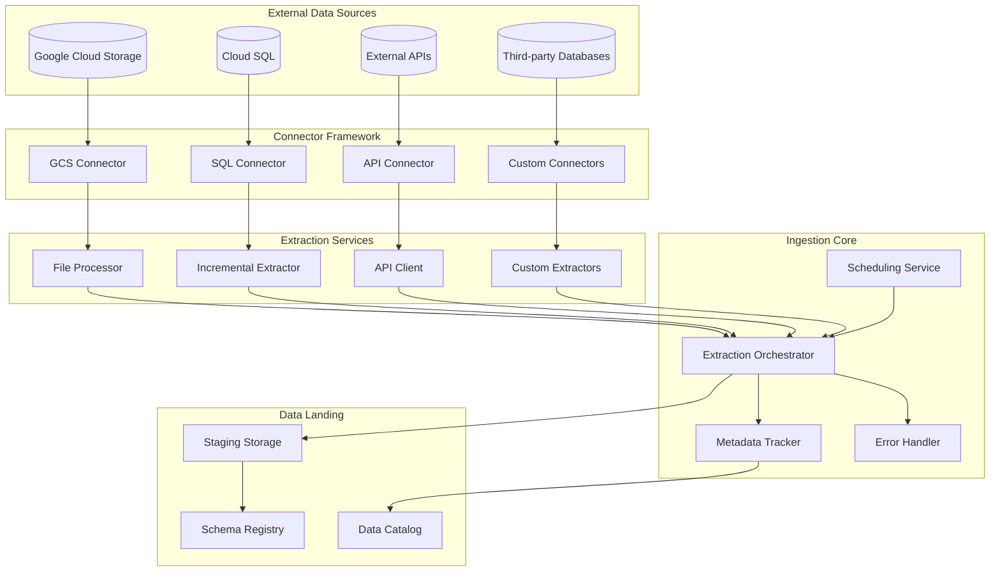

The Data Ingestion Layer is the entry point for all data flowing into the self-healing pipeline. It provides a robust, extensible framework for extracting data from various sources, handling the complexities of different protocols, formats, and authentication methods while maintaining a consistent interface for downstream components.

This document details the architecture of the Data Ingestion Layer, including its components, workflows, integration points, and self-healing capabilities.

## Introduction

### Purpose and Scope

The Data Ingestion Layer serves several critical purposes in the self-healing pipeline:

- **Data Acquisition**: Extracting data from various source systems reliably and efficiently
- **Source Abstraction**: Providing a unified interface to diverse data sources
- **Metadata Capture**: Recording comprehensive metadata about extraction processes
- **Error Handling**: Detecting and managing extraction failures with self-healing capabilities
- **Orchestration**: Coordinating complex extraction workflows with dependencies

The scope of the Data Ingestion Layer includes:

- Connections to supported data sources (GCS, Cloud SQL, APIs, third-party databases)
- Extraction of data in various formats (CSV, JSON, Avro, Parquet, etc.)
- Staging of extracted data for further processing
- Metadata tracking for lineage and monitoring
- Integration with self-healing mechanisms for error recovery

The layer does not include data transformation, quality validation, or loading into the final destination, which are handled by subsequent pipeline components.

### Key Requirements

The Data Ingestion Layer addresses several key requirements from the technical specifications:

1. **Multi-Source Support**: Ability to extract data from GCS, Cloud SQL, external APIs, and third-party databases
2. **Format Flexibility**: Support for various file formats including CSV, JSON, Avro, and Parquet
3. **Incremental Extraction**: Efficient extraction of only changed data where applicable
4. **Metadata Tracking**: Comprehensive capture of source and extraction metadata
5. **Error Resilience**: Robust error handling with retry mechanisms and self-healing capabilities
6. **Orchestration**: Coordination of extraction workflows with dependencies
7. **Scalability**: Ability to handle growing data volumes and sources
8. **Security**: Secure handling of credentials and data access

These requirements shape the architecture and implementation of the Data Ingestion Layer, ensuring it provides a reliable foundation for the self-healing pipeline.

### Design Principles

The Data Ingestion Layer is built on several core design principles:

- **Modularity**: Clear separation of concerns with well-defined interfaces between components
- **Extensibility**: Ability to add new source types and formats without modifying existing code
- **Resilience**: Multiple layers of error detection, handling, and recovery
- **Observability**: Comprehensive logging and metrics for monitoring and troubleshooting
- **Security**: Defense-in-depth approach to credential management and data protection
- **Performance**: Efficient extraction with minimal impact on source systems
- **Consistency**: Unified approach to extraction across different source types

These principles guide the architecture and implementation decisions throughout the Data Ingestion Layer, ensuring it meets the requirements while maintaining quality and maintainability.

## Architecture Overview

The Data Ingestion Layer follows a modular, component-based architecture that provides flexibility, extensibility, and resilience while maintaining a consistent interface for downstream components.

### High-Level Architecture



The Data Ingestion Layer consists of five main components:

1. **Connector Framework**: Provides standardized interfaces for connecting to different data sources
2. **Extraction Services**: Specialized components for different extraction patterns and formats
3. **Ingestion Core**: Central orchestration and management of extraction processes
4. **Data Landing**: Staging and organization of extracted data
5. **Integration Points**: Connections to other pipeline components

These components work together to provide a flexible, extensible framework for data ingestion that can adapt to different source systems and extraction requirements.

### Key Components

The Data Ingestion Layer consists of several key components, each with specific responsibilities:

1. **Connector Framework**:
   - **Base Connector**: Abstract interface defining the contract for all connectors
   - **Source-Specific Connectors**: Implementations for GCS, Cloud SQL, APIs, etc.
   - **Connector Factory**: Creates appropriate connectors based on source type
   - **Connection Manager**: Handles connection pooling and credential management

2. **Extraction Services**:
   - **File Processor**: Handles extraction from file-based sources
   - **Incremental Extractor**: Manages change data capture and incremental extraction
   - **API Client**: Manages API requests, pagination, and rate limiting
   - **Custom Extractors**: Specialized extraction logic for specific sources

3. **Ingestion Core**:
   - **Extraction Orchestrator**: Coordinates extraction processes and dependencies
   - **Scheduling Service**: Manages extraction timing and frequency
   - **Metadata Tracker**: Records comprehensive metadata about extractions
   - **Error Handler**: Manages extraction errors with retry and recovery logic

4. **Data Landing**:
   - **Staging Storage**: Temporary storage for extracted data
   - **Schema Registry**: Tracks and manages schema information
   - **Data Normalizer**: Standardizes data formats for downstream processing
   - **Data Catalog Integration**: Publishes metadata to data catalog

5. **Integration Points**:
   - **Quality Integration**: Handoff to data quality validation
   - **Self-Healing Integration**: Hooks for automated error recovery
   - **Monitoring Integration**: Metrics and events for monitoring
   - **Orchestration Integration**: Connection to Cloud Composer

Each component is designed with clear responsibilities and interfaces, enabling independent development, testing, and scaling while maintaining cohesive system behavior.

### Data Flow

The data flow through the Data Ingestion Layer follows these steps:

1. **Initiation**: Extraction is triggered by a schedule, event, or manual action
2. **Source Connection**: The appropriate connector establishes a connection to the source system
3. **Data Extraction**: Data is extracted from the source using the appropriate method
4. **Metadata Capture**: Comprehensive metadata about the extraction is recorded
5. **Data Staging**: Extracted data is staged in Cloud Storage in a standardized format
6. **Schema Registration**: Schema information is captured and registered
7. **Handoff**: Staged data and metadata are made available to downstream components

This flow is orchestrated by the Extraction Orchestrator, which manages the dependencies between steps and ensures reliable execution. The flow includes error handling at each step, with retry mechanisms and self-healing capabilities to recover from failures.

For complex extraction scenarios, the flow may include additional steps such as:

- **Incremental Detection**: Identifying only changed data since the last extraction
- **Partitioning**: Breaking large extractions into manageable chunks
- **Parallel Processing**: Extracting multiple sources or partitions concurrently
- **Validation**: Basic validation of extracted data before staging

The data flow is designed to be resilient, with comprehensive error handling and recovery mechanisms at each step.

### Integration Points

The Data Ingestion Layer integrates with other components of the pipeline through well-defined interfaces:

1. **Data Quality Layer**:
   - Provides extracted data and metadata for validation
   - Receives validation results and quality metrics
   - Coordinates with quality validation for data acceptance

2. **Self-Healing Layer**:
   - Sends extraction errors and failures for analysis
   - Receives correction actions and adjusted parameters
   - Implements healing actions to recover from failures

3. **Monitoring Layer**:
   - Publishes metrics about extraction performance and health
   - Sends events for significant extraction activities
   - Provides logs for troubleshooting and analysis

4. **Orchestration Layer**:
   - Receives execution instructions from Cloud Composer
   - Reports execution status and results
   - Manages dependencies between extraction tasks

5. **External Systems**:
   - Connects to source systems for data extraction
   - Interacts with authentication services for credentials
   - Publishes metadata to data catalog services

These integration points enable the Data Ingestion Layer to participate in the self-healing capabilities of the pipeline, with extraction issues automatically detected and corrected when possible.

## Connector Framework

The Connector Framework provides a standardized interface for connecting to different data sources, abstracting the complexities of various protocols, formats, and authentication methods.

### Base Connector Interface

The `BaseConnector` class defines the contract that all source-specific connectors must implement:

```python
class BaseConnector(abc.ABC):
    """Abstract base class that defines the interface for all data source connectors."""
    
    def __init__(self, source_id, source_name, source_type, connection_config):
        """Initialize the base connector with source information and connection configuration."""
        self.source_id = source_id
        self.source_name = source_name
        self.source_type = source_type
        self.connection_config = connection_config
        self.is_connected = False
        # Additional initialization...
        
    @abc.abstractmethod
    def connect(self):
        """Establish connection to the data source."""
        pass
        
    @abc.abstractmethod
    def disconnect(self):
        """Close connection to the data source."""
        pass
        
    @abc.abstractmethod
    def extract_data(self, extraction_params):
        """Extract data from the source based on extraction parameters."""
        pass
        
    @abc.abstractmethod
    def get_source_schema(self, object_name):
        """Retrieve the schema information for a source object."""
        pass
        
    @abc.abstractmethod
    def validate_connection_config(self, config):
        """Validate the connection configuration."""
        pass
        
    def get_connection_status(self):
        """Get the current connection status and statistics."""
        # Implementation...
        
    def reset_connection_stats(self):
        """Reset connection statistics."""
        # Implementation...
```

This interface ensures that all connectors provide consistent capabilities regardless of the underlying source system, enabling the rest of the pipeline to interact with different sources in a uniform way.

Key aspects of the `BaseConnector` interface include:

- **Connection Management**: Methods for establishing and closing connections
- **Data Extraction**: Standardized method for extracting data with parameters
- **Schema Discovery**: Ability to retrieve schema information from the source
- **Configuration Validation**: Verification of connection parameters
- **Status Reporting**: Methods for checking connection status and statistics

The interface also includes internal methods for error handling, metadata formatting, and parameter validation that provide common functionality across all connector implementations.

### Source-Specific Connectors

The framework includes several source-specific connector implementations:

1. **GCS Connector**:
   - Connects to Google Cloud Storage buckets
   - Supports various file formats (CSV, JSON, Avro, Parquet)
   - Handles file pattern matching and batch processing
   - Manages GCS-specific authentication and permissions

2. **Cloud SQL Connector**:
   - Connects to Cloud SQL instances (PostgreSQL, MySQL)
   - Supports full and incremental extraction
   - Manages connection pooling and query optimization
   - Handles database-specific error scenarios

3. **API Connector**:
   - Connects to REST, GraphQL, or SOAP APIs
   - Handles authentication, pagination, and rate limiting
   - Manages request retries and error handling
   - Supports various response formats

4. **Custom Connectors**:
   - Extensible framework for additional source types
   - Pluggable architecture for third-party integrations
   - Consistent interface with core connectors

Each connector implementation handles the specifics of its source type while conforming to the `BaseConnector` interface, ensuring consistent behavior from the perspective of the extraction orchestrator and other pipeline components.

### Connector Factory

The `ConnectorFactory` provides a centralized mechanism for creating connector instances based on source type:

```python
class ConnectorFactory:
    """Factory class for creating connector instances based on source type."""
    
    def __init__(self):
        """Initialize the connector factory."""
        self._connector_registry = {}
        
    def register_connector(self, source_type, connector_class):
        """Register a connector class for a specific source type."""
        # Implementation...
        
    def create_connector(self, source_id, source_name, source_type, connection_config):
        """Create a connector instance for a specific source."""
        # Implementation...
        
    def get_registered_connectors(self):
        """Get a list of registered connector types."""
        # Implementation...
```

The factory pattern provides several benefits:

- **Decoupling**: Clients don't need to know the specific connector classes
- **Centralized Registration**: Single point for registering and discovering connectors
- **Dynamic Selection**: Runtime selection of appropriate connector based on source type
- **Extensibility**: Easy addition of new connector types without modifying client code

The factory is used by the extraction orchestrator to create connector instances as needed, based on the source type specified in the extraction request.

### Connection Management

The Connector Framework includes robust connection management capabilities:

1. **Connection Pooling**:
   - Reuse of connections to minimize overhead
   - Pool size configuration based on workload
   - Connection health monitoring and refresh

2. **Credential Management**:
   - Secure handling of authentication credentials
   - Integration with Secret Manager for sensitive information
   - Support for various authentication methods (API keys, OAuth, IAM)

3. **Connection Resilience**:
   - Automatic reconnection on failure
   - Circuit breaker pattern for persistent failures
   - Exponential backoff for retry attempts

4. **Connection Metrics**:
   - Tracking of connection attempts, successes, and failures
   - Performance metrics for connection operations
   - Historical connection statistics for monitoring

These connection management capabilities ensure reliable, secure access to source systems while optimizing performance and resource utilization.

## Extraction Services

Extraction Services are specialized components that handle the actual data extraction from different source types, implementing source-specific logic while providing a consistent interface to the orchestration layer.

### File Processor

The File Processor handles extraction from file-based sources, primarily Google Cloud Storage:

1. **Capabilities**:
   - Processing of various file formats (CSV, JSON, Avro, Parquet)
   - Handling of compressed files (gzip, zip, etc.)
   - Schema inference from file content
   - Chunked processing for large files

2. **Format Handlers**:
   - CSV Handler: Configurable delimiter, header, and quoting options
   - JSON Handler: Support for nested structures and arrays
   - Avro Handler: Schema-aware processing with compatibility checks
   - Parquet Handler: Efficient columnar format processing

3. **Performance Optimizations**:
   - Streaming processing for large files
   - Parallel processing of multiple files
   - Memory-efficient handling of large datasets
   - Selective column reading where supported

4. **Error Handling**:
   - Format-specific error detection and recovery
   - Malformed record handling with configurable policies
   - Detailed error reporting with line/record information

The File Processor works closely with the GCS Connector to extract data from files stored in Google Cloud Storage, handling the complexities of different file formats and structures.

### Incremental Extractor

The Incremental Extractor manages change data capture and incremental extraction from database sources:

1. **Extraction Methods**:
   - Timestamp-based extraction for tables with modification timestamps
   - Primary key range extraction for tables without timestamps
   - Log-based extraction for databases with change data capture
   - Snapshot comparison for complex change detection

2. **State Management**:
   - Tracking of high-water marks for incremental extraction
   - Persistent state storage for reliable resumption
   - Versioned state for recovery and auditing

3. **Optimization Techniques**:
   - Query optimization for efficient filtering
   - Index utilization for performance
   - Partitioned extraction for large tables
   - Parallel extraction where supported

4. **Consistency Guarantees**:
   - Transaction boundary awareness
   - Handling of concurrent modifications
   - Detection of schema changes during extraction

The Incremental Extractor works with database connectors to efficiently extract only changed data, minimizing the impact on source systems while ensuring complete data capture.

### API Client

The API Client manages extraction from REST, GraphQL, and other API-based sources:

1. **API Interaction**:
   - Request construction and parameter handling
   - Response parsing and transformation
   - Error handling and status code interpretation
   - Content type negotiation

2. **Advanced Features**:
   - Pagination handling (offset, cursor, link-based)
   - Rate limiting and throttling compliance
   - Batching of requests where supported
   - Webhook support for event-driven extraction

3. **Authentication Methods**:
   - API key authentication
   - OAuth 2.0 flows
   - JWT token authentication
   - Custom authentication schemes

4. **Resilience Patterns**:
   - Retry with exponential backoff
   - Circuit breaker for API failures
   - Fallback strategies for degraded APIs
   - Request timeout management

The API Client provides a robust framework for interacting with external APIs, handling the complexities of different API designs and authentication methods while providing a consistent interface to the extraction orchestrator.

### Custom Extractors

The framework supports custom extractors for specialized source systems:

1. **Extension Points**:
   - Pluggable extractor interface
   - Custom connector integration
   - Source-specific parameter handling
   - Specialized error management

2. **Common Use Cases**:
   - Legacy system integration
   - Proprietary database access
   - Complex multi-step extraction
   - Format conversion during extraction

3. **Implementation Approach**:
   - Abstract base classes for extension
   - Configuration-driven customization
   - Middleware pattern for behavior modification
   - Composition with core extractors

4. **Integration Requirements**:
   - Conformance to extraction interface
   - Metadata generation compliance
   - Error handling consistency
   - Performance and resource guidelines

Custom extractors enable the framework to be extended for specialized source systems while maintaining consistency with the core extraction capabilities.

## Ingestion Core

The Ingestion Core provides central orchestration and management of extraction processes, coordinating the activities of connectors and extraction services while managing metadata, errors, and dependencies.

### Extraction Orchestrator

The Extraction Orchestrator is the central component that coordinates extraction processes:

```python
class ExtractionOrchestrator:
    """Orchestrates data extraction processes from various sources."""
    
    def __init__(self, metadata_tracker, dependency_manager, staging_manager):
        """Initialize the extraction orchestrator with required services."""
        self._connector_factory = ConnectorFactory()
        self._metadata_tracker = metadata_tracker
        self._dependency_manager = dependency_manager
        self._staging_manager = staging_manager
        # Additional initialization...
        
    def extract_data(self, source_id, extraction_params):
        """Extract data from a source based on extraction parameters."""
        # Implementation...
        
    def extract_data_sync(self, source_id, extraction_params):
        """Extract data synchronously and wait for completion."""
        # Implementation...
        
    def get_extraction_status(self, extraction_id):
        """Get the current status of an extraction process."""
        # Implementation...
        
    def cancel_extraction(self, extraction_id):
        """Cancel an ongoing extraction process."""
        # Implementation...
        
    def retry_extraction(self, extraction_id, updated_params=None):
        """Retry a failed extraction with optional parameter adjustments."""
        # Implementation...
        
    def apply_healing_action(self, extraction_id, healing_id, action_type, action_params):
        """Apply a healing action to a failed extraction."""
        # Implementation...
```

Key responsibilities of the Extraction Orchestrator include:

1. **Process Management**:
   - Creating and tracking extraction processes
   - Managing the lifecycle of extractions from initiation to completion
   - Handling asynchronous and synchronous extraction modes

2. **Connector Coordination**:
   - Creating and managing connectors for different sources
   - Handling connection establishment and release
   - Coordinating data extraction through appropriate connectors

3. **Dependency Management**:
   - Checking and enforcing dependencies between extractions
   - Handling dependency failures and cascading effects
   - Optimizing extraction order based on dependencies

4. **Error Handling**:
   - Detecting and classifying extraction errors
   - Implementing retry strategies with backoff
   - Integrating with self-healing for automated recovery

5. **Metadata Management**:
   - Recording comprehensive metadata about extractions
   - Tracking extraction history and performance
   - Providing status and metrics for monitoring

The Extraction Orchestrator provides both synchronous and asynchronous extraction modes, with support for cancellation, retry, and healing actions to recover from failures.

### Scheduling Service

The Scheduling Service manages the timing and frequency of extraction processes:

1. **Scheduling Capabilities**:
   - Time-based scheduling (cron expressions)
   - Event-driven scheduling (triggers)
   - Dependency-based scheduling (DAGs)
   - Manual scheduling (on-demand)

2. **Schedule Management**:
   - Creation and modification of schedules
   - Activation and deactivation of schedules
   - Schedule history and audit trail
   - Schedule conflict detection and resolution

3. **Execution Control**:
   - Triggering of scheduled extractions
   - Handling of missed schedules
   - Backfill capabilities for historical data
   - Catch-up mode for delayed executions

4. **Integration with Cloud Composer**:
   - DAG generation for complex schedules
   - Airflow operator integration
   - Sensor-based dependency management
   - Cross-DAG coordination

The Scheduling Service works closely with Cloud Composer (Apache Airflow) to manage the timing and dependencies of extraction processes, ensuring they run at the appropriate times and in the correct order.

### Metadata Tracker

The Metadata Tracker records comprehensive information about extraction processes:

1. **Metadata Capture**:
   - Source system details (type, location, version)
   - Extraction parameters and configuration
   - Execution details (timing, duration, resources)
   - Result statistics (record counts, sizes, formats)

2. **Lineage Tracking**:
   - Data origin and provenance
   - Transformation and processing history
   - Dependency relationships between datasets
   - Version tracking for reproducibility

3. **Storage and Retrieval**:
   - Efficient storage in Firestore/BigQuery
   - Indexing for quick retrieval
   - Query capabilities for analysis
   - Retention policies for historical data

4. **Integration Points**:
   - Data Catalog publication for discovery
   - Monitoring integration for metrics
   - Quality service for validation context
   - Self-healing for historical patterns

The Metadata Tracker provides a comprehensive record of all extraction activities, enabling monitoring, troubleshooting, lineage tracking, and compliance reporting.

### Error Handler

The Error Handler manages extraction errors with sophisticated detection, classification, and recovery capabilities:

1. **Error Detection**:
   - Exception monitoring during extraction
   - Timeout detection for long-running operations
   - Validation of extraction results
   - Health checks for source systems

2. **Error Classification**:
   - Source-specific error categorization
   - Transient vs. persistent errors
   - Data-related vs. system errors
   - Security and permission issues

3. **Recovery Strategies**:
   - Retry with exponential backoff
   - Parameter adjustment for retries
   - Alternative extraction paths
   - Degraded mode operation

4. **Self-Healing Integration**:
   - Error reporting to self-healing system
   - Application of healing actions
   - Feedback on healing effectiveness
   - Learning from historical errors

The Error Handler works closely with the Self-Healing Layer to automatically recover from extraction failures when possible, reducing the need for manual intervention and improving overall pipeline reliability.

## Data Landing

The Data Landing components manage the staging and organization of extracted data, preparing it for further processing by downstream pipeline components.

### Staging Storage

The Staging Storage component manages temporary storage for extracted data:

1. **Storage Architecture**:
   - Google Cloud Storage as primary staging area
   - Organized folder structure by source and date
   - Standardized naming conventions
   - Lifecycle policies for cleanup

2. **Data Organization**:
   - Source-specific directories
   - Timestamp-based partitioning
   - Status indicators (raw, validated, processed)
   - Metadata sidecar files

3. **Format Standardization**:
   - Conversion to preferred formats where needed
   - Compression for storage efficiency
   - Schema embedding where supported
   - Consistent encoding and delimiters

4. **Access Control**:
   - Fine-grained IAM permissions
   - Temporary access credentials
   - Audit logging of access
   - Encryption for sensitive data

The Staging Storage provides a reliable, organized repository for extracted data, serving as the handoff point between ingestion and subsequent processing steps.

### Schema Registry

The Schema Registry tracks and manages schema information for extracted data:

1. **Schema Management**:
   - Schema extraction from source data
   - Schema versioning and history
   - Compatibility checking between versions
   - Schema documentation and annotation

2. **Schema Formats**:
   - JSON Schema for structured data
   - Avro schemas for compatible formats
   - BigQuery schema definitions
   - Custom schema formats for specialized sources

3. **Schema Operations**:
   - Schema comparison and diff generation
   - Schema evolution management
   - Schema validation against standards
   - Schema transformation between formats

4. **Integration Points**:
   - Data Catalog integration for discovery
   - Quality validation for schema checks
   - BigQuery integration for table creation
   - Documentation generation for users

The Schema Registry ensures that schema information is accurately captured, versioned, and made available to downstream components, enabling proper interpretation and validation of the extracted data.

### Data Normalizer

The Data Normalizer standardizes extracted data formats for consistent downstream processing:

1. **Normalization Functions**:
   - Data type standardization
   - Naming convention enforcement
   - Structure normalization (nesting, arrays)
   - Value formatting (dates, numbers, strings)

2. **Source-Specific Handling**:
   - GCS file format normalization
   - Database result set formatting
   - API response transformation
   - Custom source normalization

3. **Configuration Options**:
   - Target format specification
   - Field mapping rules
   - Default value policies
   - Error handling preferences

4. **Performance Considerations**:
   - Streaming processing for large datasets
   - Efficient transformation algorithms
   - Memory management for large files
   - Parallel processing where applicable

The Data Normalizer ensures that data from different sources is transformed into a consistent format before being passed to downstream components, simplifying subsequent processing and reducing the need for source-specific handling in later stages.

### Data Catalog Integration

The Data Catalog Integration publishes metadata about extracted data to enable discovery and governance:

1. **Catalog Publishing**:
   - Automated registration of datasets
   - Schema publication with annotations
   - Lineage information recording
   - Technical and business metadata

2. **Metadata Enrichment**:
   - Source system details
   - Extraction process information
   - Quality metrics and validation results
   - Usage and access patterns

3. **Search and Discovery**:
   - Keyword and attribute-based search
   - Faceted navigation of datasets
   - Related dataset recommendations
   - Usage-based relevance ranking

4. **Governance Integration**:
   - Data classification and sensitivity labeling
   - Policy attachment to datasets
   - Ownership and stewardship assignment
   - Compliance and regulatory tagging

The Data Catalog Integration ensures that extracted data is discoverable and properly documented, enabling users to find, understand, and appropriately use the data for analytics and other purposes.

## Workflow Orchestration

The Data Ingestion Layer leverages Cloud Composer (Apache Airflow) for workflow orchestration, enabling complex extraction workflows with dependencies, scheduling, and monitoring.

### Cloud Composer Integration

The integration with Cloud Composer provides robust workflow orchestration capabilities:

1. **Environment Configuration**:
   - Managed Cloud Composer environment
   - Appropriate sizing for workload
   - Network configuration for security
   - Monitoring and logging setup

2. **DAG Management**:
   - Version-controlled DAG definitions
   - Automated deployment pipeline
   - Testing and validation framework
   - Documentation generation

3. **Operational Features**:
   - Web UI for monitoring and management
   - REST API for programmatic control
   - Alerting integration for failures
   - Logging for troubleshooting

4. **Scaling and Performance**:
   - Worker scaling based on queue depth
   - Resource allocation optimization
   - Task prioritization for critical flows
   - Performance monitoring and tuning

Cloud Composer provides a managed Apache Airflow environment that handles the complexities of workflow orchestration, enabling reliable execution of extraction processes with proper dependency management and scheduling.

### DAG Structure

The Airflow DAGs for data ingestion follow a consistent structure:

```python
with DAG(
    'gcs_ingestion_dag',
    default_args=default_args,
    description='Ingest data from GCS to BigQuery with self-healing',
    schedule_interval=datetime.timedelta(days=1),
    catchup=False,
) as dag:
    # List files matching pattern
    list_files = GCSListOperator(
        task_id='list_files',
        bucket=BUCKET_NAME,
        prefix=SOURCE_PREFIX,
        delimiter=None,
        gcp_conn_id=GCP_CONN_ID
    )
    
    # Dynamic task generation based on file list
    file_sensor = PythonOperator(
        task_id='file_sensor',
        python_callable=create_file_tasks,
        provide_context=True,
        op_kwargs={'dag': dag}
    )
    
    # End task to mark completion
    end_task = DummyOperator(task_id='end_processing')
    
    # Task dependencies
    list_files >> file_sensor >> end_task