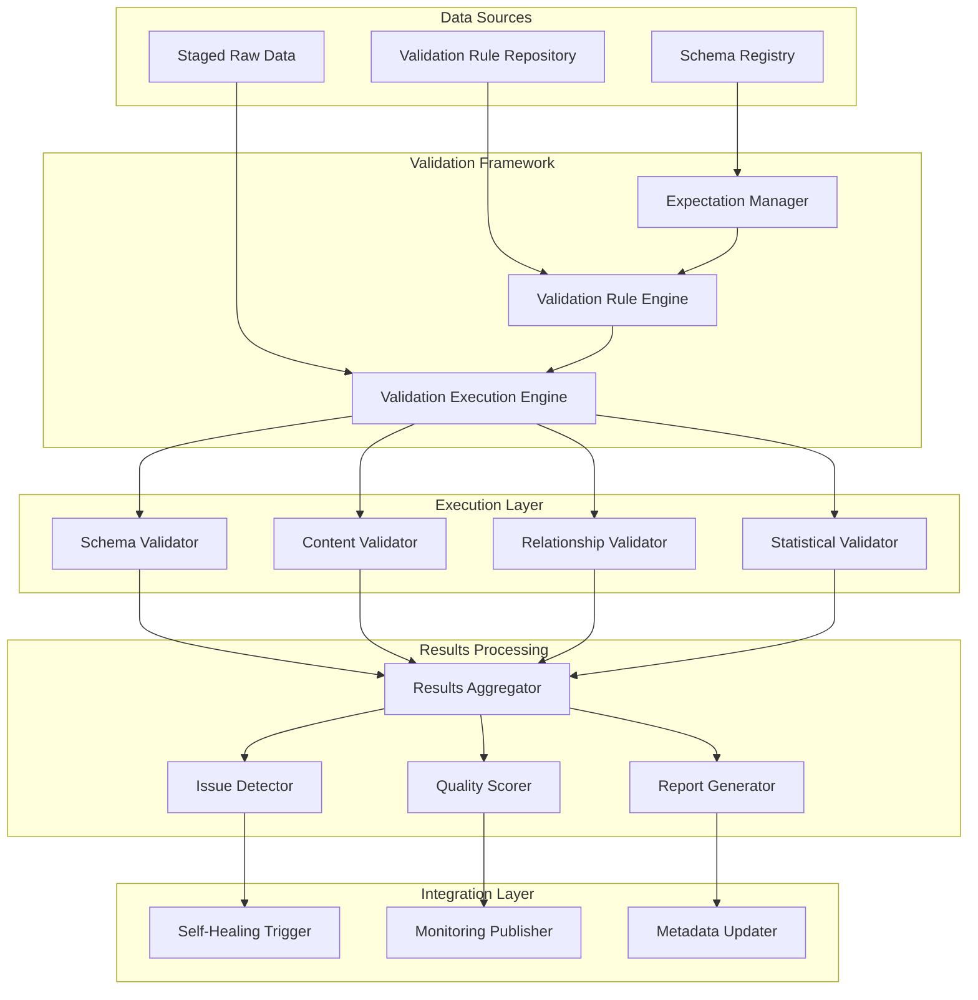
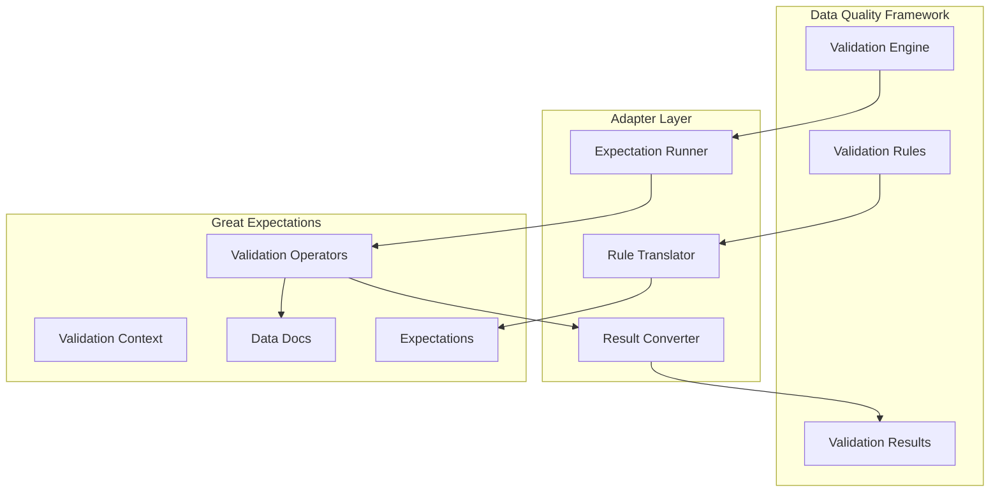
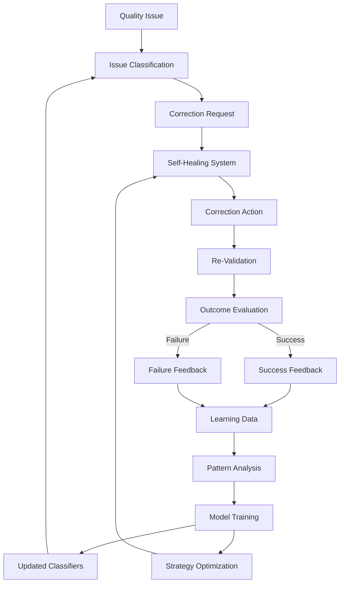

# Data Quality Architecture: Self-Healing Data Pipeline

## Introduction

The Data Quality Architecture is a foundational component of the self-healing data pipeline, providing comprehensive validation, monitoring, and quality assessment capabilities. This document outlines the design, components, and implementation details of the data quality framework that ensures data moving through the pipeline meets defined quality standards.

### Purpose and Scope

The data quality framework serves several critical purposes within the pipeline:

- **Validate Data Integrity**: Ensure data conforms to expected schemas, formats, and business rules
- **Detect Quality Issues**: Identify missing values, anomalies, referential integrity violations, and other quality problems
- **Quantify Quality Levels**: Provide measurable quality scores to assess overall data health
- **Enable Self-Healing**: Feed quality issues to the self-healing system for automated resolution
- **Support Decision Making**: Provide quality metrics to inform data-driven decisions
- **Ensure Compliance**: Validate data against regulatory and governance requirements

This architecture addresses the full spectrum of data quality concerns, from basic schema validation to complex statistical analysis, with a focus on automation and integration with the self-healing capabilities of the pipeline.

### Key Principles

The data quality architecture is built on several foundational principles:

- **Comprehensive Coverage**: Validate all aspects of data quality across multiple dimensions
- **Automated Validation**: Minimize manual quality checks through automation
- **Actionable Results**: Provide clear, specific information about quality issues
- **Self-Healing Integration**: Enable automated correction of quality problems
- **Performance Efficiency**: Optimize validation for large datasets
- **Extensibility**: Support easy addition of new validation rules and types
- **Visibility**: Provide clear metrics and visualization of quality status

These principles guide the design and implementation of all components of the data quality framework, ensuring it provides robust, scalable, and effective quality validation.

### Integration Points

The data quality framework integrates with several other components of the pipeline:

- **Data Ingestion**: Receives data from ingestion processes for validation
- **BigQuery**: Leverages BigQuery for large-scale data validation
- **Self-Healing System**: Sends quality issues for automated correction
- **Monitoring System**: Reports quality metrics for monitoring and alerting
- **Pipeline Orchestration**: Integrates with Cloud Composer for workflow management
- **Data Storage**: Validates data before loading to permanent storage
- **Reporting Systems**: Provides quality metrics for dashboards and reports

These integration points ensure that data quality is maintained throughout the pipeline, with appropriate connections to enable both automated and human-driven quality management.

## Architecture Overview

The data quality architecture employs a modular, component-based design that provides comprehensive validation capabilities while maintaining flexibility, performance, and scalability.

### Component Diagram



### Key Components

The data quality architecture consists of five main component groups:

1. **Data Sources**: Provides the data to be validated and the definitions for validation.
   - **Staged Raw Data**: Data ready for validation from various pipeline sources
   - **Schema Registry**: Repository of expected data structures and relationships
   - **Validation Rule Repository**: Collection of validation rules and configurations

2. **Validation Framework**: Core components that manage and execute validation.
   - **Validation Rule Engine**: Manages rule definitions and their application
   - **Expectation Manager**: Translates rules to executable expectations
   - **Validation Execution Engine**: Orchestrates validation execution

3. **Execution Layer**: Specialized validators for different types of quality checks.
   - **Schema Validator**: Validates data structure and types
   - **Content Validator**: Validates data values and formats
   - **Relationship Validator**: Validates referential integrity and relationships
   - **Statistical Validator**: Performs statistical and pattern-based validation

4. **Results Processing**: Components that process and analyze validation results.
   - **Results Aggregator**: Combines results from multiple validators
   - **Quality Scorer**: Calculates quality scores based on validation results
   - **Issue Detector**: Identifies and classifies quality issues
   - **Report Generator**: Creates validation reports and documentation

5. **Integration Layer**: Components that connect with other systems.
   - **Self-Healing Trigger**: Sends quality issues to the self-healing system
   - **Monitoring Publisher**: Reports metrics to the monitoring system
   - **Metadata Updater**: Updates metadata repositories with quality information

Each component has specific responsibilities and interfaces, enabling a modular, extensible architecture that can evolve over time.

### Data Flow

The data flow through the quality validation process follows these steps:

1. **Rule Loading**: Validation rules are loaded from the repository and translated into executable expectations by the Rule Engine and Expectation Manager.

2. **Data Ingestion**: Data to be validated is received from pipeline sources and prepared for validation by the Execution Engine.

3. **Validation Execution**: The Execution Engine dispatches validation tasks to appropriate validators based on rule types.

4. **Specialized Validation**: Each validator performs its specific checks:
   - Schema Validator checks data structure and types
   - Content Validator checks data values and formats
   - Relationship Validator checks referential integrity
   - Statistical Validator performs anomaly detection and pattern analysis

5. **Results Collection**: Validation results from all validators are collected and aggregated by the Results Aggregator.

6. **Results Processing**: The aggregated results are:
   - Scored by the Quality Scorer to calculate quality metrics
   - Analyzed by the Issue Detector to identify and classify problems
   - Formatted by the Report Generator for reporting and documentation

7. **Integration Outputs**: Results are sent to:
   - Self-Healing System for automated correction via the Self-Healing Trigger
   - Monitoring System for alerts and dashboards via the Monitoring Publisher
   - Metadata repositories for quality tracking via the Metadata Updater

This flow ensures comprehensive validation with appropriate actions taken based on results, connecting quality validation seamlessly with other pipeline components.

## Validation Engine

The Validation Engine is the core component of the data quality architecture, orchestrating the execution of validation rules against datasets and managing the validation process from start to finish.

### Responsibilities

The Validation Engine has several key responsibilities:

- **Validation Orchestration**: Coordinate the execution of validation rules against datasets
- **Resource Management**: Allocate appropriate resources for validation tasks
- **Performance Optimization**: Execute validations efficiently for large datasets
- **Result Collection**: Gather and normalize results from different validators
- **Error Handling**: Manage and recover from validation errors
- **Validation Tracking**: Monitor and report on validation progress
- **Context Management**: Maintain context information for validation

These responsibilities ensure that validation is executed efficiently, reliably, and with appropriate resource utilization for datasets of any size.

### Execution Modes

The Validation Engine supports multiple execution modes to handle different dataset sizes and validation requirements:

#### In-Memory Mode

- **Use Cases**: Small datasets, simple validations, development and testing
- **Implementation**: Data loaded entirely into memory for validation
- **Advantages**: Simplicity, low latency for small datasets
- **Limitations**: Memory constraints for large datasets
- **Typical Use**: Validating configuration data, reference data, small operational datasets

#### BigQuery Mode

- **Use Cases**: Large datasets, complex validations, production workloads
- **Implementation**: Validation translated to SQL and executed directly in BigQuery
- **Advantages**: Scales to petabytes, leverages BigQuery's processing power
- **Limitations**: More complex setup, depends on BigQuery availability
- **Typical Use**: Production data validation, historical analysis, complex aggregations

#### Great Expectations Mode

- **Use Cases**: Standard validations with rich reporting, complex validation pipelines
- **Implementation**: Leverages Great Expectations framework for validation
- **Advantages**: Rich expectation library, comprehensive reporting
- **Limitations**: Additional dependency, operational complexity
- **Typical Use**: Standard validation patterns, when detailed reports are required

#### Hybrid Mode

- **Use Cases**: Complex scenarios requiring multiple approaches
- **Implementation**: Combines multiple execution modes as appropriate
- **Advantages**: Flexibility, optimization for different parts of validation
- **Limitations**: More complex orchestration and result aggregation
- **Typical Use**: When different parts of validation have different requirements

The engine selects the appropriate mode based on dataset characteristics, validation complexity, and configuration settings, with the ability to override automatically selected modes when necessary.

### Validation Process

The validation process follows these steps:

1. **Initialization**:
   - Load validation rules from repository
   - Translate rules to execution-specific format
   - Initialize validation context
   - Set up resources for execution

2. **Execution Planning**:
   - Analyze dataset characteristics (size, structure)
   - Determine appropriate execution mode
   - Optimize rule execution order
   - Create execution plan

3. **Data Preparation**:
   - Connect to data source
   - Apply any necessary pre-validation transformations
   - Prepare sampling if configured
   - Validate data accessibility

4. **Rule Execution**:
   - Execute rules according to plan
   - Track execution progress
   - Manage timeouts and resource constraints
   - Collect results as they complete

5. **Result Aggregation**:
   - Normalize results from different validators
   - Combine results into unified format
   - Calculate summary statistics
   - Prepare for scoring and analysis

6. **Post-Processing**:
   - Generate validation reports
   - Update validation metadata
   - Clean up temporary resources
   - Notify interested systems

This process ensures systematic, efficient validation execution with appropriate resource management and result handling.

### Performance Considerations

The Validation Engine implements several strategies to optimize performance:

#### Execution Optimization

- **Rule Dependency Analysis**: Execute rules in optimal order based on dependencies
- **Parallel Execution**: Run independent validations concurrently
- **Incremental Validation**: Validate only changed data when possible
- **Lazy Evaluation**: Defer execution until results are needed
- **Early Termination**: Stop validation when critical failures are detected

#### Resource Management

- **Dynamic Resource Allocation**: Adjust resources based on dataset size and complexity
- **Memory Management**: Control memory usage for large datasets
- **Timeout Handling**: Graceful handling of execution timeouts
- **Backpressure Mechanisms**: Prevent resource exhaustion during peak loads
- **Resource Pooling**: Reuse connections and execution contexts

#### BigQuery Optimization

- **Query Optimization**: Generate efficient SQL for BigQuery execution
- **Partition Pruning**: Leverage partitioning for reduced data scanning
- **Clustering Utilization**: Use clustering keys for performance
- **Slot Management**: Control BigQuery slot utilization
- **Cost-Based Execution**: Balance performance and cost considerations

#### Caching Strategies

- **Rule Compilation Caching**: Cache compiled rule definitions
- **Result Caching**: Cache validation results for reuse
- **Schema Caching**: Cache schema information
- **Connection Pooling**: Reuse database connections
- **Metadata Caching**: Cache validation metadata

These optimization strategies ensure that validation can scale efficiently with data volume and complexity, providing timely results even for large datasets and complex validation rules.

## Rule Engine

The Rule Engine is responsible for managing validation rules and their lifecycle, from definition to execution. It provides a flexible, extensible framework for defining and applying data quality rules.

### Rule Structure

Validation rules follow a structured format that captures all information needed for validation:

```json
{
  "rule_id": "uniqueRuleIdentifier",
  "name": "Human-readable rule name",
  "description": "Detailed description of the rule's purpose",
  "category": "schema|content|relationship|statistical",
  "type": "specific_rule_type",
  "severity": "critical|high|medium|low",
  "target": {
    "dataset": "target_dataset",
    "table": "target_table",
    "columns": ["column1", "column2"],
    "condition": "SQL-like condition for selective application"
  },
  "parameters": {
    "param1": "value1",
    "param2": "value2"
  },
  "expectation": {
    "type": "great_expectations_type",
    "kwargs": {}
  },
  "metadata": {
    "owner": "team_or_person",
    "tags": ["tag1", "tag2"],
    "created": "timestamp",
    "updated": "timestamp",
    "version": "1.0"
  }
}
```

Key components of a rule definition include:

- **Identification**: Unique ID, name, and description
- **Classification**: Category, type, and severity
- **Targeting**: Dataset, table, columns, and conditions for application
- **Parameters**: Rule-specific configuration parameters
- **Expectation Mapping**: Corresponding Great Expectations expectation (if applicable)
- **Metadata**: Information about rule ownership, history, and context

This structure provides a comprehensive representation of validation requirements, supporting both standard and custom validation types with appropriate context and configuration.

### Rule Management

The Rule Engine provides comprehensive lifecycle management for validation rules:

#### Rule Registration

- **Creation Interfaces**: APIs and UIs for rule creation
- **Validation**: Verification of rule structure and parameters
- **Deduplication**: Prevention of duplicate rules
- **Dependencies**: Management of rule dependencies
- **Activation**: Explicit activation of new rules

#### Rule Versioning

- **Version Control**: Tracking of rule changes over time
- **Change History**: Record of modifications with timestamps
- **Rollback Capability**: Ability to revert to previous versions
- **Comparison**: Side-by-side comparison of rule versions
- **Migration**: Tools for bulk rule updates

#### Rule Organization

- **Categorization**: Grouping by category, dataset, owner, etc.
- **Tagging**: Flexible tagging system for organization
- **Search**: Rich search capabilities across rule properties
- **Collections**: Grouping of related rules
- **Dependencies**: Tracking of relationships between rules

#### Rule Testing

- **Validation**: Verification of rule syntax and structure
- **Test Execution**: Trial execution against sample data
- **Impact Analysis**: Assessment of potential impact
- **Performance Evaluation**: Testing of execution efficiency
- **Regression Testing**: Verification against historical results

This comprehensive management approach ensures that rules are well-organized, properly maintained, and effectively governed throughout their lifecycle.

### Rule Types

The Rule Engine supports four primary categories of rules, each with specific subtypes:

#### Schema Rules

Validate the structure and properties of data:

- **Existence**: Verify column existence
- **Data Type**: Validate column data types
- **Nullability**: Check nullable/non-nullable constraints
- **Schema Consistency**: Verify consistency with expected schema
- **Schema Evolution**: Validate changes against previous versions

#### Content Rules

Validate the values and formats of data:

- **Null Check**: Validate presence/absence of null values
- **Value Range**: Verify values within specified ranges
- **Value Set**: Validate against enumerated value sets
- **Pattern Match**: Verify values match specified patterns
- **Format Validation**: Check date, number, and other formats
- **Length Check**: Validate string length constraints
- **Custom Validation**: Apply custom validation logic

#### Relationship Rules

Validate relationships between data elements:

- **Referential Integrity**: Validate foreign key relationships
- **Uniqueness**: Verify unique constraints
- **Cardinality**: Check relationship cardinalities
- **Hierarchical**: Validate parent-child relationships
- **Temporal**: Verify time-based relationships
- **Cross-Dataset**: Validate relationships across datasets

#### Statistical Rules

Validate statistical properties and patterns:

- **Outlier Detection**: Identify statistical outliers
- **Distribution Analysis**: Validate value distributions
- **Correlation Check**: Verify correlations between columns
- **Aggregate Validation**: Validate aggregated values
- **Trend Analysis**: Verify trends over time
- **Anomaly Detection**: Identify unusual patterns

Each rule type has specific parameters and behavior, with the Rule Engine providing the framework for defining, managing, and executing all of these rule types consistently.

### Rule Registry

The Rule Registry serves as the central repository for all validation rules and their metadata:

#### Storage Implementation

- **Primary Storage**: Firestore document database
- **Versioning**: Git-based version control for rule definitions
- **Caching**: In-memory cache for frequently accessed rules
- **Backup**: Regular backups of the entire registry
- **Archive**: Historical storage of deprecated rules

#### Access Patterns

- **API Access**: RESTful API for programmatic access
- **UI Access**: Web interface for human interaction
- **Batch Operations**: Support for bulk operations
- **Search Capabilities**: Rich querying across rule properties
- **Change Notifications**: Events for rule changes

#### Security Controls

- **Access Control**: Role-based access to rule management
- **Audit Logging**: Comprehensive logging of all changes
- **Approval Workflows**: Configurable approval for rule changes
- **Validation**: Verification of rules before acceptance
- **Environment Separation**: Isolation between environments

#### Integration Features

- **Export/Import**: Tools for rule migration
- **Template Support**: Reusable rule templates
- **Bulk Operations**: Batch creation and modification
- **API Integration**: Integration with external systems
- **Notification**: Change notifications to interested systems

The Rule Registry provides a robust, secure foundation for rule management, enabling consistent, well-governed validation across the pipeline.

## Validators

Validators are specialized components that implement specific validation logic, each focused on a particular aspect of data quality. This modular approach allows for specialized handling of different validation requirements while maintaining a consistent framework.

### Schema Validator

The Schema Validator ensures that data conforms to expected structures and formats.

#### Core Capabilities

- **Column Existence**: Verify that all expected columns are present
- **Data Type Validation**: Ensure columns have correct data types
- **Nullability Checking**: Validate null constraints
- **Schema Comparison**: Compare actual schema against expected definition
- **Schema Evolution**: Track and validate schema changes
- **Primary Key Validation**: Verify primary key constraints

#### Implementation Approaches

- **In-Memory**: Direct schema inspection for small datasets
- **BigQuery**: SQL-based schema validation for large datasets
- **Great Expectations**: Schema expectations for standardized validation
- **Custom**: Special-purpose validators for complex schemas

#### BigQuery Integration

```sql
-- Example: Data type validation in BigQuery
WITH validation AS (
  SELECT 
    COUNT(*) AS total_rows,
    COUNTIF(SAFE_CAST(column_name AS target_type) IS NULL AND column_name IS NOT NULL) AS type_errors
  FROM dataset.table
)
SELECT 
  IF(type_errors = 0, 'PASS', 'FAIL') AS result,
  CAST(type_errors AS STRING) AS errors,
  CAST(total_rows AS STRING) AS total,
  CAST(ROUND((type_errors / total_rows) * 100, 2) AS STRING) AS error_percentage
FROM validation
```

#### Performance Optimization

- **Schema Caching**: Cache schema information for efficiency
- **Selective Validation**: Validate only changed schema elements
- **Parallel Validation**: Execute schema checks concurrently
- **Incremental Validation**: Validate only new or changed data
- **Sampling**: Use statistical sampling for large datasets

Schema validation is typically the first step in the quality validation process, as structural issues can impact all other validation types.

### Content Validator

The Content Validator ensures that data values meet quality standards and business rules.

#### Core Capabilities

- **Null Checking**: Validate presence/absence of null values
- **Value Range Validation**: Verify values within specified ranges
- **Value Set Validation**: Check values against enumerated sets
- **Pattern Matching**: Validate values against regex patterns
- **Format Validation**: Check date, number, and string formats
- **Custom Validation**: Apply custom business rules

#### Implementation Approaches

- **In-Memory**: Direct value validation for small datasets
- **BigQuery**: SQL-based content validation for large datasets
- **Great Expectations**: Content expectations for standardized validation
- **Rule-Based**: Declarative rule evaluation for complex conditions

#### BigQuery Integration

```sql
-- Example: Value range validation in BigQuery
WITH validation AS (
  SELECT 
    COUNT(*) AS total_rows,
    COUNTIF(column_name < min_value OR column_name > max_value) AS range_errors
  FROM dataset.table
  WHERE column_name IS NOT NULL
)
SELECT 
  IF(range_errors = 0, 'PASS', 'FAIL') AS result,
  CAST(range_errors AS STRING) AS errors,
  CAST(total_rows AS STRING) AS total,
  CAST(ROUND((range_errors / total_rows) * 100, 2) AS STRING) AS error_percentage
FROM validation
```

#### Performance Optimization

- **Predicate Pushdown**: Push filter conditions to the database
- **Parallel Validation**: Execute content checks concurrently
- **Early Termination**: Stop on critical validation failures
- **Selective Validation**: Validate only relevant columns
- **Query Optimization**: Generate efficient validation queries

Content validation typically represents the bulk of validation rules and is critical for ensuring data usability and correctness.

### Relationship Validator

The Relationship Validator ensures that relationships between data elements are maintained and consistent.

#### Core Capabilities

- **Referential Integrity**: Validate foreign key relationships
- **Uniqueness**: Verify unique constraints
- **Cardinality**: Check relationship cardinalities (1:1, 1:N, N:M)
- **Hierarchical Validation**: Verify parent-child relationships
- **Temporal Relationships**: Validate time-based relationships
- **Cross-Dataset Validation**: Check relationships across datasets

#### Implementation Approaches

- **In-Memory**: Direct relationship checking for small datasets
- **BigQuery**: SQL-based relationship validation for large datasets
- **Great Expectations**: Relationship expectations for standardized validation
- **Graph-Based**: Graph algorithms for complex relationship checking

#### BigQuery Integration

```sql
-- Example: Referential integrity validation in BigQuery
WITH validation AS (
  SELECT 
    COUNT(*) AS total_rows,
    COUNTIF(a.foreign_key NOT IN (SELECT primary_key FROM dataset.reference_table)) AS integrity_errors
  FROM dataset.main_table a
  WHERE a.foreign_key IS NOT NULL
)
SELECT 
  IF(integrity_errors = 0, 'PASS', 'FAIL') AS result,
  CAST(integrity_errors AS STRING) AS errors,
  CAST(total_rows AS STRING) AS total,
  CAST(ROUND((integrity_errors / total_rows) * 100, 2) AS STRING) AS error_percentage
FROM validation
```

#### Performance Optimization

- **Join Optimization**: Efficient join strategies for relationships
- **Index Utilization**: Leverage indexes for relationship checking
- **Batched Validation**: Process relationships in batches
- **Incremental Validation**: Validate only changed relationships
- **Caching**: Cache reference data for repeated checks

Relationship validation is crucial for ensuring data consistency and maintaining the integrity of related data across the system.

### Statistical Validator

The Statistical Validator applies statistical methods to identify anomalies, patterns, and quality issues that may not be detected by traditional rule-based approaches.

#### Core Capabilities

- **Outlier Detection**: Identify statistical outliers using various methods
- **Distribution Analysis**: Validate data distributions against expected patterns
- **Correlation Checking**: Verify correlations between related variables
- **Aggregate Validation**: Validate summarized values and statistics
- **Trend Analysis**: Detect unusual trends or changes over time
- **Pattern Recognition**: Identify unusual patterns in data

#### Implementation Approaches

- **Statistical Libraries**: Use libraries like SciPy for statistical calculations
- **BigQuery ML**: Leverage BigQuery ML for large-scale analysis
- **Custom Algorithms**: Implement specialized detection algorithms
- **Machine Learning**: Train models to detect anomalies
- **Hybrid Approaches**: Combine multiple methods for robust detection

#### BigQuery Integration

```sql
-- Example: Z-score outlier detection in BigQuery
WITH stats AS (
  SELECT 
    AVG(numeric_column) AS mean,
    STDDEV(numeric_column) AS std
  FROM dataset.table
  WHERE numeric_column IS NOT NULL
),
validation AS (
  SELECT
    COUNT(*) AS total_rows,
    COUNTIF(ABS((numeric_column - mean) / std) > 3) AS outliers
  FROM dataset.table, stats
  WHERE numeric_column IS NOT NULL
)
SELECT 
  IF(outliers < threshold, 'PASS', 'FAIL') AS result,
  CAST(outliers AS STRING) AS errors,
  CAST(total_rows AS STRING) AS total,
  CAST(ROUND((outliers / total_rows) * 100, 2) AS STRING) AS error_percentage
FROM validation
```

#### Performance Optimization

- **Sampling**: Use statistical sampling for large datasets
- **Incremental Analysis**: Update statistics incrementally
- **Parallel Processing**: Execute statistical calculations in parallel
- **Pre-aggregation**: Pre-calculate common statistics
- **Approximation Algorithms**: Use approximation for large-scale analysis

Statistical validation provides a powerful complement to rule-based approaches, enabling the detection of subtle quality issues and patterns that might otherwise go unnoticed.

## Quality Scoring

Quality scoring provides a quantitative assessment of data quality, enabling objective measurement, comparison, and tracking of quality levels over time. The scoring system translates validation results into meaningful metrics that support decision-making and quality management.

### Scoring Models

The quality framework supports multiple scoring models to address different requirements:

#### Simple Scoring Model

- **Calculation**: (Passed Validations / Total Validations) * 100
- **Use Cases**: Basic quality assessment, simple dashboards
- **Advantages**: Easy to understand, simple to calculate
- **Limitations**: Doesn't account for rule importance or impact
- **Example**: 90/100 validations passed = 90% quality score

#### Weighted Scoring Model

- **Calculation**: Sum(Rule Weight * Rule Result) / Sum(Rule Weights) * 100
- **Use Cases**: When rules have different levels of importance
- **Advantages**: Accounts for rule importance
- **Limitations**: Requires careful weight assignment
- **Example**: (Critical*1.0 + High*0.7 + Medium*0.3 + Low*0.1) / (Total Weights) * 100

#### Impact-Based Scoring Model

- **Calculation**: 100 - Sum(Impact Score of Failed Rules)
- **Use Cases**: Business-oriented quality assessment
- **Advantages**: Directly relates to business impact
- **Limitations**: Requires impact quantification for each rule
- **Example**: 100 - (Sum of Business Impact Points for Failed Rules)

#### Dimensional Scoring Model

- **Calculation**: Separate scores for each quality dimension
- **Use Cases**: Comprehensive quality management
- **Advantages**: Nuanced view of quality across dimensions
- **Limitations**: More complex to interpret
- **Example**: Completeness: 95%, Accuracy: 87%, Consistency: 92%, Timeliness: 99%

#### Adaptive Scoring Model

- **Calculation**: Machine learning-based scoring that adapts to patterns
- **Use Cases**: Advanced quality management, anomaly detection
- **Advantages**: Context-aware, learns from patterns
- **Limitations**: Complexity, requires historical data
- **Example**: ML model that considers historical patterns, context, and impact

The appropriate scoring model is selected based on requirements, with the ability to use multiple models in parallel for different purposes.

### Quality Dimensions

The quality scoring system assesses multiple dimensions of data quality:

#### Completeness

- **Definition**: Presence of all required data elements
- **Measurement**: Percentage of non-null values for required fields
- **Rules**: Null checks, count validations, record existence
- **Calculation**: (Non-null values / Expected values) * 100
- **Example**: If 95 out of 100 expected values are present, completeness is 95%

#### Accuracy

- **Definition**: Correctness of data values compared to reality
- **Measurement**: Percentage of values that meet accuracy rules
- **Rules**: Range checks, format validations, reference validations
- **Calculation**: (Accurate values / Total values) * 100
- **Example**: If 87 out of 100 values match expected patterns, accuracy is 87%

#### Consistency

- **Definition**: Logical coherence across data elements
- **Measurement**: Percentage of records that maintain consistency
- **Rules**: Relationship validations, cross-field checks
- **Calculation**: (Consistent records / Total records) * 100
- **Example**: If 92 out of 100 records have consistent relationships, consistency is 92%

#### Timeliness

- **Definition**: Availability of data within required time frames
- **Measurement**: Percentage of data available on schedule
- **Rules**: Freshness checks, update frequency validations
- **Calculation**: (Timely data points / Total data points) * 100
- **Example**: If 99 out of 100 data updates occur on schedule, timeliness is 99%

#### Uniqueness

- **Definition**: Absence of duplicates in data
- **Measurement**: Percentage of unique records where required
- **Rules**: Uniqueness constraints, duplicate detection
- **Calculation**: (Unique records / Total records) * 100
- **Example**: If 98 out of 100 records that should be unique are unique, uniqueness is 98%

#### Validity

- **Definition**: Conformance to business rules and constraints
- **Measurement**: Percentage of values that meet business rules
- **Rules**: Business rule validations, domain-specific checks
- **Calculation**: (Valid values / Total values) * 100
- **Example**: If 93 out of 100 values meet business rules, validity is 93%

These dimensions provide a comprehensive view of data quality, enabling targeted improvement efforts and nuanced quality assessment.

### Thresholds

Quality thresholds define acceptance levels for quality scores:

#### Threshold Definitions

- **Pass Threshold**: Score above which quality is acceptable (e.g., ≥95%)
- **Warning Threshold**: Score indicating potential issues (e.g., 80-95%)
- **Fail Threshold**: Score below which quality is unacceptable (e.g., <80%)

#### Threshold Types

- **Global Thresholds**: Applied to all datasets
- **Dataset-Specific Thresholds**: Customized for individual datasets
- **Dimension-Specific Thresholds**: Different thresholds for each quality dimension
- **Rule-Specific Thresholds**: Individual thresholds for critical rules
- **Adaptive Thresholds**: Dynamically adjusted based on historical patterns

#### Threshold Application

- **Pipeline Flow Control**: Determine whether data should proceed in pipeline
- **Alert Generation**: Trigger alerts when thresholds are breached
- **Self-Healing Activation**: Initiate automated correction when below thresholds
- **Visualization**: Color-coding and indicators in dashboards
- **Reporting**: Status indicators in quality reports

#### Threshold Management

- **Configuration**: UI and API for threshold configuration
- **Version Control**: History of threshold changes
- **Approval Workflows**: Governance for threshold modifications
- **Environment Separation**: Different thresholds for different environments
- **Override Capabilities**: Temporary threshold adjustments with approval

Thresholds translate quality scores into actionable decisions, ensuring appropriate responses to quality levels throughout the pipeline.

### Score Interpretation

The framework provides guidance for interpreting quality scores:

#### Interpretation Guidelines

- **Excellent Quality** (95-100%): Meets or exceeds all quality requirements
  - Action: Normal processing, no intervention needed
  - Example: Data suitable for critical business decisions

- **Good Quality** (85-95%): Minor quality issues, not affecting overall usability
  - Action: Process with caution, consider optional improvement
  - Example: Suitable for most business purposes with awareness of limitations

- **Marginal Quality** (70-85%): Significant quality issues affecting usability
  - Action: Review quality issues, address before critical use
  - Example: May be suitable for some analyses with appropriate caveats

- **Poor Quality** (50-70%): Major quality problems, limited usability
  - Action: Investigate and address issues before processing
  - Example: Not recommended for business use without correction

- **Unacceptable Quality** (<50%): Severe quality problems, not usable
  - Action: Reject and require correction before processing
  - Example: Should not be used for any business purpose

#### Context Factors

The interpretation of scores should consider additional context:
- **Business Criticality**: Higher standards for critical data
- **Data Volume**: Consider statistical significance for small datasets
- **Trend Direction**: Improving vs. deteriorating quality
- **Specific Issues**: Nature and impact of specific quality problems
- **Dimension Balance**: Distribution of issues across quality dimensions

This guidance ensures consistent, appropriate responses to quality scores, supporting effective quality management throughout the pipeline.

## Great Expectations Integration

The data quality framework integrates with Great Expectations, a powerful open-source data validation framework, to leverage its rich validation capabilities and reporting features.

### Adapter Pattern

The integration follows an adapter pattern to provide seamless interaction between the data quality framework and Great Expectations:



#### Key Adapter Components

- **Rule Translator**: Converts data quality rules to Great Expectations expectations
- **Expectation Runner**: Executes expectations using the Great Expectations validation operators
- **Result Converter**: Transforms Great Expectations validation results back to the framework's format
- **Configuration Manager**: Manages Great Expectations configuration and context
- **Documentation Integrator**: Incorporates Great Expectations data docs into the framework's reporting

This adapter pattern allows the data quality framework to leverage Great Expectations' capabilities while maintaining its own abstraction layer and integrations.

### Expectation Mapping

The framework maps internal validation rules to Great Expectations expectations:

| Rule Category | Rule Type | Great Expectations Expectation |
|---------------|-----------|--------------------------------|
| **Schema** | Column Existence | `expect_column_to_exist` |
| **Schema** | Data Type | `expect_column_values_to_be_of_type` |
| **Schema** | Nullability | `expect_column_values_to_not_be_null` |
| **Content** | Value Range | `expect_column_values_to_be_between` |
| **Content** | Value Set | `expect_column_values_to_be_in_set` |
| **Content** | Pattern Match | `expect_column_values_to_match_regex` |
| **Content** | String Length | `expect_column_value_lengths_to_be_between` |
| **Relationship** | Uniqueness | `expect_column_values_to_be_unique` |
| **Relationship** | Referential Integrity | `expect_column_values_to_be_in_set` (with dynamic set) |
| **Statistical** | Outlier Detection | `expect_column_quantile_values_to_be_between` |
| **Statistical** | Distribution | `expect_column_kl_divergence_to_be_less_than` |

For rules without direct expectation equivalents, the framework uses:
- Custom expectations extending the Great Expectations framework
- Combinations of multiple expectations
- Python-based custom validators integrated with Great Expectations

The mapping layer handles translation in both directions, enabling seamless integration while leveraging the rich expectation library provided by Great Expectations.

### Custom Expectations

The framework extends Great Expectations with custom expectations for specialized validation needs:

#### Custom Expectation Development

- **Extension Pattern**: Extends base Great Expectations classes
- **Registration**: Automatic registration with Great Expectations
- **Documentation**: Comprehensive docstrings and examples
- **Testing**: Thorough unit testing of custom expectations
- **Deployment**: Packaged with the data quality framework

#### Example Custom Expectations

1. **Business Rule Expectations**:
   - `expect_column_values_to_follow_business_rule`
   - `expect_related_columns_to_satisfy_condition`

2. **Advanced Statistical Expectations**:
   - `expect_column_values_to_not_be_statistical_outliers`
   - `expect_column_distribution_to_match_historical`

3. **Temporal Expectations**:
   - `expect_column_values_to_be_recent_timestamps`
   - `expect_column_values_to_have_valid_temporal_sequence`

4. **Relationship Expectations**:
   - `expect_multi_column_referential_integrity`
   - `expect_hierarchical_relationship_validity`

5. **Domain-Specific Expectations**:
   - `expect_column_values_to_be_valid_addresses`
   - `expect_column_values_to_be_valid_financial_codes`

Custom expectations extend the framework's capabilities beyond standard validations, enabling domain-specific and advanced validation scenarios.

### Execution Strategy

The integration with Great Expectations employs a strategic approach to execution:

#### Execution Modes

- **In-Memory Execution**: For small datasets, using Pandas DataFrames
- **SQL Execution**: For large datasets, using Great Expectations' SQL backend
- **Spark Execution**: For distributed processing, using Spark DataFrames
- **Mixed Execution**: Hybrid approach based on rule characteristics
- **Cloud-Native Execution**: Leveraging cloud services for execution

#### Execution Optimization

- **Rule Batching**: Group expectations for efficient execution
- **Checkpointing**: Save intermediate validation states
- **Resource Management**: Control memory and compute usage
- **Parallelization**: Execute independent validations concurrently
- **Backend Selection**: Choose optimal backend for each validation

#### Integration Points

- **Validation**: Great Expectations validation within the framework
- **Reporting**: Integration of Data Docs into framework reporting
- **Configuration**: Synchronized configuration management
- **Extensions**: Pluggable custom expectations
- **Metadata**: Shared metadata between systems

This execution strategy ensures optimal use of Great Expectations capabilities while maintaining the framework's flexibility and integration with the overall pipeline.

## BigQuery Integration

The data quality framework leverages BigQuery for large-scale data validation, taking advantage of its massive parallelism, SQL capabilities, and integration with the GCP ecosystem.

### SQL-Based Validation

The framework translates validation rules to optimized SQL queries for execution in BigQuery:

#### Translation Process

1. **Rule Analysis**: Parse validation rule definition
2. **SQL Generation**: Convert rule to appropriate SQL query
3. **Query Optimization**: Apply BigQuery-specific optimizations
4. **Execution Planning**: Determine execution strategy
5. **Result Mapping**: Transform query results to validation format

#### SQL Patterns for Common Validations

**Schema Validation:**
```sql
-- Column existence check
SELECT
  IF(COUNT(column_info) > 0, 'PASS', 'FAIL') AS result
FROM
  `project.dataset.INFORMATION_SCHEMA.COLUMNS`
WHERE
  table_name = 'target_table'
  AND column_name = 'expected_column';
```

**Non-Null Validation:**
```sql
-- Non-null check
WITH validation AS (
  SELECT 
    COUNT(*) AS total_rows,
    COUNTIF(column_name IS NULL) AS null_count
  FROM dataset.table
)
SELECT 
  IF(null_count = 0, 'PASS', 'FAIL') AS result,
  CAST(null_count AS STRING) AS errors,
  CAST(total_rows AS STRING) AS total,
  CAST(ROUND((null_count / total_rows) * 100, 2) AS STRING) AS error_percentage
FROM validation;
```

**Value Range Validation:**
```sql
-- Range check
WITH validation AS (
  SELECT 
    COUNT(*) AS total_rows,
    COUNTIF(numeric_column < min_value OR numeric_column > max_value) AS range_errors
  FROM dataset.table
  WHERE numeric_column IS NOT NULL
)
SELECT 
  IF(range_errors = 0, 'PASS', 'FAIL') AS result,
  CAST(range_errors AS STRING) AS errors,
  CAST(total_rows AS STRING) AS total,
  CAST(ROUND((range_errors / total_rows) * 100, 2) AS STRING) AS error_percentage
FROM validation;
```

**Referential Integrity Validation:**
```sql
-- Referential integrity check
WITH validation AS (
  SELECT 
    COUNT(*) AS total_rows,
    COUNTIF(a.foreign_key NOT IN (SELECT primary_key FROM dataset.reference_table)) AS integrity_errors
  FROM dataset.main_table a
  WHERE a.foreign_key IS NOT NULL
)
SELECT 
  IF(integrity_errors = 0, 'PASS', 'FAIL') AS result,
  CAST(integrity_errors AS STRING) AS errors,
  CAST(total_rows AS STRING) AS total,
  CAST(ROUND((integrity_errors / total_rows) * 100, 2) AS STRING) AS error_percentage
FROM validation;
```

**Statistical Validation:**
```sql
-- Outlier detection using z-score
WITH stats AS (
  SELECT 
    AVG(numeric_column) AS mean,
    STDDEV(numeric_column) AS std
  FROM dataset.table
  WHERE numeric_column IS NOT NULL
),
validation AS (
  SELECT
    COUNT(*) AS total_rows,
    COUNTIF(ABS((numeric_column - mean) / std) > 3) AS outliers
  FROM dataset.table, stats
  WHERE numeric_column IS NOT NULL
)
SELECT 
  IF(outliers < threshold, 'PASS', 'FAIL') AS result,
  CAST(outliers AS STRING) AS errors,
  CAST(total_rows AS STRING) AS total,
  CAST(ROUND((outliers / total_rows) * 100, 2) AS STRING) AS error_percentage
FROM validation;
```

These SQL patterns enable efficient, scalable validation in BigQuery, handling datasets of any size with optimal performance.

### Performance Optimization

The framework implements several strategies to optimize BigQuery-based validation:

#### Query Optimization Techniques

- **Predicate Pushdown**: Push filters early in the query plan
- **Join Optimization**: Optimize join order and strategies
- **Subquery Optimization**: Rewrite subqueries for efficiency
- **Aggregation Optimization**: Efficient grouping and aggregation
- **Projection Pruning**: Select only necessary columns
- **Common Table Expression (CTE) Use**: Improve readability and performance

#### BigQuery-Specific Optimizations

- **Partition Pruning**: Leverage table partitioning
- **Clustering Key Utilization**: Use clustering for performance
- **Materialized Views**: Use materialized views where applicable
- **Cached Results**: Leverage BigQuery's cache
- **Approximate Aggregations**: Use approximate functions for speed
- **BigQuery ML Integration**: Leverage ML capabilities for complex validations

#### Execution Strategies

- **Query Batching**: Group related validations
- **Parallel Execution**: Run independent validations concurrently
- **Priority Management**: Assign appropriate query priorities
- **Resource Allocation**: Manage slot allocation effectively
- **Incremental Validation**: Validate only changed data
- **Progressive Sampling**: Use sampling for initial quick checks

These optimizations ensure that BigQuery-based validation is both performant and cost-efficient, even for very large datasets.

### Cost Management

The framework implements cost management practices for BigQuery-based validation:

#### Cost Optimization Strategies

- **Query Optimization**: Minimize bytes processed through efficient SQL
- **Slot Reservation**: Use reserved slots for predictable workloads
- **Partitioning Strategy**: Leverage partitioning to reduce scanned data
- **Sampling Approach**: Use sampling for initial or approximate validation
- **Incremental Processing**: Validate only new or changed data
- **Caching Utilization**: Leverage query caching for repeated validations
- **Storage Optimization**: Compress and optimize stored data

#### Cost Monitoring and Control

- **Query Cost Estimation**: Estimate cost before execution
- **Cost Thresholds**: Set limits for validation costs
- **Cost Attribution**: Track costs by dataset, rule type, etc.
- **Usage Monitoring**: Monitor and analyze BigQuery usage
- **Budget Alerts**: Alert on approaching budget thresholds
- **Optimization Recommendations**: Generate cost-saving suggestions

#### Cost-Aware Execution

- **Cost-Based Prioritization**: Prioritize validations based on cost/benefit
- **Adaptive Sampling**: Adjust sampling based on cost constraints
- **Progressive Validation**: Start with low-cost checks, escalate as needed
- **Execution Planning**: Schedule validations during off-peak pricing
- **Resource Limiting**: Set limits on resource consumption

These cost management practices ensure that BigQuery-based validation delivers maximum value while controlling costs effectively.

## Self-Healing Integration

The data quality framework integrates closely with the self-healing system to enable automated correction of quality issues, creating a closed loop for quality management.

### Issue Detection

The data quality framework detects and classifies issues for potential self-healing:

#### Issue Classification Process

1. **Validation Result Analysis**: Analyze validation failures
2. **Issue Categorization**: Classify issues by type and severity
3. **Pattern Recognition**: Identify known issue patterns
4. **Correction Suitability**: Assess whether issues are suitable for automated correction
5. **Confidence Scoring**: Assign confidence level to issue classification
6. **Priority Assignment**: Determine issue priority based on impact

#### Issue Classification Schema

```json
{
  "issue_id": "uniqueIssueIdentifier",
  "rule_id": "failedRuleIdentifier",
  "dataset": "affected_dataset",
  "table": "affected_table",
  "columns": ["affected_column1", "affected_column2"],
  "issue_type": "schema|content|relationship|statistical",
  "issue_subtype": "specific_issue_type",
  "severity": "critical|high|medium|low",
  "affected_rows": 120,
  "sample_values": ["value1", "value2", "value3"],
  "detection_time": "timestamp",
  "confidence": 0.95,
  "context": {
    "additional": "context information",
    "related_issues": ["related_issue_id1", "related_issue_id2"]
  },
  "healing_suggestion": {
    "strategy": "suggested_strategy",
    "parameters": {"param1": "value1", "param2": "value2"}
  }
}
```

#### Healing Eligibility Assessment

The framework assesses each issue for healing eligibility based on:
- **Issue Type**: Some types are more suitable for automated correction
- **Confidence Level**: Higher confidence enables more automated response
- **Impact Assessment**: Potential impact of automated correction
- **Historical Success**: Past success rate for similar issues
- **Business Rules**: Governance policies for specific data domains

This assessment determines which issues are forwarded to the self-healing system and with what level of automation permission.

### Correction Feedback

The framework manages the feedback loop for self-healing actions:

#### Correction Request Format

```json
{
  "correction_id": "uniqueCorrectionIdentifier",
  "issue_id": "relatedIssueIdentifier",
  "correction_type": "schema_alignment|null_imputation|value_standardization|duplicate_removal|...",
  "target": {
    "dataset": "target_dataset",
    "table": "target_table",
    "columns": ["column1", "column2"],
    "filter": "condition for selective correction"
  },
  "parameters": {
    "param1": "value1",
    "param2": "value2"
  },
  "confidence": 0.95,
  "approval_required": false,
  "requested_at": "timestamp",
  "timeout": "duration"
}
```

#### Correction Response Handling

1. **Validation Triggering**: Re-trigger validation after correction
2. **Result Comparison**: Compare before/after validation results
3. **Success Evaluation**: Determine if correction resolved the issue
4. **Correction Logging**: Record correction details and outcomes
5. **Notification Generation**: Notify appropriate stakeholders
6. **Metadata Updates**: Update quality metadata with correction information

#### Failed Correction Handling

- **Escalation Workflows**: Escalate to human operators
- **Alternative Strategies**: Try alternative correction approaches
- **Partial Success Handling**: Manage partially successful corrections
- **Root Cause Analysis**: Analyze why correction failed
- **Learning Feedback**: Feed failure information to learning system

This feedback loop ensures that corrections are properly validated and their effectiveness is tracked, supporting continuous improvement of the self-healing capabilities.

### Learning Loop

The integration implements a learning loop to improve correction capabilities over time:

#### Learning Data Collection

- **Validation Patterns**: Common validation failure patterns
- **Correction Outcomes**: Success/failure of correction attempts
- **Human Interventions**: Corrections applied by human operators
- **Temporal Patterns**: Time-based patterns in quality issues
- **Contextual Factors**: Environmental factors affecting quality

#### Learning Process Flow



#### Learning Outcomes

- **Improved Classification**: Better issue classification accuracy
- **Strategy Optimization**: More effective correction strategies
- **Confidence Calibration**: More accurate confidence scoring
- **Pattern Recognition**: Better detection of issue patterns
- **Predictive Capabilities**: Anticipation of potential issues

This learning loop creates a virtuous cycle of continuous improvement, where each quality issue and correction attempt contributes to better self-healing capabilities over time.

## Monitoring and Alerting

The data quality framework integrates with the monitoring system to provide visibility into quality metrics and alert on quality issues, ensuring appropriate awareness and response to quality problems.

### Quality Metrics

The framework exposes several categories of quality metrics:

#### Overall Quality Metrics

- **Quality Score**: Overall quality score by dataset
- **Pass Rate**: Percentage of passing validations
- **Failure Rate**: Percentage of failing validations
- **Issue Count**: Number of detected issues by severity
- **Trend Indicators**: Direction of quality metrics over time

#### Dimensional Metrics

- **Completeness Score**: Quality score for completeness dimension
- **Accuracy Score**: Quality score for accuracy dimension
- **Consistency Score**: Quality score for consistency dimension
- **Timeliness Score**: Quality score for timeliness dimension
- **Uniqueness Score**: Quality score for uniqueness dimension
- **Validity Score**: Quality score for validity dimension

#### Validation Metrics

- **Validation Duration**: Time taken for validation execution
- **Validation Resource Usage**: Compute resources consumed
- **Validation Coverage**: Percentage of data covered by validations
- **Rule Effectiveness**: Success rate of individual rules
- **Validation Failures**: Details of validation failures

#### Self-Healing Metrics

- **Self-Healing Attempts**: Number of correction attempts
- **Self-Healing Success Rate**: Percentage of successful corrections
- **Resolution Time**: Time from detection to resolution
- **Manual Intervention Rate**: Percentage requiring human intervention
- **Learning Effectiveness**: Improvement in correction success over time

These metrics provide comprehensive visibility into data quality status, enabling effective monitoring and management of quality across the pipeline.

### Dashboards

The framework provides several dashboards for quality monitoring:

#### Data Quality Overview Dashboard

- **Purpose**: High-level view of data quality across all datasets
- **Primary Audience**: Data owners, senior stakeholders
- **Key Components**:
  - Overall quality score trends
  - Quality by dataset
  - Top quality issues
  - Critical datasets status
  - Self-healing effectiveness

#### Dataset Quality Dashboard

- **Purpose**: Detailed quality metrics for a specific dataset
- **Primary Audience**: Dataset owners, data engineers
- **Key Components**:
  - Dataset quality score by dimension
  - Validation results by rule type
  - Issue trends over time
  - Data samples with issues
  - Quality improvement suggestions

#### Validation Operations Dashboard

- **Purpose**: Operational view of validation execution
- **Primary Audience**: Data engineers, operations team
- **Key Components**:
  - Validation execution status
  - Resource utilization
  - Execution duration trends
  - Failure patterns
  - Performance optimization suggestions

#### Self-Healing Dashboard

- **Purpose**: Visibility into self-healing operations
- **Primary Audience**: Data engineers, quality team
- **Key Components**:
  - Self-healing attempts and success rates
  - Issue resolution time
  - Common correction patterns
  - Learning effectiveness metrics
  - Manual intervention tracking

These dashboards provide role-appropriate visibility into quality status, supporting effective management and continuous improvement of data quality.

### Alert Configuration

The framework implements alerting for quality issues:

#### Alert Types

- **Threshold Breaches**: Alerts when quality scores fall below thresholds
- **Critical Failures**: Immediate alerts for critical validation failures
- **Trend Alerts**: Notifications for significant quality trend changes
- **Self-Healing Failures**: Alerts when automated correction fails
- **Resource Alerts**: Notifications for validation resource issues

#### Alert Severities

- **Critical (P1)**: Severe quality issues requiring immediate attention
- **High (P2)**: Significant quality issues requiring prompt attention
- **Medium (P3)**: Notable quality issues requiring attention during business hours
- **Low (P4)**: Minor quality issues for awareness and tracking

#### Alert Routing

- **Teams Integration**: Primary channel for operational alerts
- **Email Notifications**: Secondary channel and digests
- **Ticketing Integration**: Creation of tickets for tracking
- **Dashboard Indicators**: Visual indicators on dashboards
- **API Webhooks**: Custom integration points

#### Alert Management

- **Deduplication**: Prevention of duplicate alerts
- **Correlation**: Grouping of related alerts
- **Muting**: Temporary suppression during maintenance
- **Escalation**: Automatic escalation for unacknowledged alerts
- **Resolution Tracking**: Monitoring of alert resolution

This alerting framework ensures appropriate notification of quality issues, with severity-based routing and management to prevent alert fatigue while ensuring critical issues receive prompt attention.

## Extensibility

The data quality framework is designed for extensibility, enabling adaptation to new requirements and integration with additional systems as needs evolve.

### Custom Validators

The framework supports development of custom validators for specialized validation needs:

#### Custom Validator Development

- **Validator Interface**: Standard interface for all validators
- **Base Classes**: Extensible base classes for common functionality
- **Registration Mechanism**: Simple registration of new validators
- **Configuration Framework**: Consistent configuration approach
- **Testing Support**: Tools for validator testing

#### Validator Development Process

1. **Design**: Define validator purpose and capabilities
2. **Implementation**: Develop validator implementation
3. **Testing**: Create test cases and verify functionality
4. **Documentation**: Document usage and configuration
5. **Registration**: Register with validator factory
6. **Deployment**: Deploy with framework or as plugin

#### Example Custom Validator Implementation

```python
from data_quality.validators import BaseValidator
from data_quality.models import ValidationResult, ValidationContext

class CustomDomainValidator(BaseValidator):
    """Validator for domain-specific business rules."""
    
    validator_type = "domain_validator"
    
    def __init__(self, config):
        super().__init__(config)
        self.domain_rules = config.get("domain_rules", {})
        
    def validate(self, data, context: ValidationContext) -> ValidationResult:
        """Execute domain-specific validation rules."""
        result = ValidationResult(validator=self.validator_type)
        
        # Implementation of domain-specific validation logic
        # ...
        
        return result
    
    @classmethod
    def get_default_config(cls):
        """Provide default configuration for this validator."""
        return {
            "domain_rules": {},
            "severity": "high"
        }
```

Custom validators extend the framework's capabilities to address domain-specific requirements and specialized validation scenarios that aren't covered by standard validators.

### Rule Extensions

The framework provides mechanisms for extending rule types and subtypes:

#### Rule Extension Points

- **Rule Type Registry**: Registration system for rule types
- **Rule Category Extension**: Addition of new rule categories
- **Subtype Definition**: Creation of new rule subtypes
- **Parameter Extensions**: Addition of new rule parameters
- **Execution Extensions**: Custom execution strategies

#### Rule Definition Process

1. **Schema Definition**: Define JSON schema for rule type
2. **Validator Mapping**: Map to appropriate validator
3. **UI Integration**: Add to rule creation interface
4. **Documentation**: Document rule type and parameters
5. **Testing**: Create test cases and examples
6. **Registration**: Register with rule type registry

#### Example Rule Type Extension

```python
from data_quality.rules import register_rule_type, RuleType, RuleCategory

@register_rule_type
class GeospatialRuleType(RuleType):
    """Rule type for geospatial validations."""
    
    type_name = "geospatial"
    category = RuleCategory.CONTENT
    
    schema = {
        "type": "object",
        "properties": {
            "rule_id": {"type": "string"},
            "name": {"type": "string"},
            "description": {"type": "string"},
            "category": {"enum": ["content"]},
            "type": {"enum": ["geospatial"]},
            "subtype": {"enum": ["coordinate_validity", "boundary_check", "proximity"]},
            "severity": {"enum": ["critical", "high", "medium", "low"]},
            "target": {
                "type": "object",
                "properties": {
                    "dataset": {"type": "string"},
                    "table": {"type": "string"},
                    "columns": {"type": "array", "items": {"type": "string"}}
                },
                "required": ["dataset", "table", "columns"]
            },
            "parameters": {
                "type": "object",
                "properties": {
                    "coordinate_format": {"type": "string"},
                    "boundary_polygon": {"type": "array"},
                    "distance_threshold": {"type": "number"}
                }
            }
        },
        "required": ["rule_id", "name", "category", "type", "severity", "target"]
    }
    
    def get_validator(self, rule_config):
        """Return appropriate validator for this rule type."""
        # Implementation to return the correct validator
        
    def get_ui_schema(self):
        """Return UI schema for rule creation interface."""
        # Implementation to define UI representation
```

Rule extensions enable the framework to address new validation requirements and domains, providing flexibility to adapt to evolving data quality needs.

### Integration Points

The framework provides several extension points for integration:

#### Available Hooks

- **Pre-Validation Hooks**: Execute before validation begins
- **Post-Validation Hooks**: Execute after validation completes
- **Rule Execution Hooks**: Execute around rule execution
- **Result Processing Hooks**: Execute during result processing
- **Reporting Hooks**: Execute during report generation
- **Self-Healing Hooks**: Execute during self-healing integration

#### Integration Examples

- **Custom Data Sources**: Integration with additional data sources
- **Specialized Reporting**: Custom reporting and visualization
- **External Quality Systems**: Integration with other quality tools
- **SDLC Integration**: Hooks into development lifecycle
- **Business Process Integration**: Connection to business workflows
- **Custom Alerting**: Integration with additional notification channels

#### Extension Development

- **Extension SDK**: Development kit for extensions
- **Documentation**: Comprehensive extension API documentation
- **Examples**: Reference implementations of common extensions
- **Testing Tools**: Framework for extension testing
- **Deployment Utilities**: Tools for extension deployment

These integration points ensure that the framework can be extended to meet specialized needs and integrate with other systems in the data ecosystem, providing flexibility for future requirements.

## Deployment Considerations

Successful deployment of the data quality framework requires careful consideration of resources, scaling, and configuration to ensure optimal performance and reliability.

### Resource Requirements

The framework has specific resource requirements based on data volume and validation complexity:

#### Compute Resources

- **Small Deployments** (<100GB data):
  - Cloud Composer: n1-standard-2 (2 vCPU, 7.5GB memory)
  - Cloud Functions: 1-2GB memory allocation
  - BigQuery: On-demand slots (10-20 typical)

- **Medium Deployments** (100GB-1TB data):
  - Cloud Composer: n1-standard-4 (4 vCPU, 15GB memory)
  - Cloud Functions: 2-4GB memory allocation
  - BigQuery: 100 reserved slots recommended

- **Large Deployments** (>1TB data):
  - Cloud Composer: n1-standard-8 (8 vCPU, 30GB memory)
  - Cloud Functions: 4-8GB memory allocation
  - BigQuery: 500+ reserved slots recommended
  - Additional Dataflow resources for large-scale processing

#### Storage Resources

- **Rule Repository**: Firestore, minimal (typically <1GB)
- **Validation Results**: BigQuery, scales with data volume and history
  - Small: ~10GB
  - Medium: ~100GB
  - Large: 1TB+
- **Quality Metrics**: BigQuery, relatively small (typically <10GB)
- **Temporary Storage**: Cloud Storage, scales with data volume
  - Typically 10-20% of validated data volume

#### Scaling Factors

- **Data Volume**: Primary scaling factor
- **Validation Complexity**: Number and complexity of rules
- **Validation Frequency**: How often validation runs
- **Concurrent Validations**: Number of parallel validations
- **History Retention**: How long validation history is kept

These resource guidelines help ensure that the framework has sufficient resources to perform effectively at different scales.

### Scaling

The framework is designed to scale with increasing data volume and complexity:

#### Horizontal Scaling

- **Validation Workers**: Scale out for parallel validation
- **BigQuery Slots**: Increase for larger data volumes
- **Cloud Functions**: Automatic scaling for varying load
- **Cloud Composer**: Worker count scaling for orchestration

#### Vertical Scaling

- **Memory Allocation**: Increase for complex validations
- **CPU Resources**: Scale up for computation-intensive validation
- **BigQuery Reservation Size**: Adjust based on query complexity
- **Cloud Composer Machine Types**: Upgrade for larger DAGs

#### Performance Scaling Techniques

- **Partitioned Validation**: Process data in partitions
- **Rule Batching**: Execute rules in optimized batches
- **Sampling**: Use statistical sampling for large datasets
- **Incremental Validation**: Validate only changed data
- **Priority-Based Execution**: Prioritize critical validations

#### Scaling Decision Factors

- **Execution Time**: If validation is taking too long
- **Resource Utilization**: If resources are consistently near capacity
- **Failure Rates**: If validations are failing due to resource constraints
- **Queue Depth**: If validation requests are backing up
- **Cost Efficiency**: Balance between performance and cost

The framework's modular architecture enables flexible scaling approaches, allowing adaptation to different workload characteristics and growth patterns.

### Configuration Management

Proper configuration management is essential for reliable operation:

#### Configuration Categories

- **Framework Configuration**: Core settings for framework operation
- **Rule Configurations**: Settings for validation rules
- **Execution Configuration**: Settings for validation execution
- **Integration Configuration**: Settings for external integrations
- **Scaling Configuration**: Resource allocation settings
- **Security Configuration**: Access controls and security settings

#### Configuration Storage

- **Version-Controlled**: Configuration in source control
- **Environment-Specific**: Separate configs for dev/test/prod
- **Secret Management**: Sensitive settings in Secret Manager
- **Runtime Configuration**: Dynamic settings in Firestore
- **Deployment Configuration**: Infrastructure settings in Terraform

#### Configuration Validation

- **Schema Validation**: Verify configuration structure
- **Dependency Checking**: Validate configuration dependencies
- **Connectivity Testing**: Verify integration configurations
- **Permission Validation**: Check access control settings
- **Resource Validation**: Verify resource allocations

#### Configuration Deployment

- **CI/CD Integration**: Automated configuration deployment
- **Staged Rollout**: Progressive deployment across environments
- **Validation Gates**: Configuration validation before deployment
- **Rollback Capability**: Easy reversion to previous configurations
- **Audit Trail**: Tracking of configuration changes

Proper configuration management ensures consistent, reliable operation across environments while enabling appropriate customization for different deployment scenarios.

## References

### Internal Documentation

- [Self-Healing Architecture](self-healing.md): Documentation of the self-healing system that integrates with data quality
- [Monitoring Architecture](monitoring.md): Documentation of the monitoring system that tracks quality metrics

### External Resources

- [Great Expectations Documentation](https://docs.greatexpectations.io/): Official documentation for the Great Expectations framework
- [BigQuery Documentation](https://cloud.google.com/bigquery/docs): Google Cloud documentation for BigQuery
- [Cloud Composer Documentation](https://cloud.google.com/composer/docs): Google Cloud documentation for Cloud Composer

### Code References

- `src/data_quality/`: Core framework implementation
- `src/data_quality/validators/`: Validator implementations
- `src/data_quality/rules/`: Rule management implementation
- `src/data_quality/integration/`: Integration components
- `src/data_quality/execution/`: Execution engine implementation