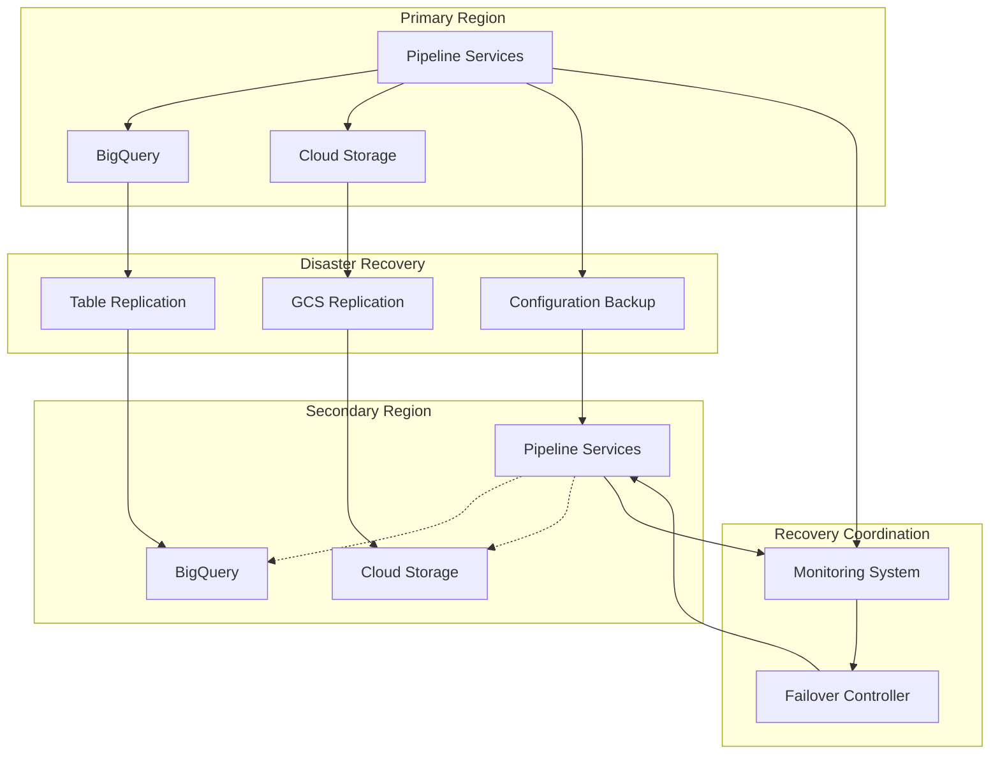

# Self-Healing Data Pipeline: Disaster Recovery Architecture

## Introduction

The disaster recovery architecture of the self-healing data pipeline ensures business continuity and data resilience in the face of various failure scenarios. This document details the strategies, procedures, and infrastructure components that enable the pipeline to recover from disruptions ranging from individual component failures to complete regional outages.

Disaster recovery is a critical cross-cutting concern that affects all aspects of the pipeline, from data storage and processing to orchestration and monitoring. The architecture addresses recovery at multiple levels, providing appropriate mechanisms for different types of failures while balancing recovery capabilities with cost considerations.

### Disaster Recovery Principles

The disaster recovery architecture is built on several foundational principles:

- **Defense in Depth**: Multiple layers of recovery capabilities to address different failure scenarios
- **Data Resilience**: Ensuring data availability and integrity through replication and backup
- **Service Continuity**: Maintaining critical pipeline services with minimal disruption
- **Automated Recovery**: Leveraging self-healing capabilities for automated recovery where possible
- **Tiered Recovery**: Different recovery approaches based on component criticality
- **Regular Testing**: Ongoing validation of recovery capabilities through testing
- **Continuous Improvement**: Learning from incidents to enhance recovery capabilities

These principles guide the implementation of disaster recovery throughout the pipeline, ensuring a consistent and effective approach to business continuity.

### Failure Scenarios

The disaster recovery architecture addresses several key failure scenarios:

- **Component Failure**: Individual service or component outage
- **Zone Failure**: Outage affecting a single zone within a region
- **Region Failure**: Complete regional outage affecting all services
- **Data Corruption**: Logical corruption of data requiring recovery from backups
- **Accidental Deletion**: Unintended deletion of data or resources
- **Service Disruption**: Temporary unavailability of dependent services
- **Network Partition**: Network connectivity issues between components

The architecture provides specific recovery strategies for each of these scenarios, with appropriate mechanisms, procedures, and recovery objectives.

### Recovery Objectives

The disaster recovery architecture defines specific recovery objectives for different components and scenarios:

- **Recovery Time Objective (RTO)**: The maximum acceptable time to restore service after a failure
- **Recovery Point Objective (RPO)**: The maximum acceptable data loss measured in time
- **Recovery Consistency Objective (RCO)**: The level of consistency required after recovery

These objectives are defined based on business requirements and component criticality, with more stringent objectives for critical components and data. The architecture implements appropriate recovery mechanisms to meet these objectives for different failure scenarios.

## Disaster Recovery Architecture Overview

The disaster recovery architecture follows a multi-layered approach, with different mechanisms for different types of failures and components.

### High-Level Architecture

The disaster recovery architecture consists of several key components working together to provide comprehensive recovery capabilities:

### Core Components

The disaster recovery architecture consists of several core components:

1. **Data Replication**: Mechanisms for replicating data across zones and regions to ensure availability in case of failures.

2. **Backup Systems**: Regular backups of data, configuration, and state to enable point-in-time recovery.

3. **Failover Mechanisms**: Automated and manual procedures for switching to backup components or regions.

4. **Recovery Coordination**: Systems for orchestrating the recovery process across multiple components.

5. **Monitoring and Detection**: Capabilities for detecting failures and triggering appropriate recovery actions.

These components work together to provide comprehensive recovery capabilities for different failure scenarios, with appropriate mechanisms for different types of components and data.

### Recovery Tiers

The disaster recovery architecture implements a tiered approach to recovery, with different mechanisms for different criticality levels:

- **Tier 1 (Mission Critical)**: Components and data that require the highest level of availability and minimal data loss. These use active-active configurations where possible, with synchronous or near-synchronous replication across regions.

- **Tier 2 (Business Critical)**: Components and data that are important for business operations but can tolerate slightly longer recovery times. These use active-standby configurations with asynchronous replication.

- **Tier 3 (Important)**: Components and data that support business operations but are not critical for core functions. These use backup-based recovery with regular backups and documented recovery procedures.

- **Tier 4 (Non-Critical)**: Components and data that are not critical for business operations. These use basic backup mechanisms with longer recovery times.

This tiered approach ensures that recovery resources are allocated appropriately based on business criticality, with more robust mechanisms for more critical components.

### Regional Strategy

The disaster recovery architecture implements a multi-region strategy for critical components:

- **Primary Region**: The main operational region where the pipeline runs under normal conditions.

- **Secondary Region**: A backup region that can take over operations in case of primary region failure.

- **Region Selection Criteria**:
  - Geographic separation to minimize correlated failures
  - Network latency considerations for replication
  - Service availability in both regions
  - Compliance with data residency requirements

- **Cross-Region Replication**:
  - Data replication between regions
  - Configuration synchronization
  - State replication for stateful components

This regional strategy ensures that the pipeline can continue operations even in the event of a complete regional outage, with appropriate replication and failover mechanisms.

## Data Resilience Strategy

Data resilience is a critical aspect of the disaster recovery architecture, ensuring that data remains available and intact despite failures.

### Data Replication

Data replication ensures availability across failures:

- **Cloud Storage Replication**:
  - Multi-region buckets for critical data
  - Region-specific buckets with cross-region replication
  - Object versioning for protection against corruption and deletion
  - Replication latency monitoring and alerting

- **BigQuery Replication**:
  - Cross-region dataset replication for critical data
  - Scheduled exports to Cloud Storage for additional protection
  - Table snapshots for point-in-time recovery
  - Query-based replication for selective data

- **Database Replication** (where applicable):
  - Cross-region read replicas
  - Automated failover configuration
  - Transaction log shipping
  - Consistency monitoring

- **Replication Monitoring**:
  - Replication lag monitoring
  - Replication failure alerting
  - Consistency verification
  - Regular replication testing

These replication mechanisms ensure that data remains available even in the event of zone or region failures, with appropriate strategies for different types of data and storage systems.

### Backup Strategy

Regular backups complement replication for data protection:

- **Backup Types**:
  - Full backups: Complete copy of data
  - Incremental backups: Changes since last backup
  - Differential backups: Changes since last full backup
  - Snapshot backups: Point-in-time snapshots

- **Backup Schedule**:
  - Daily incremental backups
  - Weekly full backups
  - Monthly consolidated backups
  - Retention based on data criticality

- **Backup Storage**:
  - Separate storage buckets for backups
  - Cross-region storage for critical backups
  - Immutable storage for protection against ransomware
  - Lifecycle management for cost optimization

- **Backup Security**:
  - Encryption of backup data
  - Access controls for backup systems
  - Audit logging of backup operations
  - Regular security review of backup systems

The backup strategy ensures that data can be recovered in case of corruption, accidental deletion, or other scenarios where replication alone is insufficient.

### Data Recovery Procedures

Documented procedures ensure effective data recovery:

- **Recovery Scenarios**:
  - Point-in-time recovery for data corruption
  - Object restoration for accidental deletion
  - Full dataset recovery for major incidents
  - Selective recovery for specific data elements

- **Recovery Tools**:
  - Cloud Storage object restoration
  - BigQuery table restoration from snapshots
  - Export/import procedures for cross-system recovery
  - Custom recovery scripts for complex scenarios

- **Recovery Validation**:
  - Data integrity verification after recovery
  - Consistency checks across related datasets
  - Performance validation of recovered systems
  - Business function testing

- **Recovery Documentation**:
  - Step-by-step recovery procedures
  - Decision trees for recovery options
  - Contact information for recovery team
  - Escalation procedures for recovery issues

These recovery procedures ensure that data can be effectively restored when needed, with appropriate validation to ensure the recovered data is accurate and usable.

### Data Consistency Management

Maintaining data consistency across replicas and during recovery:

- **Consistency Models**:
  - Strong consistency for critical transactional data
  - Eventual consistency for analytical data
  - Read-after-write consistency for user-facing data
  - Causal consistency for related data updates

- **Consistency Verification**:
  - Checksum validation for replicated data
  - Record count reconciliation
  - Sample-based verification
  - Business rule validation

- **Consistency Recovery**:
  - Procedures for resolving inconsistencies
  - Prioritization of consistency issues
  - Impact assessment of inconsistencies
  - Automated consistency repair where possible

- **Consistency Monitoring**:
  - Regular consistency checks
  - Alerting on consistency violations
  - Trend analysis of consistency metrics
  - Proactive consistency management

Consistency management ensures that data remains accurate and reliable across replicas and during recovery operations, with appropriate mechanisms for detecting and resolving inconsistencies.

## Service Resilience Strategy

Service resilience ensures that pipeline components and services remain available despite failures.

### Multi-Zone Deployment

Multi-zone deployment provides resilience against zone failures:

- **Zone Distribution**:
  - Distribution of resources across multiple zones
  - Zone-aware service deployment
  - Balanced resource allocation
  - Zone failure impact analysis

- **Zone Failover**:
  - Automated failover between zones
  - Zone health monitoring
  - Zone preference configuration
  - Zone recovery procedures

- **Zone-Aware Services**:
  - GKE clusters spanning multiple zones
  - Cloud SQL with zone redundancy
  - Load balancers with multi-zone backends
  - Stateful service replication across zones

- **Zone Isolation**:
  - Fault isolation between zones
  - Independent resource pools
  - Zone-specific monitoring
  - Zone failure simulation for testing

Multi-zone deployment ensures that services remain available even if an entire zone fails, with automatic failover to healthy zones.

### Service Failover

Service failover mechanisms enable recovery from service failures:

- **Failover Types**:
  - Automated failover for critical services
  - Semi-automated failover with approval
  - Manual failover for complex scenarios
  - Gradual failover for stateful services

- **Failover Triggers**:
  - Health check failures
  - Performance degradation
  - Error rate thresholds
  - Manual initiation

- **Failover Components**:
  - Load balancer reconfiguration
  - DNS updates
  - Connection management
  - State transfer where needed

- **Failover Monitoring**:
  - Failover success verification
  - Performance monitoring after failover
  - User impact assessment
  - Failover metrics collection

Service failover ensures that users and dependent systems experience minimal disruption when a service fails, with appropriate mechanisms for different types of services.

### Stateful Service Recovery

Special considerations for stateful services:

- **State Replication**:
  - Synchronous replication for critical state
  - Asynchronous replication for less critical state
  - Transaction log shipping
  - State snapshot backups

- **State Recovery**:
  - State reconstruction from logs
  - Snapshot restoration
  - Incremental state recovery
  - State verification procedures

- **Consistency Management**:
  - Quorum-based consistency
  - Leader election protocols
  - Split-brain prevention
  - Conflict resolution procedures

- **Stateful Service Examples**:
  - Cloud Composer (Airflow database)
  - Custom databases and caches
  - Session management services
  - Workflow state tracking

Stateful service recovery ensures that services with persistent state can be recovered with minimal data loss and appropriate consistency guarantees.

### Regional Failover

Regional failover enables recovery from complete regional outages:

- **Regional Failover Architecture**:
  - Active-passive configuration for most services
  - Active-active for selected critical services
  - Warm standby for balanced recovery time and cost
  - Cold standby for non-critical services

- **Failover Coordination**:
  - Centralized failover coordination
  - Dependency-aware failover sequencing
  - Communication procedures during failover
  - Rollback capability if failover fails

- **Traffic Management**:
  - Global load balancing for user traffic
  - DNS updates for service endpoints
  - Connection draining before failover
  - Gradual traffic shifting

- **Post-Failover Procedures**:
  - Service verification in new region
  - Performance baseline establishment
  - User communication
  - Root cause analysis of regional failure

Regional failover ensures that the pipeline can continue operations even in the event of a complete regional outage, with appropriate procedures to manage the transition to the secondary region.

## Recovery Procedures

Documented recovery procedures ensure effective response to different failure scenarios.

### Component Failure Recovery

Procedures for recovering from individual component failures:

| Component | Recovery Approach | RTO | RPO | Validation Process |
| --- | --- | --- | --- | --- |
| **Cloud Composer** | Auto-restart with environment recreation if needed | < 15 minutes | 0 (metadata in database) | DAG execution verification |
| **Cloud Functions** | Automatic redeployment from source | < 5 minutes | 0 (stateless) | Function invocation test |
| **BigQuery** | Service managed by Google with automatic recovery | < 5 minutes | 0 (managed service) | Query execution verification |
| **Cloud Storage** | Google-managed redundancy with automatic recovery | < 1 minute | 0 (redundant storage) | Object access verification |
| **Custom Services** | Auto-scaling group replacement of failed instances | < 10 minutes | 0 (stateless design) | Health check verification |

These procedures leverage the self-healing capabilities of Google Cloud services where possible, with additional automation for custom components. The focus is on rapid, automated recovery with minimal data loss.

### Zone Failure Recovery

Procedures for recovering from zone failures:

| Service Type | Recovery Approach | RTO | RPO | Validation Process |
| --- | --- | --- | --- | --- |
| **Compute Resources** | Auto-scaling across remaining zones | < 10 minutes | 0 (stateless design) | Service health verification |
| **Stateful Services** | Zone-aware failover to replicas | < 15 minutes | < 1 minute | State consistency verification |
| **Managed Services** | Google-managed zone failover | < 5 minutes | 0 (managed service) | Service functionality testing |
| **Data Access** | Multi-zone data replication | < 1 minute | 0 (synchronous replication) | Data access verification |
| **Networking** | Automatic routing to healthy zones | < 1 minute | 0 (network redundancy) | Connectivity testing |

Zone failure recovery leverages the multi-zone architecture of the pipeline, with automatic failover to healthy zones for most components. The procedures include verification steps to ensure services are functioning correctly after failover.

### Region Failure Recovery

Procedures for recovering from complete regional outages:

| Component | Recovery Approach | RTO | RPO | Validation Process |
| --- | --- | --- | --- | --- |
| **Pipeline Orchestration** | Activate standby Composer environment | < 30 minutes | < 15 minutes | DAG execution verification |
| **Data Processing** | Redeploy processing services in secondary region | < 45 minutes | 0 (idempotent processing) | Processing verification |
| **Data Storage** | Switch to replicated data in secondary region | < 15 minutes | < 15 minutes (async replication) | Data consistency verification |
| **API Services** | Redirect to secondary region instances | < 15 minutes | 0 (stateless APIs) | API functionality testing |
| **Monitoring & Alerting** | Activate secondary monitoring stack | < 30 minutes | < 5 minutes | Monitoring functionality verification |

Regional failure recovery involves more complex procedures, with a combination of automated and manual steps to activate the standby environment in the secondary region. The procedures include detailed validation to ensure the pipeline is fully operational after recovery.

### Data Corruption Recovery

Procedures for recovering from data corruption:

| Data Type | Recovery Approach | RTO | RPO | Validation Process |
| --- | --- | --- | --- | --- |
| **BigQuery Tables** | Restore from table snapshot or backup | < 2 hours | < 24 hours (daily snapshots) | Data consistency verification |
| **Cloud Storage Objects** | Restore previous version from versioning | < 30 minutes | 0 (object versioning) | Object integrity verification |
| **Pipeline Metadata** | Restore from backup or reconstruct | < 1 hour | < 1 hour | Metadata consistency check |
| **Configuration Data** | Restore from version control | < 30 minutes | 0 (version controlled) | Configuration validation |
| **Derived Data** | Recompute from source data | < 4 hours | 0 (reproducible) | Data validation against source |

Data corruption recovery focuses on restoring clean data from backups, snapshots, or previous versions, with appropriate validation to ensure the recovered data is accurate and consistent. For derived data, recomputation from source data is preferred when possible.

### Accidental Deletion Recovery

Procedures for recovering from accidental deletion:

| Resource Type | Recovery Approach | RTO | RPO | Validation Process |
| --- | --- | --- | --- | --- |
| **Cloud Storage Objects** | Restore from versioning or backup | < 30 minutes | 0 (object versioning) | Object verification |
| **BigQuery Tables** | Restore from snapshot or backup | < 1 hour | < 24 hours (daily snapshots) | Table content verification |
| **Pipeline Resources** | Redeploy from infrastructure as code | < 1 hour | 0 (IaC templates) | Resource functionality testing |
| **Configuration** | Restore from version control | < 30 minutes | 0 (version controlled) | Configuration validation |
| **Custom Resources** | Restore from backup or redeploy | < 2 hours | Varies by resource | Functionality verification |

Accidental deletion recovery leverages versioning, backups, and infrastructure as code to restore deleted resources, with appropriate validation to ensure the recovered resources are functioning correctly.

## Recovery Testing and Validation

Regular testing ensures that recovery procedures are effective and reliable.

### Testing Strategy

Comprehensive testing strategy for recovery capabilities:

- **Test Types**:
  - Component recovery tests
  - Zone failover tests
  - Regional failover tests
  - Data recovery tests
  - Full disaster recovery exercises

- **Testing Frequency**:
  - Component tests: Monthly
  - Zone failover tests: Quarterly
  - Regional failover tests: Semi-annually
  - Data recovery tests: Quarterly
  - Full DR exercises: Annually

- **Testing Environments**:
  - Isolated test environments for non-disruptive testing
  - Production-like environments for realistic validation
  - Controlled production testing for critical capabilities
  - Simulation environments for scenario testing

- **Testing Methodology**:
  - Predefined test scenarios
  - Clear success criteria
  - Detailed test documentation
  - Post-test analysis and improvement

This testing strategy ensures that recovery capabilities are regularly validated, with appropriate coverage of different failure scenarios and recovery mechanisms.

### Automated Testing

Automation of recovery testing:

- **Test Automation Framework**:
  - Automated test scripts for common scenarios
  - Scheduled execution of automated tests
  - Test result collection and analysis
  - Integration with CI/CD pipeline

- **Chaos Engineering**:
  - Controlled fault injection
  - Service disruption simulation
  - Resource constraint testing
  - Network partition simulation

- **Continuous Validation**:
  - Regular validation of replication
  - Backup restoration testing
  - Failover mechanism verification
  - Recovery time measurement

- **Test Result Management**:
  - Centralized test result repository
  - Trend analysis of recovery metrics
  - Improvement tracking
  - Test coverage reporting

Automated testing enables more frequent and consistent validation of recovery capabilities, with less manual effort and more comprehensive coverage.

### Recovery Metrics

Key metrics for measuring recovery effectiveness:

- **Time-Based Metrics**:
  - Actual recovery time vs. RTO
  - Actual data loss vs. RPO
  - Detection time for failures
  - Time to initiate recovery

- **Success Metrics**:
  - Recovery success rate
  - First-attempt success rate
  - Validation success rate
  - User impact during recovery

- **Operational Metrics**:
  - Manual steps required
  - Resource utilization during recovery
  - Dependency failures during recovery
  - Communication effectiveness

- **Improvement Metrics**:
  - Recurring issues identified
  - Procedure improvements implemented
  - Automation coverage
  - Training effectiveness

These metrics provide quantitative measurement of recovery effectiveness, enabling objective assessment and continuous improvement of recovery capabilities.

### Lessons Learned Process

Process for learning from recovery tests and actual incidents:

- **Post-Test Analysis**:
  - Detailed review of test results
  - Identification of gaps and issues
  - Root cause analysis of failures
  - Performance against objectives

- **Improvement Planning**:
  - Prioritized improvement actions
  - Responsibility assignment
  - Implementation timeline
  - Validation approach

- **Knowledge Sharing**:
  - Documentation updates
  - Team debriefings
  - Cross-team knowledge transfer
  - Executive reporting

- **Continuous Cycle**:
  - Implementation of improvements
  - Validation in subsequent tests
  - Measurement of improvement impact
  - Ongoing refinement

The lessons learned process ensures that insights from testing and actual incidents are systematically captured and used to improve recovery capabilities over time.

## Recovery Organization and Governance

Organizational structure and governance for effective disaster recovery.

### Roles and Responsibilities

Clear definition of recovery roles and responsibilities:

- **Recovery Team Structure**:
  - Recovery Coordinator: Overall coordination of recovery efforts
  - Technical Recovery Leads: Component-specific recovery leadership
  - Operations Team: Execution of recovery procedures
  - Communication Lead: Stakeholder communication during recovery
  - Executive Sponsor: Decision authority for major recovery actions

- **Role Assignments**:
  - Primary and backup assignments for each role
  - Contact information and escalation paths
  - Training requirements for each role
  - Regular role rotation for knowledge sharing

- **Decision Authority**:
  - Clear decision rights for different scenarios
  - Escalation criteria and process
  - Emergency decision protocol
  - Post-recovery review authority

- **External Coordination**:
  - Google Cloud support engagement
  - Vendor coordination procedures
  - Customer communication responsibilities
  - Regulatory reporting if required

Clear roles and responsibilities ensure effective coordination during recovery operations, with appropriate authority and accountability for different aspects of the recovery process.

### Communication Plan

Structured communication during recovery operations:

- **Internal Communication**:
  - Team communication channels
  - Status update frequency and format
  - Escalation procedures
  - Decision documentation

- **Stakeholder Communication**:
  - User impact notifications
  - Management updates
  - Vendor coordination
  - Post-incident reporting

- **Communication Tools**:
  - Primary and backup communication channels
  - Status dashboard
  - Incident management system
  - Documentation repository

- **Communication Templates**:
  - Initial notification templates
  - Status update templates
  - Resolution notification templates
  - Post-incident report templates

The communication plan ensures that all stakeholders receive appropriate information during recovery operations, with clear channels and formats for different types of communication.

### Training and Readiness

Preparation of personnel for recovery operations:

- **Training Program**:
  - Role-specific training
  - Recovery procedure training
  - Tool and system training
  - Decision-making exercises

- **Readiness Activities**:
  - Regular tabletop exercises
  - Hands-on recovery drills
  - Cross-training across roles
  - Knowledge assessment

- **Documentation**:
  - Recovery runbooks
  - Quick reference guides
  - Decision trees
  - Contact and escalation information

- **Continuous Improvement**:
  - Training effectiveness assessment
  - Feedback incorporation
  - Regular content updates
  - New team member onboarding

Training and readiness activities ensure that all team members are prepared to execute their responsibilities during recovery operations, with appropriate knowledge and skills.

### Recovery Governance

Governance framework for disaster recovery:

- **Policy Framework**:
  - Disaster recovery policy
  - Recovery objectives policy
  - Testing and validation policy
  - Continuous improvement policy

- **Review and Oversight**:
  - Regular recovery capability reviews
  - Test result reviews
  - Improvement tracking
  - Executive reporting

- **Compliance Management**:
  - Regulatory requirement alignment
  - Audit support
  - Documentation maintenance
  - Evidence collection

- **Risk Management**:
  - Recovery risk assessment
  - Risk mitigation planning
  - Residual risk acceptance
  - Emerging risk identification

The governance framework ensures that disaster recovery capabilities are managed in alignment with organizational policies and regulatory requirements, with appropriate oversight and continuous improvement.

## Integration with Self-Healing Capabilities

Leveraging the pipeline's self-healing capabilities for disaster recovery.

### Automated Recovery

Integration of self-healing with disaster recovery:

- **Self-Healing Scope**:
  - Component-level failures
  - Performance degradation
  - Data quality issues
  - Configuration drift

- **Recovery Automation**:
  - Automated detection of failures
  - Predefined recovery actions
  - Confidence-based automation
  - Escalation for complex scenarios

- **Integration Points**:
  - Monitoring system integration
  - Recovery action repository
  - Automation framework
  - Feedback loop for improvement

- **Governance Controls**:
  - Automation boundaries
  - Human oversight requirements
  - Audit logging of automated actions
  - Regular review of automation effectiveness

Integration with self-healing capabilities enables automated recovery for many common failure scenarios, reducing recovery time and manual effort while maintaining appropriate governance controls.

### AI-Driven Recovery Optimization

Using AI to enhance recovery capabilities:

- **Predictive Failure Detection**:
  - Early warning of potential failures
  - Failure pattern recognition
  - Anomaly detection for early intervention
  - Trend analysis for proactive action

- **Intelligent Recovery Selection**:
  - Context-aware recovery strategy selection
  - Optimization of recovery parameters
  - Resource allocation optimization
  - Recovery sequence optimization

- **Recovery Effectiveness Learning**:
  - Analysis of recovery outcomes
  - Identification of successful patterns
  - Continuous improvement of recovery strategies
  - Knowledge base enhancement

- **Implementation Approach**:
  - Integration with existing AI framework
  - Recovery-specific models and algorithms
  - Feedback loop for model improvement
  - Human oversight of AI-driven decisions

AI-driven recovery optimization leverages machine learning to enhance recovery capabilities, with more effective detection, selection, and execution of recovery actions based on historical patterns and current context.

### Recovery Feedback Loop

Continuous improvement through feedback:

- **Recovery Data Collection**:
  - Detailed logging of recovery actions
  - Performance metrics collection
  - Success/failure outcomes
  - Contextual information

- **Analysis Process**:
  - Pattern identification in recovery data
  - Effectiveness assessment
  - Root cause analysis of failures
  - Opportunity identification

- **Improvement Implementation**:
  - Recovery procedure updates
  - Automation enhancement
  - Model retraining
  - Configuration optimization

- **Validation Cycle**:
  - Testing of improvements
  - Measurement of impact
  - Feedback incorporation
  - Continuous refinement

The recovery feedback loop ensures that insights from recovery operations are systematically captured and used to improve future recovery capabilities, creating a cycle of continuous enhancement.

## Cost Optimization

Balancing recovery capabilities with cost considerations.

### Cost-Effective Architecture

Architectural approaches for cost-effective recovery:

- **Tiered Recovery**:
  - Different recovery mechanisms based on criticality
  - Cost-appropriate solutions for each tier
  - Optimization of RTO/RPO based on business value
  - Resource allocation aligned with criticality

- **Resource Optimization**:
  - Right-sized standby environments
  - Warm standby with minimal resources
  - Cold standby for non-critical components
  - Just-in-time resource provisioning

- **Storage Optimization**:
  - Tiered storage for backups
  - Lifecycle management for older backups
  - Compression and deduplication
  - Selective replication based on criticality

- **Operational Efficiency**:
  - Automation to reduce manual effort
  - Streamlined recovery procedures
  - Tool consolidation
  - Knowledge management for efficient operations

These architectural approaches ensure that recovery capabilities are implemented in a cost-effective manner, with appropriate investment based on business criticality and value.

### Cost vs. Recovery Capability Analysis

Framework for balancing cost and recovery capabilities:

- **Cost Components**:
  - Infrastructure costs for standby environments
  - Storage costs for replication and backups
  - Operational costs for management and testing
  - Tool and service costs

- **Capability Assessment**:
  - Recovery time capabilities
  - Data loss limitations
  - Coverage of failure scenarios
  - Automation level

- **Business Impact Analysis**:
  - Cost of downtime by component
  - Value of data by category
  - Operational impact of failures
  - Reputation and compliance considerations

- **Optimization Approach**:
  - Cost-benefit analysis for recovery investments
  - Prioritization based on business value
  - Incremental capability enhancement
  - Regular review and adjustment

This framework enables informed decisions about recovery investments, ensuring that resources are allocated effectively based on business impact and value.

### Cloud Cost Management

Specific strategies for managing cloud costs:

- **Reserved Instances**:
  - Commitments for predictable recovery components
  - Balanced with on-demand for flexibility
  - Right-sizing of reservations
  - Regular review and adjustment

- **Storage Optimization**:
  - Storage class selection based on access patterns
  - Lifecycle policies for automatic transitions
  - Retention policy enforcement
  - Compression and format optimization

- **Network Cost Management**:
  - Efficient replication patterns
  - Batch transfers where appropriate
  - Compression for network transfers
  - Regional data locality

- **Resource Scheduling**:
  - Scaling down non-critical resources during off-hours
  - Just-in-time provisioning for testing
  - Automated cleanup after tests
  - Efficient resource utilization

These strategies leverage cloud-specific capabilities to optimize costs while maintaining required recovery capabilities, with a focus on efficient resource utilization and appropriate service selection.

## Future Enhancements

Planned improvements to the disaster recovery architecture.

### Advanced Automation

Future enhancements for recovery automation:

- **End-to-End Recovery Automation**:
  - Fully automated recovery for more scenarios
  - Complex dependency management
  - Intelligent recovery orchestration
  - Adaptive recovery based on context

- **Predictive Recovery**:
  - Preemptive action based on failure predictions
  - Resource pre-provisioning
  - Proactive data protection
  - Early warning system enhancement

- **Self-Optimizing Recovery**:
  - Dynamic adjustment of recovery parameters
  - Learning from recovery performance
  - Resource optimization during recovery
  - Continuous procedure refinement

- **Implementation Roadmap**:
  - Phased automation enhancement
  - Capability prioritization
  - Integration with evolving self-healing capabilities
  - Validation and governance approach

These automation enhancements will further reduce recovery times and manual effort, with more intelligent and adaptive recovery capabilities that leverage the pipeline's self-healing foundation.

### Multi-Region Active-Active

Evolution toward active-active architecture:

- **Active-Active Design**:
  - Simultaneous operation in multiple regions
  - Load distribution across regions
  - Stateful service synchronization
  - Consistent data access

- **Traffic Management**:
  - Intelligent request routing
  - Latency-based distribution
  - Regional affinity with failover
  - Global load balancing

- **Data Consistency**:
  - Multi-region data synchronization
  - Conflict resolution mechanisms
  - Consistency models by data type
  - Transactional integrity

- **Operational Considerations**:
  - Multi-region deployment automation
  - Consistent configuration management
  - Monitoring across regions
  - Coordinated maintenance

The evolution toward a multi-region active-active architecture will provide higher availability and better resource utilization, with seamless failover and reduced recovery time for regional failures.

### Enhanced Testing Capabilities

Future improvements to recovery testing:

- **Continuous Testing**:
  - Automated testing integrated with CI/CD
  - Regular validation of recovery capabilities
  - Non-disruptive testing in production
  - Comprehensive coverage of scenarios

- **Advanced Chaos Engineering**:
  - Sophisticated failure injection
  - Complex scenario simulation
  - Controlled impact testing
  - Realistic failure conditions

- **Recovery Simulation**:
  - Digital twin for recovery simulation
  - Predictive modeling of recovery scenarios
  - What-if analysis for recovery options
  - Training environment for recovery teams

- **Testing Automation**:
  - Expanded test automation coverage
  - Intelligent test scenario generation
  - Automated result analysis
  - Continuous improvement feedback

Enhanced testing capabilities will provide more comprehensive and frequent validation of recovery capabilities, with more realistic scenarios and better insights for improvement.

## Conclusion

The disaster recovery architecture of the self-healing data pipeline provides comprehensive capabilities for recovering from various failure scenarios, from individual component failures to complete regional outages. By implementing a multi-layered approach with appropriate mechanisms for different types of failures and components, the architecture ensures business continuity and data resilience while balancing recovery capabilities with cost considerations.

Key strengths of the disaster recovery architecture include:

- **Defense in Depth**: Multiple layers of recovery capabilities to address different failure scenarios
- **Data Resilience**: Robust data replication and backup strategies to ensure data availability and integrity
- **Service Continuity**: Multi-zone deployment and failover mechanisms to maintain service availability
- **Automated Recovery**: Integration with self-healing capabilities for automated recovery from common failures
- **Regular Testing**: Comprehensive testing strategy to validate recovery capabilities
- **Continuous Improvement**: Feedback loops and lessons learned processes for ongoing enhancement

By implementing this architecture, the self-healing data pipeline can maintain high availability and data integrity despite various failure scenarios, ensuring reliable operation and business continuity.

## References

- [Architecture Overview](overview.md)
- [Monitoring Architecture](monitoring.md)
- [Security Architecture](security.md)
- [Google Cloud Disaster Recovery Planning Guide](https://cloud.google.com/architecture/dr-scenarios-planning-guide)
- [BigQuery Disaster Recovery](https://cloud.google.com/bigquery/docs/disaster-recovery-planning)
- [Cloud Storage Redundancy](https://cloud.google.com/storage/docs/storage-classes)
- [Cloud Composer Disaster Recovery](https://cloud.google.com/composer/docs/composer-2/disaster-recovery)