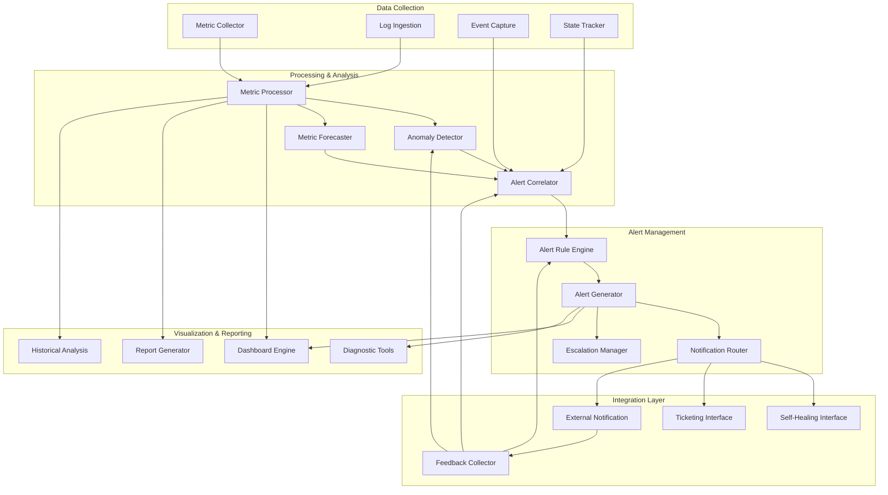
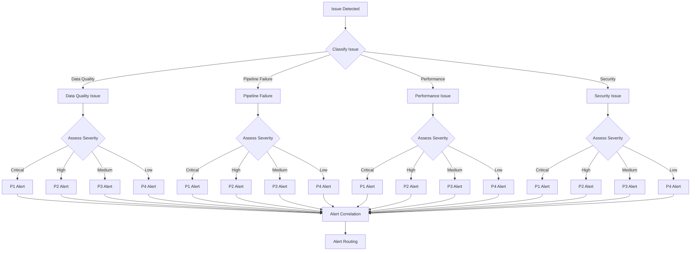
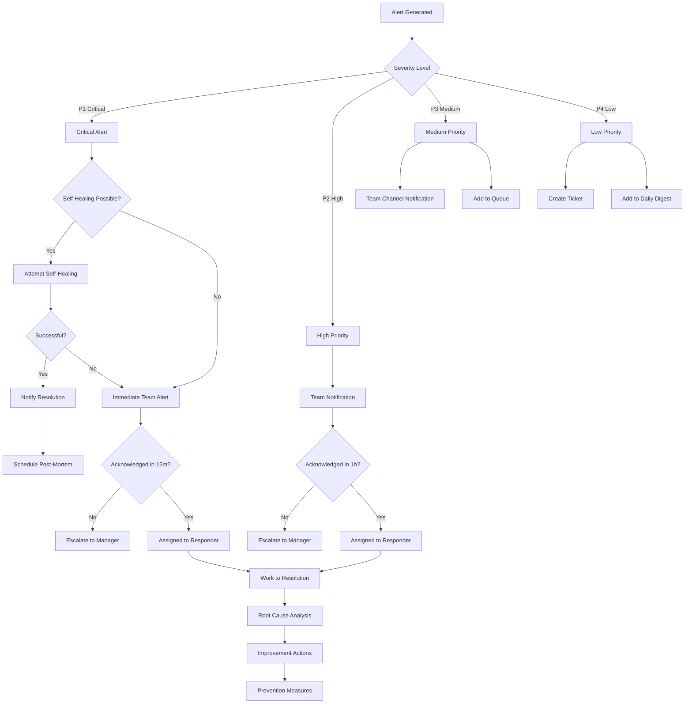

# Self-Healing Data Pipeline: Monitoring and Alerting Architecture

## Introduction

The Monitoring and Alerting architecture is a critical component of the self-healing data pipeline, providing comprehensive visibility into pipeline health, performance, and behavior. It enables proactive issue detection, intelligent alerting, and supports the self-healing capabilities of the pipeline through anomaly detection and event correlation.

This document details the monitoring architecture, including its components, workflows, integration points, and implementation considerations. It explains how the monitoring system not only provides visibility but actively contributes to the pipeline's self-healing capabilities by detecting issues early and triggering appropriate responses.

### Purpose and Objectives

The monitoring architecture serves several key purposes in the self-healing data pipeline:

- **Comprehensive Visibility**: Provide complete visibility into all aspects of pipeline operation, from infrastructure to data quality
- **Proactive Issue Detection**: Identify potential issues before they impact business operations through anomaly detection and predictive analytics
- **Intelligent Alerting**: Generate actionable alerts with appropriate context and route them to the right channels based on severity and type
- **Self-Healing Support**: Enable autonomous correction of issues by feeding detected anomalies to the self-healing system
- **Performance Optimization**: Identify optimization opportunities through trend analysis and resource utilization monitoring
- **Compliance and Audit**: Support compliance requirements through comprehensive logging and audit trails

These objectives align with the overall goal of minimizing manual intervention in pipeline operations while ensuring reliability, performance, and data quality.

### Key Architectural Principles

The monitoring architecture is built on several foundational principles:

- **Defense in Depth**: Multiple layers of monitoring to ensure comprehensive coverage
- **Intelligence Over Volume**: Focus on meaningful insights rather than overwhelming data volume
- **Correlation and Context**: Connect related events to provide context for troubleshooting
- **Actionable Alerts**: Ensure alerts provide clear information on what happened, why it matters, and what to do
- **Appropriate Notification**: Route notifications to the right channels based on severity and type
- **Continuous Improvement**: Learn from historical patterns to improve detection and response
- **Integration with Self-Healing**: Seamless connection with self-healing capabilities for autonomous operation

These principles guide the design and implementation of the monitoring system, ensuring it provides value beyond basic metrics collection.

### Technology Foundation

The monitoring architecture leverages several key technologies:

- **Google Cloud Monitoring**: Core platform for metrics collection, alerting, and dashboards
- **Cloud Logging**: Centralized logging for all pipeline components
- **Cloud Trace**: Distributed tracing for request flows across components
- **Custom Metrics API**: Extension of standard metrics with pipeline-specific KPIs
- **Pub/Sub**: Event distribution for monitoring events and alerts
- **BigQuery**: Long-term storage and analysis of monitoring data
- **Vertex AI**: Machine learning for anomaly detection and pattern recognition
- **Microsoft Teams**: Primary notification channel for alerts
- **Email**: Secondary notification channel for alerts

These technologies are integrated to create a comprehensive monitoring system that supports the self-healing capabilities of the pipeline.

## Monitoring Architecture Overview

The monitoring architecture follows a layered approach, with distinct components handling different aspects of the monitoring and alerting process.

### High-Level Architecture

The monitoring architecture consists of five main layers, each with specific responsibilities in the monitoring and alerting process.

### Core Components

The monitoring architecture consists of five core layers, each containing specialized components:

1. **Data Collection Layer**: Responsible for gathering metrics, logs, events, and state information from all pipeline components. This layer handles the collection of raw monitoring data from various sources.

2. **Processing & Analysis Layer**: Processes and analyzes the collected data to identify patterns, anomalies, and potential issues. This layer applies statistical and machine learning techniques to detect unusual behavior that may indicate problems.

3. **Alert Management Layer**: Manages the generation, correlation, and routing of alerts based on detected anomalies and defined rules. This layer ensures that the right people are notified about relevant issues through appropriate channels.

4. **Visualization & Reporting Layer**: Provides visual representations of system health, performance, and issues through dashboards and reports. This layer makes monitoring data accessible and actionable for different user roles.

5. **Integration Layer**: Connects the monitoring system with other components of the pipeline, particularly the self-healing system, as well as external notification channels. This layer enables the monitoring system to trigger automated responses and notify stakeholders.

Each layer contains specialized components that work together to provide comprehensive monitoring and alerting capabilities for the self-healing data pipeline.

### Data Flow

The data flow through the monitoring architecture follows these steps:

1. **Data Collection**: Metrics, logs, events, and state information are collected from all pipeline components through various collection mechanisms.

2. **Data Processing**: Collected data is processed, normalized, and enriched with additional context to prepare it for analysis.

3. **Anomaly Detection**: Processed data is analyzed using statistical and machine learning techniques to identify anomalies and unusual patterns.

4. **Alert Correlation**: Detected anomalies are correlated to identify related issues and determine root causes, reducing alert noise.

5. **Alert Generation**: Correlated anomalies that meet alert criteria trigger the generation of alerts with appropriate severity and context.

6. **Notification Routing**: Alerts are routed to appropriate channels based on severity, type, and other factors, with escalation for unacknowledged critical alerts.

7. **Self-Healing Triggering**: Certain alerts are sent to the self-healing system to trigger automated correction actions when confidence is high enough.

8. **Visualization**: Monitoring data and alerts are visualized through dashboards and reports for human consumption.

9. **Feedback Collection**: Response to alerts and correction outcomes are collected as feedback to improve future detection and response.

This flow ensures that monitoring data is effectively collected, analyzed, and acted upon, with both automated and human-driven responses as appropriate.

### Key Interfaces

The monitoring architecture interfaces with other components of the pipeline and external systems:

- **Pipeline Components to Monitoring**: All pipeline components publish metrics, logs, and events to the monitoring system through standardized interfaces.

- **Monitoring to Self-Healing**: Detected anomalies and alerts are sent to the self-healing system to trigger automated correction actions.

- **Monitoring to Notification Channels**: Alerts are sent to Microsoft Teams, email, and other notification channels based on routing rules.

- **Monitoring to Visualization**: Monitoring data is made available to dashboards and reports for visualization.

- **Feedback to Monitoring**: Alert responses and correction outcomes are fed back to the monitoring system to improve detection and response.

These interfaces enable the monitoring system to collect data from all parts of the pipeline, trigger appropriate responses, and continuously improve its capabilities through feedback loops.

## Data Collection Layer

The Data Collection Layer is responsible for gathering metrics, logs, events, and state information from all pipeline components. It provides a comprehensive view of system behavior by collecting data from multiple sources and preparing it for analysis.

### Key Capabilities

The Data Collection Layer provides several key capabilities:

- **Multi-source collection**: Gathering data from all pipeline components and infrastructure
- **Metric standardization**: Normalizing metrics from different sources into consistent formats
- **Log aggregation**: Centralizing logs from all components for unified analysis
- **Event capture**: Recording significant events from pipeline execution
- **State tracking**: Monitoring the state of pipeline components and processes
- **Collection optimization**: Efficient data collection with appropriate sampling and filtering

These capabilities ensure comprehensive data collection while managing the volume and cost of monitoring data.

### Component Architecture

The data collection layer consists of several key components:

- **Metric Collector**: Gathers metrics from all pipeline components through various collection methods, including pull-based collection from APIs, push-based reporting from components, and extraction from logs. It supports system metrics (CPU, memory, disk, network), application metrics (task counts, durations, rates), business metrics (record counts, quality scores), and custom metrics (component-specific KPIs).

- **Log Ingestion**: Centralizes logs from all components, supporting structured logging formats, log parsing and extraction, and log-based metric generation. It handles operational logs, error logs, audit logs, and data transformation logs with appropriate retention policies.

- **Event Capture**: Records significant events from pipeline execution, including state transitions, error occurrences, and business events. It provides event filtering, enrichment with context, and correlation with related events.

- **State Tracker**: Monitors the state of pipeline components and processes, tracking component health, process execution status, and resource state. It enables state transition analysis, historical state tracking, and state-based alerting.

These components work together to provide a comprehensive view of system behavior through multiple data types and collection methods.

### Metric Collection Strategy

The metric collection strategy balances comprehensive coverage with efficiency:

- **Tiered Collection**: Different collection frequencies based on metric importance and volatility
- **Sampling**: Appropriate sampling for high-volume metrics to reduce storage and processing costs
- **Aggregation**: Pre-aggregation of high-cardinality metrics to manage volume
- **Filtering**: Collection of only relevant metrics to avoid noise
- **Enrichment**: Addition of metadata and context to raw metrics
- **Standardization**: Consistent naming and units across all metrics

This strategy ensures that the right metrics are collected at the right frequency and with the right context to support effective monitoring without excessive cost or complexity.

### Log Management Approach

The log management approach focuses on structured, actionable logging:

- **Structured Logging**: JSON-formatted logs with consistent fields across all components
- **Log Levels**: Appropriate use of log levels (DEBUG, INFO, WARN, ERROR, FATAL)
- **Context Enrichment**: Addition of correlation IDs, component identifiers, and other context
- **Sensitive Data Handling**: Automatic redaction of sensitive information
- **Retention Policies**: Tiered retention based on log importance and compliance requirements
- **Log-Based Metrics**: Extraction of metrics from logs for additional insights

This approach ensures that logs provide valuable information for troubleshooting and analysis while managing volume and protecting sensitive data.

### Integration with Cloud Monitoring

The data collection layer integrates with Google Cloud Monitoring as the primary monitoring platform:

- **Standard Metrics**: Collection of standard GCP service metrics
- **Custom Metrics**: Extension with pipeline-specific custom metrics
- **Logs Integration**: Routing of logs to Cloud Logging
- **Monitoring Agent**: Deployment on compute resources for system-level metrics
- **API Integration**: Direct API calls for custom metric reporting
- **Resource Hierarchy**: Alignment with GCP resource hierarchy for organization

This integration leverages the capabilities of Cloud Monitoring while extending them with pipeline-specific metrics and logs.

## Processing & Analysis Layer

The Processing & Analysis Layer processes and analyzes the collected monitoring data to identify patterns, anomalies, and potential issues. It applies statistical and machine learning techniques to detect unusual behavior that may indicate problems before they impact business operations.

### Key Capabilities

The Processing & Analysis Layer provides several key capabilities:

- **Metric processing**: Normalization, transformation, and enrichment of raw metrics
- **Anomaly detection**: Identification of unusual patterns using statistical and ML techniques
- **Pattern recognition**: Detection of recurring patterns in system behavior
- **Trend analysis**: Identification of long-term trends and gradual changes
- **Forecasting**: Prediction of future metric values and potential issues
- **Correlation analysis**: Identification of relationships between different metrics and events

These capabilities enable the monitoring system to extract meaningful insights from raw monitoring data and detect potential issues before they impact business operations.

### Metric Processor

The Metric Processor component handles the preparation and transformation of raw metrics:

- **Normalization**: Conversion of metrics to consistent units and scales
- **Aggregation**: Combining metrics at appropriate time intervals
- **Filtering**: Removal of noise and irrelevant data points
- **Enrichment**: Addition of context and metadata
- **Derived Metrics**: Calculation of new metrics from raw data
- **Time Series Alignment**: Synchronization of metrics from different sources

The Metric Processor ensures that metrics are in a suitable format for analysis and visualization, with consistent naming, units, and context across all data sources.

### Anomaly Detection System

The Anomaly Detection System identifies unusual patterns that may indicate issues:

- **Statistical Methods**: Z-score analysis, IQR-based outlier detection, and other statistical techniques for identifying anomalies
- **Machine Learning Models**: Isolation forests, LSTM networks, and other ML models for complex pattern detection
- **Anomaly Types**: Detection of point anomalies (spikes/drops), contextual anomalies (normal value, wrong context), collective anomalies (pattern violations), and trend anomalies (unexpected changes in direction)
- **Confidence Scoring**: Assignment of confidence scores to detected anomalies
- **Baseline Management**: Maintenance of dynamic baselines that adapt to changing patterns
- **Sensitivity Configuration**: Adjustable sensitivity based on metric importance and context

The system uses a combination of statistical and machine learning approaches to detect different types of anomalies with high accuracy and low false positive rates.

### Alert Correlation Engine

The Alert Correlation Engine connects related anomalies and events to reduce noise and identify root causes:

- **Temporal Correlation**: Grouping of events that occur within close time proximity
- **Topological Correlation**: Correlation based on system component relationships
- **Causal Correlation**: Identification of cause-effect relationships between events
- **Pattern Matching**: Recognition of known issue patterns from historical data
- **Root Cause Analysis**: Determination of underlying causes for observed symptoms
- **Noise Reduction**: Suppression of duplicate and secondary alerts

This engine reduces alert fatigue by grouping related alerts, identifying root causes, and suppressing secondary symptoms, ensuring that operators receive actionable information rather than overwhelming noise.

### Forecasting Engine

The Forecasting Engine predicts future metric values and potential issues:

- **Time Series Forecasting**: Prediction of future metric values based on historical patterns
- **Trend Detection**: Identification of long-term trends and gradual changes
- **Seasonality Analysis**: Recognition of cyclical patterns in metrics
- **Anomaly Prediction**: Forecasting of potential anomalies before they occur
- **Resource Planning**: Prediction of future resource needs based on trends
- **SLA Prediction**: Forecasting of potential SLA violations

This engine enables proactive management by predicting potential issues before they occur, allowing for preventive action rather than reactive response.

### Machine Learning Implementation

The machine learning implementation for anomaly detection and forecasting includes:

- **Model Types**: Isolation forests for outlier detection, LSTM networks for time series analysis, ensemble methods for robust detection
- **Training Process**: Automated training using historical data with labeled anomalies
- **Feature Engineering**: Extraction of relevant features from raw metrics
- **Model Evaluation**: Regular assessment of model performance with precision/recall metrics
- **Model Deployment**: Serving of models through Vertex AI for inference
- **Continuous Learning**: Ongoing improvement through feedback loops

This implementation leverages Vertex AI for model training and serving, with specialized models for different types of metrics and anomalies to ensure high detection accuracy with low false positive rates.

## Alert Management Layer

The Alert Management Layer handles the generation, correlation, and routing of alerts based on detected anomalies and defined rules. It ensures that the right people are notified about relevant issues through appropriate channels, with escalation for critical unacknowledged alerts.

### Key Capabilities

The Alert Management Layer provides several key capabilities:

- **Rule-based alerting**: Generation of alerts based on defined rules and thresholds
- **Alert classification**: Categorization of alerts by severity, type, and component
- **Notification routing**: Delivery of alerts to appropriate channels based on rules
- **Alert deduplication**: Prevention of duplicate alerts for the same issue
- **Alert suppression**: Temporary suppression during maintenance or known issues
- **Escalation management**: Automatic escalation of unacknowledged critical alerts
- **Alert lifecycle tracking**: Monitoring of alert status from creation to resolution

These capabilities ensure that alerts are actionable, reach the right people, and are properly managed throughout their lifecycle.

### Alert Rule Engine

The Alert Rule Engine evaluates monitoring data against defined rules to generate alerts:

- **Rule Types**: Threshold-based rules, anomaly-based rules, event-based rules, and compound rules
- **Rule Management**: Creation, modification, and versioning of alert rules
- **Rule Evaluation**: Efficient evaluation of rules against incoming data
- **Rule Prioritization**: Assignment of priority to rules based on importance
- **Rule Testing**: Validation of rules against historical data
- **Rule Templates**: Reusable templates for common alert patterns

The engine supports a flexible rule definition format that can express complex conditions while remaining maintainable and efficient to evaluate.

### Alert Generator

The Alert Generator creates alerts based on rule evaluation results:

- **Alert Creation**: Generation of alerts with appropriate metadata
- **Severity Assignment**: Classification of alerts by severity (P1-P4)
- **Context Enrichment**: Addition of relevant context to alerts
- **Deduplication**: Prevention of duplicate alerts for the same issue
- **Grouping**: Aggregation of related alerts
- **Rate Limiting**: Prevention of alert storms during major incidents

The generator ensures that alerts contain all necessary information for diagnosis and resolution, while preventing alert fatigue through deduplication and grouping.

### Notification Router

The Notification Router delivers alerts to appropriate channels based on routing rules:

- **Channel Support**: Integration with Microsoft Teams, email, SMS, and ticketing systems
- **Routing Rules**: Configuration of which alerts go to which channels
- **Message Formatting**: Appropriate formatting for each channel
- **Delivery Tracking**: Monitoring of notification delivery status
- **Retry Logic**: Automatic retry for failed notifications
- **Notification Batching**: Grouping of non-critical notifications to reduce noise

The router ensures that alerts reach the right people through the right channels, with appropriate formatting and delivery guarantees.

### Escalation Manager

The Escalation Manager handles the escalation of unacknowledged critical alerts:

- **Escalation Policies**: Definition of escalation paths based on alert properties
- **Acknowledgment Tracking**: Monitoring of alert acknowledgment status
- **Timeout Management**: Escalation after defined acknowledgment timeouts
- **Notification Escalation**: Progression through notification channels
- **Responder Escalation**: Escalation to higher-level responders
- **Escalation Tracking**: Monitoring of escalation status and history

The manager ensures that critical alerts receive attention even if initial notifications are missed, with progressive escalation until acknowledgment.

### Microsoft Teams Integration

The Microsoft Teams integration provides rich notification capabilities:

- **Webhook Integration**: Delivery of alerts via Teams webhooks
- **Adaptive Cards**: Rich formatting using Teams adaptive cards
- **Severity-Based Styling**: Visual differentiation based on alert severity
- **Interactive Elements**: Action buttons for acknowledgment and response
- **Thread Management**: Organization of related alerts in threads
- **Delivery Tracking**: Monitoring of notification delivery status

This integration makes Teams a primary notification channel for the monitoring system, with rich formatting and interactive capabilities that enhance the alert response workflow.

### Email Notification System

The Email Notification System provides a secondary notification channel:

- **SMTP Integration**: Delivery of alerts via SMTP
- **HTML Formatting**: Rich formatting of email notifications
- **Severity Indication**: Clear indication of alert severity
- **Actionable Links**: Links to relevant dashboards and systems
- **Email Threading**: Organization of related alerts in threads
- **Delivery Tracking**: Monitoring of email delivery status

This system ensures that alerts reach recipients even when they're not actively using Teams, with clear formatting and actionable information.

## Visualization & Reporting Layer

The Visualization & Reporting Layer provides visual representations of system health, performance, and issues through dashboards and reports. It makes monitoring data accessible and actionable for different user roles, from executives to engineers.

### Key Capabilities

The Visualization & Reporting Layer provides several key capabilities:

- **Dashboard creation**: Generation of customizable dashboards for different user roles
- **Real-time visualization**: Live updates of monitoring data in dashboards
- **Historical analysis**: Visualization of historical trends and patterns
- **Report generation**: Creation of scheduled and on-demand reports
- **Diagnostic tools**: Interactive tools for troubleshooting and analysis
- **Alert visualization**: Clear presentation of active and historical alerts
- **SLA tracking**: Visualization of SLA compliance and error budgets

These capabilities ensure that monitoring data is presented in a way that's accessible and actionable for different user roles, from executives to engineers.

### Dashboard Engine

The Dashboard Engine creates and manages monitoring dashboards:

- **Dashboard Types**: Operational, executive, engineering, and data quality dashboards
- **Widget Types**: Time series, gauges, tables, text, and alert widgets
- **Template System**: Reusable templates for common dashboard patterns
- **Customization**: User-specific dashboard customization
- **Refresh Management**: Automatic and manual dashboard refreshing
- **Sharing and Access Control**: Controlled sharing of dashboards

The engine leverages Cloud Monitoring's dashboard capabilities while extending them with pipeline-specific templates and widgets, creating role-appropriate views of monitoring data.

### Role-Specific Dashboards

The system provides dashboards tailored to different user roles:

- **Executive Dashboard**: High-level view of system health, SLA compliance, and business impact
- **Operations Dashboard**: Detailed view of current system status, active alerts, and recent executions
- **Engineering Dashboard**: Technical metrics, logs, and diagnostic information for troubleshooting
- **Data Quality Dashboard**: Quality scores, validation results, and quality trends

Each dashboard presents information at the appropriate level of detail for its intended audience, with drill-down capabilities for deeper investigation when needed.

### Report Generator

The Report Generator creates scheduled and on-demand reports:

- **Report Types**: Operational reports, trend reports, incident reports, and compliance reports
- **Scheduling**: Regular generation of reports on defined schedules
- **Distribution**: Automatic distribution to stakeholders
- **Format Options**: PDF, HTML, and other formats
- **Interactive Elements**: Links to dashboards and systems for further investigation
- **Customization**: Tailoring of reports to specific needs

The generator ensures that stakeholders receive regular updates on system health and performance, with appropriate detail and context for their needs.

### Diagnostic Tools

The Diagnostic Tools provide interactive capabilities for troubleshooting:

- **Log Explorer**: Advanced search and filtering of logs
- **Metric Explorer**: Interactive exploration of metrics
- **Trace Viewer**: Visualization of distributed traces
- **Correlation Tools**: Identification of relationships between events
- **Root Cause Analysis**: Automated and guided analysis of issues
- **Timeline View**: Chronological view of events leading to issues

These tools enable engineers to investigate issues efficiently, with powerful search, visualization, and analysis capabilities that reduce mean time to resolution.

### Historical Analysis Tools

The Historical Analysis Tools enable investigation of past behavior:

- **Trend Analysis**: Visualization of long-term trends
- **Pattern Recognition**: Identification of recurring patterns
- **Comparative Analysis**: Comparison of different time periods
- **Anomaly Retrospectives**: Review of historical anomalies
- **Performance Tracking**: Analysis of performance changes over time
- **Incident Review**: Detailed review of past incidents

These tools support continuous improvement by enabling analysis of historical patterns, identification of recurring issues, and validation of improvement efforts.

### SLA Monitoring Framework

The SLA Monitoring Framework tracks compliance with service level objectives:

- **SLI Tracking**: Measurement of service level indicators
- **SLO Visualization**: Clear presentation of SLO achievement
- **Error Budget Tracking**: Visualization of consumed error budget
- **Burndown Alerts**: Notifications when error budget consumption accelerates
- **Compliance Reporting**: Regular reports on SLA compliance
- **Trend Analysis**: Long-term SLA performance trends

This framework ensures visibility into service level compliance, with clear tracking of SLIs, SLOs, and error budgets to support reliability management.

## Integration Layer

The Integration Layer connects the monitoring system with other components of the pipeline, particularly the self-healing system, as well as external notification channels. It enables the monitoring system to trigger automated responses and notify stakeholders.

### Key Capabilities

The Integration Layer provides several key capabilities:

- **Self-healing integration**: Connection with the self-healing system for automated response
- **Notification delivery**: Integration with external notification channels
- **Ticketing system integration**: Creation and updating of tickets for issues
- **Feedback collection**: Gathering of response data for continuous improvement
- **External system monitoring**: Integration with monitoring of external dependencies
- **API exposure**: Provision of APIs for external consumption of monitoring data

These capabilities ensure that the monitoring system is well-connected with other components of the pipeline and external systems, enabling coordinated response to detected issues.

### Self-Healing Interface

The Self-Healing Interface connects the monitoring system with the self-healing capabilities:

- **Anomaly Forwarding**: Transmission of detected anomalies to the self-healing system
- **Confidence Scoring**: Inclusion of confidence scores for detected issues
- **Context Provision**: Delivery of relevant context for healing decisions
- **Action Tracking**: Monitoring of healing actions and outcomes
- **Feedback Loop**: Collection of healing results for monitoring improvement
- **Coordination Protocol**: Standardized communication between monitoring and healing

This interface enables the monitoring system to trigger automated healing actions when issues are detected with sufficient confidence, creating a closed loop for autonomous operation.

### Ticketing System Integration

The Ticketing System Integration connects the monitoring system with IT service management:

- **Ticket Creation**: Automatic creation of tickets for detected issues
- **Ticket Updates**: Updates to tickets based on issue status
- **Bidirectional Sync**: Synchronization of status between monitoring and ticketing
- **Context Transfer**: Inclusion of relevant context in tickets
- **Resolution Tracking**: Monitoring of ticket resolution status
- **SLA Alignment**: Alignment of ticket priorities with alert severity

This integration ensures that issues are properly tracked in the organization's service management system, with appropriate prioritization and context for efficient resolution.

### External Notification Systems

The External Notification Systems deliver alerts to various channels:

- **Microsoft Teams**: Primary collaboration platform for alerts
- **Email**: Secondary notification channel
- **SMS**: Critical alerts for on-call personnel
- **Mobile Apps**: Push notifications for monitoring apps
- **Custom Webhooks**: Integration with other notification systems
- **Delivery Tracking**: Monitoring of notification delivery status

These systems ensure that alerts reach the right people through their preferred channels, with appropriate formatting and delivery guarantees for each channel.

### Feedback Collection System

The Feedback Collection System gathers response data for continuous improvement:

- **Alert Response Tracking**: Monitoring of how alerts are handled
- **False Positive Identification**: Tracking of incorrectly generated alerts
- **Resolution Time Measurement**: Tracking of time to resolve issues
- **Action Effectiveness**: Assessment of response action effectiveness
- **User Feedback**: Collection of explicit feedback from users
- **Improvement Suggestions**: Generation of improvement recommendations

This system enables continuous improvement of the monitoring system by collecting data on alert accuracy, response effectiveness, and user experience, which feeds back into rule refinement and model training.

### API Layer

The API Layer exposes monitoring capabilities to external consumers:

- **Metric Query API**: Access to current and historical metrics
- **Alert Management API**: Creation, updating, and querying of alerts
- **Dashboard API**: Programmatic access to dashboards
- **Report Generation API**: On-demand report creation
- **Configuration API**: Management of monitoring configuration
- **Authentication and Authorization**: Secure access control

This layer enables integration with external systems and custom applications, with secure, well-documented APIs for accessing monitoring data and capabilities.

## Alert Response Workflow

The alert response workflow defines how alerts are processed from detection to resolution, ensuring appropriate handling of issues based on severity and type.

### Alert Severity Levels

The monitoring system uses four severity levels for alerts:

- **P1 (Critical)**: Severe impact on business operations, requiring immediate attention. Examples include pipeline complete failure, data loss, or security breach.

- **P2 (High)**: Significant impact on business operations, requiring prompt attention. Examples include partial pipeline failure, significant performance degradation, or data quality issues affecting critical data.

- **P3 (Medium)**: Moderate impact on business operations, requiring attention within business hours. Examples include minor performance issues, non-critical data quality problems, or warning signs of potential future issues.

- **P4 (Low)**: Minimal impact on business operations, requiring attention when convenient. Examples include informational alerts, minor anomalies, or optimization opportunities.

Each severity level has associated response time expectations, notification channels, and escalation policies to ensure appropriate handling.

### Alert Detection and Classification

The alert detection and classification process involves:

1. **Issue Detection**: Identification of potential issues through anomaly detection, threshold violations, or event analysis.

2. **Issue Classification**: Categorization of the issue by type (data quality, pipeline failure, performance, security, etc.).

3. **Severity Assessment**: Determination of severity level based on business impact, scope, and other factors.

4. **Alert Correlation**: Grouping of related alerts and identification of root causes to reduce noise.

5. **Alert Routing**: Direction of the alert to appropriate channels based on type and severity.

This process ensures that alerts are properly classified and routed for efficient handling.

### Notification and Escalation

The notification and escalation process includes:

1. **Initial Notification**: Alerts are sent to appropriate channels based on severity:
   - P1 (Critical): Teams, SMS, and email to on-call personnel
   - P2 (High): Teams and email to responsible team
   - P3 (Medium): Teams channel notification
   - P4 (Low): Ticket creation and daily digest

2. **Self-Healing Attempt**: For suitable issues, the self-healing system attempts to resolve the problem automatically.

3. **Acknowledgment Tracking**: The system monitors whether alerts are acknowledged within expected timeframes:
   - P1: 15 minutes
   - P2: 1 hour
   - P3: 4 hours
   - P4: 24 hours

4. **Escalation**: Unacknowledged alerts are escalated according to defined policies:
   - P1: Escalate to manager after 15 minutes, then to director after 30 minutes
   - P2: Escalate to manager after 1 hour
   - P3: Escalate to team lead after 4 hours
   - P4: Reminder after 24 hours

5. **Resolution Tracking**: The system monitors the resolution process, with expected resolution times based on severity.

6. **Post-Resolution Activities**: After resolution, appropriate follow-up activities occur, such as root cause analysis, improvement actions, and prevention measures.

This process ensures that alerts receive appropriate attention and are handled efficiently, with escalation when necessary to prevent issues from being overlooked.

### Self-Healing Integration

The integration with the self-healing system enables automated response to certain alerts:

1. **Healing Eligibility Assessment**: When an alert is generated, the system evaluates whether it's suitable for self-healing based on the issue type, confidence in diagnosis, and potential impact of automated correction.

2. **Confidence-Based Automation**: The level of automation depends on the confidence in the diagnosis and correction:
   - High confidence (>90%): Fully automated correction
   - Medium confidence (70-90%): Semi-automated with approval
   - Low confidence (<70%): Recommendation only

3. **Healing Action Tracking**: The monitoring system tracks the execution and outcome of healing actions, updating alert status accordingly.

4. **Feedback Loop**: Results of healing attempts are fed back to both the monitoring and self-healing systems to improve future detection and correction.

5. **Human Oversight**: Even for automated corrections, human operators are notified of the action taken and can intervene if necessary.

This integration enables many common issues to be resolved automatically, reducing mean time to resolution and minimizing the need for manual intervention while maintaining appropriate human oversight.

### Post-Incident Analysis

After significant incidents, a structured post-incident analysis process is followed:

1. **Incident Documentation**: Comprehensive documentation of the incident, including timeline, impact, and resolution actions.

2. **Root Cause Analysis**: Systematic investigation to identify the underlying causes of the incident, using techniques such as the 5 Whys and fishbone diagrams.

3. **Contributing Factor Identification**: Analysis of factors that contributed to the incident or its impact, such as process gaps, tool limitations, or communication issues.

4. **Improvement Actions**: Development of specific actions to address root causes and contributing factors, with clear ownership and timelines.

5. **Prevention Measures**: Implementation of measures to prevent similar incidents in the future, such as monitoring improvements, process changes, or system enhancements.

6. **Knowledge Sharing**: Documentation and sharing of lessons learned to improve organizational knowledge and prevent similar issues elsewhere.

This process ensures that incidents lead to continuous improvement of the system, with systematic identification and addressing of root causes and contributing factors.

## Anomaly Detection Implementation

The anomaly detection capabilities of the monitoring system are a critical component of its ability to identify potential issues before they impact business operations. This section details the implementation of these capabilities.

### Anomaly Detection Approaches

The monitoring system uses multiple approaches to anomaly detection:

1. **Statistical Methods**:
   - Z-score analysis for identifying values that deviate significantly from the mean
   - Interquartile Range (IQR) for detecting outliers in distributions
   - Moving average deviation for identifying unusual changes in trends
   - Seasonal decomposition for detecting anomalies in seasonal patterns

2. **Machine Learning Methods**:
   - Isolation Forests for unsupervised outlier detection
   - LSTM networks for sequence anomaly detection
   - One-class SVM for novelty detection
   - Ensemble methods combining multiple techniques for robust detection

3. **Pattern-Based Methods**:
   - Rule-based detection for known issue patterns
   - Signature matching for recognized anomaly patterns
   - Correlation-based detection for related metrics

These approaches are applied selectively based on the characteristics of each metric and the types of anomalies that are relevant for it, ensuring effective detection with minimal false positives.

### Anomaly Types and Detection

The system detects several types of anomalies:

1. **Point Anomalies**: Individual data points that deviate significantly from normal values.
   - Detection: Statistical methods (Z-score, IQR) for simple cases, ML methods for complex distributions
   - Example: Sudden spike in error rate or resource utilization

2. **Contextual Anomalies**: Values that are abnormal in a specific context but may be normal globally.
   - Detection: Context-aware models that consider factors like time of day, day of week, or related metrics
   - Example: Normal load during off-hours, unusual query patterns for a specific user

3. **Collective Anomalies**: Sequences of values that represent an unusual pattern when considered together.
   - Detection: Sequence analysis using LSTM networks or pattern matching
   - Example: Gradual increase in latency followed by error spike

4. **Trend Anomalies**: Unexpected changes in the trend of a metric over time.
   - Detection: Trend analysis and forecasting models
   - Example: Steadily increasing memory usage that deviates from historical patterns

By detecting these different types of anomalies, the system can identify a wide range of potential issues, from sudden failures to gradual degradations that might otherwise go unnoticed until they cause significant problems.

### Baseline Management

Effective anomaly detection requires accurate baselines of normal behavior:

1. **Dynamic Baselines**: Baselines that adapt to changing patterns over time, rather than static thresholds.

2. **Temporal Context**: Different baselines for different time periods (hour of day, day of week, month of year) to account for normal variations.

3. **Exponential Weighting**: Greater weight given to recent data while still considering historical patterns.

4. **Seasonal Adjustment**: Accounting for seasonal patterns in metrics when establishing baselines.

5. **Change Detection**: Identification of legitimate changes in behavior patterns that should update the baseline.

6. **Confidence Intervals**: Establishment of normal ranges rather than single values, with anomalies defined as values outside these ranges.

The baseline management system continuously updates baselines based on recent data, while filtering out anomalies to prevent them from skewing the baseline. This ensures that the anomaly detection remains accurate even as the system evolves over time.

### Machine Learning Model Implementation

The machine learning models for anomaly detection are implemented using Vertex AI:

1. **Model Architecture**:
   - Isolation Forest models for general outlier detection
   - LSTM networks for sequence and trend anomalies
   - Ensemble models combining multiple techniques for robust detection

2. **Feature Engineering**:
   - Statistical features (mean, std, skew, etc.)
   - Temporal features (hour, day, month, etc.)
   - Frequency domain features (FFT components)
   - Trend and seasonality features

3. **Training Process**:
   - Initial training on historical data with labeled anomalies
   - Regular retraining with new data and feedback
   - Cross-validation to prevent overfitting
   - Hyperparameter optimization for model tuning

4. **Model Deployment**:
   - Models deployed as prediction services in Vertex AI
   - Versioned model registry for tracking and rollback
   - A/B testing of model improvements
   - Monitoring of model performance in production

5. **Inference Pipeline**:
   - Feature extraction from raw metrics
   - Model inference to generate anomaly scores
   - Threshold application based on desired sensitivity
   - Confidence scoring for detected anomalies

This implementation leverages the capabilities of Vertex AI for model training, deployment, and serving, with a focus on maintainability, performance, and continuous improvement.

### Confidence Scoring

Confidence scoring is a critical aspect of the anomaly detection system:

1. **Anomaly Score Calculation**:
   - Statistical methods: Deviation from mean in standard deviations
   - ML methods: Model-specific anomaly scores normalized to 0-1 range
   - Ensemble methods: Weighted combination of multiple scores

2. **Confidence Factors**:
   - Magnitude of deviation from normal
   - Consistency across multiple detection methods
   - Historical accuracy for similar anomalies
   - Context relevance and supporting evidence

3. **Confidence Levels**:
   - High confidence (>90%): Strong evidence of anomaly
   - Medium confidence (70-90%): Moderate evidence of anomaly
   - Low confidence (<70%): Possible anomaly requiring verification

4. **Confidence Application**:
   - Alert severity influenced by confidence level
   - Self-healing actions gated by confidence thresholds
   - User interface indication of confidence level

The confidence scoring system ensures that the reliability of anomaly detections is quantified and used appropriately in downstream processes, reducing false positives while enabling automated response for high-confidence detections.

### Feedback Loop and Continuous Improvement

The anomaly detection system includes a feedback loop for continuous improvement:

1. **Feedback Collection**:
   - Explicit feedback from users on alert accuracy
   - Implicit feedback from alert handling actions
   - Self-healing success/failure outcomes
   - False positive/negative tracking

2. **Performance Metrics**:
   - Precision: Percentage of true anomalies among detected anomalies
   - Recall: Percentage of detected anomalies among all actual anomalies
   - F1 Score: Harmonic mean of precision and recall
   - False Positive Rate: Percentage of normal points incorrectly flagged

3. **Model Improvement**:
   - Regular retraining with feedback-enhanced data
   - Feature engineering refinement based on performance
   - Threshold adjustment based on false positive/negative rates
   - New model techniques evaluation and integration

4. **Rule Refinement**:
   - Adjustment of rule parameters based on feedback
   - Creation of new rules for detected patterns
   - Deprecation of ineffective rules
   - Context refinement for improved accuracy

This feedback loop ensures that the anomaly detection system continuously improves over time, learning from its successes and failures to increase accuracy and reduce false positives.

## Dashboard Implementation

The dashboard implementation provides visual representations of monitoring data tailored to different user roles and use cases. This section details the implementation of these dashboards.

### Dashboard Architecture

The dashboard architecture is built on Cloud Monitoring with custom extensions:

1. **Core Components**:
   - Dashboard Engine: Creates and manages dashboard definitions
   - Widget Library: Collection of visualization components
   - Template System: Reusable dashboard templates
   - Data Source Connectors: Interfaces to various data sources

2. **Dashboard Types**:
   - Operational Dashboards: Real-time system status for operators
   - Executive Dashboards: High-level KPIs for management
   - Engineering Dashboards: Detailed technical metrics for engineers
   - Data Quality Dashboards: Quality metrics and validation results

3. **Implementation Approach**:
   - Cloud Monitoring as the foundation
   - Custom dashboard definitions for specialized needs
   - Programmatic dashboard creation and management
   - Role-based access control for dashboard visibility

This architecture provides a flexible, extensible foundation for creating dashboards that meet the needs of different user roles while leveraging the capabilities of Cloud Monitoring.

### Operational Dashboard

The Operational Dashboard provides real-time visibility into system status for operators:

1. **Dashboard Sections**:
   - Pipeline Health Overview: Status of all pipeline components
   - Active Alerts: Current alerts requiring attention
   - Recent Executions: Status of recent pipeline executions
   - System Status: Health of infrastructure components
   - Quick Stats: Key operational metrics

2. **Key Widgets**:
   - Pipeline Health Card: Visual status of pipeline components
   - Alert Summary Card: Count and severity of active alerts
   - Execution Timeline: Visual representation of recent executions
   - Resource Utilization Charts: CPU, memory, and storage usage
   - Error Rate Trends: Visualization of error rates over time

3. **Interactive Features**:
   - Drill-down from summary to details
   - Time range selection for historical view
   - Direct links to related systems
   - Alert acknowledgment actions
   - Execution log access

This dashboard provides operators with the information they need to monitor system health and respond to issues promptly, with clear visualization of current status and recent history.

### Executive Dashboard

The Executive Dashboard provides high-level KPIs for management:

1. **Dashboard Sections**:
   - SLA Compliance: Performance against service level objectives
   - Business Impact: Metrics related to business outcomes
   - Operational Efficiency: Resource utilization and cost metrics
   - Trend Analysis: Long-term trends in key metrics

2. **Key Widgets**:
   - SLA Scorecard: Visual representation of SLA compliance
   - Error Budget: Remaining error budget for each SLO
   - Cost Efficiency: Cost per transaction or data volume
   - Reliability Trend: Long-term trend in reliability metrics
   - Incident Summary: Count and impact of recent incidents

3. **Focus Areas**:
   - Business-oriented metrics rather than technical details
   - Long-term trends rather than real-time status
   - Exception highlighting for management attention
   - Cost and efficiency metrics
   - Comparative analysis (current vs. previous periods)

This dashboard provides executives with the high-level information they need to understand system performance from a business perspective, without overwhelming technical detail.

### Engineering Dashboard

The Engineering Dashboard provides detailed technical metrics for engineers:

1. **Dashboard Sections**:
   - Detailed Metrics: In-depth technical metrics for all components
   - Log Analysis: Access to logs and log-based metrics
   - Error Analysis: Detailed breakdown of errors and exceptions
   - Resource Utilization: Detailed resource usage metrics
   - Performance Metrics: Response times, throughput, and other performance indicators

2. **Key Widgets**:
   - Metric Explorer: Interactive exploration of metrics
   - Log Viewer: Access to filtered logs
   - Error Distribution: Breakdown of errors by type and component
   - Resource Timeline: Detailed resource utilization over time
   - Performance Heatmap: Visualization of performance hotspots

3. **Technical Focus**:
   - Detailed technical metrics not relevant to other audiences
   - Diagnostic tools for troubleshooting
   - Historical data for pattern analysis
   - Correlation tools for complex issues
   - Direct access to logs and traces

This dashboard provides engineers with the detailed information they need for development, troubleshooting, and optimization, with access to low-level metrics and diagnostic tools.

### Data Quality Dashboard

The Data Quality Dashboard focuses on data quality metrics and validation results:

1. **Dashboard Sections**:
   - Quality Overview: Summary of data quality across datasets
   - Validation Results: Results of recent quality validations
   - Quality Trends: Long-term trends in quality metrics
   - Issue Analysis: Breakdown of quality issues by type
   - Dataset Details: Quality metrics for specific datasets

2. **Key Widgets**:
   - Quality Score Card: Visual representation of overall quality
   - Validation Results Table: Detailed results of recent validations
   - Quality Trend Chart: Visualization of quality trends over time
   - Issue Distribution: Breakdown of quality issues by type
   - Dataset Comparison: Comparison of quality across datasets

3. **Quality Focus**:
   - Data-centric rather than system-centric view
   - Quality metrics by dataset and data element
   - Validation rule compliance
   - Issue tracking and resolution
   - Quality trend analysis

This dashboard provides data stewards and analysts with visibility into data quality, helping them identify and address quality issues that could affect business decisions.

### Custom Dashboard Creation

The system supports creation of custom dashboards for specific needs:

1. **Dashboard Builder**:
   - Visual interface for dashboard creation
   - Drag-and-drop widget placement
   - Widget configuration options
   - Template selection and customization
   - Layout management

2. **Widget Library**:
   - Time Series: Line charts for metric trends
   - Gauges: Visual representation of current values
   - Tables: Tabular data presentation
   - Text: Markdown or HTML content
   - Alerts: Current alert status
   - Logs: Filtered log viewer
   - Custom: User-defined visualizations

3. **Customization Options**:
   - Time range selection
   - Metric selection and filtering
   - Visualization options (colors, scales, etc.)
   - Refresh rate configuration
   - Sharing and access control

This capability enables users to create dashboards tailored to their specific needs, complementing the standard dashboards provided by the system.

### Dashboard Sharing and Access Control

The dashboard system includes comprehensive sharing and access control:

1. **Access Levels**:
   - View Only: Can view dashboard but not modify
   - Edit: Can modify dashboard configuration
   - Admin: Can manage access and delete dashboard

2. **Sharing Options**:
   - Individual user sharing
   - Group-based sharing
   - Organization-wide visibility
   - Public links (with appropriate controls)

3. **Embedding**:
   - Embedding in other applications
   - Iframe integration
   - API access for programmatic use

4. **Export Options**:
   - PDF export for reports
   - Image export for presentations
   - Data export for further analysis

These capabilities ensure that dashboards can be shared appropriately with stakeholders while maintaining security and access control.

## Implementation Considerations

This section covers important considerations for implementing the monitoring architecture, including scalability, security, and operational aspects.

### Scalability Considerations

The monitoring architecture is designed to scale with the pipeline:

1. **Metric Volume Scaling**:
   - Appropriate sampling for high-volume metrics
   - Aggregation for high-cardinality metrics
   - Tiered storage for different retention needs
   - Efficient query patterns for large metric volumes

2. **Alert Processing Scaling**:
   - Parallel processing of alert rules
   - Efficient correlation algorithms
   - Rate limiting for notification storms
   - Prioritization of critical alerts

3. **Dashboard Performance**:
   - Efficient query design for dashboards
   - Appropriate refresh intervals
   - Caching of dashboard data
   - Progressive loading for large dashboards

4. **Resource Allocation**:
   - Automatic scaling for processing components
   - Resource quotas to prevent exhaustion
   - Performance monitoring of monitoring components
   - Capacity planning for growth

These considerations ensure that the monitoring system can scale with the pipeline, handling increasing data volumes and complexity without performance degradation.

### Security Considerations

Security is a critical aspect of the monitoring architecture:

1. **Access Control**:
   - Role-based access to monitoring data
   - Principle of least privilege for all components
   - Separation of duties for sensitive operations
   - Regular access review and cleanup

2. **Data Protection**:
   - Encryption of monitoring data at rest and in transit
   - Masking of sensitive information in logs and alerts
   - Retention policies aligned with data sensitivity
   - Secure handling of credentials and secrets

3. **API Security**:
   - Authentication and authorization for all APIs
   - Rate limiting to prevent abuse
   - Input validation to prevent injection attacks
   - Audit logging of API access

4. **Notification Security**:
   - Secure webhook endpoints for notifications
   - Authentication for notification channels
   - Sensitive data handling in notifications
   - Secure storage of notification configurations

These security measures ensure that the monitoring system protects sensitive information while providing appropriate access to authorized users.

### Operational Considerations

Several operational aspects are important for the monitoring architecture:

1. **Monitoring the Monitoring System**:
   - Meta-monitoring of monitoring components
   - Health checks for critical monitoring services
   - Alerting for monitoring system issues
   - Redundancy for critical monitoring components

2. **Configuration Management**:
   - Version control for monitoring configuration
   - Configuration validation before deployment
   - Automated deployment of configuration changes
   - Configuration backup and recovery

3. **Maintenance Procedures**:
   - Regular review and cleanup of alerts and dashboards
   - Performance optimization of monitoring components
   - Version upgrades of monitoring tools
   - Capacity planning and scaling

4. **Documentation and Training**:
   - Comprehensive documentation of monitoring capabilities
   - Training for users of different roles
   - Runbooks for common monitoring tasks
   - Knowledge base for troubleshooting

These operational considerations ensure that the monitoring system itself is reliable, maintainable, and well-understood by its users.

### Cost Optimization

Cost management is an important consideration for the monitoring architecture:

1. **Metric Volume Optimization**:
   - Selective collection of relevant metrics
   - Appropriate sampling rates for high-volume metrics
   - Aggregation for high-cardinality metrics
   - Tiered storage based on access patterns

2. **Log Management**:
   - Log filtering to reduce volume
   - Log sampling for high-volume logs
   - Appropriate retention periods
   - Efficient log query patterns

3. **Resource Efficiency**:
   - Right-sizing of monitoring components
   - Autoscaling for variable loads
   - Efficient processing algorithms
   - Resource sharing where appropriate

4. **Cost Visibility**:
   - Monitoring of monitoring costs
   - Attribution of costs to components
   - Alerting on unexpected cost increases
   - Regular cost review and optimization

These cost optimization strategies ensure that the monitoring system provides value while managing costs appropriately.

### Integration with DevOps Practices

The monitoring architecture integrates with DevOps practices:

1. **CI/CD Integration**:
   - Automated deployment of monitoring configuration
   - Monitoring as code with version control
   - Testing of monitoring changes
   - Automated validation of monitoring configuration

2. **Infrastructure as Code**:
   - Terraform definitions for monitoring infrastructure
   - Consistent deployment across environments
   - Version-controlled configuration
   - Automated provisioning and scaling

3. **SRE Practices**:
   - SLO definition and tracking
   - Error budget management
   - Toil reduction through automation
   - Continuous improvement based on incidents

4. **Feedback Loops**:
   - Monitoring data feeding back to development
   - Performance impact of changes
   - Quality metrics for releases
   - Incident data for improvement

These integrations ensure that the monitoring system supports modern DevOps and SRE practices, enabling continuous improvement of the pipeline.

## Future Enhancements

The monitoring architecture is designed for future enhancement and extension, with several potential areas for expansion.

### Advanced AI Capabilities

Future AI enhancements to the monitoring system may include:

1. **Generative AI for Root Cause Analysis**:
   - Natural language processing of logs and events
   - Automated narrative generation for incidents
   - Context-aware troubleshooting suggestions
   - Explanation of complex system behavior

2. **Reinforcement Learning for Alert Optimization**:
   - Dynamic adjustment of alert thresholds
   - Learning from alert response patterns
   - Optimization of alert routing
   - Adaptive noise reduction

3. **Predictive Maintenance**:
   - Prediction of component failures before they occur
   - Maintenance scheduling optimization
   - Resource lifecycle management
   - Proactive capacity planning

4. **Causal Inference Models**:
   - Identification of cause-effect relationships
   - Impact analysis of system changes
   - Counterfactual analysis for incidents
   - Automated A/B testing of improvements

These advanced AI capabilities would further enhance the autonomous operation of the monitoring system, enabling it to provide deeper insights and more proactive management of the pipeline.

### Extended Visualization Capabilities

Future visualization enhancements may include:

1. **Interactive Exploration**:
   - Advanced drill-down capabilities
   - Ad-hoc query interfaces
   - Visual correlation analysis
   - Interactive what-if analysis

2. **3D and VR Visualization**:
   - Immersive visualization of complex systems
   - Spatial representation of system relationships
   - Virtual reality for complex troubleshooting
   - Augmented reality for on-site support

3. **Natural Language Interfaces**:
   - Query dashboards using natural language
   - Conversational interfaces for monitoring
   - Voice-activated monitoring commands
   - Narrative generation from monitoring data

4. **Advanced Alerting Visualization**:
   - Visual alert correlation maps
   - Impact visualization
   - Temporal pattern visualization
   - Predictive alert visualization

These visualization enhancements would make monitoring data more accessible and actionable, enabling users to gain deeper insights and respond more effectively to issues.

### Integration Expansion

Future integration enhancements may include:

1. **Additional Notification Channels**:
   - Integration with emerging collaboration platforms
   - Enhanced mobile notifications
   - Voice notifications for critical alerts
   - Custom notification channels

2. **Business System Integration**:
   - Connection to business process management
   - Integration with customer experience monitoring
   - Business impact correlation
   - Revenue and cost impact analysis

3. **External Monitoring Integration**:
   - Integration with third-party monitoring tools
   - Federated monitoring across organizations
   - Supply chain monitoring integration
   - Customer-facing status pages

4. **IoT and Edge Integration**:
   - Monitoring of edge devices and IoT sensors
   - Distributed monitoring for edge computing
   - Low-bandwidth monitoring protocols
   - Offline monitoring capabilities

These integration enhancements would extend the reach of the monitoring system, connecting it more deeply with the broader ecosystem and enabling more comprehensive visibility.

### Observability Enhancements

Future observability enhancements may include:

1. **Enhanced Tracing**:
   - End-to-end tracing across all components
   - Business transaction tracing
   - User journey tracking
   - Performance impact analysis

2. **Continuous Profiling**:
   - Automated performance profiling
   - Resource utilization analysis
   - Bottleneck identification
   - Optimization recommendation

3. **Chaos Engineering Integration**:
   - Controlled fault injection
   - Resilience testing
   - Recovery monitoring
   - Failure scenario simulation

4. **Synthetic Monitoring**:
   - Automated testing of critical paths
   - User experience simulation
   - Global performance monitoring
   - Competitive benchmarking

These observability enhancements would provide deeper insights into system behavior, enabling more effective optimization, troubleshooting, and resilience engineering.

## Conclusion

The Monitoring and Alerting architecture is a critical component of the self-healing data pipeline, providing comprehensive visibility, proactive issue detection, and intelligent alerting. By leveraging Cloud Monitoring as the foundation and extending it with custom components for anomaly detection, alert management, and visualization, the architecture enables both automated and human-driven responses to issues.

Key strengths of the architecture include:

- **Comprehensive Visibility**: Complete monitoring of all pipeline components and processes
- **Intelligent Detection**: AI-driven anomaly detection to identify potential issues early
- **Actionable Alerts**: Clear, context-rich alerts routed to appropriate channels
- **Self-Healing Integration**: Seamless connection with self-healing capabilities for autonomous operation
- **Role-Appropriate Visualization**: Dashboards tailored to different user roles and needs
- **Continuous Improvement**: Feedback loops for ongoing enhancement of monitoring capabilities

Through these capabilities, the monitoring architecture not only provides visibility into pipeline operations but actively contributes to the pipeline's reliability, performance, and efficiency by enabling both automated and human-driven responses to detected issues.

## References

- Architecture Overview (see main project documentation)
- Self-Healing Architecture (see main project documentation)
- [Google Cloud Monitoring Documentation](https://cloud.google.com/monitoring/docs)
- [Google Cloud Logging Documentation](https://cloud.google.com/logging/docs)
- [Microsoft Teams Webhook Documentation](https://docs.microsoft.com/en-us/microsoftteams/platform/webhooks-and-connectors/how-to/connectors-using)
- [TensorFlow Documentation](https://www.tensorflow.org/guide)
- [Vertex AI Documentation](https://cloud.google.com/vertex-ai/docs)