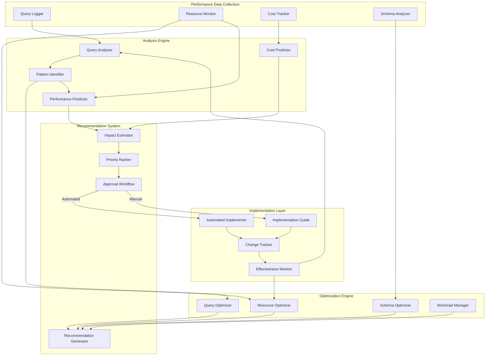

# Performance Optimization Architecture

## Introduction

The Performance Optimization architecture is a critical component of the self-healing data pipeline, focused on enhancing the efficiency, performance, and cost-effectiveness of BigQuery operations and overall pipeline execution. This document details the design and implementation of the optimization capabilities that significantly improve query performance, optimize storage patterns, and ensure efficient resource utilization.

The optimization architecture works in conjunction with the monitoring and self-healing components to create a comprehensive approach to performance management, where issues are not only detected and resolved but proactively prevented through continuous optimization.

### Purpose and Scope

The optimization architecture serves multiple critical purposes within the data pipeline:

- **Query Performance Enhancement**: Automatically analyze and optimize BigQuery queries to improve execution speed and reduce costs
- **Schema Optimization**: Implement optimal partitioning, clustering, and table design strategies for BigQuery tables
- **Resource Utilization Optimization**: Ensure efficient use of computational resources across the pipeline
- **Cost Management**: Reduce operational costs through improved efficiency and resource allocation
- **Continuous Improvement**: Provide ongoing optimization recommendations based on usage patterns

This document covers the design principles, component architecture, optimization strategies, and implementation details of the performance optimization system, focusing on how it enhances the efficiency and cost-effectiveness of the self-healing data pipeline.

### Design Principles

The optimization architecture is built on several key principles:

- **Data-Driven Optimization**: Base optimization decisions on actual usage patterns and performance metrics
- **Continuous Improvement**: Regularly analyze and optimize based on evolving workloads
- **Risk Management**: Validate optimizations before applying them to prevent regressions
- **Cost-Benefit Analysis**: Prioritize optimizations with the highest impact relative to implementation effort
- **Automation First**: Automate routine optimization tasks while providing human oversight for complex changes
- **Measurable Outcomes**: Quantify the impact of optimizations to demonstrate value
- **Holistic Approach**: Consider the entire pipeline rather than optimizing components in isolation

### Key Capabilities

The optimization system provides several key capabilities:

- **Query Analysis and Optimization**: Identification and correction of inefficient query patterns
- **Schema Design Optimization**: Recommendations and implementation of optimal table structures
- **Resource Allocation Management**: Dynamic adjustment of computational resources
- **Cost Monitoring and Optimization**: Tracking and reduction of operational costs
- **Performance Prediction**: Forecasting the impact of potential optimizations
- **Workload Analysis**: Understanding usage patterns to inform optimization strategies
- **Automated Implementation**: Applying optimizations with appropriate validation and safeguards

## Optimization Architecture Overview

The optimization architecture follows a layered approach, with specialized components handling different aspects of performance optimization across the data pipeline.

### High-Level Architecture Diagram

### Architectural Patterns

The optimization architecture employs several key patterns:

- **Feedback Loop**: Performance metrics feed back into the optimization system to drive continuous improvement
- **Layered Architecture**: Separation of data collection, analysis, optimization, recommendation, and implementation
- **Confidence-Based Automation**: Automation level based on confidence in optimization impact
- **Human-in-the-Loop**: Critical or high-impact optimizations require human approval
- **A/B Testing**: Validation of optimizations through comparative testing
- **Incremental Optimization**: Progressive improvement rather than radical changes

### Integration Points

The optimization system integrates with several other components of the data pipeline:

- **BigQuery**: Primary target for query and schema optimizations
- **Monitoring System**: Source of performance metrics and anomaly detection
- **Self-Healing System**: Consumer of optimization recommendations for automated improvements
- **Pipeline Orchestration**: Target for workflow and resource optimizations
- **Notification System**: Channel for optimization recommendations and approvals

These integration points enable the optimization system to collect performance data, implement improvements, and coordinate with other components to create a comprehensive optimization approach.

## Core Components

The optimization architecture consists of five core components, each with specific responsibilities and integration points.

### Performance Data Collection

**Purpose**: Gather performance data from various sources to inform optimization decisions

**Key Technologies**:
- Cloud Monitoring for metric collection
- BigQuery INFORMATION_SCHEMA for query analysis
- Custom logging for detailed performance tracking

**Components**:

1. **Query Logger**: Captures and analyzes query execution details
   - Records query text, execution time, and resource usage
   - Tracks query frequency and patterns
   - Identifies common query templates
   - Maintains historical query performance data

2. **Resource Monitor**: Tracks resource utilization across the pipeline
   - Monitors BigQuery slot usage
   - Tracks Composer worker utilization
   - Measures storage consumption and growth
   - Identifies resource bottlenecks

3. **Cost Tracker**: Monitors and analyzes cost metrics
   - Tracks BigQuery query costs
   - Monitors storage costs
   - Analyzes cost trends over time
   - Identifies cost optimization opportunities

4. **Schema Analyzer**: Examines table structures and usage patterns
   - Analyzes table schemas and sizes
   - Tracks query access patterns
   - Identifies partitioning and clustering opportunities
   - Monitors schema evolution

**Implementation Details**:
- Integration with Cloud Monitoring for metric collection
- Custom logging for detailed query analysis
- BigQuery INFORMATION_SCHEMA queries for metadata
- Historical data storage in BigQuery for trend analysis

### Analysis Engine

**Purpose**: Analyze performance data to identify optimization opportunities

**Key Technologies**:
- Custom analysis algorithms
- Statistical analysis libraries
- Machine learning for pattern recognition

**Components**:

1. **Query Analyzer**: Examines query structure and performance
   - Parses and analyzes SQL syntax
   - Examines query execution plans
   - Identifies inefficient query patterns
   - Analyzes query performance metrics

2. **Pattern Identifier**: Recognizes common patterns and anti-patterns
   - Matches queries against known anti-patterns
   - Identifies optimization opportunities
   - Categorizes issues by type and impact
   - Maintains a library of pattern definitions

3. **Performance Predictor**: Forecasts performance of optimized queries
   - Estimates execution time improvements
   - Predicts resource utilization changes
   - Calculates cost impact of optimizations
   - Provides confidence scores for predictions

4. **Cost Predictor**: Estimates cost implications of changes
   - Calculates cost savings from optimizations
   - Predicts ROI for optimization efforts
   - Analyzes cost trends and anomalies
   - Prioritizes cost-saving opportunities

**Implementation Details**:
- SQL parsing and analysis using sqlparse
- Pattern matching using regular expressions and AST analysis
- Statistical models for performance prediction
- Historical data analysis for trend identification

### Optimization Engine

**Purpose**: Generate optimized versions of queries and schema designs

**Key Technologies**:
- SQL transformation libraries
- BigQuery schema management APIs
- Resource management APIs

**Components**:

1. **Query Optimizer**: Transforms queries for better performance
   - Applies predicate pushdown optimizations
   - Optimizes join orders and types
   - Flattens unnecessary subqueries
   - Converts to more efficient SQL patterns
   - Validates optimized query correctness

2. **Schema Optimizer**: Designs optimal table structures
   - Generates partitioning strategies
   - Recommends clustering keys
   - Suggests denormalization opportunities
   - Optimizes column ordering and types
   - Creates materialized view recommendations

3. **Resource Optimizer**: Adjusts resource allocations
   - Optimizes BigQuery slot reservations
   - Tunes Composer worker counts
   - Recommends resource scaling policies
   - Balances resources across workloads
   - Identifies idle resource opportunities

4. **Workload Manager**: Optimizes job scheduling and execution
   - Analyzes workload patterns
   - Recommends job scheduling strategies
   - Identifies batch processing opportunities
   - Suggests query queue optimizations
   - Balances concurrent workloads

**Implementation Details**:
- Query transformation engine with multiple optimization techniques
- Schema design algorithms based on access patterns
- Resource allocation models using historical utilization
- Workload analysis using time-series pattern recognition

### Recommendation System

**Purpose**: Generate, prioritize, and manage optimization recommendations

**Key Technologies**:
- Recommendation engines
- Impact estimation models
- Workflow management

**Components**:

1. **Recommendation Generator**: Creates optimization suggestions
   - Combines outputs from optimization engines
   - Formats recommendations with context
   - Generates implementation instructions
   - Provides before/after examples
   - Creates comprehensive recommendation packages

2. **Impact Estimator**: Assesses potential impact of optimizations
   - Calculates performance improvement estimates
   - Determines cost savings potential
   - Assesses implementation complexity
   - Evaluates risk factors
   - Provides confidence scores for estimates

3. **Priority Ranker**: Prioritizes recommendations by value
   - Ranks recommendations by ROI
   - Considers business impact factors
   - Evaluates dependencies between recommendations
   - Balances quick wins vs. strategic improvements
   - Creates optimization roadmaps

4. **Approval Workflow**: Manages the approval process
   - Routes recommendations to appropriate approvers
   - Tracks approval status and history
   - Implements approval policies based on impact
   - Provides context for approval decisions
   - Manages notification and reminder flow

**Implementation Details**:
- Recommendation engine with templates for different optimization types
- ROI calculation models for prioritization
- Workflow engine for approval routing and tracking
- Integration with notification systems for approvals

### Implementation Layer

**Purpose**: Apply approved optimizations to the system

**Key Technologies**:
- BigQuery DDL/DML execution
- API clients for resource management
- Change management tracking

**Components**:

1. **Automated Implementer**: Applies optimizations automatically
   - Executes approved optimization actions
   - Implements schema changes
   - Applies resource configuration updates
   - Replaces queries with optimized versions
   - Validates changes after implementation

2. **Implementation Guide**: Assists with manual implementation
   - Generates step-by-step implementation instructions
   - Provides SQL scripts for manual execution
   - Creates configuration change templates
   - Offers rollback procedures
   - Includes validation steps

3. **Change Tracker**: Records all optimization changes
   - Maintains history of all optimizations
   - Tracks implementation status
   - Records before/after states
   - Enables rollback if needed
   - Provides audit trail for changes

4. **Effectiveness Monitor**: Measures optimization impact
   - Compares performance before and after
   - Calculates actual vs. predicted improvements
   - Identifies unexpected consequences
   - Feeds results back to analysis engine
   - Generates optimization effectiveness reports

**Implementation Details**:
- Safe execution framework for automated changes
- Template-based instruction generation
- Change tracking database with version history
- A/B testing framework for effectiveness measurement

### Optimization Modes and Confidence Thresholds

The optimization system operates in different modes based on confidence levels and impact assessment:

1. **Fully Automated Mode**:
   - High confidence optimizations (typically >90%)
   - Low impact changes (e.g., simple query rewrites)
   - Well-understood optimization patterns
   - Automatic implementation without approval
   - Post-implementation notification

2. **Semi-Automated Mode**:
   - Medium confidence optimizations (typically 70-90%)
   - Medium impact changes (e.g., adding indexes)
   - Common optimization patterns
   - Automatic implementation with notification
   - Option for human intervention

3. **Approval-Required Mode**:
   - Lower confidence optimizations (<70%)
   - High impact changes (e.g., table restructuring)
   - Complex or novel optimizations
   - Requires explicit approval before implementation
   - Provides detailed context for decision-making

4. **Advisory Mode**:
   - Any confidence level
   - Recommendations only, no automated implementation
   - Suitable for educational purposes
   - Provides implementation instructions
   - Tracks manual implementation status

Confidence thresholds are configurable by optimization type, component, and environment, allowing for fine-tuned control over automation levels.

## Query Optimization

Query optimization is a core capability of the performance optimization system, focused on improving the efficiency and cost-effectiveness of BigQuery queries through automated analysis and transformation.

### Query Analysis Process

The query analysis process examines queries to identify optimization opportunities:

1. **Query Parsing**: Breaking down the SQL query into a structured representation
   - Lexical analysis to tokenize the query
   - Syntactic analysis to create a parse tree
   - Semantic analysis to understand query intent
   - Identification of query components (SELECT, FROM, WHERE, etc.)

2. **Execution Plan Analysis**: Examining how BigQuery will execute the query
   - Retrieval of query execution plan
   - Analysis of operation types and order
   - Identification of full table scans, joins, and aggregations
   - Detection of potential bottlenecks

3. **Pattern Matching**: Identifying known inefficient patterns
   - Matching against library of anti-patterns
   - Detection of suboptimal join conditions
   - Identification of inefficient function usage
   - Recognition of unnecessary operations

4. **Performance Metrics Analysis**: Examining historical performance data
   - Analysis of execution time patterns
   - Slot utilization assessment
   - Data processed volume analysis
   - Cost analysis for similar queries

This analysis process provides a comprehensive understanding of query behavior and identifies specific opportunities for optimization.

### Optimization Techniques

The query optimizer applies several techniques to improve query performance:

1. **Predicate Pushdown**: Moving filter conditions closer to data sources
   - Pushing WHERE clauses into subqueries
   - Moving filters before joins
   - Applying filters as early as possible
   - Reducing data volume early in query execution

2. **Join Optimization**: Improving join operations
   - Reordering joins to process smaller tables first
   - Converting to more efficient join types
   - Optimizing join conditions
   - Adding appropriate join hints

3. **Subquery Flattening**: Simplifying nested queries
   - Converting subqueries to joins where possible
   - Flattening unnecessary nested queries
   - Merging related subqueries
   - Simplifying query structure

4. **Projection Pruning**: Reducing column selection
   - Replacing SELECT * with specific columns
   - Eliminating unused columns
   - Minimizing data transfer between query stages
   - Reducing unnecessary data processing

5. **Aggregation Optimization**: Improving aggregation operations
   - Pushing aggregations closer to data sources
   - Optimizing GROUP BY clauses
   - Simplifying complex aggregations
   - Leveraging approximate functions where appropriate

6. **Common Table Expression (CTE) Usage**: Improving query readability and performance
   - Converting repeated subqueries to CTEs
   - Structuring complex queries with CTEs
   - Improving query plan generation
   - Enhancing query maintainability

These techniques are applied selectively based on the specific characteristics of each query, with validation to ensure correctness.

### Query Validation Framework

The query validation framework ensures that optimized queries produce correct results:

1. **Result Set Validation**: Comparing query outputs
   - Executing original and optimized queries
   - Comparing result schemas for compatibility
   - Validating row counts and data distributions
   - Ensuring semantic equivalence

2. **Performance Validation**: Verifying performance improvements
   - Measuring execution time differences
   - Comparing slot utilization
   - Analyzing bytes processed
   - Calculating cost differences

3. **A/B Testing**: Controlled comparison of query versions
   - Running both versions in production with sampling
   - Collecting performance metrics
   - Analyzing statistical significance
   - Validating real-world improvements

4. **Regression Testing**: Ensuring ongoing correctness
   - Maintaining test suites for optimized queries
   - Regular validation against changing data
   - Automated testing in CI/CD pipeline
   - Alerting on validation failures

This validation framework ensures that optimizations improve performance without compromising correctness, with appropriate safeguards to prevent issues in production.

### Implementation Approach

The implementation of query optimizations follows a structured approach:

1. **Optimization Candidates**: Identifying queries for optimization
   - Analysis of query logs for frequent queries
   - Identification of high-cost queries
   - Focus on queries with clear optimization potential
   - Prioritization based on business impact

2. **Optimization Application**: Applying optimizations to queries
   - Generation of optimized query versions
   - Validation of correctness and performance
   - Documentation of changes and expected benefits
   - Version control of query transformations

3. **Deployment Methods**: Implementing optimized queries
   - Direct replacement in code repositories
   - View creation for transparent replacement
   - Stored procedure updates
   - Query rewrite rules in middleware

4. **Monitoring and Feedback**: Tracking optimization effectiveness
   - Performance monitoring of optimized queries
   - Comparison with predicted improvements
   - Feedback loop for optimization techniques
   - Continuous improvement of optimization process

This structured approach ensures that query optimizations are applied effectively and safely, with appropriate monitoring to validate their impact.

### Query Anti-Pattern Library

The system maintains a comprehensive library of query anti-patterns:

1. **Inefficient Join Patterns**:
   - Cartesian products (missing join conditions)
   - Joining on non-indexed columns
   - Suboptimal join order (large tables first)
   - Unnecessary self-joins

2. **Suboptimal Filtering**:
   - Late filtering (WHERE clauses after joins)
   - Non-selective filters
   - Inefficient use of partitioning columns
   - Function calls in WHERE clauses

3. **Projection Inefficiencies**:
   - SELECT * when few columns are needed
   - Unnecessary columns in intermediate results
   - Duplicate column selection
   - Excessive type conversions

4. **Aggregation Issues**:
   - Aggregating before filtering
   - Multiple levels of unnecessary aggregation
   - GROUP BY on high-cardinality columns
   - Inefficient use of window functions

5. **Subquery Problems**:
   - Correlated subqueries that could be joins
   - Repeated subqueries
   - Deeply nested subqueries
   - Scalar subqueries in loops

This library is continuously expanded and refined based on new patterns discovered in query analysis and industry best practices.

## Schema Optimization

Schema optimization focuses on designing BigQuery table structures for optimal performance and cost efficiency, with particular emphasis on partitioning and clustering strategies.

### Table Structure Analysis

The schema analysis process examines table structures and usage patterns:

1. **Schema Analysis**: Examining table definitions
   - Column types and distributions
   - Primary and foreign key relationships
   - Nested and repeated field usage
   - Schema evolution history

2. **Query Pattern Analysis**: Understanding how tables are accessed
   - Frequent filter conditions
   - Common join columns
   - Typical aggregation fields
   - Sort order requirements

3. **Data Distribution Analysis**: Examining data characteristics
   - Row count and growth rate
   - Data skew across potential partition keys
   - Cardinality of columns
   - Temporal distribution of data

4. **Access Pattern Analysis**: Understanding usage over time
   - Query frequency and patterns
   - Data freshness requirements
   - Historical data access patterns
   - Batch vs. interactive query patterns

This analysis provides the foundation for schema optimization recommendations, ensuring that table structures align with actual usage patterns.

### Partitioning Strategies

The system recommends and implements optimal partitioning strategies:

1. **Partitioning Method Selection**:
   - Time-based partitioning for time-series data
   - Integer range partitioning for numeric keys
   - Ingestion-time partitioning for streaming data
   - Custom partitioning expressions for specific needs

2. **Partition Key Selection**:
   - Analysis of query filter patterns
   - Evaluation of data distribution across keys
   - Assessment of partition count and size
   - Consideration of partition pruning effectiveness

3. **Partition Sizing Optimization**:
   - Balancing partition count and size
   - Preventing partition skew
   - Managing partition limits
   - Optimizing for query performance

4. **Partition Management**:
   - Partition expiration policies
   - Partition merging strategies
   - Historical partition handling
   - Partition metadata management

Effective partitioning significantly improves query performance and reduces costs by limiting the amount of data scanned during query execution.

### Clustering Strategies

Clustering complements partitioning by organizing data within partitions:

1. **Clustering Key Selection**:
   - Analysis of query filter and sort patterns
   - Identification of frequently filtered columns
   - Evaluation of column cardinality
   - Assessment of data locality benefits

2. **Multi-Column Clustering**:
   - Determining optimal column order
   - Balancing specificity and flexibility
   - Evaluating column combinations
   - Optimizing for common query patterns

3. **Clustering Maintenance**:
   - Monitoring clustering effectiveness
   - Reclustering recommendations
   - Cluster evolution with changing patterns
   - Performance impact assessment

4. **Clustering vs. Partitioning Decisions**:
   - When to use clustering vs. partitioning
   - Combining both strategies effectively
   - Trade-offs and limitations
   - Best practices for different scenarios

Clustering improves query performance by organizing related data together, reducing the amount of data scanned and improving data locality.

### Materialized Views

Materialized views provide pre-computed results for common query patterns:

1. **Materialized View Candidates**:
   - Identification of frequently executed queries
   - Analysis of computation-heavy operations
   - Detection of common intermediate results
   - Assessment of refresh frequency requirements

2. **View Definition Optimization**:
   - Balancing specificity and reusability
   - Optimizing for query performance
   - Minimizing maintenance overhead
   - Ensuring data freshness requirements

3. **Maintenance Strategy**:
   - Refresh scheduling optimization
   - Incremental refresh implementation
   - Dependency management
   - Staleness monitoring

4. **Cost-Benefit Analysis**:
   - Storage cost vs. query savings
   - Maintenance cost considerations
   - Performance improvement quantification
   - ROI calculation for each view

Materialized views can dramatically improve performance for common query patterns by pre-computing results, reducing the need for expensive operations at query time.

### Schema Evolution Management

The system helps manage schema changes while maintaining performance:

1. **Schema Change Impact Analysis**:
   - Assessment of query compatibility
   - Performance impact prediction
   - Cost implication analysis
   - Optimization opportunity identification

2. **Migration Strategy Recommendations**:
   - In-place vs. new table strategies
   - Data migration approaches
   - Transition period management
   - Rollback planning

3. **Backward Compatibility Optimization**:
   - Default value strategies
   - Field deprecation approaches
   - Query compatibility techniques
   - Version management recommendations

4. **Schema Documentation and Governance**:
   - Automated schema documentation
   - Change tracking and history
   - Best practice enforcement
   - Schema validation tools

Effective schema evolution management ensures that changes can be made safely while maintaining or improving performance characteristics.

### Implementation Approach

Schema optimizations are implemented through a careful, staged approach:

1. **Impact Assessment**:
   - Performance improvement prediction
   - Cost change estimation
   - Query compatibility verification
   - Risk assessment

2. **Implementation Planning**:
   - Resource requirement estimation
   - Downtime minimization strategies
   - Dependency management
   - Rollback procedures

3. **Execution Methods**:
   - In-place modifications where possible
   - Create-copy-replace for major changes
   - View-based compatibility layers
   - Phased implementation for complex changes

4. **Validation and Monitoring**:
   - Performance verification
   - Query compatibility testing
   - Cost impact measurement
   - Ongoing optimization effectiveness monitoring

This structured approach ensures that schema optimizations deliver the expected benefits while minimizing disruption and risk.

## Resource Optimization

Resource optimization focuses on efficient allocation and utilization of computational resources across the data pipeline, ensuring optimal performance while managing costs.

### Resource Utilization Analysis

The resource analysis process examines how resources are used:

1. **Utilization Pattern Analysis**:
   - Historical utilization trends
   - Peak usage patterns
   - Idle periods identification
   - Seasonal and cyclical patterns

2. **Workload Characterization**:
   - Job type classification
   - Resource consumption profiles
   - Execution duration patterns
   - Concurrency requirements

3. **Bottleneck Identification**:
   - Resource constraint detection
   - Contention point analysis
   - Scalability limitation assessment
   - Performance impact quantification

4. **Cost Analysis**:
   - Resource cost breakdown
   - Utilization efficiency metrics
   - Cost per operation analysis
   - Waste identification

This analysis provides insights into resource usage patterns and identifies opportunities for optimization.

### BigQuery Slot Management

Optimization of BigQuery computational resources:

1. **Slot Allocation Strategy**:
   - Reservation sizing recommendations
   - Commitment level optimization
   - Slot pool configuration
   - Workload management setup

2. **Workload Prioritization**:
   - Workload identification and classification
   - Priority assignment based on business impact
   - Resource allocation policies
   - Preemption strategy optimization

3. **Scaling Optimization**:
   - Auto-scaling configuration
   - Baseline capacity determination
   - Peak handling strategies
   - Idle capacity management

4. **Cost-Performance Balancing**:
   - On-demand vs. committed resource analysis
   - Workload-specific optimization
   - Time-based scaling recommendations
   - ROI analysis for slot investments

Effective slot management ensures that BigQuery resources are allocated efficiently, balancing performance needs with cost considerations.

### Composer Resource Optimization

Optimization of Cloud Composer orchestration resources:

1. **Environment Sizing**:
   - Node count recommendations
   - Machine type optimization
   - Disk size configuration
   - Memory and CPU allocation

2. **Worker Management**:
   - Worker count optimization
   - Concurrency settings
   - Queue management
   - Task distribution strategies

3. **Execution Optimization**:
   - Task duration analysis
   - Parallelism optimization
   - Resource constraint identification
   - Execution efficiency improvements

4. **Scaling Strategy**:
   - Auto-scaling configuration
   - Scaling trigger optimization
   - Minimum/maximum capacity settings
   - Scaling speed adjustments

Optimizing Composer resources ensures efficient pipeline orchestration while managing costs and maintaining performance.

### Storage Optimization

Optimization of storage resources and costs:

1. **Storage Class Selection**:
   - Access pattern analysis
   - Storage class recommendations
   - Lifecycle policy optimization
   - Cost-performance trade-off analysis

2. **Data Retention Optimization**:
   - Usage pattern analysis
   - Retention policy recommendations
   - Archival strategy optimization
   - Compliance requirement integration

3. **Compression and Format Optimization**:
   - Format efficiency analysis
   - Compression strategy recommendations
   - Column-oriented storage optimization
   - Encoding optimization

4. **Storage Cost Management**:
   - Unused data identification
   - Duplicate data detection
   - Storage growth forecasting
   - Cost allocation optimization

Storage optimization reduces costs while ensuring appropriate performance characteristics for different data access patterns.

### Workload Scheduling Optimization

Optimization of job scheduling for resource efficiency:

1. **Workload Pattern Analysis**:
   - Temporal distribution of jobs
   - Resource consumption patterns
   - Dependency relationships
   - Priority classifications

2. **Schedule Optimization**:
   - Peak load distribution
   - Idle time utilization
   - Dependency-aware scheduling
   - Priority-based resource allocation

3. **Batch Processing Optimization**:
   - Batch size recommendations
   - Processing window optimization
   - Resource reservation strategies
   - Parallel processing configuration

4. **Concurrency Management**:
   - Optimal concurrency levels
   - Queue management strategies
   - Throttling recommendations
   - Contention mitigation approaches

Workload scheduling optimization ensures efficient resource utilization by distributing work appropriately across time and available resources.

### Implementation Approach

Resource optimizations are implemented through a structured approach:

1. **Recommendation Generation**:
   - Clear, actionable optimization recommendations
   - Expected impact quantification
   - Implementation complexity assessment
   - Risk evaluation

2. **Approval Workflow**:
   - Stakeholder notification
   - Impact review process
   - Approval tracking
   - Implementation authorization

3. **Implementation Methods**:
   - API-based configuration changes
   - Infrastructure as Code updates
   - Console configuration changes
   - Scheduled adjustments

4. **Validation and Monitoring**:
   - Pre/post performance comparison
   - Cost impact verification
   - Ongoing effectiveness monitoring
   - Continuous optimization feedback

This approach ensures that resource optimizations are implemented safely and effectively, with appropriate validation to confirm their impact.

## Cost Optimization

Cost optimization is a critical aspect of the performance optimization system, focused on reducing operational expenses while maintaining or improving performance.

### Cost Analysis Framework

The cost analysis framework provides visibility into pipeline costs:

1. **Cost Breakdown Analysis**:
   - Component-level cost attribution
   - Query-level cost tracking
   - Storage cost analysis
   - Resource utilization costs

2. **Trend Analysis**:
   - Historical cost patterns
   - Growth rate analysis
   - Anomaly detection
   - Forecasting and prediction

3. **Efficiency Metrics**:
   - Cost per query
   - Cost per GB processed
   - Cost per pipeline execution
   - Resource utilization efficiency

4. **Benchmarking**:
   - Internal benchmarking across components
   - Industry standard comparisons
   - Best practice gap analysis
   - Optimization potential quantification

This framework provides the foundation for identifying cost optimization opportunities and measuring the impact of optimization efforts.

### Query Cost Optimization

Strategies for reducing BigQuery query costs:

1. **Data Volume Reduction**:
   - Column pruning (SELECT only needed columns)
   - Predicate optimization (filter early)
   - Partition pruning optimization
   - Sampling for exploratory queries

2. **Computation Optimization**:
   - Materialized view utilization
   - Precomputation strategies
   - Approximation functions where appropriate
   - Query rewriting for efficiency

3. **Caching Strategies**:
   - Result caching optimization
   - Intermediate result reuse
   - Cache-aware query design
   - Cache hit rate optimization

4. **Cost-Based Query Routing**:
   - Query classification by cost profile
   - Appropriate execution environment selection
   - Batch vs. interactive optimization
   - Cost-based query rewriting

These strategies focus on reducing the amount of data processed and computational resources required for queries, directly impacting costs.

### Storage Cost Optimization

Approaches for optimizing storage costs:

1. **Storage Lifecycle Management**:
   - Age-based storage class transitions
   - Access pattern-based optimization
   - Automated archival processes
   - Deletion policy optimization

2. **Compression and Format Optimization**:
   - Optimal file format selection
   - Compression algorithm selection
   - Encoding optimization
   - Partitioning for storage efficiency

3. **Data Retention Optimization**:
   - Business need-based retention
   - Compliance-aware policies
   - Aggregation strategies for historical data
   - Selective field retention

4. **Duplicate and Unused Data Management**:
   - Duplicate data identification
   - Unused data detection
   - Temporary data cleanup
   - Test data management

Storage cost optimization ensures that data is stored in the most cost-effective manner while remaining accessible as needed.

### Resource Cost Optimization

Strategies for optimizing resource-related costs:

1. **Resource Right-Sizing**:
   - Utilization-based sizing recommendations
   - Elimination of over-provisioning
   - Performance-appropriate sizing
   - Scaling optimization

2. **Commitment Optimization**:
   - Commitment level recommendations
   - Commitment term optimization
   - Utilization maximization strategies
   - Flex slot optimization

3. **Idle Resource Management**:
   - Idle resource identification
   - Automatic scaling to zero
   - Scheduled resource management
   - Shared resource pooling

4. **Resource Allocation Efficiency**:
   - Priority-based allocation
   - Workload-specific resource pools
   - Time-based allocation strategies
   - Cost-sharing optimization

Resource cost optimization ensures that computational resources are allocated efficiently and scaled appropriately based on actual needs.

### Cost Governance Framework

Framework for managing and controlling costs:

1. **Budget Management**:
   - Budget allocation recommendations
   - Spending tracking and alerting
   - Trend-based forecasting
   - Variance analysis

2. **Cost Attribution**:
   - Tagging strategy optimization
   - Workload-based attribution
   - Chargeback/showback models
   - Cost allocation recommendations

3. **Cost Control Policies**:
   - Query cost limits
   - Approval workflows for high-cost operations
   - Resource quota management
   - Cost anomaly detection and alerting

4. **Cost Optimization Culture**:
   - Cost awareness training
   - Optimization incentive programs
   - Best practice sharing
   - Cost efficiency metrics and goals

The cost governance framework ensures that costs are visible, attributable, and controllable, with appropriate policies and practices to maintain cost efficiency.

### ROI-Based Optimization

Approach for prioritizing optimizations based on return on investment:

1. **Cost Saving Quantification**:
   - Estimated cost reduction calculation
   - Confidence scoring for estimates
   - Time-based saving projections
   - Total cost of ownership analysis

2. **Implementation Cost Assessment**:
   - Development effort estimation
   - Operational impact evaluation
   - Risk factor consideration
   - Maintenance cost projection

3. **ROI Calculation**:
   - Payback period determination
   - Net present value analysis
   - Risk-adjusted return calculation
   - Comparative ROI ranking

4. **Optimization Roadmap**:
   - Priority-based implementation planning
   - Quick win identification
   - Strategic initiative development
   - Continuous improvement framework

ROI-based optimization ensures that optimization efforts are focused on areas with the highest potential return, maximizing the value of optimization investments.

## Integration with Self-Healing

The optimization system integrates closely with the self-healing capabilities of the pipeline, enabling automated performance improvements based on detected issues and patterns.

### Optimization-Driven Healing

Integration of optimization recommendations into self-healing actions:

1. **Performance Issue Detection**:
   - Monitoring system identifies performance anomalies
   - Pattern recognition for known performance issues
   - Threshold-based detection for degradation
   - Trend analysis for gradual performance decline

2. **Optimization Selection**:
   - Mapping of issues to optimization techniques
   - Confidence-based selection of optimizations
   - Impact assessment for potential actions
   - Risk evaluation for automated application

3. **Automated Application**:
   - Self-healing system applies optimizations
   - Validation of optimization effectiveness
   - Rollback capability for unsuccessful optimizations
   - Learning from optimization outcomes

4. **Feedback Loop**:
   - Performance impact measurement
   - Optimization effectiveness tracking
   - Model refinement based on outcomes
   - Pattern library enhancement

This integration enables the pipeline to automatically improve its performance based on detected issues, creating a self-optimizing system.

### Resource Adjustment Healing

Automated resource adjustments in response to changing conditions:

1. **Resource Constraint Detection**:
   - Monitoring system identifies resource bottlenecks
   - Utilization threshold violations
   - Contention detection
   - Performance impact assessment

2. **Adjustment Strategy Selection**:
   - Resource type identification (slots, workers, etc.)
   - Scaling direction and magnitude determination
   - Timing optimization for adjustments
   - Cost impact assessment

3. **Automated Adjustment**:
   - Self-healing system applies resource changes
   - Gradual scaling to avoid disruption
   - Performance monitoring during adjustment
   - Stabilization verification

4. **Optimization Learning**:
   - Effectiveness tracking of adjustments
   - Pattern recognition for recurring needs
   - Predictive model enhancement
   - Proactive adjustment capability development

This capability enables the pipeline to automatically adjust its resources in response to changing workloads and requirements, maintaining optimal performance.

### Predictive Optimization

Proactive optimization based on predicted issues:

1. **Performance Prediction**:
   - Analysis of performance trends
   - Workload forecasting
   - Resource utilization prediction
   - Potential bottleneck identification

2. **Preventive Optimization Selection**:
   - Mapping of predicted issues to optimizations
   - Proactive vs. reactive trade-off analysis
   - Implementation timing optimization
   - Risk assessment for preventive actions

3. **Scheduled Optimization**:
   - Timing optimization for implementation
   - Dependency-aware scheduling
   - Impact minimization planning
   - Validation strategy development

4. **Effectiveness Measurement**:
   - Counterfactual analysis (what would have happened)
   - Performance stability tracking
   - False positive/negative assessment
   - Predictive model refinement

Predictive optimization enables the system to address potential issues before they impact performance, shifting from reactive to proactive optimization.

### Continuous Improvement Cycle

Ongoing enhancement of optimization capabilities through learning:

1. **Optimization Outcome Collection**:
   - Success/failure tracking of optimizations
   - Performance impact measurement
   - User feedback collection
   - Context data gathering

2. **Pattern Recognition**:
   - Identification of successful optimization patterns
   - Context factors for optimization success
   - Failure pattern analysis
   - New optimization opportunity discovery

3. **Model Enhancement**:
   - Optimization selection model refinement
   - Performance prediction improvement
   - Confidence scoring calibration
   - New technique development

4. **Knowledge Base Expansion**:
   - Pattern library enhancement
   - Best practice documentation
   - Case study development
   - Optimization strategy evolution

This continuous improvement cycle ensures that the optimization system becomes more effective over time, learning from its successes and failures to enhance future optimization decisions.

## Implementation Considerations

This section covers important considerations for implementing the optimization architecture, including deployment, security, and operational aspects.

### Deployment Model

The optimization system follows a cloud-native deployment model:

1. **Component Deployment**:
   - Analysis Engine: Cloud Functions and Vertex AI
   - Optimization Engine: Cloud Functions with BigQuery integration
   - Recommendation System: Cloud Functions and Firestore
   - Implementation Layer: Cloud Functions with service-specific integrations

2. **Environment Strategy**:
   - Development: For feature development and testing
   - Staging: For integration testing and validation
   - Production: For business operations
   - Isolated resources and configurations for each environment

3. **Deployment Pipeline**:
   - Infrastructure as Code with Terraform
   - CI/CD pipeline with Cloud Build
   - Automated testing at multiple levels
   - Canary deployments for risk mitigation

4. **Implementation Details**:
   - Containerized components where appropriate
   - Serverless architecture for scaling and management
   - Managed services for reduced operational overhead
   - Version control for all components and configurations

This deployment model ensures consistent, reproducible deployment across environments while leveraging cloud-native capabilities for scalability and reliability.

### Security Considerations

Security is a critical aspect of the optimization architecture:

1. **Access Control**:
   - Role-based access to optimization capabilities
   - Principle of least privilege for all components
   - Separation of duties for sensitive operations
   - Regular access review and cleanup

2. **Data Protection**:
   - Encryption of optimization data at rest and in transit
   - Secure handling of query samples and execution plans
   - Sensitive data identification and protection
   - Appropriate data retention policies

3. **Change Management**:
   - Approval workflows for significant changes
   - Audit logging of all optimization actions
   - Rollback capabilities for all changes
   - Change impact assessment

4. **Secure Development**:
   - Secure coding practices
   - Dependency vulnerability scanning
   - Regular security testing
   - Security review for all components

These security measures ensure that the optimization system operates securely while protecting sensitive data and systems.

### Operational Considerations

Several operational aspects are important for the optimization architecture:

1. **Monitoring and Alerting**:
   - Performance monitoring of optimization components
   - Alerting for optimization failures
   - Tracking of optimization effectiveness
   - Dashboards for optimization visibility

2. **Maintenance Procedures**:
   - Regular review and update of optimization techniques
   - Pattern library maintenance
   - Model retraining and validation
   - Configuration updates for changing requirements

3. **Disaster Recovery**:
   - Backup of optimization configurations
   - Recovery procedures for optimization components
   - Business continuity planning
   - Regular testing of recovery capabilities

4. **Documentation and Training**:
   - Comprehensive documentation of optimization capabilities
   - Training for users and administrators
   - Best practice guides
   - Case studies and examples

These operational considerations ensure that the optimization system is reliable, maintainable, and well-understood by its users and operators.

### Performance Considerations

The optimization system itself must be optimized for performance:

1. **Analysis Performance**:
   - Efficient query parsing and analysis
   - Optimized pattern matching algorithms
   - Caching of analysis results
   - Parallel processing where appropriate

2. **Recommendation Generation**:
   - Prioritized processing of high-impact opportunities
   - Asynchronous generation for complex recommendations
   - Caching of common recommendations
   - Incremental updates for changing conditions

3. **Implementation Efficiency**:
   - Batched implementation of related changes
   - Optimized execution timing
   - Resource-aware implementation scheduling
   - Parallel implementation where safe

4. **System Scalability**:
   - Horizontal scaling for increased workload
   - Efficient storage of optimization data
   - Performance monitoring and optimization
   - Resource allocation based on demand

These performance considerations ensure that the optimization system itself operates efficiently, providing timely recommendations and implementations without becoming a bottleneck.

### Cost Management

The optimization system must manage its own costs effectively:

1. **Resource Efficiency**:
   - Right-sized components for workload
   - Serverless architecture for cost efficiency
   - Appropriate caching to reduce repeated work
   - Efficient storage utilization

2. **Analysis Optimization**:
   - Sampling for large datasets
   - Incremental analysis where possible
   - Prioritized processing based on value
   - Scheduled analysis for non-critical components

3. **ROI Focus**:
   - Cost-benefit analysis for optimization efforts
   - Focus on high-impact opportunities
   - Measurement of optimization ROI
   - Continuous refinement of optimization strategy

4. **Cost Visibility**:
   - Tracking of optimization system costs
   - Attribution to business value
   - Regular cost review and optimization
   - Cost-effectiveness reporting

These cost management practices ensure that the optimization system delivers value that significantly exceeds its operational costs.

## Future Enhancements

The optimization architecture is designed for future enhancement and extension, with several potential areas for expansion.

### Advanced AI Capabilities

Future AI enhancements to the optimization system may include:

1. **Generative AI for Query Optimization**:
   - Natural language understanding of query intent
   - Automated query rewriting for performance
   - Explanation generation for optimization recommendations
   - Code generation for optimized queries

2. **Reinforcement Learning for Resource Optimization**:
   - Dynamic resource allocation learning
   - Workload-adaptive scaling policies
   - Continuous optimization through experience
   - Multi-objective optimization balancing performance and cost

3. **Deep Learning for Performance Prediction**:
   - More accurate execution time prediction
   - Resource utilization forecasting
   - Anomaly prediction with higher accuracy
   - Workload characterization and classification

4. **Explainable AI for Optimization Decisions**:
   - Transparent reasoning for optimization choices
   - Confidence factor explanation
   - Trade-off analysis visualization
   - Alternative optimization comparison

These advanced AI capabilities would further enhance the autonomous operation of the optimization system, enabling more sophisticated and effective optimizations.

### Extended Optimization Domains

The optimization capabilities can be extended to new domains:

1. **Data Pipeline Optimization**:
   - DAG structure optimization
   - Task scheduling optimization
   - Dependency management improvement
   - Pipeline parallelism enhancement

2. **Data Model Optimization**:
   - Logical data model recommendations
   - Normalization/denormalization balance
   - Access pattern-based model evolution
   - Schema design automation

3. **Application Query Optimization**:
   - ORM query optimization
   - Application-level caching strategies
   - Data access pattern optimization
   - Client-side query efficiency

4. **Cross-System Optimization**:
   - End-to-end workflow optimization
   - Multi-system data flow improvement
   - Holistic resource allocation
   - System boundary optimization

These extensions would broaden the scope of optimization beyond BigQuery to address the entire data ecosystem, creating more comprehensive optimization capabilities.

### User Experience Enhancements

Future improvements to user experience may include:

1. **Interactive Optimization Interface**:
   - Visual query optimization tool
   - Interactive schema design assistant
   - What-if analysis for optimization options
   - Real-time optimization feedback

2. **Natural Language Interface**:
   - Optimization recommendations in plain language
   - Natural language queries about performance
   - Conversational optimization assistant
   - Voice-based interaction for optimization

3. **Personalized Optimization Experience**:
   - Role-based optimization views
   - User-specific recommendation prioritization
   - Learning from user preferences
   - Customizable optimization dashboards

4. **Collaborative Optimization**:
   - Team-based optimization workflows
   - Knowledge sharing and best practices
   - Collaborative decision making
   - Community-driven optimization patterns

These user experience enhancements would make the optimization system more accessible and intuitive, improving adoption and effectiveness.

### Integration Expansion

Additional integration capabilities may include:

1. **BI Tool Integration**:
   - Direct optimization of BI tool queries
   - Dashboard performance optimization
   - Report acceleration recommendations
   - Visual model optimization

2. **ETL Tool Integration**:
   - Integration with ETL platforms
   - Transformation optimization
   - Pipeline design recommendations
   - Cross-platform optimization

3. **DevOps Integration**:
   - CI/CD pipeline integration
   - Performance testing automation
   - Deployment-time optimization
   - Version-based performance comparison

4. **Cost Management Integration**:
   - Integration with FinOps platforms
   - Budget-aware optimization
   - Chargeback/showback integration
   - Cost anomaly correlation

These integrations would enhance the pipeline's value by connecting optimization capabilities with the broader data ecosystem and operational tools, extending optimization benefits across the organization.

## Conclusion

The Performance Optimization architecture provides a comprehensive framework for enhancing the efficiency, performance, and cost-effectiveness of the self-healing data pipeline. By leveraging a combination of query optimization, schema optimization, and resource management techniques, the system significantly improves BigQuery operations while reducing costs.

Key strengths of the architecture include:

- **Data-Driven Optimization**: Recommendations based on actual usage patterns and performance metrics
- **Comprehensive Coverage**: Optimization across queries, schemas, and resources
- **Intelligent Automation**: AI-driven analysis and recommendation generation
- **Risk Management**: Validation and approval workflows to ensure safe optimization
- **Continuous Improvement**: Feedback loops that enhance optimization capabilities over time
- **Integration with Self-Healing**: Coordination with self-healing capabilities for automated optimization

By implementing this architecture, organizations can achieve significant improvements in query performance, resource efficiency, and cost management, enabling more effective use of BigQuery and the overall data pipeline while reducing operational expenses.

## References

- [Monitoring Architecture](monitoring.md)
- [Self-Healing Architecture](self-healing.md)
- [Google BigQuery Documentation](https://cloud.google.com/bigquery/docs)
- [BigQuery Best Practices](https://cloud.google.com/bigquery/docs/best-practices-performance-overview)
- [Google Cloud Monitoring Documentation](https://cloud.google.com/monitoring/docs)
- [Vertex AI Documentation](https://cloud.google.com/vertex-ai/docs)