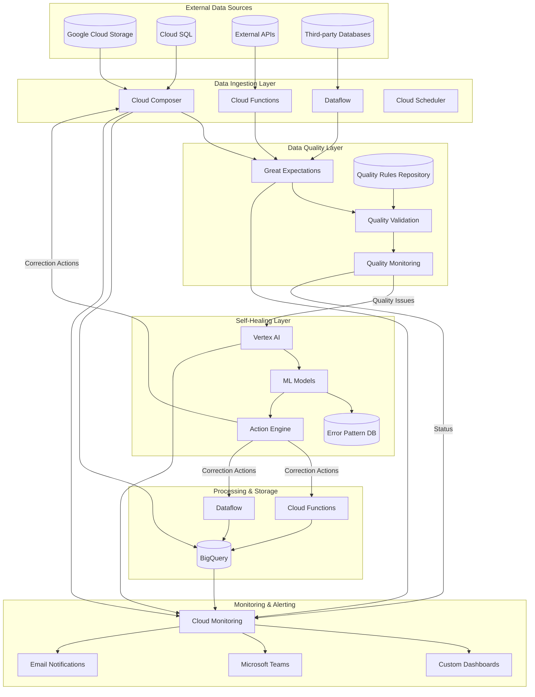

# Self-Healing Data Pipeline: Architecture Overview

## Introduction

The self-healing data pipeline is an end-to-end solution designed to address the challenges of data pipeline reliability through AI-driven automation and intelligent monitoring. This document provides a comprehensive overview of the system architecture, explaining how the various components work together to create a robust, scalable, and autonomous data pipeline.

### Purpose and Vision

Modern data-driven organizations require robust, reliable data pipelines to support critical analytics and business intelligence workflows. As data volumes grow and sources diversify, traditional pipeline management approaches become unsustainable, leading to significant challenges:

- Frequent pipeline failures requiring manual intervention
- Time-consuming error resolution processes
- Data quality issues affecting downstream analytics
- Reactive rather than proactive management
- High operational overhead for maintenance

The self-healing data pipeline addresses these challenges by creating an intelligent system that can:

- Automatically detect and diagnose issues
- Apply corrections with minimal human intervention
- Continuously learn and improve from experience
- Provide comprehensive visibility into pipeline health
- Optimize performance and resource utilization

By combining cloud-native services with AI-driven automation, the system aims to reduce manual intervention by 80%, improve data reliability, minimize pipeline downtime, and enable faster, more reliable business insights.

### Key Architectural Principles

The architecture is built on several foundational principles:

- **Modularity**: Clear separation of concerns with well-defined interfaces between components
- **Resilience**: Multiple layers of error detection, handling, and recovery
- **Intelligence**: AI/ML capabilities embedded throughout for autonomous operation
- **Observability**: Comprehensive monitoring and visibility at all levels
- **Scalability**: Ability to handle growing data volumes and complexity
- **Security**: Defense-in-depth approach to protect data and systems
- **Extensibility**: Flexible design that can adapt to evolving requirements

### Technology Foundation

The self-healing data pipeline is built on Google Cloud Platform, leveraging managed services to minimize operational overhead:

- **Google Cloud Storage**: For data lake storage and staging
- **BigQuery**: As the core data warehouse
- **Cloud Composer**: For workflow orchestration (based on Apache Airflow) // Google Cloud Composer, version 2.x
- **Vertex AI**: For machine learning and AI capabilities // Google Vertex AI, version latest
- **Cloud Functions**: For serverless event-driven processing
- **Cloud Monitoring**: For comprehensive observability

These services are complemented by open-source technologies:

- **Great Expectations**: For data validation // Great Expectations, version 0.15.x
- **TensorFlow**: For machine learning models
- **Python**: As the primary programming language

This combination of managed services and open-source technologies provides a robust foundation for the self-healing capabilities of the pipeline.

## System Architecture Overview

The self-healing data pipeline follows a modular, microservices-oriented architecture with distinct components that work together to create an end-to-end solution.

### High-Level Architecture

The architecture consists of six main layers, each with specific responsibilities in the data pipeline:

### Core Components

The self-healing data pipeline consists of five core components:

1. **Data Ingestion Layer**: Responsible for extracting data from various sources and preparing it for processing. This layer handles connections to different source systems, manages extraction logic, and ensures reliable data movement.

2. **Data Quality Layer**: Validates data against defined expectations and detects quality issues. This layer applies schema validation, content checks, relationship validation, and statistical analysis to ensure data meets quality standards.

3. **Self-Healing Layer**: The intelligent core that automatically detects, diagnoses, and resolves issues. This layer uses AI/ML to analyze problems, determine appropriate corrections, and apply fixes with minimal human intervention.

4. **Processing & Storage Layer**: Handles data transformation, loading, and storage in BigQuery. This layer manages the efficient processing of data and ensures it's properly stored for analytics.

5. **Monitoring & Alerting Layer**: Provides comprehensive visibility into pipeline health and performance. This layer collects metrics, detects anomalies, generates alerts, and visualizes system status.

Each component is designed to be modular, with well-defined interfaces that enable independent development, testing, and scaling while maintaining cohesive system behavior.

### Data Flow

The end-to-end data flow through the pipeline follows these steps:

1. **Data Extraction**: Data is extracted from source systems (GCS, Cloud SQL, APIs, etc.) using the appropriate connectors in the ingestion layer.

2. **Data Staging**: Extracted data is staged in Cloud Storage in a standardized format for further processing.

3. **Quality Validation**: The data quality layer validates the staged data against defined expectations, checking for schema consistency, null values, anomalies, and referential integrity.

4. **Issue Detection**: Quality issues are identified and classified based on severity and type.

5. **Self-Healing**: The self-healing layer analyzes detected issues, determines appropriate corrections, and applies fixes when confidence is high enough.

6. **Transformation & Loading**: Validated (and potentially corrected) data is transformed as needed and loaded into BigQuery tables.

7. **Monitoring & Alerting**: Throughout the process, the monitoring layer collects metrics, detects anomalies, and generates alerts when necessary.

This flow is orchestrated by Cloud Composer (Apache Airflow), which manages the dependencies between steps and ensures reliable execution.

### Key Interfaces

The components interact through well-defined interfaces:

- **Ingestion to Quality**: Staged data and metadata passed for validation
- **Quality to Self-Healing**: Quality issues sent for analysis and correction
- **Self-Healing to Ingestion/Processing**: Correction actions applied to pipeline components
- **All Components to Monitoring**: Metrics and events published for monitoring

These interfaces use a combination of:
- Event-based communication through Pub/Sub
- Shared storage in Cloud Storage and BigQuery
- Direct API calls between services
- Metadata exchange through Firestore

The well-defined interfaces enable loose coupling between components, allowing them to evolve independently while maintaining system cohesion.

## Data Ingestion Layer

The Data Ingestion Layer is responsible for extracting data from various source systems and preparing it for processing in the pipeline. It provides a unified framework for connecting to different data sources while handling the complexities of various protocols, formats, and authentication methods.

### Key Capabilities

The Data Ingestion Layer provides several key capabilities:

- **Multi-source connectivity**: Support for GCS, Cloud SQL, external APIs, and third-party databases
- **Format flexibility**: Handling of various file formats (CSV, JSON, Avro, Parquet, etc.)
- **Incremental extraction**: Efficient extraction of only changed data where applicable
- **Metadata tracking**: Comprehensive capture of source and extraction metadata
- **Error resilience**: Robust error handling with retry mechanisms
- **Orchestration**: Coordination of extraction workflows with dependencies

These capabilities ensure reliable data extraction from diverse sources while minimizing impact on source systems and providing comprehensive tracking of the extraction process.

### Component Architecture

The ingestion layer consists of several key components:

- **Connector Framework**: Standardized interfaces for different data sources
- **Extraction Services**: Specialized components for different extraction patterns
- **Orchestration Layer**: Coordination of extraction workflows using Cloud Composer
- **Metadata Management**: Tracking of source and extraction metadata
- **Error Handling**: Management of extraction errors and retries
- **Data Landing**: Staging and normalization of extracted data

These components work together to provide a flexible, extensible framework for data ingestion that can adapt to different source systems and extraction requirements.

For more details, see [Data Ingestion Architecture](data-ingestion.md).

### Integration Points

The Data Ingestion Layer integrates with other components of the pipeline:

- **Data Quality Layer**: Provides extracted data for validation
- **Self-Healing Layer**: Receives correction actions for extraction issues
- **Monitoring Layer**: Publishes metrics and events for monitoring
- **External Systems**: Connects to source systems for data extraction

These integration points enable the ingestion layer to participate in the self-healing capabilities of the pipeline, with extraction issues automatically detected and corrected when possible.

## Data Quality Layer

The Data Quality Layer validates data against defined expectations and detects quality issues that may require correction. It provides a comprehensive framework for ensuring data meets quality standards before proceeding to further processing.

### Key Capabilities

The Data Quality Layer provides several key capabilities:

- **Schema validation**: Verification of data structure against expected schemas
- **Content validation**: Checking for null values, format issues, and value constraints
- **Relationship validation**: Verification of referential integrity and relationships
- **Statistical validation**: Detection of anomalies and pattern deviations
- **Quality scoring**: Quantification of data quality across multiple dimensions
- **Issue detection**: Identification and classification of quality problems

These capabilities ensure comprehensive validation of data quality, with issues detected and classified for potential self-healing.

### Component Architecture

The quality layer consists of several key components:

- **Validation Rule Engine**: Management of validation rules and expectations
- **Execution Engine**: Optimization and execution of validation against datasets
- **Validators**: Specialized components for different validation types
- **Quality Scorer**: Calculation of quality scores from validation results
- **Issue Detector**: Identification and classification of quality issues
- **Integration Layer**: Connection with self-healing and monitoring systems

These components leverage Great Expectations as the core validation framework, extended with custom capabilities for the specific needs of the self-healing pipeline.

For more details, see [Data Quality Architecture](data-quality.md).

### Integration Points

The Data Quality Layer integrates with other components of the pipeline:

- **Data Ingestion Layer**: Receives data for validation
- **Self-Healing Layer**: Sends quality issues for analysis and correction
- **Monitoring Layer**: Publishes quality metrics and validation results
- **Processing Layer**: Provides validation status for data processing decisions

These integration points enable the quality layer to trigger self-healing actions when quality issues are detected, creating a feedback loop that continuously improves data quality.

## Self-Healing Layer

The Self-Healing Layer is the intelligent core of the pipeline, automatically detecting, diagnosing, and resolving issues with minimal human intervention. It leverages AI/ML to analyze problems, determine appropriate corrections, and apply fixes to maintain pipeline reliability.

### Key Capabilities

The Self-Healing Layer provides several key capabilities:

- **Issue classification**: Categorization of problems based on type and characteristics
- **Root cause analysis**: Determination of underlying causes for issues
- **Pattern recognition**: Identification of recurring patterns in issues and resolutions
- **Correction selection**: Choice of appropriate healing actions based on context
- **Automated remediation**: Application of fixes with confidence-based automation
- **Continuous learning**: Improvement of healing capabilities through feedback

These capabilities enable the pipeline to autonomously recover from many common issues, reducing the need for manual intervention and improving overall reliability.

### Component Architecture

The self-healing layer consists of several key components:

- **AI Analysis Layer**: Classifies issues, determines root causes, and recognizes patterns
- **Decision Engine**: Selects resolution strategies and determines execution paths
- **Resolution Engine**: Executes corrections and adjustments to resolve issues
- **Learning & Improvement**: Collects feedback and improves healing capabilities
- **Knowledge Base**: Stores patterns, strategies, and historical outcomes

These components leverage Vertex AI for model training and serving, with specialized models for different types of issues and corrections.

For more details, see [Self-Healing Architecture](self-healing.md).

### Integration Points

The Self-Healing Layer integrates with other components of the pipeline:

- **Data Quality Layer**: Receives quality issues for analysis and correction
- **Data Ingestion Layer**: Applies corrections to extraction processes
- **Processing Layer**: Adjusts processing parameters and configurations
- **Monitoring Layer**: Receives anomaly alerts and publishes healing metrics

These integration points enable the self-healing layer to receive issues from multiple sources and apply corrections across different components of the pipeline, creating a comprehensive self-healing capability.

### Risk Management

The self-healing capabilities include robust risk management to ensure safe operation:

- **Confidence thresholds**: Actions only automated when confidence is high enough
- **Impact assessment**: Evaluation of potential risks before automated actions
- **Approval workflows**: Human review for significant or lower-confidence actions
- **Rollback capabilities**: Ability to revert changes if errors occur
- **Audit trails**: Full logging of all automated corrections

## Monitoring and Alerting Layer

The Monitoring and Alerting Layer provides comprehensive visibility into pipeline health, performance, and behavior. It enables proactive issue detection, intelligent alerting, and supports the self-healing capabilities of the pipeline through anomaly detection and alerting.

### Key Capabilities

The Monitoring and Alerting Layer provides several key capabilities:

- **Metric collection**: Gathering of metrics from all pipeline components
- **Anomaly detection**: Machine learning models to detect pipeline execution anomalies.
- **Alert management**: Generation, correlation, and routing of alerts
- **Visualization**: Real-time dashboards and monitoring of pipeline health.
- **Notification**: Real-time alerts via Microsoft Teams and Email.
- **Root Cause Analysis**: Automated analysis to identify root causes of pipeline failures.

These capabilities ensure comprehensive visibility into pipeline operations, with proactive detection of potential issues before they impact business operations.

### Component Architecture

The monitoring layer consists of several key components:

- **Cloud Monitoring Integration**: Comprehensive monitoring using Google Cloud Monitoring.
- **Microsoft Teams Notification System**: Real-time alerts via Microsoft Teams for pipeline events.
- **Email Alert System**: Configurable email alerts for pipeline events and issues.
- **Root Cause Analysis Engine**: Automated analysis to identify root causes of pipeline failures.

For more details, see [Monitoring Architecture](monitoring.md).

### Integration Points

The Monitoring Layer integrates with other components of the pipeline:

- **All Pipeline Components**: Collects metrics and events from all components
- **Self-Healing Layer**: Sends anomaly alerts for potential healing actions
- **External Systems**: Delivers notifications to Microsoft Teams and Email Systems

## Processing and Storage Layer

The Processing and Storage Layer handles data transformation, loading, and storage in BigQuery. It ensures efficient processing of data and proper organization in the data warehouse for analytics.

### Key Capabilities

The Processing and Storage Layer provides several key capabilities:

- **Data transformation**: Conversion of data to required formats and structures
- **Data loading**: Efficient loading of data into BigQuery tables
- **Schema management**: Handling of schema evolution and compatibility
- **Partitioning and clustering**: Implementation of optimal BigQuery table partitioning and clustering.
- **Data lifecycle management**: Policies for retention, archiving, and deletion
- **Query optimization**: Automated query analysis and optimization for BigQuery.

These capabilities ensure that data is properly processed, stored, and optimized for analytical queries in BigQuery.

### BigQuery Implementation

BigQuery serves as the core data warehouse for the pipeline, with several key implementation aspects:

- Partitioning by ingestion time for time-series data
- Clustering on frequently filtered columns
- Data retention policies aligned with business requirements

### Performance Optimization

The layer includes several performance optimization techniques:

- Automated query analysis and optimization for BigQuery.
- Implementation of optimal BigQuery table partitioning and clustering.

## Cross-Cutting Concerns

Several concerns cut across all components of the self-healing data pipeline, requiring consistent approaches throughout the architecture.

### Security Architecture

The security architecture follows a defense-in-depth approach:

- Secure credential management for data sources
- Data encryption in transit and at rest
- Least privilege access principles
- Handling of sensitive data during validation
- Access controls for quality metrics
- Audit trails for data quality verification
- Protection of alert channels
- Prevention of sensitive data in alerts
- Authorization for query and table modifications
- Cost control mechanisms
- Resource utilization monitoring

### Scalability and Performance

The architecture is designed for scalability and performance:

- Handle growing data volumes with linear scaling
- Support increasing number of data sources
- Maintain performance with larger datasets
- Scale validation with data volume growth
- Performance optimization for large-scale validation
- Parallelization of quality checks
- Scale AI models with increasing use cases
- Maintain correction performance at scale
- Resource optimization for prediction models
- Handle increasing metric volume
- Alert consolidation to prevent flooding
- Scalable log analysis for root cause identification
- Optimization techniques for larger datasets
- Partitioning strategies for growing tables
- Resource allocation for increasing query complexity

### Disaster Recovery

The disaster recovery strategy employs a tiered approach with increasing recovery times based on failure scope. For component and zone failures, automated recovery mechanisms provide near-zero downtime. For region-level failures, a documented manual failover process ensures business continuity.

## Deployment Model

The self-healing data pipeline follows a cloud-native deployment model leveraging Google Cloud Platform services.

### Environment Strategy

The pipeline supports multiple environments:

- Development: For feature development and testing
- Staging: For integration testing and validation
- Production: For business operations

Each environment has isolated resources and configurations, with promotion paths for code, configuration, and models. This separation ensures changes can be thoroughly tested before affecting production systems.

### Infrastructure as Code

All infrastructure is defined and deployed using Terraform:

- Resource Definitions: Declarative specification of all GCP resources
- Module Structure: Reusable components for different environments
- State Management: Centralized state with locking
- CI Integration: Automated validation and planning

### CI/CD Pipeline

The continuous integration and deployment pipeline automates testing and deployment:

- Source Control: All code and configuration in version control
- Automated Testing: Unit and integration testing
- Static Analysis: Code quality and security scanning
- Artifact Generation: Creation of deployable artifacts

## Future Extensibility

The self-healing data pipeline architecture is designed for future enhancement and extension, with several potential areas for expansion.

### Advanced AI Capabilities

Future AI enhancements may include:

- Generative AI: Using large language models for complex healing
- Reinforcement Learning: Optimizing healing strategies through experience
- Explainable AI: Better explanations of healing decisions

### Additional Data Sources

The pipeline can be extended to support additional data sources:

- Streaming Data: Real-time data from streaming sources
- NoSQL Databases: Document, key-value, and graph databases
- SaaS Applications: Integration with more SaaS platforms

### Enhanced Self-Healing Domains

The self-healing capabilities can be extended to new domains:

- Data Governance: Automated compliance and policy enforcement
- Cost Optimization: Intelligent resource and cost management
- Security Healing: Automated response to security issues

### Integration Expansion

Additional integration capabilities may include:

- Data Catalogs: Integration with data discovery and governance tools
- BI Platforms: Direct feeds to business intelligence systems
- ML Platforms: Support for model training and deployment pipelines

## Conclusion

The self-healing data pipeline provides a comprehensive solution for reliable, efficient data processing with minimal manual intervention. By combining cloud-native services with AI-driven automation, the system addresses the challenges of traditional data pipelines and enables organizations to focus on deriving value from their data rather than maintaining infrastructure.

Key strengths of the architecture include:

- End-to-End Integration: Seamless flow from data sources to BigQuery
- Intelligent Automation: AI-driven self-healing throughout the pipeline
- Comprehensive Monitoring: Complete visibility into pipeline health and performance
- Scalable Design: Ability to handle growing data volumes and complexity
- Operational Efficiency: Reduced manual effort through automation
- Future-Ready: Extensible architecture that can evolve with needs

By implementing this architecture, organizations can achieve more reliable data pipelines, higher data quality, reduced operational costs, and faster time to insight from their data assets.

## References

- [Data Ingestion Architecture](data-ingestion.md)
- [Data Quality Architecture](data-quality.md)
- [Self-Healing Architecture](self-healing.md)
- [Monitoring Architecture](monitoring.md)
- [Google Cloud Platform Documentation](https://cloud.google.com/docs) // Google Cloud Platform, version latest
- [BigQuery Documentation](https://cloud.google.com/bigquery/docs) // Google BigQuery, version latest
- [Cloud Composer Documentation](https://cloud.google.com/composer/docs) // Google Cloud Composer, version 2.x
- [Vertex AI Documentation](https://cloud.google.com/vertex-ai/docs) // Google Vertex AI, version latest
- [Great Expectations Documentation](https://docs.greatexpectations.io/) // Great Expectations, version 0.15.x