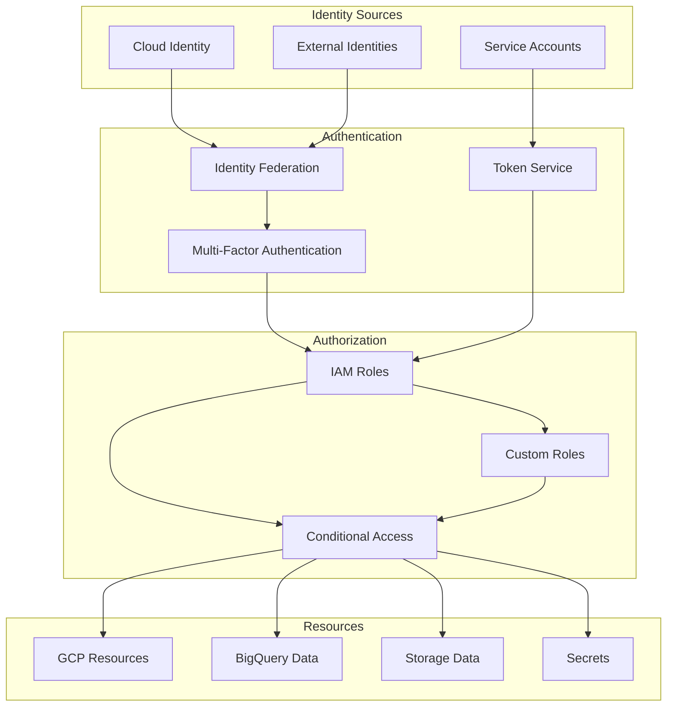

# Self-Healing Data Pipeline: Security Architecture

## Introduction

The security architecture of the self-healing data pipeline implements a comprehensive defense-in-depth approach to protect data, systems, and operations throughout the pipeline lifecycle. This document details the security controls, principles, and implementation across all components of the pipeline, ensuring a robust security posture while enabling the autonomous operation of the system.

Security is a critical cross-cutting concern that affects all aspects of the pipeline, from data ingestion to processing, storage, and monitoring. The architecture addresses security at multiple layers, providing protection against various threats while maintaining compliance with regulatory requirements and organizational policies.

### Security Principles

The security architecture is built on several foundational principles:

- **Defense in Depth**: Multiple layers of security controls to protect against different threats
- **Least Privilege**: Minimal access rights for all identities and components
- **Secure by Default**: Security built into the architecture from the beginning
- **Zero Trust**: Verification of all access attempts regardless of source
- **Data-Centric Security**: Protection focused on the data itself, not just perimeters
- **Continuous Validation**: Ongoing verification of security controls and configurations
- **Automated Response**: Leveraging self-healing capabilities for security issues
- **Comprehensive Visibility**: Complete monitoring and logging of security-relevant events

These principles guide the implementation of security controls throughout the pipeline, ensuring a consistent and robust approach to security.

### Threat Model

The security architecture addresses several key threat vectors:

- **Data Exfiltration**: Unauthorized access to or extraction of sensitive data
- **Unauthorized Access**: Improper access to pipeline components or data
- **Data Corruption**: Malicious or accidental modification of data
- **Service Disruption**: Attacks aimed at disrupting pipeline operations
- **Credential Compromise**: Theft or misuse of authentication credentials
- **Insider Threats**: Malicious actions by authorized users
- **Supply Chain Attacks**: Compromises through dependencies or third parties

The threat model informs the security controls implemented throughout the pipeline, with specific mitigations for each threat vector.

### Security Architecture Overview

The security architecture encompasses several key domains:

- **Identity and Access Management**: Controls for authentication, authorization, and access governance
- **Data Protection**: Encryption, masking, and other data-centric security controls
- **Network Security**: Perimeter protection, segmentation, and secure communication
- **Infrastructure Security**: Secure configuration of cloud resources and services
- **Application Security**: Secure development practices and runtime protection
- **Security Monitoring**: Detection of security events and anomalies
- **Incident Response**: Procedures for handling security incidents
- **Compliance**: Controls to meet regulatory and organizational requirements

Each domain includes specific controls and implementation details tailored to the needs of the self-healing data pipeline.

## Identity and Access Management

Identity and Access Management (IAM) is a foundational component of the security architecture, controlling who can access what resources and under what conditions. The pipeline implements a comprehensive IAM approach that follows the principle of least privilege while enabling the necessary access for automated operations.

### IAM Architecture



The IAM architecture integrates with Google Cloud IAM and implements additional controls specific to the pipeline's needs. It provides a unified approach to managing identities and access across all pipeline components.

### Service Accounts

Service accounts are the primary mechanism for service-to-service authentication within the pipeline:

- **Pipeline Service Account**: Primary service account for pipeline components
  - Granted specific roles for pipeline operations
  - Managed through infrastructure as code
  - Regular key rotation for service account keys

- **Composer Service Account**: Dedicated service account for Cloud Composer
  - Specific roles for workflow orchestration
  - Integration with Workload Identity for Kubernetes

- **Component-Specific Accounts**: Specialized service accounts for specific components
  - Data ingestion service account
  - Quality validation service account
  - Self-healing service account
  - Monitoring service account

- **Workload Identity**: Used for GKE-based components
  - Mapping between Kubernetes service accounts and GCP service accounts
  - Elimination of service account key management

Service accounts are configured with the minimal permissions required for their specific functions, following the principle of least privilege. Regular access reviews ensure that permissions remain appropriate over time.

### Role-Based Access Control

Role-based access control (RBAC) is implemented using Google Cloud IAM roles:

- **Predefined Roles**: Standard GCP roles used where appropriate
  - BigQuery Data Editor for data processing
  - Storage Object Admin for data lake operations
  - Monitoring Viewer for metrics access

- **Custom Roles**: Specialized roles for pipeline-specific needs
  - Pipeline Operator: Monitoring and basic operational tasks
  - Pipeline Administrator: Full control of pipeline configuration
  - Data Quality Manager: Management of quality rules and validation
  - Self-Healing Administrator: Control of self-healing configuration

- **Resource Hierarchy**: Roles applied at appropriate levels
  - Organization-level for broad policies
  - Project-level for project-wide access
  - Resource-level for fine-grained control

- **Role Assignment Process**: Formal process for role assignments
  - Request and approval workflow
  - Regular access reviews
  - Just-in-time access for administrative functions

This RBAC approach ensures that all identities have only the permissions they need for their specific responsibilities, minimizing the potential impact of credential compromise.

### Authentication Controls

The pipeline implements robust authentication controls for all access:

- **Human User Authentication**:
  - Integration with enterprise identity provider
  - Multi-factor authentication requirement
  - Conditional access based on risk factors
  - Session management with appropriate timeouts

- **Service Authentication**:
  - Service account keys with regular rotation
  - Workload Identity for GKE workloads
  - OAuth 2.0 for API authentication
  - Mutual TLS for service-to-service communication

- **External System Authentication**:
  - API keys for simple integrations
  - OAuth client credentials for more complex scenarios
  - IP allowlisting for additional security
  - Rate limiting to prevent abuse

- **Authentication Monitoring**:
  - Logging of all authentication events
  - Alerting on suspicious authentication patterns
  - Regular review of authentication logs
  - Automated response to potential compromises

These authentication controls ensure that only legitimate users and services can access pipeline components, with appropriate verification mechanisms for different access types.

### Access Governance

Access governance ensures that access rights remain appropriate over time:

- **Access Reviews**: Regular review of all access rights
  - Quarterly review of human access
  - Monthly review of service account permissions
  - Automated tools for access review facilitation

- **Privileged Access Management**: Special controls for administrative access
  - Just-in-time access for privileged operations
  - Time-limited elevated permissions
  - Additional approval for critical actions
  - Enhanced monitoring of privileged sessions

- **Separation of Duties**: Prevention of excessive concentration of access
  - Different roles for development, operations, and security
  - Approval workflows for sensitive operations
  - Technical enforcement of separation

- **Access Lifecycle Management**: Comprehensive management of access rights
  - Automated provisioning based on role
  - Prompt deprovisioning when access no longer needed
  - Regular reconciliation of access rights

These governance processes ensure that access rights remain appropriate and minimal throughout the lifecycle of the pipeline and its users.

## Data Protection

Data protection controls safeguard the confidentiality, integrity, and availability of data throughout its lifecycle in the pipeline. These controls focus on protecting the data itself, regardless of where it is stored or processed.

### Data Classification

Data classification provides the foundation for appropriate protection measures:

- **Classification Levels**:
  - Public: Non-sensitive data with no restrictions
  - Internal: Business data with limited distribution
  - Confidential: Sensitive business data requiring protection
  - Restricted: Highly sensitive data with strict controls

- **Classification Process**:
  - Initial classification during data onboarding
  - Metadata tagging for automated handling
  - Regular review and reclassification as needed
  - Classification inheritance for derived data

- **Implementation Mechanisms**:
  - BigQuery column-level security for classification
  - Cloud DLP for automated classification
  - Metadata in Data Catalog for tracking
  - Labels and tags on storage resources

- **Classification Governance**:
  - Data steward responsibility for classification
  - Regular audit of classification accuracy
  - Automated detection of potential misclassification

This classification framework ensures that data receives protection appropriate to its sensitivity throughout the pipeline.

### Encryption Strategy

Comprehensive encryption protects data at rest and in transit:

- **Data at Rest Encryption**:
  - Google-managed encryption by default
  - Customer-managed encryption keys (CMEK) for sensitive data
  - Key rotation every 90 days
  - Separation of duties for key management

- **Data in Transit Encryption**:
  - TLS 1.2+ for all network communication
  - Modern cipher suites with forward secrecy
  - Certificate management through Certificate Authority Service
  - Internal communication over private networks where possible

- **Application-Level Encryption**:
  - Additional encryption for highly sensitive fields
  - Separate key hierarchy for application encryption
  - Encryption before storage for sensitive data
  - Key access limited to specific services

- **Key Management**:
  - Cloud KMS for centralized key management
  - Hardware security module (HSM) protection for critical keys
  - Strict access controls for key operations
  - Comprehensive key usage logging

This encryption strategy ensures that data is protected throughout its lifecycle, with appropriate key management controls to maintain the security of encryption keys.

### Data Masking and Tokenization

Data masking and tokenization protect sensitive data during processing and analysis:

- **Dynamic Data Masking**:
  - Column-level security in BigQuery
  - Role-based masking policies
  - Partial masking for certain roles
  - Full masking for unauthorized users

- **Tokenization**:
  - Replacement of sensitive values with tokens
  - Secure token vault for reference
  - Format-preserving tokenization where needed
  - Consistent tokens for join operations

- **Implementation Approaches**:
  - BigQuery column-level security for structured data
  - Custom masking functions for complex scenarios
  - Data Loss Prevention API for automated detection and masking
  - Tokenization services for high-value identifiers

- **Governance Controls**:
  - Approval process for mask exceptions
  - Audit logging of all access to unmasked data
  - Regular review of masking policies
  - Testing of masking effectiveness

These techniques ensure that sensitive data is protected even during legitimate processing operations, reducing the risk of exposure to unauthorized users.

### Secure Data Handling

Secure data handling practices protect data throughout processing:

- **Data Minimization**:
  - Collection of only necessary data
  - Early filtering of sensitive elements when not needed
  - Aggregation instead of individual records where possible
  - Deletion of intermediate data when no longer needed

- **Secure Processing**:
  - Processing in secure environments
  - Memory protection during processing
  - Secure temporary storage
  - Cleanup of processing artifacts

- **Data Lineage**:
  - Tracking of data origin and transformations
  - Verification of appropriate handling throughout pipeline
  - Audit trail of all data access and modification
  - Lineage visualization for governance

- **Data Lifecycle Management**:
  - Clear retention policies by data type
  - Automated enforcement of retention
  - Secure deletion when retention period ends
  - Legal hold process for exceptions

These practices ensure that data is handled securely throughout its lifecycle in the pipeline, from ingestion through processing to eventual deletion.

### Backup and Recovery

Backup and recovery controls ensure data availability and integrity:

- **Backup Strategy**:
  - Regular backups of critical data
  - Point-in-time recovery capabilities
  - Immutable backups for protection against ransomware
  - Backup encryption with separate keys

- **Recovery Procedures**:
  - Documented recovery processes
  - Regular recovery testing
  - Recovery time objectives (RTO) by data criticality
  - Recovery point objectives (RPO) by data criticality

- **Backup Protection**:
  - Access controls for backup systems
  - Encryption of backup data
  - Secure offsite storage
  - Regular validation of backup integrity

- **Disaster Recovery**:
  - Cross-region replication for critical data
  - Failover procedures for regional outages
  - Regular disaster recovery exercises
  - Documentation and training for recovery scenarios

These controls ensure that data can be recovered in case of accidental deletion, corruption, or disaster, maintaining the availability and integrity of pipeline data.

## Network Security

Network security controls protect the communication between pipeline components and with external systems, preventing unauthorized access and data exfiltration.

### Network Architecture

```mermaid
flowchart TD
    subgraph "External Networks"
        Internet[Internet]
        Corporate[Corporate Network]
    end
    
    subgraph "Google Cloud"
        subgraph "VPC Network"
            subgraph "Service Perimeter"
                BQ[BigQuery]
                GCS[Cloud Storage]
                Secrets[Secret Manager]
            end
            
            Composer[Cloud Composer]
            Functions[Cloud Functions]
            GKE[GKE Clusters]
            
            PrivateLink[Private Service Connect]
        end
        
        GCLB[Cloud Load Balancing]
        IAP[Identity-Aware Proxy]
        Armor[Cloud Armor]
    end
    
    Internet --> Armor
    Armor --> GCLB
    GCLB --> IAP
    IAP --> Functions
    
    Corporate --> PrivateLink
    PrivateLink --> VPC
    
    Functions --> Service Perimeter
    Composer --> Service Perimeter
    GKE --> Service Perimeter
```

The network architecture implements a defense-in-depth approach with multiple layers of protection, including perimeter security, network segmentation, and secure communication channels.

### VPC Service Controls

VPC Service Controls create a security perimeter around sensitive services:

- **Service Perimeter Configuration**:
  - Perimeter around BigQuery, Cloud Storage, and other data services
  - Controlled ingress and egress
  - Access context-based restrictions
  - Integration with Identity and Access Management

- **Access Levels**:
  - IP-based access restrictions
  - Device-based access policies
  - User identity conditions
  - Time-based restrictions

- **Perimeter Bridges**:
  - Controlled communication between perimeters
  - Specific service and project allowlisting
  - Audit logging of cross-perimeter access

- **Implementation Details**:
  - Production environment with strict perimeter
  - Development with more permissive settings
  - Regular testing of perimeter effectiveness
  - Monitoring for perimeter violations

VPC Service Controls provide a critical defense against data exfiltration by creating a security boundary around sensitive data services.

### Private Connectivity

Private connectivity ensures that traffic remains on Google's network:

- **Private Service Access**:
  - Private connectivity to Google services
  - No exposure to public internet
  - Service-specific connection configurations
  - Reduced attack surface

- **VPC Network Peering**:
  - Private connectivity between VPC networks
  - Secure multi-project communication
  - Traffic isolation from public internet
  - Controlled routing between networks

- **Private Google Access**:
  - Access to Google APIs without public IP addresses
  - Secure access from internal resources
  - Reduced exposure to internet threats

- **Cloud Interconnect/VPN**:
  - Secure connectivity to on-premises networks
  - Encrypted tunnels for data in transit
  - Redundant connections for availability
  - Bandwidth management for performance

Private connectivity ensures that traffic between pipeline components and with Google services remains on Google's private network, reducing exposure to internet-based threats.

### Firewall and Access Controls

Firewall and access controls restrict network traffic:

- **VPC Firewall Rules**:
  - Default-deny posture with explicit allows
  - Service-specific rule sets
  - Tag-based and service account-based rules
  - Regular review and cleanup of rules

- **Cloud Armor**:
  - Web application firewall protection
  - DDoS mitigation
  - IP-based access controls
  - Rate limiting for API endpoints

- **Identity-Aware Proxy (IAP)**:
  - Identity-based access to applications and VMs
  - Central authentication and authorization
  - Elimination of VPN requirements
  - Detailed access logging

- **Load Balancer Security**:
  - SSL termination with modern cipher suites
  - Certificate management
  - HTTP to HTTPS redirection
  - Backend service authentication

These controls restrict network traffic to legitimate sources and destinations, preventing unauthorized access and protecting against network-based attacks.

### Network Monitoring

Network monitoring provides visibility into network traffic and potential threats:

- **VPC Flow Logs**:
  - Logging of network flows for analysis
  - Traffic pattern monitoring
  - Anomaly detection
  - Forensic capabilities

- **Network Intelligence Center**:
  - Network topology visualization
  - Performance monitoring
  - Connectivity testing
  - Firewall insights

- **Security Command Center**:
  - Threat detection for network traffic
  - Vulnerability identification
  - Security posture monitoring
  - Compliance reporting

- **Custom Monitoring**:
  - Traffic volume baselines and alerting
  - Connection attempt monitoring
  - Geo-location anomaly detection
  - Integration with SIEM systems

Network monitoring provides visibility into network traffic patterns and potential security issues, enabling rapid detection and response to network-based threats.

## Infrastructure Security

Infrastructure security controls ensure the secure configuration and operation of the cloud resources that support the pipeline.

### Secure Configuration

Secure configuration practices ensure that infrastructure components are deployed securely:

- **Infrastructure as Code**:
  - Terraform definitions for all infrastructure
  - Version-controlled configuration
  - Peer review process for changes
  - Automated validation of security configurations

- **Security Baselines**:
  - Hardened configuration templates
  - CIS benchmark alignment
  - Regular baseline updates
  - Compliance validation

- **Configuration Management**:
  - Centralized configuration repository
  - Change management process
  - Configuration drift detection
  - Automated remediation of drift

- **Least Privilege Configuration**:
  - Minimal service enablement
  - Default-deny security posture
  - Just-enough access for operations
  - Regular review of enabled services

Secure configuration ensures that infrastructure components are deployed with security best practices and maintained in a secure state throughout their lifecycle.

### Secret Management

Secret management controls protect sensitive configuration values:

- **Secret Manager Implementation**:
  - Centralized storage for all secrets
  - Encryption of secret values
  - Version control for secrets
  - Automatic rotation for supported secrets

- **Access Controls**:
  - Fine-grained IAM permissions for secrets
  - Audit logging of all secret access
  - Separation of duties for secret administration
  - Just-in-time access for sensitive secrets

- **Secret Types Managed**:
  - API keys and credentials
  - Database connection strings
  - Encryption keys and certificates
  - Authentication tokens

- **Integration Patterns**:
  - Runtime secret access by applications
  - CI/CD pipeline integration
  - Rotation hooks for automated updates
  - Secret injection into environments

Secret management ensures that sensitive configuration values are securely stored, accessed only by authorized services, and properly rotated to maintain security.

### Container Security

Container security controls protect containerized components of the pipeline:

- **Image Security**:
  - Base image security scanning
  - Vulnerability scanning in CI/CD
  - Signed images with Binary Authorization
  - Minimal base images to reduce attack surface

- **Runtime Security**:
  - Pod security policies in GKE
  - Workload identity for authentication
  - Network policy enforcement
  - Runtime vulnerability scanning

- **Orchestration Security**:
  - Private GKE clusters
  - Node auto-upgrade
  - Control plane security
  - Authorized networks for API server

- **Supply Chain Security**:
  - Verified image sources
  - Dependency scanning
  - Software bill of materials (SBOM)
  - Artifact provenance verification

Container security ensures that containerized components of the pipeline are built, deployed, and run securely, with protection against common container security threats.

### Compute Security

Compute security controls protect the compute resources used by the pipeline:

- **Cloud Functions Security**:
  - Minimal IAM permissions
  - Private networking where possible
  - Environment variable encryption
  - Regular updates and patching

- **Cloud Composer Security**:
  - Private IP configuration
  - Secure Airflow configuration
  - Web server authentication
  - Environment-level access controls

- **VM Security** (where applicable):
  - OS hardening and minimal installations
  - Regular patching and updates
  - Boot disk encryption
  - Shielded VM features

- **Serverless Security**:
  - Service perimeter protection
  - Minimal service account permissions
  - Secure configuration of triggers
  - Logging and monitoring integration

Compute security ensures that the various compute resources used by the pipeline are configured securely and protected against common threats.

### Storage Security

Storage security controls protect data stored in various storage services:

- **Cloud Storage Security**:
  - Bucket-level access controls
  - Object-level ACLs where needed
  - Uniform bucket-level access
  - Public access prevention

- **BigQuery Security**:
  - Dataset-level access controls
  - Table and view-level permissions
  - Column-level security for sensitive data
  - Row-level security where needed

- **Database Security** (where applicable):
  - Private connectivity
  - Strong authentication
  - Encrypted connections
  - Automated backups

- **Shared Security Controls**:
  - Encryption at rest
  - Access logging
  - Retention policies
  - Secure deletion practices

Storage security ensures that data stored in various storage services is protected against unauthorized access, with appropriate access controls and encryption.

## Application Security

Application security controls ensure that the custom code and applications within the pipeline are developed and operated securely.

### Secure Development Practices

Secure development practices ensure that security is built into the pipeline code:

- **Secure Coding Standards**:
  - Language-specific security guidelines
  - Code review checklists for security
  - Common vulnerability prevention
  - Regular training for developers

- **Security Testing**:
  - Static application security testing (SAST)
  - Software composition analysis (SCA)
  - Dynamic application security testing (DAST)
  - Interactive application security testing (IAST)

- **CI/CD Security Integration**:
  - Automated security scanning in pipelines
  - Security gates for deployment
  - Vulnerability tracking and remediation
  - Secure build and deployment processes

- **Code Repository Security**:
  - Access controls for repositories
  - Branch protection rules
  - Secret scanning in code
  - Signed commits for authenticity

Secure development practices ensure that security vulnerabilities are prevented, detected, and remediated throughout the development lifecycle.

### API Security

API security controls protect the APIs exposed by the pipeline:

- **Authentication and Authorization**:
  - OAuth 2.0 for authentication
  - Scoped access tokens
  - Role-based access control
  - Token validation and management

- **API Gateway Protection**:
  - Request validation
  - Rate limiting and quotas
  - IP allowlisting where appropriate
  - DDoS protection

- **Input Validation**:
  - Schema validation for requests
  - Parameter sanitization
  - Content type validation
  - Protection against injection attacks

- **API Monitoring**:
  - Usage monitoring and anomaly detection
  - Error rate tracking
  - Security-focused logging
  - Abuse detection

API security ensures that the interfaces exposed by the pipeline are protected against common API security threats and accessed only by authorized clients.

### Dependency Management

Dependency management controls address supply chain security risks:

- **Dependency Scanning**:
  - Automated scanning for vulnerabilities
  - License compliance checking
  - Known malicious package detection
  - Regular rescanning of dependencies

- **Dependency Update Process**:
  - Regular updates of dependencies
  - Automated update PRs with security fixes
  - Testing of updates before deployment
  - Emergency process for critical vulnerabilities

- **Dependency Governance**:
  - Approved dependency sources
  - Versioning policy for dependencies
  - Pinned versions for reproducibility
  - Dependency inventory and tracking

- **Build Process Security**:
  - Verified build tools and environments
  - Reproducible builds
  - Artifact signing and verification
  - Secure artifact storage

Dependency management ensures that the third-party code used by the pipeline is secure and properly maintained, reducing supply chain security risks.

### Runtime Protection

Runtime protection controls secure the pipeline during operation:

- **Runtime Application Self-Protection (RASP)**:
  - Real-time attack detection and prevention
  - Context-aware security controls
  - Protection against known attack patterns
  - Integration with monitoring systems

- **Function Security**:
  - Input validation for all functions
  - Output encoding to prevent injection
  - Error handling that doesn't leak information
  - Resource constraints to prevent DoS

- **Memory Safety**:
  - Protection against buffer overflows
  - Safe memory management practices
  - Use of memory-safe languages where possible
  - Regular security patching

- **Execution Environment Security**:
  - Minimal execution permissions
  - Environment isolation
  - Secure configuration of runtime
  - Regular updates and patching

Runtime protection ensures that the pipeline components are protected against attacks during operation, with real-time detection and prevention of common attack patterns.

### Self-Healing Security

Self-healing security leverages the pipeline's autonomous capabilities for security:

- **Security Issue Detection**:
  - Automated detection of security misconfigurations
  - Vulnerability identification in runtime
  - Anomalous behavior detection
  - Compliance drift identification

- **Automated Remediation**:
  - Self-healing for common security issues
  - Automated patching of vulnerabilities
  - Configuration correction
  - Quarantine of suspicious components

- **Security Optimization**:
  - Continuous improvement of security posture
  - Least privilege optimization
  - Unused permission identification
  - Security control effectiveness analysis

- **Implementation Approach**:
  - Integration with self-healing framework
  - Security-specific healing actions
  - Risk-based automation decisions
  - Human approval for high-impact changes

Self-healing security extends the pipeline's autonomous capabilities to security concerns, enabling automated detection and remediation of security issues.

## Security Monitoring and Response

Security monitoring and response capabilities enable the detection, investigation, and remediation of security incidents affecting the pipeline.

### Security Monitoring Architecture

```mermaid
flowchart TD
    subgraph "Log Sources"
        AuditLogs[Audit Logs]
        AppLogs[Application Logs]
        SysLogs[System Logs]
        NetLogs[Network Logs]
    end
    
    subgraph "Collection & Processing"
        LogSink[Log Sink]
        SIEM[SIEM Integration]
        LogAnalytics[Log Analytics]
    end
    
    subgraph "Detection & Analysis"
        Rules[Detection Rules]
        ML[ML-Based Detection]
        Correlation[Event Correlation]
        Enrichment[Threat Intelligence]
    end
    
    subgraph "Response"
        Alerts[Security Alerts]
        Playbooks[Response Playbooks]
        Automation[Automated Response]
        Investigation[Investigation Tools]
    end
    
    AuditLogs --> LogSink
    AppLogs --> LogSink
    SysLogs --> LogSink
    NetLogs --> LogSink
    
    LogSink --> SIEM
    LogSink --> LogAnalytics
    
    SIEM --> Rules
    LogAnalytics --> ML
    Rules --> Correlation
    ML --> Correlation
    Correlation --> Enrichment
    
    Enrichment --> Alerts
    Alerts --> Playbooks
    Alerts --> Automation
    Playbooks --> Investigation