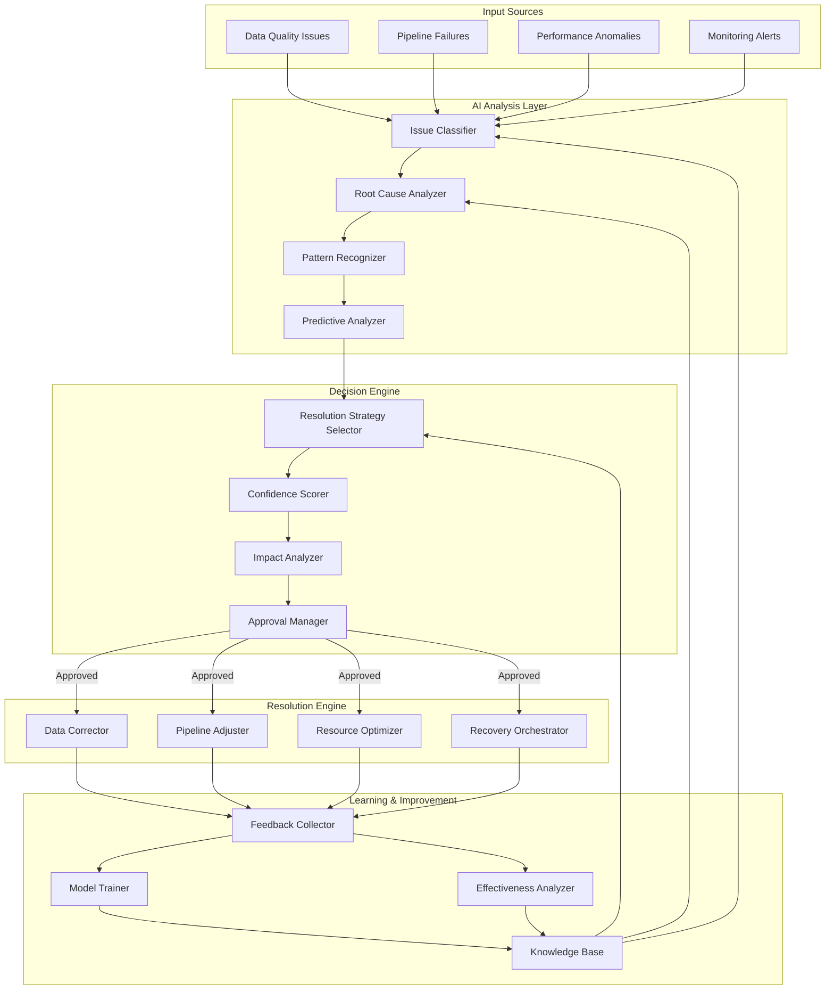
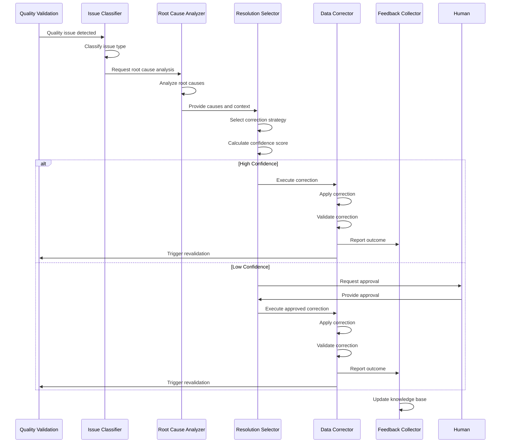
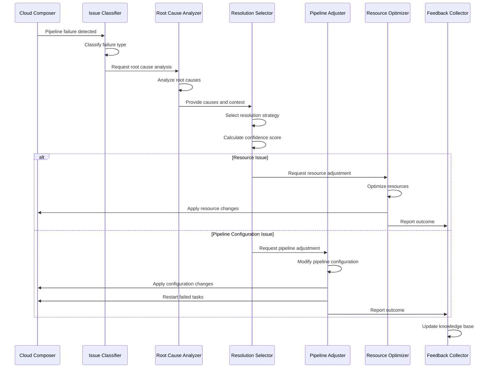
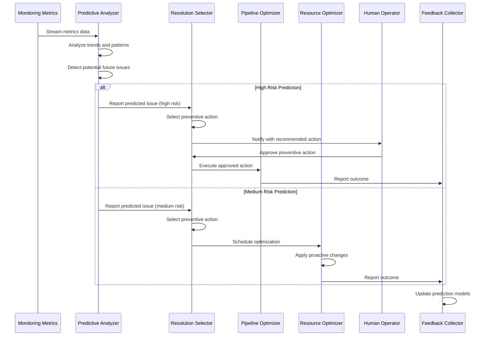
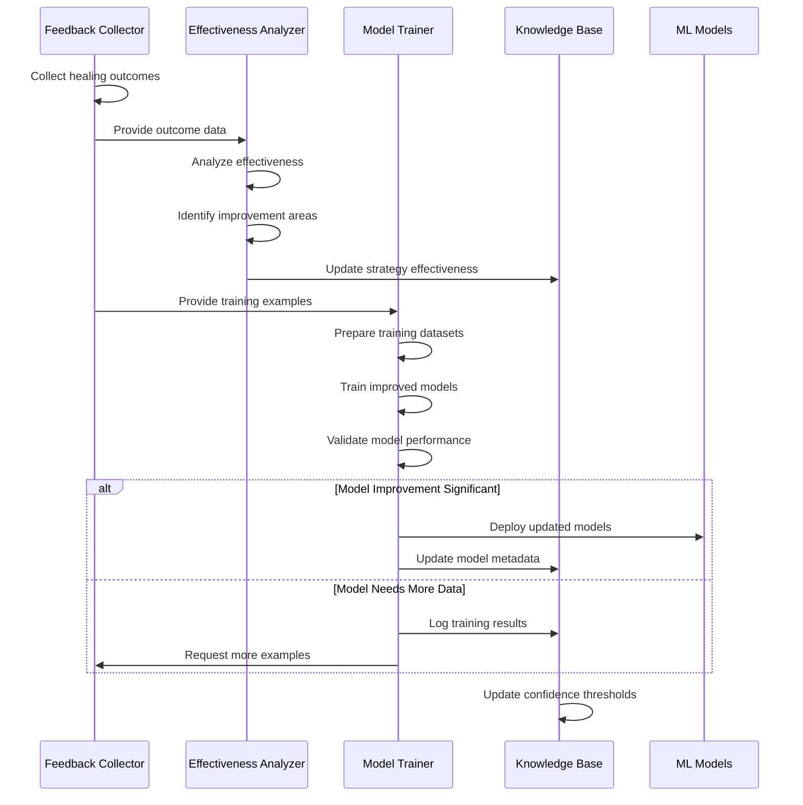

# Self-Healing Data Pipeline: Architecture and Implementation

## Introduction

The self-healing architecture is the intelligent core of the data pipeline, enabling autonomous detection, diagnosis, and resolution of issues with minimal human intervention. This document details the design and implementation of the self-healing capabilities that significantly reduce manual operations and improve pipeline reliability.

### Purpose and Scope

The self-healing architecture serves multiple critical purposes within the data pipeline:

- **Autonomous Issue Resolution**: Automatically detect and fix common data and pipeline issues
- **Reduced Manual Intervention**: Minimize the need for human involvement in routine problem-solving
- **Continuous Improvement**: Learn from past issues to improve future healing capabilities
- **Proactive Prevention**: Predict and prevent potential failures before they impact operations
- **Operational Efficiency**: Reduce mean time to resolution and increase pipeline reliability

This document covers the design principles, component architecture, workflows, and implementation details of the self-healing system, focusing on how AI/ML capabilities are leveraged to create an intelligent, autonomous healing framework.

### Design Principles

The self-healing architecture is built on several key principles:

- **Intelligence-First**: Leverage AI/ML for sophisticated issue detection and resolution
- **Confidence-Based Automation**: Apply automated fixes only when confidence is high enough
- **Continuous Learning**: Improve healing capabilities through feedback loops
- **Explainable Actions**: Provide clear explanations for all automated actions
- **Risk Management**: Implement safeguards to prevent harmful automated actions
- **Human Oversight**: Maintain appropriate human supervision and approval workflows
- **Extensibility**: Support easy addition of new healing capabilities

### Key Capabilities

The self-healing system provides several key capabilities:

- **Issue Classification**: Categorization of problems based on type and characteristics
- **Root Cause Analysis**: Determination of underlying causes for issues
- **Pattern Recognition**: Identification of recurring patterns in issues and resolutions
- **Correction Selection**: Choice of appropriate healing actions based on context
- **Automated Remediation**: Application of fixes with confidence-based automation
- **Continuous Learning**: Improvement of healing capabilities through feedback
- **Predictive Analysis**: Forecasting potential issues before they occur

## Self-Healing Architecture Overview

The self-healing architecture follows a layered approach, with specialized components handling different aspects of the autonomous healing workflow.

### High-Level Architecture Diagram



### Architectural Patterns

The self-healing architecture employs several key patterns:

- **Layered Architecture**: Separation of analysis, decision-making, and execution
- **Event-Driven Processing**: Components communicate through events for loose coupling
- **Feedback Loops**: Healing outcomes feed back into the system to improve future actions
- **Confidence-Based Automation**: Actions automated based on confidence levels
- **Human-in-the-Loop**: Critical or low-confidence actions require human approval
- **Knowledge Base**: Central repository of patterns, strategies, and outcomes

### Integration Points

The self-healing system integrates with several other components of the data pipeline:

- **Data Quality Framework**: Receives quality issues for analysis and correction
- **Pipeline Orchestration**: Applies adjustments to workflow configurations
- **Monitoring System**: Receives anomaly alerts and publishes healing metrics
- **Resource Management**: Optimizes resource allocation based on analysis
- **Notification System**: Sends alerts and approval requests to stakeholders

These integration points enable the self-healing system to receive issues from multiple sources and apply corrections across different components of the pipeline, creating a comprehensive healing capability.

## Core Components

The self-healing architecture consists of five core components, each with specific responsibilities and integration points.

### AI Analysis Layer

**Purpose**: Analyze issues to classify them, determine root causes, and recognize patterns

**Key Technologies**:
- Vertex AI for model training and serving
- TensorFlow for deep learning models
- Custom ML pipelines for specialized analysis

**Components**:

1. **Issue Classifier**: Categorizes issues based on their characteristics
   - Analyzes error messages, logs, and context
   - Classifies issues into categories and subcategories
   - Assigns confidence scores to classifications
   - Maps issues to potential healing actions

2. **Root Cause Analyzer**: Determines underlying causes of issues
   - Builds causality graphs from events and metrics
   - Identifies primary and contributing causes
   - Correlates symptoms with potential root causes
   - Provides confidence scores for identified causes

3. **Pattern Recognizer**: Identifies recurring patterns in issues
   - Matches current issues against historical patterns
   - Calculates similarity scores for pattern matching
   - Identifies trends and recurring problems
   - Suggests proven solutions for recognized patterns

4. **Predictive Analyzer**: Forecasts potential future issues
   - Analyzes trends and patterns to predict failures
   - Estimates time-to-failure for degrading components
   - Identifies risk factors and vulnerable components
   - Suggests preventive actions before failures occur

**Implementation Details**:
- Models are trained on historical pipeline issues and resolutions
- Multiple analysis techniques combined for comprehensive understanding
- Confidence scoring for all analysis results
- Continuous improvement through feedback loops

### Decision Engine

**Purpose**: Determine appropriate healing actions and manage approval workflows

**Key Technologies**:
- Decision tree algorithms
- Reinforcement learning for strategy selection
- Workflow management for approvals

**Components**:

1. **Resolution Strategy Selector**: Chooses optimal healing strategies
   - Evaluates multiple potential solutions
   - Considers context and constraints
   - Ranks strategies by likelihood of success
   - Selects optimal strategy based on multiple factors

2. **Confidence Scorer**: Calculates confidence in proposed actions
   - Combines confidence scores from analysis components
   - Adjusts based on historical success rates
   - Considers context-specific factors
   - Determines automation level based on confidence

3. **Impact Analyzer**: Assesses potential impact of healing actions
   - Evaluates business impact of proposed actions
   - Identifies potential risks and side effects
   - Calculates cost-benefit ratio of actions
   - Flags high-impact actions for additional review

4. **Approval Manager**: Manages approval workflows for actions
   - Routes low-confidence actions for human approval
   - Implements approval workflows based on impact
   - Tracks approval status and timeouts
   - Provides context for human decision-making

**Implementation Details**:
- Configurable confidence thresholds for different action types
- Multi-factor decision making for strategy selection
- Risk assessment for all proposed actions
- Audit trail of all decisions and approvals

### Resolution Engine

**Purpose**: Execute healing actions to resolve identified issues

**Key Technologies**:
- Custom correction libraries
- Cloud Functions for serverless execution
- BigQuery for data corrections
- Cloud Composer API for pipeline adjustments

**Components**:

1. **Data Corrector**: Applies fixes to data quality issues
   - Implements various correction strategies:
     - Missing value imputation
     - Outlier correction
     - Format standardization
     - Schema alignment
     - Data reconstruction
   - Validates corrections before committing
   - Maintains audit trail of all changes
   - Supports rollback if corrections fail validation

2. **Pipeline Adjuster**: Modifies pipeline configurations
   - Adjusts DAG parameters and configurations
   - Implements retry strategies with optimized parameters
   - Modifies task dependencies and scheduling
   - Updates pipeline definitions through API

3. **Resource Optimizer**: Adjusts resource allocations
   - Scales resources up or down as needed
   - Optimizes BigQuery slot allocation
   - Adjusts Composer worker count
   - Implements resource quotas and limits

4. **Recovery Orchestrator**: Coordinates complex recovery actions
   - Manages multi-step recovery processes
   - Coordinates actions across multiple components
   - Implements fallback strategies when needed
   - Ensures consistent state after recovery

**Implementation Details**:
- Modular design with specialized correctors for different issue types
- Validation of all corrections before committing
- Comprehensive logging of all actions
- Rollback capabilities for failed corrections

### Learning & Improvement

**Purpose**: Continuously improve healing capabilities through feedback and learning

**Key Technologies**:
- Vertex AI Training for model updates
- BigQuery for analytics on healing effectiveness
- Firestore for knowledge base storage

**Components**:

1. **Feedback Collector**: Gathers outcomes of healing actions
   - Collects success/failure status of actions
   - Captures metrics on effectiveness
   - Records human feedback on actions
   - Aggregates data for analysis

2. **Model Trainer**: Updates ML models based on feedback
   - Prepares training data from feedback
   - Retrains models with new examples
   - Evaluates model improvements
   - Deploys updated models to production

3. **Effectiveness Analyzer**: Analyzes healing performance
   - Calculates success rates by issue type
   - Identifies areas for improvement
   - Recommends strategy adjustments
   - Generates effectiveness reports

4. **Knowledge Base**: Stores patterns, strategies, and outcomes
   - Maintains catalog of known issues and solutions
   - Updates success rates for strategies
   - Provides lookup for pattern matching
   - Serves as institutional memory for healing

**Implementation Details**:
- Automated feedback collection from all healing actions
- Scheduled model retraining based on new data
- A/B testing of new healing strategies
- Continuous optimization of confidence thresholds

### Healing Modes and Confidence Thresholds

The self-healing system operates in different modes based on confidence levels and risk assessment:

1. **Fully Autonomous Mode**:
   - High confidence actions (typically >90%)
   - Low business impact actions
   - Well-understood issue patterns
   - Automatic execution without human approval
   - Post-execution notification

2. **Semi-Autonomous Mode**:
   - Medium confidence actions (typically 70-90%)
   - Medium business impact actions
   - Less common issue patterns
   - Automatic execution with notification
   - Option for human intervention

3. **Approval-Required Mode**:
   - Lower confidence actions (<70%)
   - High business impact actions
   - Novel or complex issues
   - Requires explicit human approval
   - Provides recommendations and context

4. **Learning Mode**:
   - New issue patterns or strategies
   - Always requires human approval
   - Collects data for model improvement
   - Gradually transitions to other modes as confidence increases

Confidence thresholds are configurable by issue type, action type, and environment, allowing for fine-tuned control over automation levels.

## Self-Healing Workflows

The self-healing system implements several key workflows to address different types of issues and scenarios.

### Data Quality Healing Workflow



The data quality healing workflow addresses issues detected during data validation:

1. **Issue Detection**: Quality validation detects an issue (e.g., missing values, outliers)
2. **Classification**: Issue classifier categorizes the problem and its characteristics
3. **Root Cause Analysis**: Analyzer determines underlying causes of the issue
4. **Strategy Selection**: Resolution selector chooses appropriate correction strategy
5. **Confidence Assessment**: System calculates confidence in the proposed correction
6. **Execution Path**:
   - High confidence: Automatic correction without human intervention
   - Low confidence: Human approval required before correction
7. **Correction Application**: Data corrector applies the selected strategy
8. **Validation**: Corrected data is validated to ensure quality
9. **Feedback**: Results are recorded for learning and improvement
10. **Revalidation**: Quality validation is triggered to verify the fix

This workflow enables autonomous correction of common data quality issues while ensuring appropriate human oversight for complex or uncertain cases.

### Pipeline Failure Healing Workflow



The pipeline failure healing workflow addresses issues in pipeline execution:

1. **Failure Detection**: Cloud Composer reports a pipeline or task failure
2. **Classification**: Issue classifier categorizes the failure type
3. **Root Cause Analysis**: Analyzer determines underlying causes of the failure
4. **Strategy Selection**: Resolution selector chooses appropriate recovery strategy
5. **Execution Path**:
   - Resource issues: Resource optimizer adjusts allocations
   - Configuration issues: Pipeline adjuster modifies parameters
   - Dependency issues: Recovery orchestrator resolves dependencies
6. **Application**: Changes are applied to the pipeline environment
7. **Retry**: Failed tasks are restarted with new configuration
8. **Feedback**: Results are recorded for learning and improvement

This workflow enables automatic recovery from common pipeline failures, reducing downtime and manual intervention.

### Predictive Healing Workflow



The predictive healing workflow proactively addresses potential issues before they cause failures:

1. **Metric Collection**: Monitoring system collects performance metrics
2. **Trend Analysis**: Predictive analyzer identifies concerning trends
3. **Risk Assessment**: System evaluates the risk level of potential issues
4. **Strategy Selection**: Resolution selector chooses preventive actions
5. **Execution Path**:
   - High risk: Human notification with recommended action
   - Medium risk: Scheduled automatic optimization
   - Low risk: Continued monitoring with increased frequency
6. **Preventive Action**: Changes applied to prevent predicted issues
7. **Feedback**: Results recorded to improve prediction accuracy

This workflow enables the system to prevent issues before they impact operations, shifting from reactive to proactive management.

### Learning and Improvement Workflow



The learning and improvement workflow ensures continuous enhancement of healing capabilities:

1. **Feedback Collection**: System gathers outcomes of all healing actions
2. **Effectiveness Analysis**: Analyzer evaluates performance by issue and strategy
3. **Knowledge Update**: Success rates and patterns updated in knowledge base
4. **Model Training**: New examples used to retrain ML models
5. **Performance Validation**: Updated models evaluated against benchmarks
6. **Deployment**: Improved models deployed to production when significant
7. **Threshold Adjustment**: Confidence thresholds refined based on performance

This workflow creates a continuous improvement cycle that enhances the system's ability to autonomously resolve issues over time.

## AI Models and Algorithms

The self-healing system leverages various AI models and algorithms to enable intelligent issue detection, diagnosis, and resolution.

### Issue Classification Models

The issue classification system uses several models to categorize problems:

1. **Text Classification Models**:
   - Deep learning models (BERT-based) for error message analysis
   - Multi-class classification for issue categorization
   - Trained on historical error messages and resolutions
   - Features include error text, stack traces, and context

2. **Multimodal Classification**:
   - Combines textual features with numerical metrics
   - Ensemble approach with specialized models for different issue types
   - Hierarchical classification (category → subcategory → specific issue)
   - Confidence scoring for classification reliability

3. **Implementation Details**:
   - Models trained on labeled dataset of historical issues
   - Regular retraining with new examples from production
   - Model versioning and performance tracking
   - Fallback to rule-based classification for novel issues

These models enable accurate categorization of issues, which is the foundation for selecting appropriate healing strategies.

### Root Cause Analysis Algorithms

Root cause analysis employs several techniques to identify underlying causes:

1. **Causal Graph Analysis**:
   - Directed graph representation of causal relationships
   - Temporal sequence analysis of events
   - Bayesian networks for probabilistic causality
   - Graph traversal to identify root nodes

2. **Pattern-Based Analysis**:
   - Matching current issues against known patterns
   - Similarity scoring for pattern matching
   - Historical success rate consideration
   - Context-aware pattern application

3. **Statistical Correlation**:
   - Time-series correlation of metrics and events
   - Anomaly detection in related metrics
   - Change point detection for identifying triggers
   - Statistical significance testing

4. **Implementation Details**:
   - Hybrid approach combining multiple techniques
   - Confidence scoring for identified causes
   - Explainable results with supporting evidence
   - Continuous learning from feedback

These algorithms enable the system to move beyond symptom treatment to address the underlying causes of issues.

### Correction Strategy Models

The system uses several models to select and apply appropriate corrections:

1. **Strategy Selection Models**:
   - Decision trees for mapping issues to strategies
   - Reinforcement learning for strategy optimization
   - Context-aware selection based on multiple factors
   - Success probability estimation

2. **Data Correction Models**:
   - Specialized models for different correction types:
     - Missing value imputation (regression, kNN, etc.)
     - Outlier correction (statistical, ML-based)
     - Format standardization (rule-based, learned patterns)
     - Schema alignment (mapping models)
   - Validation models to verify corrections

3. **Pipeline Adjustment Models**:
   - Parameter optimization models
   - Resource allocation optimization
   - Scheduling optimization
   - Dependency analysis

4. **Implementation Details**:
   - Strategy models trained on historical correction outcomes
   - Specialized correction models for different data types
   - A/B testing framework for strategy comparison
   - Continuous optimization based on feedback

These models enable intelligent selection and application of healing strategies tailored to specific issues and contexts.

### Predictive Models

Predictive capabilities are implemented through several model types:

1. **Time Series Forecasting**:
   - LSTM networks for sequence prediction
   - ARIMA models for trend analysis
   - Anomaly prediction in metric trends
   - Time-to-failure estimation

2. **Failure Prediction Models**:
   - Classification models for failure risk
   - Regression models for time-to-failure
   - Feature importance analysis for risk factors
   - Confidence intervals for predictions

3. **Resource Utilization Prediction**:
   - Forecasting models for resource needs
   - Bottleneck identification
   - Capacity planning models
   - Seasonal pattern recognition

4. **Implementation Details**:
   - Models trained on historical metrics and failure data
   - Regular retraining with new operational data
   - Prediction horizon optimization
   - Confidence calibration for reliable forecasts

These predictive models enable the system to shift from reactive to proactive management, addressing potential issues before they impact operations.

### Model Training and Deployment

The self-healing system implements a robust approach to model training and deployment:

1. **Training Pipeline**:
   - Automated data collection and preparation
   - Feature engineering pipelines
   - Hyperparameter optimization
   - Cross-validation for performance estimation
   - Model evaluation against benchmarks

2. **Deployment Strategy**:
   - Versioned model registry in Vertex AI
   - Canary deployment for new models
   - A/B testing framework for model comparison
   - Rollback capabilities for problematic models
   - Performance monitoring after deployment

3. **Continuous Improvement**:
   - Automated retraining triggers based on:
     - Performance degradation detection
     - Sufficient new training data
     - Scheduled periodic retraining
   - Model drift detection and mitigation
   - Feedback incorporation from healing outcomes

4. **Implementation Details**:
   - Vertex AI for model training and serving
   - TensorFlow for model development
   - Custom training pipelines for specialized models
   - Comprehensive model metadata and lineage tracking

This approach ensures that the self-healing models continuously improve and adapt to changing patterns and requirements.

## Implementation Details

This section covers the technical implementation details of the self-healing system.

### Technology Stack

The self-healing system is implemented using the following technologies:

1. **Core Technologies**:
   - **Python 3.9+**: Primary implementation language
   - **TensorFlow 2.12.x**: Deep learning framework for ML models
   - **scikit-learn 1.2.x**: For statistical models and preprocessing
   - **pandas 2.0.x**: Data manipulation for correction operations
   - **networkx 3.1.x**: Graph-based causality analysis

2. **Google Cloud Services**:
   - **Vertex AI**: Model training, registry, and serving
   - **BigQuery**: Data storage and analysis
   - **Cloud Functions**: Serverless execution of healing actions
   - **Cloud Composer**: Pipeline orchestration and adjustment
   - **Pub/Sub**: Event-driven communication
   - **Firestore**: Knowledge base and state storage

3. **Development Tools**:
   - **Terraform**: Infrastructure as code
   - **Cloud Build**: CI/CD pipeline
   - **pytest**: Testing framework
   - **Jupyter Notebooks**: Model development and analysis

This technology stack provides a robust foundation for the self-healing capabilities, leveraging managed services where possible while maintaining flexibility for custom components.

### Component Implementation

The self-healing components are implemented as follows:

1. **Issue Classifier**:
   - Python class implementing classification logic
   - TensorFlow models for text and multimodal classification
   - Integration with Vertex AI for model serving
   - Confidence scoring algorithms

2. **Root Cause Analyzer**:
   - Graph-based causality analysis implementation
   - Pattern matching algorithms
   - Statistical correlation analysis
   - Integration with monitoring data sources

3. **Resolution Engine**:
   - Modular corrector implementations for different issue types
   - Strategy selection algorithms
   - Validation frameworks for corrections
   - Integration with data sources and pipeline components

4. **Learning System**:
   - Feedback collection framework
   - Model training pipelines in Vertex AI
   - Knowledge base implementation in Firestore
   - Effectiveness analysis algorithms

Each component is designed with clear interfaces, comprehensive logging, and robust error handling to ensure reliable operation in production environments.

### Data Structures

The self-healing system uses several key data structures:

1. **Issue Classification**:
   ```json
   {
       "classification_id": "uuid",
       "issue_id": "reference_to_original_issue",
       "issue_category": "data_quality|pipeline|system",
       "issue_type": "specific_issue_type",
       "description": "human_readable_description",
       "confidence": 0.95,
       "features": {
           "error_message": "...",
           "component": "...",
           "context": {...}
       },
       "recommended_action": "action_type",
       "severity": "high|medium|low",
       "classification_time": "timestamp"
   }
   ```

2. **Root Cause Analysis**:
   ```json
   {
       "analysis_id": "uuid",
       "issue_id": "reference_to_original_issue",
       "issue_type": "from_classification",
       "root_causes": [
           {
               "cause_id": "uuid",
               "cause_category": "category",
               "cause_type": "specific_type",
               "description": "human_readable_description",
               "confidence": 0.92,
               "evidence": {...},
               "recommended_action": "action_type"
           }
       ],
       "causality_graph": {...},
       "context": {...},
       "analysis_time": "timestamp"
   }
   ```

3. **Healing Action**:
   ```json
   {
       "action_id": "uuid",
       "issue_id": "reference_to_original_issue",
       "action_type": "data_correction|pipeline_adjustment|resource_optimization",
       "strategy": "specific_strategy",
       "parameters": {...},
       "confidence": 0.88,
       "approval_status": "approved|pending|rejected",
       "execution_status": "pending|in_progress|completed|failed",
       "result": {...},
       "created_at": "timestamp",
       "updated_at": "timestamp"
   }
   ```

4. **Knowledge Base Entry**:
   ```json
   {
       "pattern_id": "uuid",
       "issue_category": "category",
       "issue_type": "specific_type",
       "pattern_definition": {...},
       "healing_strategies": [
           {
               "strategy_id": "uuid",
               "strategy_type": "strategy_name",
               "parameters": {...},
               "success_rate": 0.95,
               "execution_count": 120
           }
       ],
       "created_at": "timestamp",
       "updated_at": "timestamp"
   }
   ```

These data structures provide a comprehensive representation of issues, analyses, actions, and knowledge, enabling effective healing operations and continuous improvement.

### API Interfaces

The self-healing system exposes several APIs for integration with other components:

1. **Classification API**:
   - `POST /api/v1/self-healing/classify`
   - Input: Issue details (error message, context, etc.)
   - Output: Classification result with confidence

2. **Root Cause Analysis API**:
   - `POST /api/v1/self-healing/analyze`
   - Input: Issue details and classification
   - Output: Root cause analysis with confidence

3. **Healing Action API**:
   - `POST /api/v1/self-healing/heal`
   - Input: Issue details, classification, and analysis
   - Output: Healing action result

4. **Approval API**:
   - `POST /api/v1/self-healing/approve`
   - Input: Action ID and approval decision
   - Output: Updated action status

5. **Feedback API**:
   - `POST /api/v1/self-healing/feedback`
   - Input: Action ID and feedback details
   - Output: Acknowledgment

6. **Configuration API**:
   - `GET/POST /api/v1/self-healing/config`
   - Input: Configuration parameters
   - Output: Current configuration

These APIs enable seamless integration with other pipeline components and user interfaces, providing a comprehensive interface for self-healing operations.

### Configuration Options

The self-healing system provides extensive configuration options:

1. **Healing Mode Configuration**:
   - `healing_mode`: `autonomous`, `semi-autonomous`, `approval_required`, `disabled`
   - `confidence_thresholds`: Configurable by issue type and action type
   - `approval_requirements`: Rules for when approval is required

2. **Model Configuration**:
   - `model_versions`: Specific versions for each model type
   - `vertex_ai_endpoints`: Endpoint IDs for Vertex AI models
   - `local_model_paths`: Paths for locally deployed models

3. **Strategy Configuration**:
   - `correction_strategies`: Parameters for different correction strategies
   - `retry_strategies`: Configuration for intelligent retry behavior
   - `resource_optimization`: Parameters for resource adjustments

4. **Integration Configuration**:
   - `notification_channels`: Configuration for alert notifications
   - `approval_workflow`: Settings for approval process
   - `feedback_collection`: Configuration for feedback mechanisms

5. **Monitoring Configuration**:
   - `logging_level`: Detail level for self-healing logs
   - `metrics_collection`: Settings for performance metrics
   - `effectiveness_tracking`: Configuration for success tracking

These configuration options provide fine-grained control over the self-healing behavior, allowing adaptation to different environments and requirements.

## Risk Management

The self-healing system implements robust risk management to ensure safe operation.

### Confidence-Based Automation

The system uses confidence scores to determine the level of automation:

1. **Confidence Calculation**:
   - Combines model confidence scores
   - Adjusts based on historical success rates
   - Considers issue complexity and impact
   - Results in a score between 0.0 and 1.0

2. **Automation Thresholds**:
   - High confidence (typically >90%): Fully automated
   - Medium confidence (70-90%): Automated with notification
   - Low confidence (<70%): Requires human approval

3. **Threshold Adjustment**:
   - Different thresholds for different issue types
   - Different thresholds for different environments
   - Automatic adjustment based on performance
   - Manual override capability

4. **Implementation Details**:
   - Configurable thresholds in system configuration
   - Regular review of threshold effectiveness
   - Monitoring of automation rates and success

This confidence-based approach ensures that automation is applied only when the system has high confidence in its actions, reducing the risk of inappropriate automated actions.

### Impact Assessment

All healing actions undergo impact assessment before execution:

1. **Impact Factors**:
   - Data volume affected
   - Business criticality of affected components
   - Potential downstream effects
   - Reversibility of the action
   - Execution time and resource requirements

2. **Impact Categories**:
   - Low impact: Localized effects, easily reversible
   - Medium impact: Broader effects, but contained and reversible
   - High impact: System-wide effects or difficult to reverse

3. **Impact-Based Controls**:
   - High-impact actions require explicit approval regardless of confidence
   - Medium-impact actions follow confidence-based automation rules
   - Low-impact actions may use lower confidence thresholds

4. **Implementation Details**:
   - Impact assessment algorithms for different action types
   - Configuration of impact thresholds
   - Documentation of impact assessment for all actions

Impact assessment ensures that potentially disruptive actions receive appropriate scrutiny, even when confidence is high.

### Approval Workflows

Human approval workflows provide oversight for critical or uncertain actions:

1. **Approval Triggers**:
   - Low confidence actions
   - High impact actions
   - Novel or complex issues
   - Configurable approval rules

2. **Approval Process**:
   - Notification to appropriate approvers
   - Context-rich information for decision-making
   - Options to approve, reject, or modify
   - Timeout handling for unresponsive approvers

3. **Approver Selection**:
   - Role-based approver routing
   - Escalation paths for timely decisions
   - Backup approver designation
   - Approval delegation capabilities

4. **Implementation Details**:
   - Integration with notification systems
   - Approval tracking and auditing
   - SLA monitoring for approval times
   - Approval analytics for process improvement

Approval workflows ensure appropriate human oversight while providing rich context for informed decision-making.

### Rollback Capabilities

The system implements comprehensive rollback capabilities for all healing actions:

1. **Pre-Action Backup**:
   - Automatic backup before significant changes
   - Snapshot creation for data modifications
   - Configuration versioning for pipeline changes
   - State preservation for rollback

2. **Validation Checks**:
   - Post-action validation of expected outcomes
   - Automatic rollback on validation failure
   - Health checks after significant changes
   - Performance impact verification

3. **Manual Rollback**:
   - One-click rollback capability for operators
   - Detailed rollback preview
   - Partial rollback options when appropriate
   - Rollback impact assessment

4. **Implementation Details**:
   - Rollback procedures for each action type
   - Transaction-like semantics where possible
   - Comprehensive logging of all changes
   - Rollback testing in deployment pipeline

Rollback capabilities ensure that any problematic healing actions can be quickly reversed, minimizing potential negative impacts.

### Audit and Compliance

The self-healing system maintains comprehensive audit trails for compliance and governance:

1. **Action Logging**:
   - Detailed logging of all healing actions
   - Before/after state capture
   - Decision factors and confidence scores
   - Approvals and modifications

2. **Audit Trail**:
   - Immutable audit records
   - Complete traceability of all actions
   - Linkage to triggering events
   - Retention aligned with compliance requirements

3. **Compliance Features**:
   - Role-based access control for healing actions
   - Separation of duties for critical functions
   - Regular audit reporting
   - Compliance validation checks

4. **Implementation Details**:
   - Structured audit logs in Cloud Logging
   - Long-term audit storage in BigQuery
   - Audit visualization and reporting
   - Compliance dashboard for oversight

These audit and compliance features ensure that all self-healing activities are transparent, traceable, and compliant with governance requirements.

## Integration with Other Components

The self-healing system integrates closely with other components of the data pipeline to create a comprehensive autonomous solution.

### Data Quality Integration

Integration with the data quality framework enables automated correction of quality issues:

1. **Quality Issue Detection**:
   - Data quality framework detects and reports issues
   - Standardized issue format with context and metadata
   - Severity classification for prioritization
   - Quality metrics for trend analysis

2. **Correction Feedback Loop**:
   - Self-healing system applies corrections
   - Quality framework re-validates corrected data
   - Validation results feed back to self-healing
   - Continuous improvement of correction strategies

3. **Quality Rule Evolution**:
   - Self-healing insights inform quality rule updates
   - Pattern detection for recurring issues
   - Automated rule suggestion based on corrections
   - Quality threshold optimization

4. **Implementation Details**:
   - Event-based integration through Pub/Sub
   - Shared data formats and schemas
   - Coordinated versioning of components
   - Joint monitoring and alerting

This integration creates a closed loop where quality issues are automatically detected and corrected, with continuous improvement of both detection and correction capabilities.

### Pipeline Orchestration Integration

Integration with Cloud Composer enables intelligent pipeline management:

1. **Failure Detection and Analysis**:
   - Composer reports task and DAG failures
   - Self-healing system analyzes failure patterns
   - Root cause identification across dependencies
   - Historical execution analysis

2. **Pipeline Adjustment**:
   - Parameter optimization for failed tasks
   - Resource allocation adjustments
   - Scheduling optimization
   - Dependency management

3. **Intelligent Retry**:
   - Context-aware retry strategies
   - Exponential backoff with parameter tuning
   - Prerequisite validation before retry
   - Alternative execution paths

4. **Implementation Details**:
   - Composer API integration for pipeline management
   - Custom Airflow operators for self-healing
   - Sensor tasks for health monitoring
   - Metadata exchange for execution context

This integration enables intelligent management of pipeline execution, with automated recovery from failures and optimization of pipeline parameters.

### Monitoring Integration

Integration with the monitoring system enables proactive issue detection and resolution:

1. **Metric Collection and Analysis**:
   - Monitoring system collects performance metrics
   - Self-healing system analyzes for patterns and anomalies
   - Predictive models forecast potential issues
   - Threshold-based and ML-based detection

2. **Alert-to-Action Flow**:
   - Monitoring generates alerts for anomalies
   - Self-healing system analyzes alert context
   - Appropriate healing actions triggered
   - Resolution status reported back to monitoring

3. **Healing Metrics**:
   - Self-healing publishes performance metrics
   - Success rates by issue type
   - Resolution time tracking
   - Automation level metrics

4. **Implementation Details**:
   - Event-based integration through Pub/Sub
   - Shared alert format and schema
   - Bidirectional status updates
   - Joint dashboards for visibility

This integration creates a proactive system that can detect and resolve issues before they impact business operations, with comprehensive visibility into the healing process.

For more details on the monitoring system, see [Monitoring Architecture](monitoring.md).

### User Interface Integration

Integration with user interfaces enables visibility and control of self-healing activities:

1. **Dashboard Integration**:
   - Self-healing status in operational dashboards
   - Healing activity visualization
   - Success metrics and trends
   - Issue pattern visualization

2. **Approval Interface**:
   - Notification of pending approvals
   - Context-rich approval requests
   - One-click approval/rejection
   - Modification capabilities for proposed actions

3. **Configuration Interface**:
   - Self-healing mode configuration
   - Confidence threshold adjustment
   - Strategy parameter tuning
   - Rule management for healing actions

4. **Implementation Details**:
   - RESTful API for UI integration
   - Real-time updates via WebSockets
   - Responsive design for different devices
   - Role-based access control

This integration provides users with visibility into self-healing operations and appropriate controls for oversight, while maintaining the autonomous nature of the system for routine operations.

## Deployment and Operations

This section covers the deployment and operational aspects of the self-healing system.

### Deployment Model

The self-healing system follows a cloud-native deployment model:

1. **Component Deployment**:
   - AI Analysis Layer: Vertex AI models with Cloud Functions
   - Decision Engine: Cloud Functions and Firestore
   - Resolution Engine: Cloud Functions with service-specific integrations
   - Learning System: Vertex AI Training and BigQuery

2. **Environment Strategy**:
   - Development: For feature development and testing
   - Staging: For integration testing and validation
   - Production: For business operations
   - Isolated resources and configurations for each environment

3. **Deployment Pipeline**:
   - Infrastructure as Code with Terraform
   - CI/CD pipeline with Cloud Build
   - Automated testing at multiple levels
   - Canary deployments for risk mitigation

4. **Implementation Details**:
   - Containerized components where appropriate
   - Serverless architecture for scaling and management
   - Managed services for reduced operational overhead
   - Version control for all components and configurations

This deployment model ensures consistent, reproducible deployment across environments while leveraging cloud-native capabilities for scalability and reliability.

### Scaling Considerations

The self-healing system is designed to scale with pipeline growth:

1. **Horizontal Scaling**:
   - Stateless components scale horizontally
   - Cloud Functions scale automatically with load
   - Vertex AI endpoints scale based on prediction volume
   - Event-driven architecture for load distribution

2. **Performance Optimization**:
   - Efficient algorithms for analysis and correction
   - Caching of common patterns and solutions
   - Batch processing for non-time-critical operations
   - Asynchronous processing where appropriate

3. **Resource Management**:
   - Dynamic resource allocation based on workload
   - Prioritization of critical healing actions
   - Cost optimization through efficient scaling
   - Performance monitoring for bottleneck detection

4. **Implementation Details**:
   - Auto-scaling configuration for all components
   - Load testing as part of deployment pipeline
   - Performance benchmarks and targets
   - Capacity planning for growth

These scaling considerations ensure that the self-healing system can handle growing data volumes and pipeline complexity while maintaining performance and cost efficiency.

### Monitoring and Alerting

Comprehensive monitoring ensures reliable operation of the self-healing system:

1. **System Health Monitoring**:
   - Component health checks
   - Performance metrics for all operations
   - Error rates and patterns
   - Resource utilization tracking

2. **Operational Metrics**:
   - Issue detection rates
   - Healing success rates
   - Automation levels
   - Resolution time tracking
   - Approval workflow metrics

3. **Alert Configuration**:
   - Critical alerts for system failures
   - Performance degradation alerts
   - Unusual pattern alerts
   - Stalled workflow alerts

4. **Implementation Details**:
   - Cloud Monitoring for metrics collection
   - Custom dashboards for visibility
   - Alert routing to appropriate teams
   - SLO definition and tracking

This monitoring approach ensures visibility into the self-healing system's operation, with appropriate alerting for any issues that require attention.

### Disaster Recovery

The self-healing system implements robust disaster recovery capabilities:

1. **Data Backup**:
   - Regular backup of knowledge base
   - Model version management
   - Configuration backup
   - Execution history preservation

2. **Recovery Procedures**:
   - Component-level recovery procedures
   - System-wide recovery plan
   - Data restoration process
   - Verification steps for recovery

3. **Resilience Features**:
   - Multi-zone deployment
   - Graceful degradation capabilities
   - Fallback to rule-based operation if ML unavailable
   - State recovery mechanisms

4. **Implementation Details**:
   - Automated backup procedures
   - Regular recovery testing
   - Documentation of all recovery processes
   - Training for operations team

These disaster recovery capabilities ensure that the self-healing system can recover from various failure scenarios with minimal data loss and downtime.

### Operational Procedures

Standard operational procedures ensure reliable management of the self-healing system:

1. **Routine Operations**:
   - Performance monitoring and optimization
   - Model evaluation and retraining
   - Configuration review and adjustment
   - Success rate analysis

2. **Maintenance Activities**:
   - Model updates and deployment
   - Knowledge base maintenance
   - Configuration updates
   - System upgrades

3. **Troubleshooting Procedures**:
   - Diagnostic workflows for issues
   - Log analysis techniques
   - Component isolation testing
   - Recovery procedures

4. **Implementation Details**:
   - Documented runbooks for all procedures
   - Automation of routine tasks
   - Training materials for operations team
   - Continuous improvement of procedures

These operational procedures ensure consistent, reliable management of the self-healing system throughout its lifecycle, with appropriate documentation and training for operations personnel.

## Future Enhancements

The self-healing architecture is designed for future enhancement and extension, with several potential areas for expansion.

### Advanced AI Capabilities

Future AI enhancements may include:

1. **Generative AI Integration**:
   - Large language models for complex healing
   - Code generation for custom corrections
   - Natural language interaction for approvals
   - Enhanced explanation capabilities

2. **Reinforcement Learning**:
   - Learning optimal healing strategies through experience
   - Multi-step healing optimization
   - Adaptive confidence thresholds
   - Context-aware strategy selection

3. **Federated Learning**:
   - Learning across multiple pipeline instances
   - Privacy-preserving knowledge sharing
   - Cross-organization pattern recognition
   - Collaborative improvement

4. **Explainable AI**:
   - Enhanced explanation of healing decisions
   - Visual causality graphs
   - Confidence factor breakdown
   - Alternative action comparison

These advanced AI capabilities would further enhance the autonomous operation of the pipeline, enabling it to handle more complex scenarios with less human intervention.

### Extended Healing Domains

The self-healing capabilities can be extended to new domains:

1. **Data Governance Healing**:
   - Automated compliance correction
   - Metadata healing and enrichment
   - Access control optimization
   - Policy enforcement automation

2. **Cost Optimization Healing**:
   - Intelligent resource right-sizing
   - Query optimization automation
   - Storage optimization
   - Idle resource management

3. **Security Healing**:
   - Automated vulnerability remediation
   - Security configuration optimization
   - Threat response automation
   - Compliance gap correction

4. **Cross-System Healing**:
   - End-to-end workflow optimization
   - Cross-component dependency management
   - System boundary healing
   - Ecosystem-wide optimization

These extensions would broaden the scope of self-healing beyond data quality and pipeline failures to address additional operational concerns.

### User Experience Enhancements

Future improvements to user experience may include:

1. **Natural Language Interfaces**:
   - Conversational interaction with healing system
   - Natural language explanation of issues and actions
   - Voice-based alerting and approval
   - Query capabilities in plain language

2. **Augmented Reality**:
   - Visualization of system state in AR
   - Spatial representation of pipeline health
   - Interactive healing visualization
   - Immersive troubleshooting environment

3. **Personalized Dashboards**:
   - Role-based customization
   - Personal preference adaptation
   - Context-aware information presentation
   - Adaptive detail level based on expertise

4. **Collaborative Healing**:
   - Team-based approval workflows
   - Knowledge sharing interfaces
   - Collaborative troubleshooting tools
   - Shared learning environments

These user experience enhancements would make the self-healing system more accessible and intuitive, improving the collaboration between human operators and automated systems.

### Integration Expansion

Additional integration capabilities may include:

1. **Data Catalogs**:
   - Integration with data discovery tools
   - Automated metadata healing
   - Lineage tracking enhancement
   - Knowledge graph integration

2. **MLOps Integration**:
   - Self-healing for ML pipelines
   - Model performance optimization
   - Training data quality healing
   - Model drift correction

3. **Business Process Integration**:
   - Workflow automation integration
   - Business impact awareness
   - Process optimization suggestions
   - Business metric correlation

4. **External System Healing**:
   - API gateway integration
   - Cross-system healing coordination
   - External service optimization
   - Ecosystem-wide healing orchestration

These integrations would enhance the pipeline's value by connecting it more deeply with the broader data ecosystem and business processes, extending healing capabilities beyond the pipeline boundaries.

## Conclusion

The self-healing architecture provides a comprehensive framework for autonomous issue detection, diagnosis, and resolution in the data pipeline. By leveraging AI/ML capabilities, the system significantly reduces the need for manual intervention while improving pipeline reliability and efficiency.

Key strengths of the architecture include:

- **Intelligent Analysis**: Sophisticated AI models for issue classification and root cause analysis
- **Confidence-Based Automation**: Appropriate balance of automation and human oversight
- **Continuous Learning**: Feedback loops that improve healing capabilities over time
- **Comprehensive Coverage**: Healing capabilities for data quality, pipeline failures, and resource issues
- **Risk Management**: Robust safeguards to prevent harmful automated actions
- **Extensibility**: Flexible design that can adapt to new requirements and capabilities

By implementing this architecture, organizations can achieve more reliable data pipelines with significantly reduced operational overhead, enabling data teams to focus on value-adding activities rather than routine troubleshooting and maintenance.

## References

- [Monitoring Architecture](monitoring.md)
- [Google Vertex AI Documentation](https://cloud.google.com/vertex-ai/docs)
- [TensorFlow Documentation](https://www.tensorflow.org/guide)
- [BigQuery Documentation](https://cloud.google.com/bigquery/docs)
- [Cloud Composer Documentation](https://cloud.google.com/composer/docs)