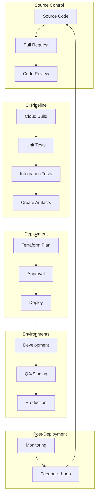
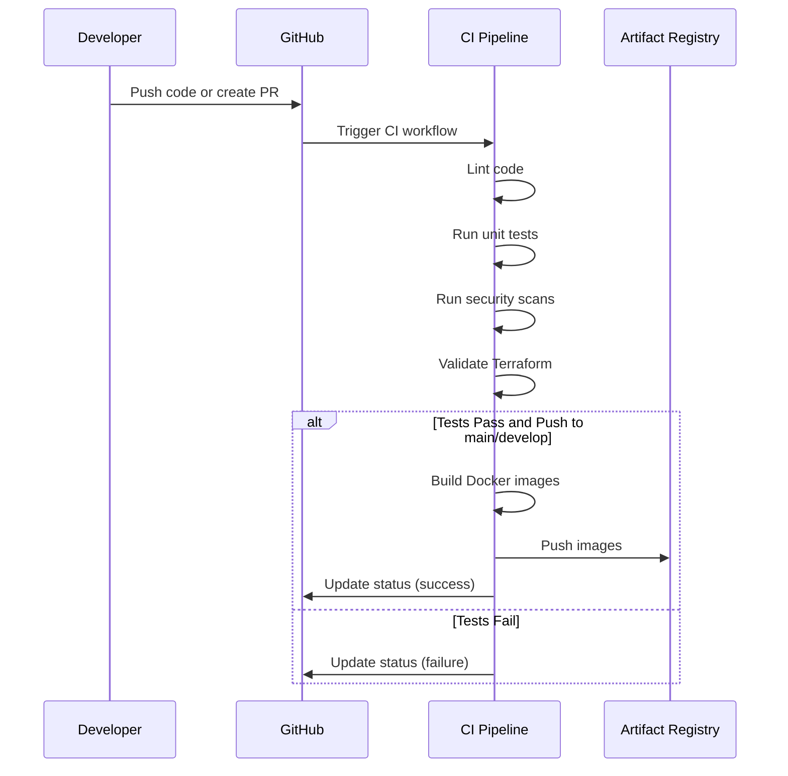
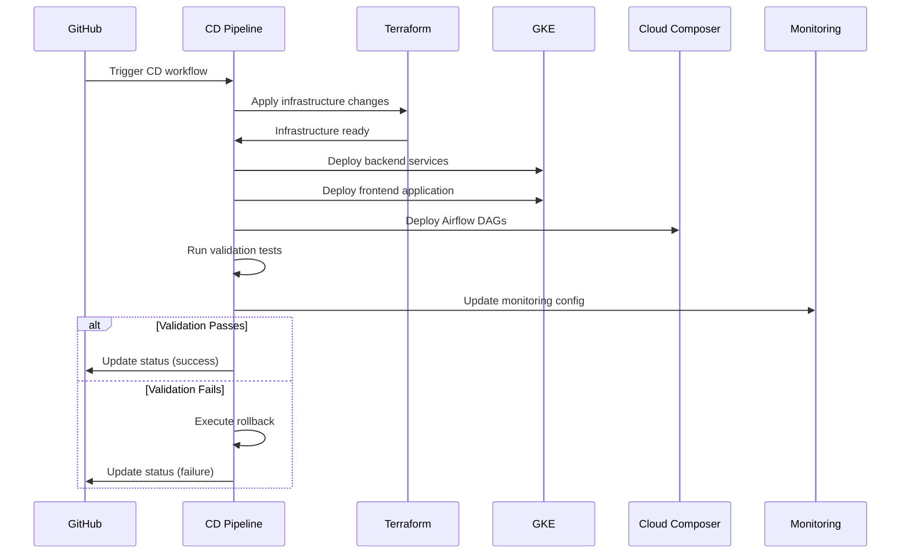
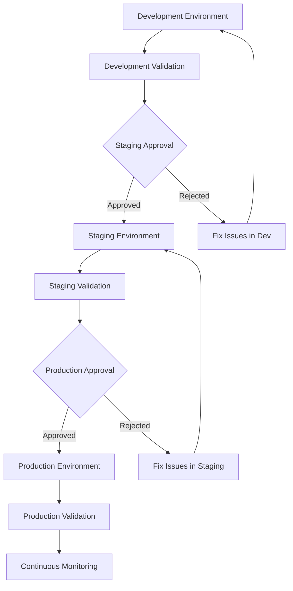
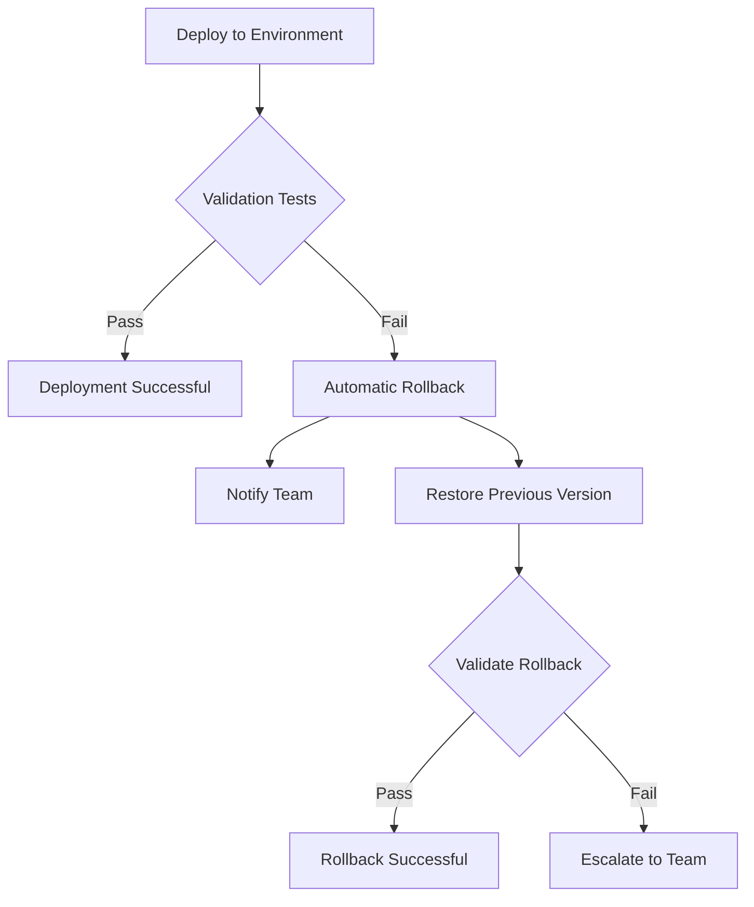

# Continuous Integration and Continuous Deployment (CI/CD)

## Introduction

This document provides a comprehensive overview of the Continuous Integration (CI) and Continuous Deployment (CD) pipeline for the self-healing data pipeline project. The CI/CD pipeline automates the building, testing, validation, and deployment of the application to ensure consistent, reliable, and efficient delivery of changes to various environments.

## CI/CD Architecture

### Overview

The CI/CD pipeline is implemented using GitHub Actions workflows that automate the entire software delivery process. The pipeline is designed to ensure code quality, security, and reliability through automated testing and validation before deployment to target environments.



### Key Components

The CI/CD pipeline consists of several key components:

- **GitHub Actions Workflows**: Automated workflows that execute CI/CD processes based on triggers such as code pushes, pull requests, and manual invocations.
- **Quality Gates**: Validation checkpoints that ensure code meets quality, security, and performance standards before proceeding to the next stage.
- **Artifact Registry**: Storage for built artifacts (Docker images) that are deployed to target environments.
- **Terraform**: Infrastructure as Code tool used to provision and manage Google Cloud resources.
- **Kubernetes/GKE**: Container orchestration platform for deploying and managing application containers.
- **Cloud Composer**: Managed Apache Airflow service for orchestrating data pipeline workflows.

### Workflow Triggers

The CI/CD pipeline is triggered by various events:

| Event | Description | Target |
|-------|-------------|--------|
| Pull Request | Triggers PR validation workflow to verify code quality and functionality before merging. | PR validation workflow |
| Push to develop branch | Triggers CI workflow and automatic deployment to development environment. | CI workflow → CD workflow (dev) |
| Push to main branch | Triggers CI workflow and deployment pipeline for production (with approval). | CI workflow → CD workflow (prod) |
| Manual workflow dispatch | Allows manual triggering of deployment to specific environments. | CD workflow (specified environment) |
| Scheduled execution | Weekly quality checks run automatically to ensure ongoing code quality. | Quality checks workflow |

## Continuous Integration

### CI Workflow

The Continuous Integration workflow (ci.yml) builds and tests the application components to ensure code quality and functionality.

| Step | Description |
|------|-------------|
| Code Checkout | Retrieves the source code from the repository. |
| Environment Setup | Sets up Python, Node.js, and other required tools. |
| Dependency Installation | Installs required dependencies for backend and frontend. |
| Linting and Code Quality Checks | Runs linters (flake8, ESLint) and formatters (black, prettier) to ensure code quality. |
| Unit Testing | Executes unit tests for backend (pytest) and frontend (Jest). |
| Security Scanning | Performs security scans using tools like Bandit and npm audit. |
| Terraform Validation | Validates Terraform configurations for infrastructure. |
| Artifact Building | Builds Docker images for backend and frontend components. |
| Artifact Publishing | Pushes Docker images to Google Artifact Registry. |



### Pull Request Validation

The PR validation workflow (pr-validation.yml) performs comprehensive checks on pull requests to ensure code quality before merging.

| Step | Description |
|------|-------------|
| Change Detection | Identifies which components have changed to run targeted validations. |
| Backend Linting | Validates Python code quality using flake8, black, isort, and mypy. |
| Backend Testing | Runs unit tests with coverage reporting and enforces minimum coverage thresholds. |
| Backend Security Scanning | Checks for security vulnerabilities in Python code and dependencies. |
| Frontend Linting | Validates JavaScript/TypeScript code quality using ESLint and Prettier. |
| Frontend Testing | Runs unit tests with coverage reporting and enforces minimum coverage thresholds. |
| Frontend Security Scanning | Checks for security vulnerabilities in JavaScript dependencies. |
| Terraform Validation | Validates Terraform configurations for syntax and best practices. |
| Airflow DAG Validation | Validates Airflow DAG integrity and syntax. |
| Validation Summary | Generates a summary report and adds it as a comment to the PR. |

### Quality Gates

Quality gates are checkpoints that ensure code meets quality standards before proceeding to the next stage.

| Gate | Tools | Criteria |
|------|-------|----------|
| Code Style Compliance | flake8, black, isort, ESLint, Prettier | Code must adhere to style guidelines with no linting errors. |
| Unit Test Coverage | pytest, Jest | Backend code must have ≥85% coverage, frontend code must have ≥80% coverage. |
| Security Vulnerability Check | Bandit, Safety, npm audit | No critical or high severity vulnerabilities in code or dependencies. |
| Type Checking | mypy, TypeScript | All code must pass type checking with no errors. |
| Infrastructure Validation | terraform validate, tflint | Terraform configurations must be valid and follow best practices. |
| DAG Validation | pytest-airflow | Airflow DAGs must be valid and load without errors. |

### Scheduled Quality Checks

The quality checks workflow (quality-checks.yml) runs weekly to ensure ongoing code quality and identify potential issues.

| Check | Description | Frequency |
|-------|-------------|-----------|
| Code Quality Analysis | Comprehensive analysis of code quality using tools like pylint and mypy. | Weekly |
| Test Coverage Analysis | Analysis of test coverage trends and identification of coverage gaps. | Weekly |
| Security Scanning | In-depth security analysis using CodeQL, Bandit, and dependency scanners. | Weekly |
| Dependency Analysis | Identification of outdated or vulnerable dependencies. | Weekly |
| Infrastructure Validation | Comprehensive validation of infrastructure configurations. | Weekly |
| Documentation Validation | Verification of documentation quality and accuracy. | Weekly |

## Continuous Deployment

### CD Workflow

The Continuous Deployment workflow (cd.yml) automates the deployment of the application to target environments.

| Step | Description |
|------|-------------|
| Environment Determination | Determines the target environment based on trigger or input. |
| Infrastructure Deployment | Applies Terraform configurations to provision or update infrastructure. |
| Backend Deployment | Deploys backend services to Google Kubernetes Engine. |
| Frontend Deployment | Deploys frontend application to Google Kubernetes Engine. |
| Airflow DAG Deployment | Deploys Airflow DAGs to Cloud Composer environment. |
| Post-Deployment Validation | Verifies successful deployment through health checks and tests. |
| Monitoring Integration | Updates monitoring and alerting configurations. |



### Deployment Environments

The pipeline supports deployment to multiple environments with different characteristics and purposes.

| Environment | Purpose | Deployment Trigger | Approval Required | Characteristics |
|-------------|---------|-------------------|-------------------|-----------------|
| Development (dev) | For ongoing development and feature testing | Automatic on merge to develop branch | No | - Reduced resource allocation for cost efficiency<br>- May contain experimental features<br>- Used by development team for testing |
| Staging (staging) | For pre-production testing and validation | Manual or after successful testing in development | Yes - QA team | - Production-like configuration<br>- Used for integration testing and UAT<br>- Deployed after successful testing in development |
| Production (prod) | For live production workloads | Manual after successful validation in staging | Yes - Change Advisory Board | - Highest resource allocation and redundancy<br>- Strict change control procedures<br>- Deployed after successful validation in staging |

### Deployment Strategies

Different deployment strategies are used depending on the component and environment:

| Strategy | Description | Use Case | Benefits |
|----------|-------------|----------|----------|
| Blue-Green Deployment | Two identical environments with only one live at a time | Frontend application deployment | - Zero downtime deployments<br>- Easy rollback capability<br>- Reduced risk |
| Rolling Updates | Gradually replacing instances with new versions | Backend services deployment | - No additional infrastructure required<br>- Gradual rollout<br>- Automatic rollback on failure |
| Canary Deployment | Releasing to a small subset of users before full deployment | New features in production | - Limited exposure to new code<br>- Real user feedback<br>- Early problem detection |

### Environment Promotion

The process of promoting code from one environment to the next involves validation and approval steps to ensure quality and reliability.



| Promotion | Criteria |
|-----------|----------|
| Development to Staging | - All automated tests pass<br>- QA team approval<br>- No known critical bugs<br>- Documentation updated |
| Staging to Production | - Successful UAT (User Acceptance Testing)<br>- Performance testing meets requirements<br>- Security review completed<br>- Change Advisory Board approval<br>- Rollback plan documented |

## Rollback Procedures

### Automated Rollback

The CI/CD pipeline includes automated rollback capabilities that are triggered when deployment validation fails.



### Manual Rollback

In cases where a deployment issue is discovered after the validation phase, manual rollback procedures can be executed.

| Method | Command | Use Case |
|--------|---------|----------|
| Kubernetes Rollback | `kubectl rollout undo deployment/DEPLOYMENT_NAME -n NAMESPACE [--to-revision=REVISION]` | Rolling back application deployments |
| Helm Rollback | `helm rollback RELEASE_NAME REVISION -n NAMESPACE` | Rolling back Helm-based deployments |
| Terraform Rollback | `terraform apply PREVIOUS_PLAN` | Rolling back infrastructure changes |
| Image Tag Rollback | Update deployment to use previous image tag | Quick rollback to previous container version |
| DAG Rollback | `gsutil cp PREVIOUS_VERSION gs://COMPOSER_BUCKET/dags/` | Rolling back Airflow DAG changes |

### Rollback Script

A dedicated rollback script is available for executing manual rollbacks:

**Script Path**: infrastructure/scripts/rollback.sh

**Usage**:
```bash
# Basic usage
./infrastructure/scripts/rollback.sh --project-id=PROJECT_ID --environment=ENVIRONMENT

# Full options
./infrastructure/scripts/rollback.sh \
  --project-id=PROJECT_ID \
  --environment=dev|staging|prod \
  --region=REGION \
  --resource-prefix=PREFIX \
  --k8s-dir=K8S_DIR \
  --helm-dir=HELM_DIR \
  [--rollback-terraform] \
  [--skip-k8s] \
  [--skip-helm] \
  [--version=VERSION] \
  [--dry-run]
```

## CI/CD Pipeline Monitoring

### Workflow Monitoring

Monitoring the CI/CD pipeline itself is essential for ensuring reliable and efficient operation.

| Aspect | Metrics |
|--------|---------|
| Workflow Execution Metrics | - Workflow success rate<br>- Workflow duration<br>- Step-specific durations<br>- Resource utilization |
| Failure Monitoring | - Failure rate by workflow<br>- Failure rate by step<br>- Common failure patterns<br>- Mean time to recovery |
| Quality Metrics | - Code coverage trends<br>- Linting error trends<br>- Security vulnerability trends<br>- Test success rate |

### Deployment Monitoring

Monitoring deployments ensures successful application delivery and operation.

| Aspect | Metrics |
|--------|---------|
| Deployment Success Metrics | - Deployment success rate<br>- Deployment duration<br>- Rollback frequency<br>- Post-deployment incident rate |
| Environment Health | - Service availability<br>- Error rates post-deployment<br>- Performance metrics post-deployment<br>- Resource utilization |

### Alerting

Alerts notify the team of CI/CD issues that require attention.

| Type | Trigger | Notification |
|------|---------|--------------|
| Workflow Failure | CI/CD workflow fails | Teams/Slack notification, email to development team |
| Deployment Failure | Deployment step fails | Teams/Slack notification, email to deployment team |
| Quality Gate Failure | Code fails to meet quality standards | Teams/Slack notification, PR comment |
| Security Vulnerability | Security scan detects critical vulnerability | Teams/Slack notification, email to security team |

## CI/CD Best Practices

### Code Management

Best practices for managing code in the CI/CD pipeline:

| Practice | Description |
|----------|-------------|
| Trunk-Based Development | Work in small batches and merge frequently to the main branch. |
| Feature Flags | Use feature flags to enable/disable features without code changes. |
| Branch Protection | Enforce PR reviews and status checks before merging to protected branches. |
| Semantic Versioning | Use semantic versioning for releases to clearly communicate changes. |

### Pipeline Optimization

Strategies for optimizing CI/CD pipeline performance:

| Strategy | Description |
|----------|-------------|
| Caching Dependencies | Cache dependencies to speed up builds and reduce network usage. |
| Parallel Execution | Run independent jobs and steps in parallel to reduce overall execution time. |
| Incremental Testing | Run only tests affected by code changes to reduce test execution time. |
| Optimized Docker Builds | Use multi-stage builds and layer caching to optimize container builds. |

### Security Considerations

Security best practices for the CI/CD pipeline:

| Practice | Description |
|----------|-------------|
| Secrets Management | Store secrets securely using GitHub Secrets or Google Secret Manager. |
| Least Privilege | Use service accounts with minimal required permissions. |
| Artifact Signing | Sign and verify artifacts to ensure integrity. |
| Regular Security Scanning | Continuously scan code, dependencies, and containers for vulnerabilities. |

### Continuous Improvement

Approaches for continuously improving the CI/CD pipeline:

| Approach | Description |
|----------|-------------|
| Pipeline Metrics Analysis | Regularly analyze pipeline performance metrics to identify bottlenecks. |
| Post-Incident Reviews | Conduct reviews after pipeline failures to identify improvement opportunities. |
| Feedback Collection | Gather feedback from developers and operators on pipeline usability. |
| Regular Updates | Keep tools and dependencies up to date to benefit from improvements and security fixes. |

## Workflow Configuration Reference

### CI Workflow (ci.yml)

Configuration reference for the Continuous Integration workflow.

**File Path**: .github/workflows/ci.yml

**Key Components**:
- **Triggers**: Triggered on push to main/develop branches and pull requests.
- **Environment Variables**: PYTHON_VERSION: 3.9, NODE_VERSION: 18, and various GCP-related variables.
- **Jobs**: lint-and-test-backend, lint-and-test-web, security-scan, terraform-validate, build-backend, build-web

### PR Validation Workflow (pr-validation.yml)

Configuration reference for the Pull Request validation workflow.

**File Path**: .github/workflows/pr-validation.yml

**Key Components**:
- **Triggers**: Triggered on pull request to main/develop branches.
- **Environment Variables**: PYTHON_VERSION: 3.9, NODE_VERSION: 18, MIN_COVERAGE_BACKEND: 85, MIN_COVERAGE_WEB: 80
- **Jobs**: detect-changes, lint-backend, test-backend, security-scan-backend, lint-web, test-web, security-scan-web, validate-terraform, validate-airflow, pr-validation-summary

### CD Workflow (cd.yml)

Configuration reference for the Continuous Deployment workflow.

**File Path**: .github/workflows/cd.yml

**Key Components**:
- **Triggers**: Triggered on push to main branch and manual workflow dispatch.
- **Environment Variables**: GCP_PROJECT_ID, GCP_SA_KEY, TF_STATE_BUCKET, DOCKER_REGISTRY
- **Jobs**: deploy-to-dev, deploy-to-staging, deploy-to-production, rollback

### Quality Checks Workflow (quality-checks.yml)

Configuration reference for the scheduled quality checks workflow.

**File Path**: .github/workflows/quality-checks.yml

**Key Components**:
- **Triggers**: Scheduled weekly (Sunday at midnight) and manual workflow dispatch.
- **Environment Variables**: PYTHON_VERSION: 3.9, NODE_VERSION: 18, MIN_COVERAGE_BACKEND: 85, MIN_COVERAGE_WEB: 80
- **Jobs**: code-quality-analysis, test-coverage-analysis, security-scanning, dependency-analysis, infrastructure-validation, documentation-validation, quality-report

## Troubleshooting

### Common CI Issues

Solutions for frequently encountered CI pipeline issues:

| Issue | Solution |
|-------|----------|
| Flaky Tests | Identify and fix non-deterministic tests, or mark them as flaky and retry automatically. |
| Dependency Installation Failures | Check for version conflicts, network issues, or repository outages. Use dependency caching. |
| Resource Constraints | Optimize resource usage, split large jobs, or upgrade runner resources. |
| Timeout Issues | Optimize long-running steps, increase timeout limits, or split into smaller jobs. |

### Common CD Issues

Solutions for frequently encountered CD pipeline issues:

| Issue | Solution |
|-------|----------|
| Terraform Apply Failures | Check for resource conflicts, permission issues, or state file problems. |
| Kubernetes Deployment Failures | Verify image existence, resource constraints, and configuration validity. |
| Cloud Composer DAG Deployment Issues | Check for DAG syntax errors, missing dependencies, or permission issues. |
| Post-Deployment Validation Failures | Investigate application logs, configuration issues, or integration problems. |

### Debugging Workflows

Techniques for debugging CI/CD workflow issues:

| Technique | Description |
|-----------|-------------|
| Enable Debug Logging | Set the ACTIONS_RUNNER_DEBUG secret to true for detailed logs. |
| Use Step Debug | Set the ACTIONS_STEP_DEBUG secret to true for step-level debugging. |
| Local Workflow Testing | Use act tool to run GitHub Actions workflows locally. |
| Manual Step Execution | Run problematic steps manually to isolate issues. |

## References

Additional resources for CI/CD information:

- [Testing Documentation](./testing.md): Information about testing strategies and practices
- **Deployment Procedures**: For detailed information about deployment procedures, refer to the operations documentation in the project repository
- [GitHub Actions Documentation](https://docs.github.com/en/actions): Official GitHub Actions documentation
- [Terraform Documentation](https://www.terraform.io/docs): Official Terraform documentation
- [Google Cloud Build Documentation](https://cloud.google.com/build/docs): Google Cloud Build documentation
- [Kubernetes Documentation](https://kubernetes.io/docs/home/): Official Kubernetes documentation