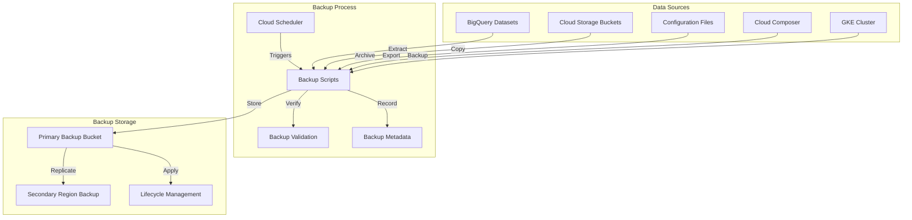

# Backup and Restore Procedures

## Introduction

This document provides comprehensive guidance on backup and restore procedures for the self-healing data pipeline. It covers automated backup processes, recovery methods, and disaster recovery strategies for various components of the system.

Regular backups and tested recovery procedures are essential for ensuring business continuity and data integrity in the face of various failure scenarios, from accidental data deletion to complete regional outages. The self-healing data pipeline implements a multi-layered approach to backup and recovery, with appropriate mechanisms for different types of data and components.

### Backup and Recovery Principles

The backup and recovery strategy for the self-healing data pipeline is built on several key principles:

- **Defense in Depth**: Multiple layers of protection including replication, backups, and snapshots
- **Automation First**: Automated backup processes to ensure consistency and reliability
- **Regular Testing**: Scheduled validation of backup integrity and recovery procedures
- **Tiered Approach**: Different backup strategies based on data criticality and recovery requirements
- **Secure by Design**: Encrypted backups with appropriate access controls
- **Compliance Alignment**: Retention policies that meet regulatory requirements
- **Cost Optimization**: Efficient use of storage and lifecycle management

These principles guide the implementation of backup and recovery throughout the pipeline, ensuring a consistent and effective approach to data protection.

### Backup and Recovery Objectives

The backup and recovery strategy defines specific objectives for different components and data types:

| Component | Recovery Time Objective (RTO) | Recovery Point Objective (RPO) | Backup Frequency |
| --- | --- | --- | --- |
| BigQuery Datasets | < 4 hours | < 24 hours | Daily |
| Cloud Storage Buckets | < 2 hours | < 24 hours | Daily |
| Configuration Files | < 1 hour | < 24 hours | Daily |
| GKE Cluster | < 4 hours | < 24 hours | Daily |
| Cloud Composer | < 4 hours | < 1 hour | Hourly metadata, Daily DAGs |

These objectives are defined based on business requirements and component criticality, with more stringent objectives for critical components and data. The backup and recovery procedures are designed to meet these objectives for different failure scenarios.

### Scope

This document covers backup and recovery procedures for the following components of the self-healing data pipeline:

- **Data Storage**
  - BigQuery datasets and tables
  - Cloud Storage buckets and objects
  - Metadata repositories

- **Configuration and Code**
  - Pipeline definitions and DAGs
  - Configuration files
  - Infrastructure as Code templates

- **Infrastructure Components**
  - GKE clusters and workloads
  - Cloud Composer environments
  - Custom services and applications

The procedures described in this document apply to all environments (development, staging, and production), with appropriate adjustments for each environment's specific requirements.

## Backup Architecture

The backup architecture of the self-healing data pipeline implements a comprehensive approach to data protection, with multiple mechanisms working together to ensure data resilience.

### Backup Components

The backup architecture consists of several key components:

1. **Automated Backup Scripts**: Scheduled scripts that execute backup operations for different components

2. **Backup Storage**: Dedicated Cloud Storage buckets for storing backup data with appropriate lifecycle policies

3. **Metadata Tracking**: Systems for tracking backup metadata, including timestamps, content, and validation results

4. **Validation Mechanisms**: Processes for validating backup integrity and completeness

5. **Retention Management**: Automated cleanup of old backups based on retention policies

These components work together to provide comprehensive backup capabilities for all critical data and configurations in the pipeline.

### Backup Flow Diagram



The backup flow illustrates how data from various sources is backed up through automated scripts, stored in dedicated backup storage, and managed through metadata tracking and lifecycle policies.

### Backup Storage Strategy

The backup storage strategy implements a tiered approach to balance accessibility, durability, and cost:

- **Primary Backup Storage**:
  - Dedicated Cloud Storage bucket in the primary region
  - Standard storage class for recent backups (0-30 days)
  - Versioning enabled for additional protection
  - CMEK encryption for sensitive data

- **Secondary Backup Storage**:
  - Cross-region replication to secondary region
  - Ensures backup availability even during regional outages
  - Same security controls as primary storage

- **Long-term Archive**:
  - Automatic transition to Nearline storage (30-90 days)
  - Automatic transition to Coldline storage (90+ days)
  - Lifecycle policies based on data criticality and compliance requirements

- **Backup Organization**:
  - Hierarchical folder structure by component type
  - Date-based organization for easy retrieval
  - Metadata files with backup details
  - Consistent naming conventions

This storage strategy ensures that backups are stored efficiently and securely, with appropriate accessibility based on age and criticality.

### Backup Security

Security measures for backup data protection:

- **Encryption**:
  - All backups encrypted at rest using Google-managed keys or CMEK
  - Encryption in transit for all backup operations
  - Key rotation according to security policies

- **Access Control**:
  - Dedicated service accounts for backup operations
  - Principle of least privilege for backup permissions
  - Separation of duties between backup and production access
  - Regular access review and audit

- **Immutability**:
  - Object versioning to prevent overwrites
  - Retention policies to prevent deletion
  - Audit logging of all backup operations

- **Secure Transfer**:
  - TLS encryption for all data transfers
  - Private Google access for GCP services
  - No public access to backup storage

These security measures ensure that backup data is protected against unauthorized access, modification, or deletion, maintaining the confidentiality and integrity of backed-up data.

## Backup Procedures

This section details the specific backup procedures for different components of the self-healing data pipeline.

### BigQuery Backup Procedure

BigQuery datasets and tables are backed up using the following procedure:

1. **Backup Scope**:
   - All production datasets
   - Critical staging datasets
   - Table data and schemas
   - Dataset metadata and permissions

2. **Backup Method**:
   - Table export to Cloud Storage in Avro or Parquet format
   - Schema export as JSON files
   - Dataset metadata export
   - Snapshot-based backup for large tables

3. **Backup Schedule**:
   - Full backup: Daily at 01:00 UTC
   - Incremental backup: Not applicable (full exports only)
   - Retention: 30 days in Standard storage, 90 days in Nearline

4. **Execution Process**:
   ```bash
   # Example command from backup.sh
   backup_bigquery_datasets "dataset1,dataset2" "gs://backup-bucket/bigquery"
   ```

5. **Validation**:
   - Record count verification
   - Schema consistency check
   - Sample data validation
   - Backup metadata recording

The BigQuery backup procedure ensures that all critical data warehouse information is regularly backed up and can be restored if needed.

### Cloud Storage Backup Procedure

Cloud Storage buckets are backed up using the following procedure:

1. **Backup Scope**:
   - All production data buckets
   - Critical configuration buckets
   - Staging data as needed

2. **Backup Method**:
   - Direct object copy to backup bucket
   - Metadata preservation
   - Versioning for change protection
   - Synchronization to maintain consistency

3. **Backup Schedule**:
   - Full backup: Daily at 02:00 UTC
   - Incremental sync: Every 6 hours
   - Retention: 30 days in Standard storage, 90 days in Nearline

4. **Execution Process**:
   ```bash
   # Example command from backup.sh
   backup_gcs_buckets "bucket1,bucket2" "gs://backup-bucket/gcs"
   ```

5. **Validation**:
   - Object count verification
   - Size consistency check
   - Metadata verification
   - Backup completion confirmation

The Cloud Storage backup procedure ensures that all critical object data is regularly backed up with appropriate versioning and lifecycle management.

### Configuration Backup Procedure

Configuration files and code are backed up using the following procedure:

1. **Backup Scope**:
   - Pipeline configuration files
   - Airflow DAGs and plugins
   - Infrastructure as Code templates
   - Environment-specific configurations

2. **Backup Method**:
   - Direct file copy to backup bucket
   - Archive creation for related files
   - Version control integration
   - Metadata preservation

3. **Backup Schedule**:
   - Full backup: Daily at 00:30 UTC
   - On-demand backup: After significant changes
   - Retention: 90 days for all configuration backups

4. **Execution Process**:
   ```bash
   # Example command from backup.sh
   backup_configurations "gs://backup-bucket/configs"
   ```

5. **Validation**:
   - File count verification
   - Syntax validation for critical files
   - Consistency checking
   - Backup metadata recording

The configuration backup procedure ensures that all critical configuration information is regularly backed up and can be restored if needed, complementing the version control system used for code management.

### GKE Cluster Backup Procedure

GKE clusters and workloads are backed up using the following procedure:

1. **Backup Scope**:
   - Kubernetes resource definitions
   - Persistent volume data
   - Custom resource definitions
   - Secrets and ConfigMaps

2. **Backup Method**:
   - GKE Backup for GKE service
   - Resource export to YAML files
   - Persistent volume snapshots
   - Helm chart and values backup

3. **Backup Schedule**:
   - Full backup: Daily at 03:00 UTC
   - Retention: 30 days for cluster backups

4. **Execution Process**:
   - Automated through GKE Backup for GKE
   - Configured via Terraform
   - Backup plan with defined schedule and retention

5. **Validation**:
   - Backup completion verification
   - Resource count validation
   - Backup metadata recording
   - Periodic restore testing

The GKE cluster backup procedure ensures that all Kubernetes resources and configurations are regularly backed up and can be restored in case of cluster issues or failures.

### Cloud Composer Backup Procedure

Cloud Composer environments are backed up using the following procedure:

1. **Backup Scope**:
   - Airflow DAG definitions
   - Custom plugins and operators
   - Environment configurations
   - Airflow variables and connections

2. **Backup Method**:
   - DAG and plugin files copied to backup bucket
   - Airflow metadata export via Airflow API
   - Environment configuration export
   - Snapshot-based backup where applicable

3. **Backup Schedule**:
   - DAGs and plugins: Daily at 00:15 UTC
   - Airflow metadata: Hourly
   - Environment configuration: Daily
   - Retention: 30 days for all Composer backups

4. **Execution Process**:
   - Automated through backup scripts
   - Integration with Airflow API
   - GCS bucket synchronization

5. **Validation**:
   - File count verification
   - Metadata consistency check
   - DAG parsing validation
   - Backup completion confirmation

The Cloud Composer backup procedure ensures that all orchestration definitions and configurations are regularly backed up and can be restored if needed.

### Backup Automation and Scheduling

The backup procedures are automated and scheduled using the following mechanisms:

1. **Scheduling Tools**:
   - Cloud Scheduler for triggering backup jobs
   - Airflow DAGs for complex backup workflows
   - Cron jobs for simple, regular backups

2. **Execution Environment**:
   - Dedicated backup service account
   - Appropriate IAM permissions
   - Logging and monitoring integration

3. **Schedule Management**:
   - Staggered schedules to distribute load
   - Maintenance window alignment
   - Retry mechanisms for failed backups
   - Notification of schedule changes

4. **Monitoring and Alerting**:
   - Backup job success/failure monitoring
   - Duration and size trend analysis
   - Alert on backup failures
   - Regular backup reports

Backup automation ensures consistent and reliable execution of backup procedures, with appropriate scheduling, monitoring, and alerting to ensure backup reliability.

### Backup Validation and Testing

Regular validation and testing ensures backup reliability:

1. **Automated Validation**:
   - Post-backup integrity checks
   - Metadata verification
   - Size and count validation
   - Corruption detection

2. **Periodic Testing**:
   - Monthly restore testing for critical data
   - Quarterly comprehensive restore tests
   - Validation in isolated environment
   - Recovery time measurement

3. **Validation Reporting**:
   - Automated validation reports
   - Test results documentation
   - Issue tracking and resolution
   - Trend analysis of validation metrics

4. **Continuous Improvement**:
   - Backup process refinement based on test results
   - Failure analysis and mitigation
   - Procedure updates as needed
   - Regular review of backup strategy

Regular validation and testing ensures that backups are reliable and can be used effectively for recovery when needed, with continuous improvement based on test results and operational experience.

## Restore Procedures

This section details the specific restore procedures for different components of the self-healing data pipeline.

### Restore Preparation

Before initiating any restore operation, complete these preparation steps:

1. **Incident Assessment**:
   - Identify affected components and data
   - Determine cause of data loss or corruption
   - Assess impact and urgency
   - Determine appropriate recovery point

2. **Restore Planning**:
   - Select appropriate backup to restore from
   - Identify restore target (original or alternate location)
   - Determine if point-in-time recovery is needed
   - Plan for service disruption if applicable

3. **Environment Preparation**:
   - Ensure sufficient permissions for restore
   - Verify target environment readiness
   - Prepare any prerequisite resources
   - Set up validation mechanisms

4. **Communication**:
   - Notify stakeholders of restore operation
   - Communicate expected downtime if applicable
   - Establish communication channels for updates
   - Document restore decision and plan

Proper preparation ensures that restore operations are executed efficiently and effectively, with appropriate planning and communication.

### BigQuery Restore Procedure

To restore BigQuery datasets and tables:

1. **Restore Scenarios**:
   - Complete dataset recovery
   - Individual table recovery
   - Schema-only recovery
   - Point-in-time recovery (where applicable)

2. **Restore Steps**:
   - Identify appropriate backup in backup storage
   - Create target dataset if it doesn't exist
   - Load data from backup files using bq load or BigQuery API
   - Apply schema from schema backup files
   - Verify loaded data integrity

3. **Example Commands**:
   ```bash
   # Create dataset if needed
   bq mk --dataset project_id:dataset_name
   
   # Load table from backup
   bq load --source_format=AVRO dataset_name.table_name gs://backup-bucket/bigquery/dataset_name/table_name/backup_date/*.avro
   
   # Apply permissions
   bq set-iam-policy dataset_name /path/to/policy.json
   ```

4. **Post-Restore Validation**:
   - Record count verification
   - Schema validation
   - Sample data verification
   - Query testing if applicable

5. **Special Considerations**:
   - Handle partitioned and clustered tables appropriately
   - Manage table dependencies during restore
   - Consider impact on views and authorized datasets
   - Verify dataset permissions after restore

The BigQuery restore procedure enables recovery of data warehouse components with appropriate validation and special handling for complex table structures.

### Cloud Storage Restore Procedure

To restore Cloud Storage objects:

1. **Restore Scenarios**:
   - Complete bucket recovery
   - Folder/prefix recovery
   - Individual object recovery
   - Version-specific recovery

2. **Restore Steps**:
   - Identify appropriate backup in backup storage
   - Create target bucket if it doesn't exist
   - Copy objects from backup to target location
   - Restore metadata if applicable
   - Verify restored objects

3. **Example Commands**:
   ```bash
   # Create bucket if needed
   gsutil mb gs://target-bucket
   
   # Restore entire bucket
   gsutil -m cp -r gs://backup-bucket/gcs/source-bucket/* gs://target-bucket/
   
   # Restore specific prefix
   gsutil -m cp -r gs://backup-bucket/gcs/source-bucket/prefix/* gs://target-bucket/prefix/
   
   # Restore single object
   gsutil cp gs://backup-bucket/gcs/source-bucket/path/to/object gs://target-bucket/path/to/object
   ```

4. **Post-Restore Validation**:
   - Object count verification
   - Size validation
   - Metadata verification
   - Access testing

5. **Special Considerations**:
   - Handle object versioning appropriately
   - Restore object ACLs if needed
   - Consider impact on dependent systems
   - Manage lifecycle policies on restored objects

The Cloud Storage restore procedure enables recovery of object data with appropriate validation and special handling for object metadata and versioning.

### Configuration Restore Procedure

To restore configuration files and code:

1. **Restore Scenarios**:
   - Complete configuration recovery
   - Specific configuration file recovery
   - Version-specific recovery
   - Environment-specific configuration recovery

2. **Restore Steps**:
   - Identify appropriate backup in backup storage
   - Determine target location for restored files
   - Copy configuration files from backup to target location
   - Update references if necessary
   - Verify restored configurations

3. **Example Commands**:
   ```bash
   # Restore all configurations
   gsutil -m cp -r gs://backup-bucket/configs/backup_date/* /path/to/config/directory/
   
   # Restore specific configuration file
   gsutil cp gs://backup-bucket/configs/backup_date/path/to/config.yaml /path/to/config/directory/config.yaml
   ```

4. **Post-Restore Validation**:
   - File integrity verification
   - Syntax validation
   - Configuration testing
   - Integration testing if applicable

5. **Special Considerations**:
   - Handle environment-specific configurations
   - Manage secrets and sensitive information
   - Consider impact on running systems
   - Coordinate with version control if applicable

The configuration restore procedure enables recovery of configuration files and code with appropriate validation and special handling for environment-specific configurations.

### GKE Cluster Restore Procedure

To restore GKE clusters and workloads:

1. **Restore Scenarios**:
   - Complete cluster recovery
   - Namespace recovery
   - Specific resource recovery
   - Application-specific recovery

2. **Restore Steps**:
   - Identify appropriate backup in GKE Backup for GKE
   - Create restore plan with appropriate scope
   - Execute restore operation
   - Verify restored resources
   - Validate application functionality

3. **Example Process**:
   - Use Google Cloud Console or gcloud CLI to initiate restore
   - Select backup and target cluster
   - Define restore scope (all or selected namespaces/resources)
   - Execute restore operation
   - Monitor restore progress

4. **Post-Restore Validation**:
   - Resource count verification
   - Pod status verification
   - Service connectivity testing
   - Application functionality testing

5. **Special Considerations**:
   - Handle stateful applications appropriately
   - Manage service disruption during restore
   - Consider impact on external dependencies
   - Verify network policies and security controls

The GKE cluster restore procedure enables recovery of Kubernetes resources and applications with appropriate validation and special handling for stateful applications.

### Cloud Composer Restore Procedure

To restore Cloud Composer environments:

1. **Restore Scenarios**:
   - Complete environment recovery
   - DAG and plugin recovery
   - Airflow metadata recovery
   - Configuration recovery

2. **Restore Steps**:
   - Identify appropriate backup in backup storage
   - Determine restore approach (in-place or new environment)
   - Restore DAGs, plugins, and configurations
   - Restore Airflow metadata if applicable
   - Verify restored environment

3. **Example Commands**:
   ```bash
   # Restore DAGs to Composer environment
   gsutil -m cp -r gs://backup-bucket/composer/dags/backup_date/* gs://composer-environment-bucket/dags/
   
   # Restore plugins
   gsutil -m cp -r gs://backup-bucket/composer/plugins/backup_date/* gs://composer-environment-bucket/plugins/