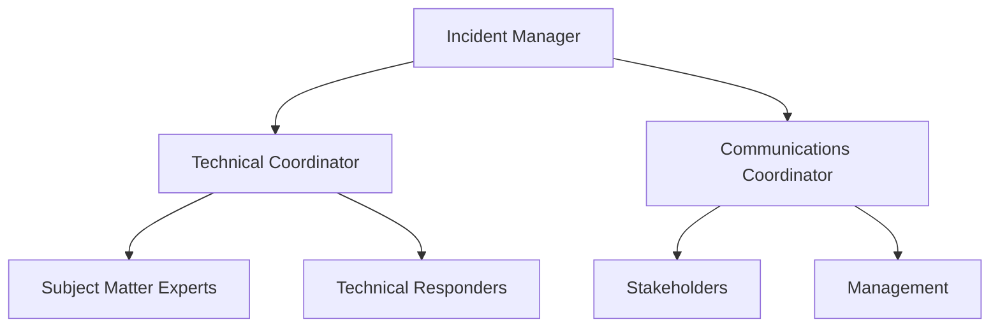
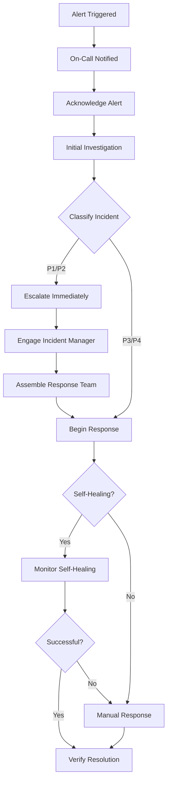
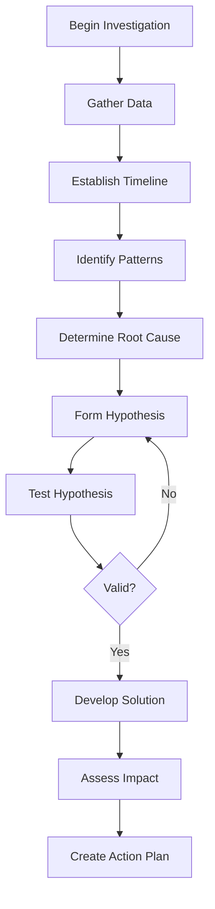
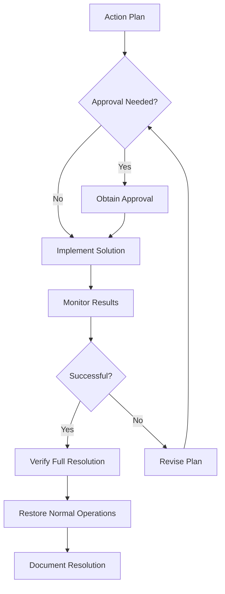

This document provides comprehensive guidance for responding to incidents in the self-healing data pipeline. While the pipeline includes automated self-healing capabilities that resolve many issues without human intervention, some incidents may require manual response and resolution. This guide outlines the procedures, roles, and tools for effective incident management.

Incident response for the self-healing data pipeline follows a structured approach designed to minimize impact, ensure rapid resolution, and capture learnings to prevent future occurrences. This document serves as the authoritative reference for all incident response activities.

## Introduction

### Purpose and Scope
This incident response guide serves several key purposes:

- Define a structured approach to incident management
- Clarify roles and responsibilities during incidents
- Establish communication protocols and channels
- Document escalation procedures and thresholds
- Outline post-incident analysis and improvement processes

This guide covers all incidents related to the self-healing data pipeline, including:

- Data quality incidents
- Pipeline execution failures
- Performance degradation
- Security incidents
- Infrastructure failures
- Self-healing system issues

The procedures in this document apply to all environments (development, staging, and production), with appropriate adjustments for the criticality of each environment.

### Incident Response Philosophy
The incident response approach for the self-healing data pipeline is built on several key principles:

1. **Automation First**: Leverage the self-healing capabilities of the system whenever possible
2. **Rapid Response**: Minimize time to detection and resolution
3. **Clear Ownership**: Establish clear roles and responsibilities
4. **Blameless Culture**: Focus on process improvement, not individual blame
5. **Continuous Learning**: Use incidents as opportunities to improve the system
6. **Transparent Communication**: Maintain clear communication with all stakeholders

These principles guide all aspects of incident response, from initial detection through resolution and post-incident analysis.

### Relationship with Self-Healing
The self-healing data pipeline includes automated capabilities that can detect and resolve many issues without human intervention. The incident response procedures in this document complement these automated capabilities in several ways:

1. **Handling Exceptions**: Addressing incidents that the self-healing system cannot resolve automatically
2. **Providing Oversight**: Monitoring and verifying self-healing actions
3. **Managing Approvals**: Handling approval workflows for high-impact self-healing actions
4. **Addressing System Issues**: Responding to problems with the self-healing system itself
5. **Continuous Improvement**: Feeding insights from manual incident response back into the self-healing system

The goal is to continuously expand the self-healing capabilities of the system, reducing the need for manual incident response over time.

## Incident Classification
Incidents are classified based on severity, impact, and scope to ensure appropriate response and resource allocation. This classification determines notification channels, response times, and escalation procedures.

### Severity Levels
Incidents are categorized into four severity levels:

| Severity | Description | Examples | Response Time | Escalation Time |
| --- | --- | --- | --- | --- |
| **P1 (Critical)** | Complete system failure or severe business impact affecting multiple critical pipelines or data | • Production pipeline complete failure<br>• Data corruption affecting business decisions<br>• Security breach | 15 minutes | 30 minutes |
| **P2 (High)** | Significant impact to business operations with partial system functionality | • Critical pipeline component failure<br>• Significant performance degradation<br>• Data quality issues affecting reports | 1 hour | 2 hours |
| **P3 (Medium)** | Limited impact with most system functionality available | • Non-critical pipeline failures<br>• Minor performance issues<br>• Isolated data quality problems | 4 hours | 8 hours |
| **P4 (Low)** | Minimal impact with no effect on core functionality | • Cosmetic issues<br>• Non-critical warnings<br>• Minor optimization opportunities | 24 hours | N/A |

Severity may be upgraded or downgraded as more information becomes available during the incident response process.

### Impact Assessment
Impact assessment considers several dimensions to determine the overall severity of an incident:

1. **Business Impact**:
   - Critical business processes affected
   - Financial implications
   - Regulatory or compliance concerns
   - Reputational risk

2. **Technical Impact**:
   - Number of affected components
   - Data integrity concerns
   - Performance degradation
   - Security implications

3. **User Impact**:
   - Number of affected users
   - Types of affected users (executives, analysts, etc.)
   - Availability of workarounds
   - Duration of impact

4. **Recovery Complexity**:
   - Estimated time to resolve
   - Resource requirements
   - Dependency on external parties
   - Potential for data loss

The impact assessment should be continuously updated as new information becomes available during the incident response process.

### Incident Types
Incidents are categorized by type to guide the response approach and team assignment:

1. **Data Quality Incidents**:
   - Schema validation failures
   - Data integrity issues
   - Missing or corrupt data
   - Referential integrity violations

2. **Pipeline Execution Incidents**:
   - DAG or task failures
   - Scheduling issues
   - Dependency failures
   - Resource constraints

3. **Performance Incidents**:
   - Slow query execution
   - Processing delays
   - Resource exhaustion
   - Throughput degradation

4. **Infrastructure Incidents**:
   - Cloud service disruptions
   - Network issues
   - Storage problems
   - Compute resource failures

5. **Security Incidents**:
   - Unauthorized access attempts
   - Unusual access patterns
   - Potential data exfiltration
   - Compliance violations

6. **Self-Healing System Incidents**:
   - Incorrect automated actions
   - Self-healing failures
   - Model performance issues
   - Configuration problems

Many incidents may span multiple categories, requiring a coordinated response across different specialized teams.

### Automated Classification
The monitoring system includes automated classification capabilities that assign initial severity and type based on alert context:

1. **Classification Factors**:
   - Alert source and category
   - Affected components and services
   - Historical patterns for similar alerts
   - Business context (time of day, business cycle)
   - Current system state

2. **Classification Workflow**:
   - Initial classification by monitoring system
   - Review and potential adjustment by on-call responder
   - Continuous reassessment throughout the incident
   - Final classification for post-incident analysis

3. **Classification Overrides**:
   - On-call responders can override automated classification
   - Escalation managers can adjust severity as needed
   - Business stakeholders may request severity adjustments

The automated classification system continuously improves through machine learning based on historical incident data and response patterns.

## Roles and Responsibilities
Clear definition of roles and responsibilities is essential for effective incident response. This section outlines the key roles involved in incident management and their specific responsibilities.

### Incident Response Team Structure
The incident response team follows a structured approach with clearly defined roles:



This structure scales based on incident severity, with smaller incidents potentially combining roles or eliminating some entirely. For P1 incidents, all roles are typically filled, while P3/P4 incidents may only involve technical responders.

### Key Roles and Responsibilities
| Role | Responsibilities | Staffed By |
| --- | --- | --- |
| **On-Call Responder** | • Initial incident triage<br>• First-level response<br>• Escalation when needed<br>• Initial communication | Rotating on-call schedule |
| **Incident Manager** | • Overall incident coordination<br>• Resource allocation<br>• Escalation decisions<br>• Status tracking | Designated senior engineer or manager |
| **Technical Coordinator** | • Technical response leadership<br>• Solution development<br>• Technical resource coordination<br>• Technical documentation | Senior engineer with system expertise |
| **Communications Coordinator** | • Stakeholder updates<br>• User communication<br>• Status page updates<br>• Management briefings | Product manager or designated communicator |
| **Subject Matter Experts** | • Specialized technical expertise<br>• Component-specific troubleshooting<br>• Solution implementation | Component owners and specialists |
| **Stakeholder Representative** | • Business impact assessment<br>• Priority guidance<br>• Business decision making<br>• User perspective | Business unit representative |

Roles may be combined or expanded depending on incident scope and severity. For smaller incidents, the On-Call Responder may handle multiple roles.

### On-Call Rotation
The on-call rotation ensures 24/7 coverage for incident response:

1. **Rotation Schedule**:
   - Primary on-call: First responder for all alerts
   - Secondary on-call: Backup if primary is unavailable
   - Specialist on-call: Component-specific expertise

2. **Rotation Management**:
   - Weekly rotation periods (Monday to Sunday)
   - Handoff procedures at rotation boundaries
   - PagerDuty for scheduling and notifications
   - Swap procedures for schedule conflicts

3. **On-Call Expectations**:
   - 15-minute response time for P1 alerts
   - 30-minute response time for P2 alerts
   - Laptop and internet access at all times
   - Familiarity with incident response procedures
   - Ability to join video calls when needed

4. **On-Call Support**:
   - Training for all on-call personnel
   - Runbooks and documentation access
   - Escalation paths for additional help
   - Post-rotation review and feedback

The on-call schedule is published monthly and accessible to all team members through the operations portal.

### Escalation Paths
Clear escalation paths ensure that incidents receive appropriate attention and resources:

1. **Technical Escalation**:
   - Level 1: On-call responder
   - Level 2: Technical coordinator and SMEs
   - Level 3: Engineering managers and architects
   - Level 4: CTO and senior leadership

2. **Time-Based Escalation**:
   - P1: Escalate to Level 2 after 30 minutes without resolution
   - P2: Escalate to Level 2 after 2 hours without resolution
   - P3: Escalate to Level 2 after 8 hours without resolution

3. **Functional Escalation**:
   - Data issues: Data engineering team
   - Infrastructure issues: DevOps team
   - Security issues: Security team
   - Application issues: Development team

4. **Management Escalation**:
   - P1: Notify director level immediately
   - P2: Notify director level if exceeding 2 hours
   - P3: Notify director level if exceeding 8 hours
   - P4: No management escalation required

All escalations should include a summary of the incident, actions taken so far, and specific assistance needed.

## Incident Response Workflow
The incident response workflow provides a structured approach to managing incidents from detection through resolution and post-incident analysis.

### Detection and Triage


1. **Alert Detection**:
   - Automated alert from monitoring system
   - User-reported issue
   - Proactive discovery during operations

2. **Initial Triage**:
   - Acknowledge alert in alerting system
   - Review alert details and context
   - Perform initial assessment of scope and impact
   - Classify incident severity and type

3. **Response Initiation**:
   - For P1/P2: Immediately escalate and assemble team
   - For P3/P4: Begin response and escalate if needed
   - Create incident ticket in tracking system
   - Start incident documentation

4. **Self-Healing Assessment**:
   - Determine if self-healing is active for the issue
   - Monitor self-healing progress if applicable
   - Intervene if self-healing is unsuccessful
   - Document self-healing actions and outcomes

The detection and triage phase should be completed within 15 minutes for P1 incidents, 1 hour for P2 incidents, and 4 hours for P3 incidents.

### Investigation and Diagnosis


1. **Data Collection**:
   - Review logs and monitoring data
   - Examine system state and configurations
   - Collect error messages and stack traces
   - Interview users or witnesses if applicable

2. **Timeline Construction**:
   - Establish sequence of events leading to incident
   - Identify triggering events or changes
   - Correlate events across different systems
   - Document timeline in incident record

3. **Pattern Recognition**:
   - Compare to previous similar incidents
   - Identify common factors or conditions
   - Review recent changes or deployments
   - Check for concurrent issues or dependencies

4. **Root Cause Analysis**:
   - Develop hypotheses about potential causes
   - Test hypotheses through investigation
   - Identify primary and contributing causes
   - Document findings in incident record

The investigation should focus on understanding the root cause rather than just addressing symptoms. For complex incidents, consider using techniques like the "5 Whys" or Ishikawa diagrams to identify underlying causes.

### Resolution and Recovery


1. **Solution Development**:
   - Design solution based on root cause
   - Consider immediate fixes vs. long-term solutions
   - Assess risks and potential side effects
   - Develop rollback plan if solution fails

2. **Approval Process**:
   - Obtain necessary approvals for high-impact changes
   - Follow change management procedures
   - Document approval in incident record
   - Communicate plan to stakeholders

3. **Implementation**:
   - Execute solution according to plan
   - Follow established procedures and runbooks
   - Document all actions taken
   - Monitor for unexpected effects

4. **Verification**:
   - Confirm issue is resolved
   - Verify all affected systems are functioning
   - Check for any residual issues
   - Obtain confirmation from users if applicable

5. **Service Restoration**:
   - Return to normal operations
   - Remove any temporary workarounds
   - Update documentation and status pages
   - Notify users of resolution

The resolution phase should be methodical and careful, with appropriate testing and verification to ensure the incident is fully resolved without introducing new issues.

### Communication Protocol
Effective communication is critical throughout the incident lifecycle:

1. **Internal Communication**:
   - Primary channel: Dedicated incident Slack/Teams channel
   - Secondary channel: Video conference for complex incidents
   - Regular status updates (frequency based on severity)
   - Clear, concise updates with timestamps

2. **Stakeholder Communication**:
   - Initial notification with severity and estimated impact
   - Regular updates at defined intervals
   - Clear explanation of business impact
   - Estimated time to resolution (when available)

3. **User Communication**:
   - Status page updates
   - Email notifications for major incidents
   - In-application banners when appropriate
   - Clear, non-technical language

4. **Update Frequency**:
   - P1: Updates every 30 minutes
   - P2: Updates every 2 hours
   - P3: Updates every 4 hours
   - P4: Initial and final updates only

5. **Communication Templates**:
   - Initial notification template
   - Status update template
   - Resolution notification template
   - Post-mortem announcement template

All communications should be clear, factual, and appropriate for the audience. Avoid technical jargon in user-facing communications, and focus on impact and expected resolution.

### Incident Closure
Proper incident closure ensures that all necessary steps are completed:

1. **Closure Criteria**:
   - Issue is fully resolved
   - Root cause is identified and documented
   - Temporary workarounds are removed
   - Normal service is restored
   - All stakeholders are notified

2. **Closure Process**:
   - Update incident status to "Resolved"
   - Document final resolution details
   - Capture key metrics (time to detect, time to resolve, etc.)
   - Schedule post-incident review if required
   - Notify all participants of closure

3. **Closure Notification**:
   - Send resolution notification to stakeholders
   - Update status page
   - Remove any alert banners or notifications
   - Thank participants for their assistance

4. **Handoff to Post-Incident Activities**:
   - Assign follow-up action items
   - Schedule post-incident review
   - Identify preventive measures
   - Create tickets for long-term fixes

Incident closure should be formal and thorough to ensure proper documentation and follow-up.

## Incident Response Tools
The incident response process is supported by various tools and systems that facilitate detection, communication, and resolution.

### Monitoring and Alerting Tools
1. **Google Cloud Monitoring**:
   - Primary monitoring platform
   - Alert generation and management
   - Metric visualization and analysis
   - Custom dashboards for incident investigation

2. **Cloud Logging**:
   - Centralized log collection and analysis
   - Log-based metrics and alerts
   - Log search and filtering
   - Log-based investigation tools

3. **Custom Monitoring Dashboards**:
   - Pipeline health dashboards
   - Component-specific monitoring
   - Business impact visualization
   - Historical trend analysis

4. **PagerDuty**:\n   - Alert notification and routing\n   - On-call schedule management\n   - Escalation policy enforcement\n   - Incident tracking and metrics

These tools provide the visibility and alerting capabilities necessary for prompt incident detection and investigation. For detailed information on the monitoring system, refer to the [Monitoring Documentation](monitoring.md).

### Communication Tools
1. **Microsoft Teams**:\n   - Primary communication channel\n   - Dedicated incident channels\n   - File sharing and collaboration\n   - Integration with other tools

2. **Zoom/Google Meet**:\n   - Video conferencing for complex incidents\n   - Screen sharing for collaborative investigation\n   - Recording capability for post-incident review\n   - Breakout rooms for parallel workstreams

3. **Email**:\n   - Formal stakeholder communications\n   - Incident notifications\n   - Resolution announcements\n   - Post-incident review invitations

4. **Status Page**:\n   - Public/internal service status\n   - Incident history and updates\n   - Scheduled maintenance notifications\n   - Subscription-based alerts

Effective communication tools ensure that all participants have access to necessary information and can collaborate efficiently during incident response.

### Incident Management Tools
1. **Jira/ServiceNow**:\n   - Incident tracking and documentation\n   - Workflow management\n   - Action item assignment\n   - Integration with other systems

2. **Confluence/SharePoint**:\n   - Runbook documentation\n   - Post-incident reviews\n   - Knowledge base\n   - Process documentation

3. **Google Docs/Office 365**:\n   - Collaborative incident documentation\n   - Real-time note-taking\n   - Shared action items\n   - Timeline construction

4. **Custom Incident Management Portal**:\n   - Incident dashboard\n   - Historical incident data\n   - Metrics and reporting\n   - Resource management

These tools provide the structure and documentation capabilities necessary for effective incident management and knowledge retention.

### Diagnostic and Remediation Tools
1. **Cloud Console**:\n   - GCP resource management\n   - Service configuration\n   - Monitoring and logging access\n   - IAM and security management

2. **BigQuery Console**:\n   - Query execution and analysis\n   - Dataset and table management\n   - Job monitoring and control\n   - Performance analysis

3. **Cloud Composer UI**:\n   - DAG monitoring and management\n   - Task execution tracking\n   - Log access and analysis\n   - Manual task triggering

4. **Custom Diagnostic Scripts**:\n   - Automated diagnostic procedures\n   - Health check scripts\n   - Configuration validation\n   - Recovery automation

These tools provide the technical capabilities needed to diagnose and resolve incidents across different components of the data pipeline.

## Post-Incident Activities
Post-incident activities are critical for learning from incidents and preventing recurrence. This section outlines the processes for post-incident review, follow-up actions, and continuous improvement.

### Post-Incident Review Process
```mermaid
flowchart TD
    Incident[Incident Resolved] --> Schedule[Schedule Review]
    Schedule --> Prepare[Prepare Documentation]
    Prepare --> Meeting[Conduct Review Meeting]
    Meeting --> Document[Document Findings]
    Document --> Actions[Assign Action Items]
    Actions --> Track[Track Implementation]
    Track --> Verify[Verify Effectiveness]
    Verify --> Share[Share Learnings]